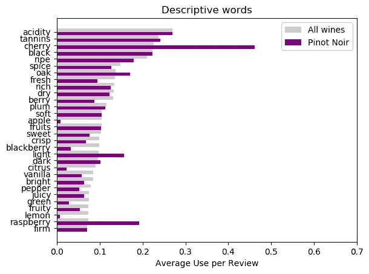
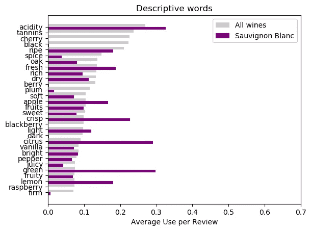
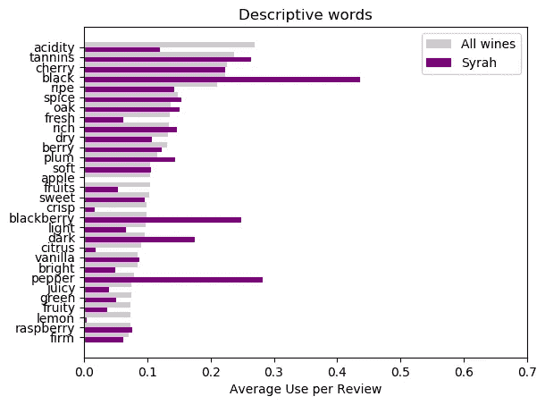
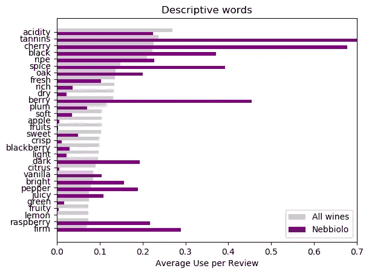
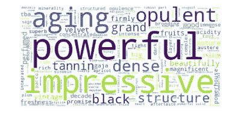
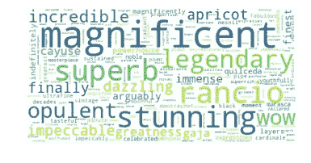
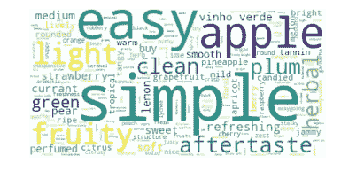
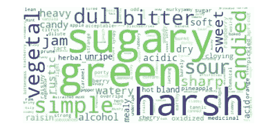
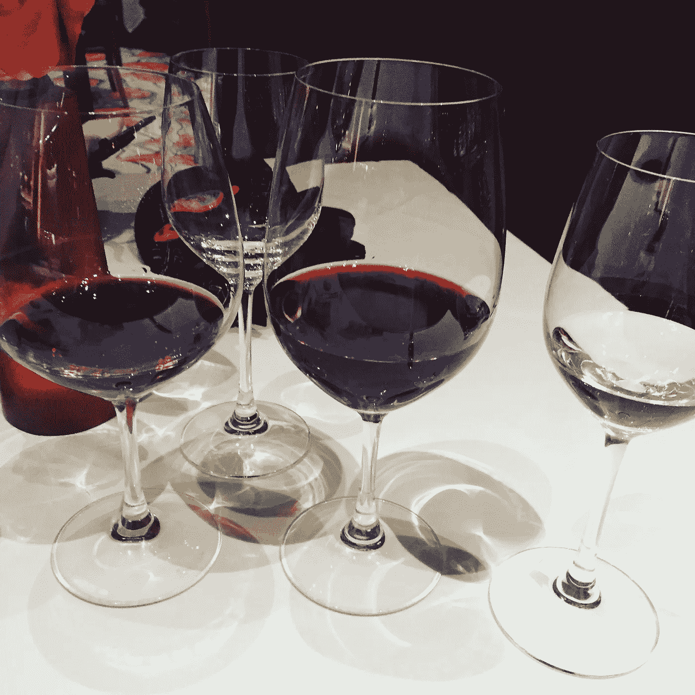

# 这就是你谈论酒的方式

> 原文：<https://towardsdatascience.com/this-is-how-you-talk-about-wine-2a41d6844587?source=collection_archive---------15----------------------->

## 数据科学有助于揭开语言的神秘面纱

喝酒是一回事，理解专家们在谈论葡萄酒时使用的充满形容词的语言是另一回事。如果你和我一样，你已经被比较味道的描述逗乐了，困惑了(赞许！)到“湿花岗岩”或讨论“鼻子”暗示“石墨和铅笔屑”。加上单宁、酸度和余味等术语，偶尔喝葡萄酒的人会想知道这些描述告诉了他们什么。

我们能从所有的描述性术语中解读出什么吗？我们能在葡萄酒评论中找到一些简单的东西来提醒我们什么是我们喜欢的，什么是我们不能接受的吗？

我对 Kaggle 数据集进行了分析，该数据集包含来自葡萄酒爱好者杂志的超过 13 万篇葡萄酒评论，旨在了解专家们用来描述葡萄酒的词汇能告诉我们关于葡萄酒的质量、价格和美味的信息。

Fig 1: Pinot word descriptions compared to all wines

我的第一步是比较所有评论中描述性词语的平均使用情况，以及 20 种不同葡萄酒中相同词语的使用情况。任何显著的差异都应该指出是什么让这种葡萄酒变得如此重要。在左边(图 1)你可以看到，如果你喜欢樱桃或覆盆子口味和浅红色，那么黑皮诺可能是你想要的。

Fig 2: Sauvignon Blanc descriptions

如果你不是浆果迷，那么长相思值得一试。绝对不能与浆果相提并论，但有很多关于柑橘、苹果和清淡松脆的谈论(图 2)。

看到红葡萄酒和白葡萄酒之间的这种对比并不意外，但是不同类型的红葡萄酒之间的语言有什么不同呢？

Fig 3: Syrah descriptions

对于西拉(图 3)，你将享受黑色，成熟的浆果味道和一些胡椒味。不像上面的皮诺，你会尝到黑莓而不是樱桃。如果你喜欢这些口味，那么你可能会想继续喝内比奥罗(图 4 ),它能给你更多的浓度和辣味。“坚实”这个词的重要意义在于表达了你品尝的东西的各个组成部分是如何协调工作的。

Fig 4: Nebbiolo descriptions

现在你知道了这些区别，你可以试着自己品尝，并在向朋友描述葡萄酒时使用这些术语。总的来说，红葡萄酒是关于浆果、单宁和香料的，而白葡萄酒是关于柑橘、酸和松脆的味道。

你描述的特定浆果或柑橘及其强度取决于你的味蕾。

最后，我将葡萄酒评论中唯一使用的词按照得分(0-100)和价格分类，制成词云。高价酒和高分酒有什么共同点？荣誉:

Fig 5: Unique words for wines costing over $200

Fig 6: Unique words for wines scoring more than 97 points

有几个描述性的词偷偷放在里面，但没有多少能告诉你酒是什么味道。但是，这是一个很好的赌注，无论是高价葡萄酒还是高分葡萄酒都很好喝。

同样的关系不适用于低成本葡萄酒和低评分葡萄酒:

Fig 7\. Unique words for wines priced less than $10

Fig 8\. Unique words for wines scoring less than 82 points

便宜的葡萄酒(图 7)被认为是容易、简单和清淡的。正如我们在第一节中了解到的，苹果、绿色和清洁这些词的出现表明许多廉价的葡萄酒是白葡萄酒。

低分葡萄酒(图 8)没有什么可推荐的。植物性的、乏味的、苦涩的、刺耳的:这些词除了低评分评论外，在任何地方都找不到。

所以，你可以找到一种又好又便宜的酒，但是不要指望用低分的酒就能开心。

我们发现了描述葡萄酒最常用的词，以及它们的用法如何随着葡萄酒的类型和质量而变化。要听起来像专家，有 3 个简单的步骤:

1.  学会区分酸度和单宁，并描述你品尝时的酸度和单宁含量。
2.  形容红葡萄酒带有浆果、香料和成熟的味道。用柑橘类水果、苹果和松脆来形容白葡萄酒。
3.  当其他方法都失败时，就照我做的去做，然后说，“这很好。我会喝了它"

