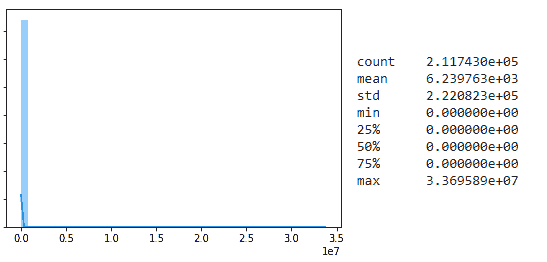
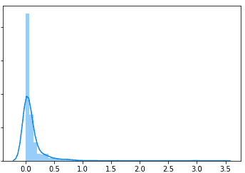
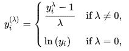
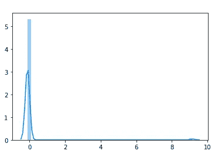
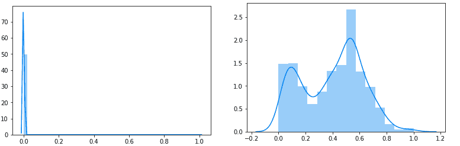
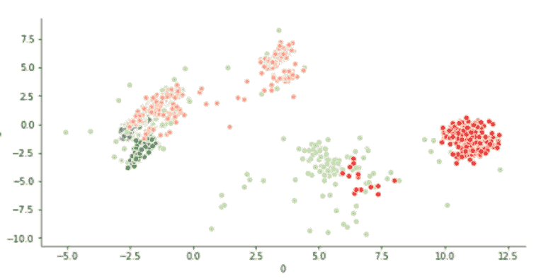

# 这是我作为数据科学家真正做的事情

> 原文：<https://towardsdatascience.com/this-is-what-i-really-do-as-a-data-scientist-d637ed747ef9?source=collection_archive---------4----------------------->

source:Pixabay

数据科学越来越受欢迎，许多人正试图加入这一潮流，这很好。但许多人认为，数据科学、机器学习(在这里插入任何其他时髦词汇)是将数据插入一些 Sckit-Learn 库。实际工作是这样的。

为了让您了解上下文，在收集数据后，会发生以下情况。不要误会，我不认为这应该被认为是一个简单的步骤，但我想重点谈谈数据预处理和规范化。

# 问题是

如果你关注我的博客，你可能会意识到我在机器 2 机器领域做了很多工作。最近在工作中，我试图根据机器的行为，也就是它们的数据消耗，将它们聚集在一起。

这些功能可报告特定服务类别(如社交媒体、音频等)的下载和上传使用情况。为此，让我们假设我们正在查看一个计数器，该计数器查看与 AWS (Amazon Web Services)建立了多少连接。

如果我们按原样获取数据，并决定从中提取聚类，我们会得到如下结果:

注意，这是数据的一个 [LDA](https://en.wikipedia.org/wiki/Linear_discriminant_analysis) 2 轴表示。LDA 作为 90%的代表因素。即使它不是完美的，聚类也几乎是无用的。在这一点上，一些我建议使用这种或那种算法，并调整超参数，这正是最糟糕的想法。

# 臭名昭著的数据

现在，让我们开始工作。数据是什么样的。建议你在输入一些来自 sklearn.cluster import KMeans 的*之前要花很多时间。*我们将看一下这个例子的一个具体特征，但请记住，大多数特征都是相似的。

这是 AWS 计数器(不是真的，但我们会假装)。

所有的数据看起来都是 0，但如果你仔细看，有价值上升到 3e+7。你怎么能指望用这个创造出任何有意义的距离。即使您将其缩放到 0 和 1 之间，大多数数据也将介于 0 和 0.0000005 之间或类似的值，因此距离不会变得更好。

如果我们观察所有非零数据，我们会发现一些更有趣的东西:

# 数据处理

这开始看起来像一个[对数正态分布。现在我们如何使它正常化？至少有一点。所以我的一个同事，Tanguy 有一个非常聪明的主意，关于如何转换对数正态分布。](https://en.wikipedia.org/wiki/Log-normal_distribution)[盒考克斯变换](https://docs.scipy.org/doc/scipy/reference/generated/scipy.stats.boxcox.html)。这种转换试图尽可能“正常化”不同的分布，包括对数正态分布。

这个变换试图最小化这个公式中的 lamda 值(图片来自[维基百科](https://en.wikipedia.org/wiki/Power_transform)):

在我们的例子中，有太多的零，lamda 会更低，大约是这样:(注意:你只需要得到正值，所以所有的值都加 1)

在这张图片中，您可以看到 9 点左右的小凸起，它包含了大部分非零数据。在这一点上，我们已经有了更好的东西，在距离方面好了几个数量级，但仍然可以改进。

我们再把这个数据的来龙去脉带回来。我们正试图对机器行为进行分类。在机器对机器的世界里，这里面隐藏着大量的信息。机器可以使用 AWS。这听起来很可笑，但在这里非常重要。这些机器通常被编程来完成非常特殊的任务，例如报告天气、表演节目等等。他们的任务通常是硬编码的，他们不会随机开始脸书之类的。仅仅是他们可以使用服务(比如 AWS)这一事实就包含了大量信息。因此，我的计划是，我将把 0 保留为 0，然后为其余的数据指定 0.5 到 1 的范围。现在剩下的数据怎么表达… Box Cox 变换。我将在唯一的非零设备上进行转换。

这是它的样子。在左侧，您可以看到所有数据都进行了转换，就像在 0–1 空间中解释的那样。在右边，你有一个在 0.5 和 1 之间的部分的缩放图形。

即使左边的图看起来没有那么好，我可以向你保证，对于算法来说，这是一个不同的世界。

# 结果

因此，在对数据进行预处理后，我们对其运行聚类算法，并且在没有任何定制的情况下，我们得到了结果。

# 结论

我发现人们对算法有点“触发式快乐”,太快地跳到了模型构建上。有人说你甚至不需要理解背后的数学，我不同意，你至少需要理解算法的基础。至少足以理解如何为它准备数据。作为例子，在 K-意味着这是所有关于点之间的距离，当你有这种类型的范围(10e7)你不能指望算法找到字幕模式，它将被范围蒙蔽。

所以拜托，一遍又一遍的看你的数据。到了你觉得可以用手分离它的程度，然后让花哨的算法来完成剩下的工作。

*原载于 2018 年 4 月 27 日*[*coffeeanddata . ca*](http://coffeeanddata.ca/this-is-what-i-really-do-as-a-data-scientist/)*。*