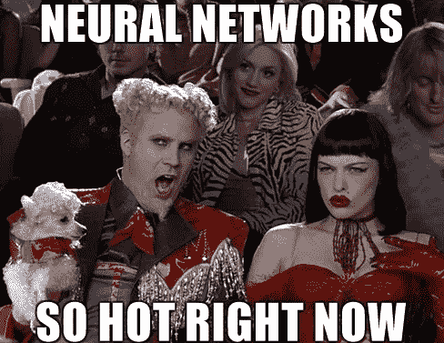
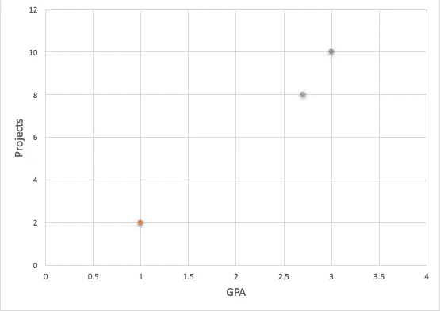
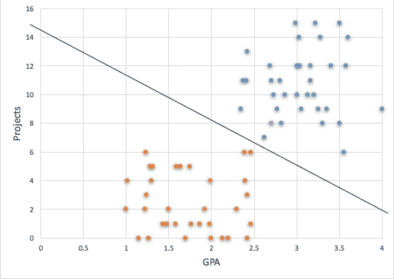
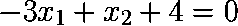
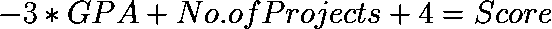
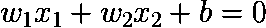
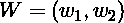
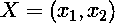
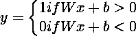

# 神经网络揭秘 1:分类问题

> 原文：<https://towardsdatascience.com/this-series-is-an-attempt-to-make-neural-networks-understandable-for-people-who-know-nothing-more-df6695b6cd39?source=collection_archive---------1----------------------->

他的系列文章试图让只懂高中数学的人理解神经网络。没有比看着冗长的数学公式和一长串代码却不知道如何使用它们更可怕的了。带走了所有的乐趣！

所以事不宜迟，让我们从理解一个简单的**分类问题**开始，它将温和地介绍神经网络背后的概念。

假设你是一家公司的招聘经理，该公司正在招聘大学生进行暑期实习。你可能会收到一个学生的简历，他的平均绩点是 3.0，并且完成了 10 个个人项目，你决定雇佣这个学生。另一份简历可能有 1.0 的 GPA 和 2 个个人项目，你拒绝了这份申请。现在你需要决定另一份有 2.7 GPA 和 8 个个人项目的简历是否被*录取？*

为了找到答案，让我们先把现有的数据绘制成图表，x 轴是平均绩点，y 轴是项目数量。

蓝点代表被录取的学生，橙点代表被拒绝的学生，灰点代表我们需要决定的学生。现在让我们把过去几年中可能发生的所有接受和拒绝的数据加到我们的图表中。

注意蓝点和橙点之间的分隔线，它清楚地告诉你，绩点 2.7 和项目 8 的学生应该被录取。**这条线在人工智能/神经网络/ML 行话中被称为“模型”**(每当我听到这个术语时，我总是会抓狂，但它真的没有那么糟糕，对吗？).对于我们人类来说，画这条线很容易，但它涉及到仔细绘制每个数据点，然后找到最佳拟合线的平凡任务。好消息，电脑的发明是为了让我们远离这些无聊的工作，这样我们就可以专注于更重要的任务。**那么我们如何让计算机为我们找到模型呢？**

让我们从一些基本的数学开始，我们将用变量 x1 标注对应于 GPA 的横轴，用变量 x2 标注对应于项目数量的纵轴。因此，蓝色和橙色点的分界线将有一个线性方程:

Approximate equation without real numbers

这个等式真正代表的是学生的分数，可以写成以下格式:

现在，每当我们想知道一个新学生是否合格时，我们在这个等式中输入每个值，如果分数是正的，那么我们接受这个学生，否则不接受。让我们把 2.7 作为平均绩点，8 作为项目数量。我们得到 3.9 分。*学生合格！*

在更一般的形式中，我们将有一个用于该模型的方程:

或者以矢量形式表示为:

在哪里

和

我们只取两个向量的乘积。按照惯例，我们将 W 称为权重，x 称为输入，b 称为偏差。*我们可以将正面分数标注为 1(蓝点)，负面分数标注为 0(橙点)。*

最后，我们模型的预测是:

这意味着如果分数大于 0，我们的算法将尝试预测 1，如果分数小于 0，则预测 0。我们的算法对数据已有的标签做出的预测越接近，它的表现就越好，这就相当于将蓝点和橙点分开的最佳拟合线。

F 对于这篇文章，我将在这里停下来，我希望到现在为止，对分类问题，它们如何工作以及算法如何试图找到预测已经有了一些了解。这是一些简单的背景，我想在我们深入神经网络的神奇世界之前介绍一下。下次见，再见！

*欢迎提出改进意见:)*