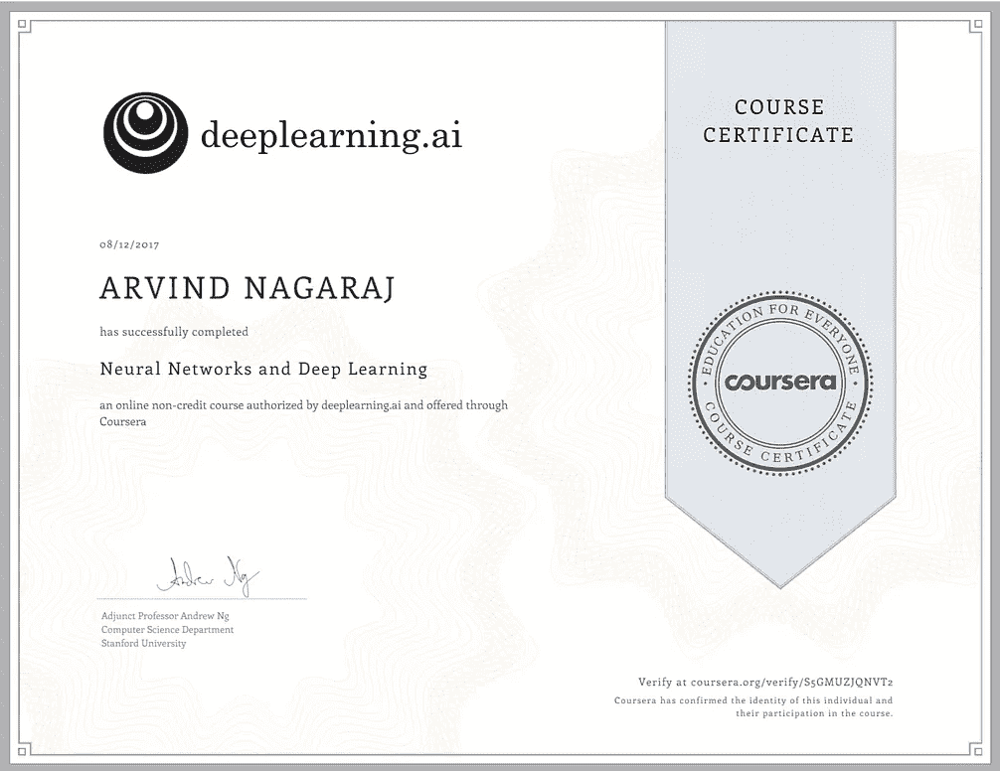
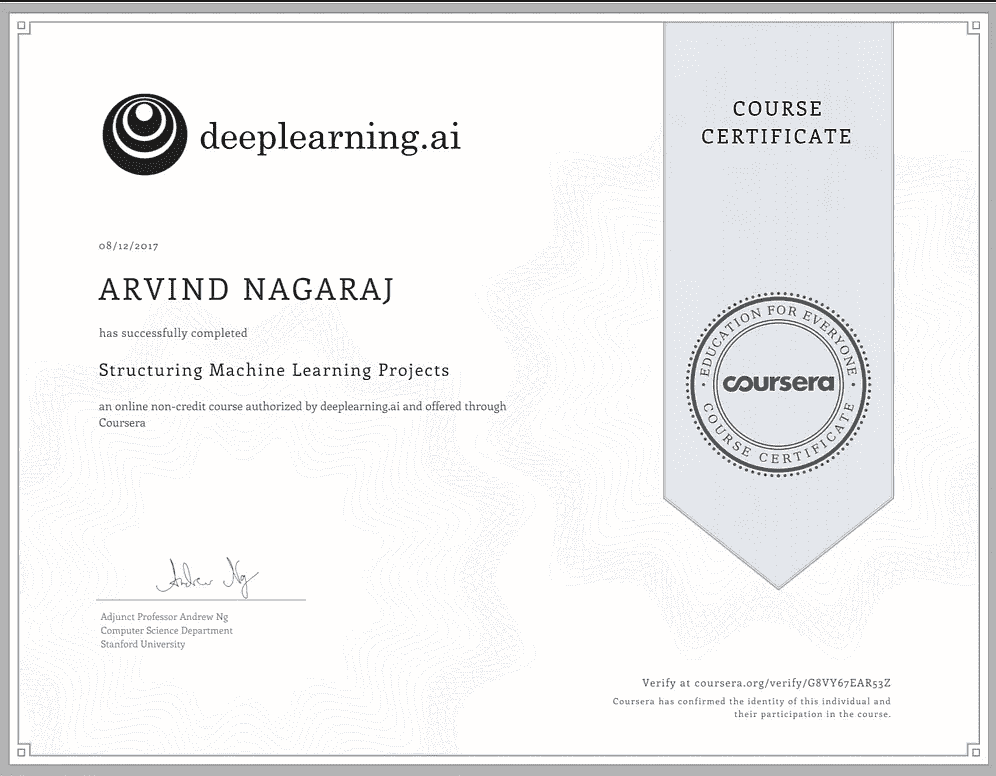
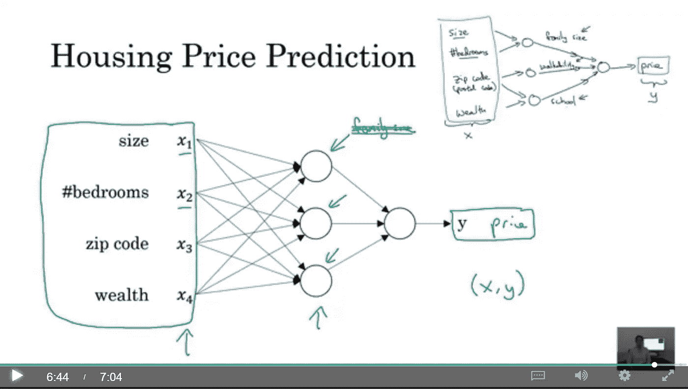
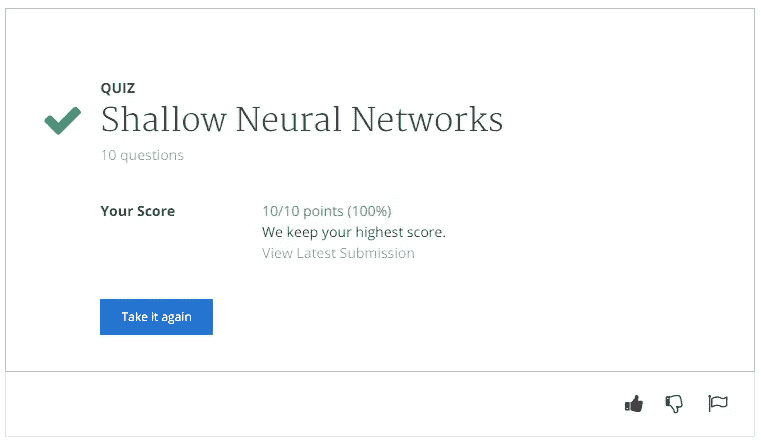
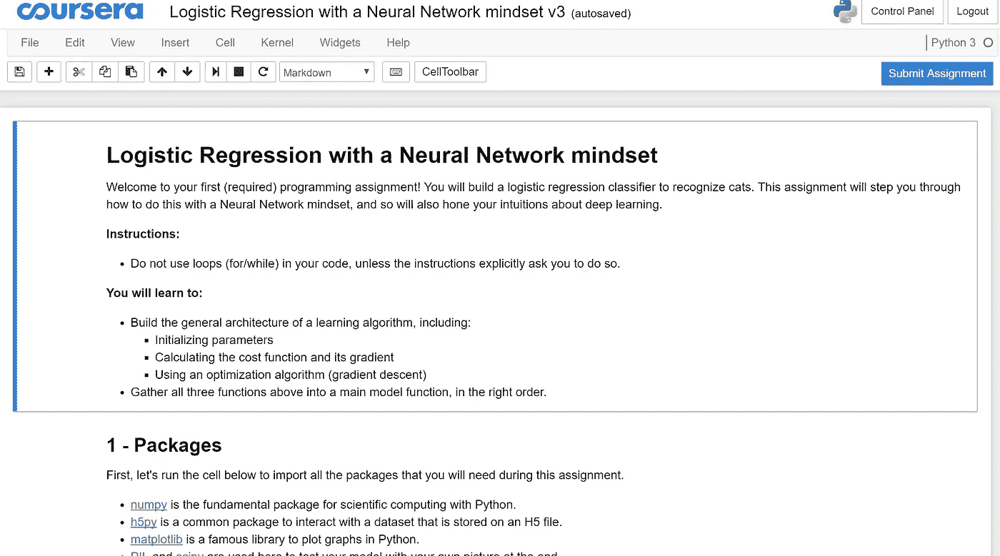
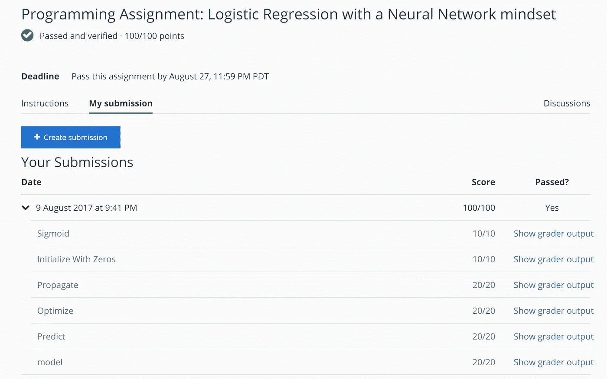
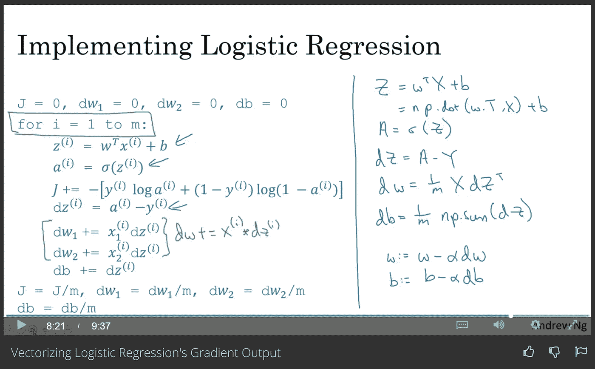
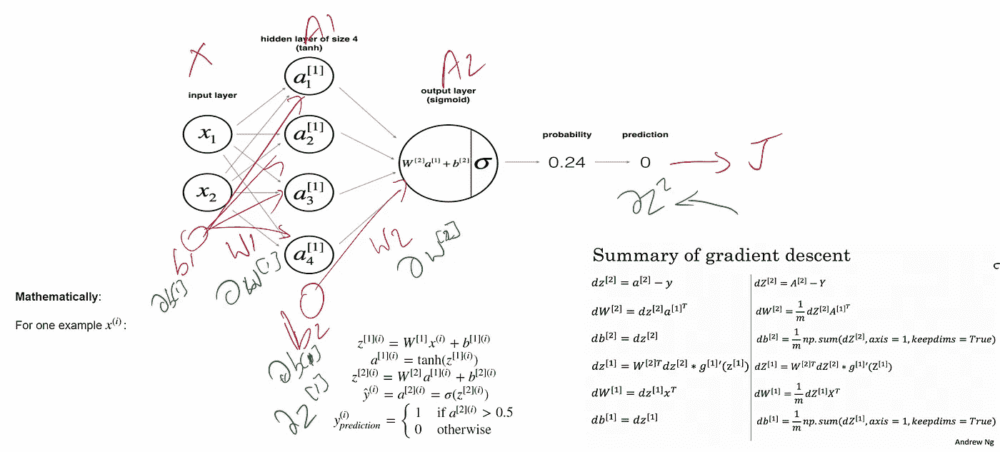
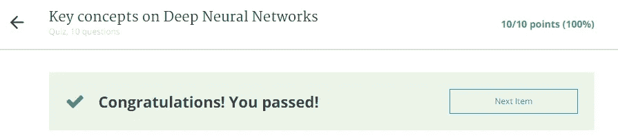
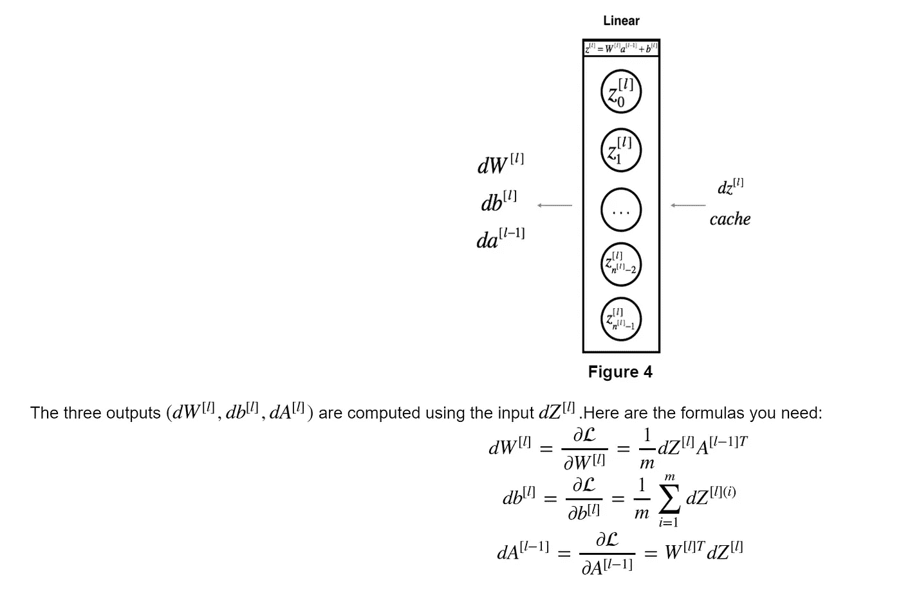

# 参加 Deeplearning.ai 课程后的想法

> 原文：<https://towardsdatascience.com/thoughts-after-taking-the-deeplearning-ai-courses-8568f132153?source=collection_archive---------1----------------------->

更新时间:2018 年 2 月 2 日:当我写这篇博文的时候，只有 3 门课程已经发布。 [*本专精的 5 门课程现在全部出*](https://www.coursera.org/account/accomplishments/specialization/certificate/2VB5TAAWSWNK) *。我很快会有后续博文。* ]

# 简介:

在全职工作和家里蹒跚学步的孩子之间，我用业余时间学习认知科学和人工智能的思想。偶尔会出现一篇很棒的论文/视频/课程，你会立刻被吸引住。

吴恩达新推出的 deeplearning.ai 课程就像那部让人向往的[什恩·卡鲁斯](https://www.quora.com/What-is-Shane-Carruths-new-film-Upstream-Color-all-about/answer/Arvind-Nagaraj?srid=TS2A)或[拉吉尼坎塔电影](https://www.youtube.com/watch?v=hDJEn9xTe5c)！

很自然地，课程一在 coursera 上发布，我就注册了，并花了 4 个晚上的时间疯狂地观看课程，完成测验和编程作业。

DL 实践者和 ML 工程师通常花大部分时间在抽象的 Keras 或 TensorFlow 级别上工作。但偶尔休息一下，认真学习算法的具体细节，并实际手动进行反向传播也是不错的。它既有趣又[非常有用](https://medium.com/@karpathy/yes-you-should-understand-backprop-e2f06eab496b)！

# 本课程的内容是:

吴恩达的新 *ad* venture 是一种[自下而上的方法](https://en.wikipedia.org/wiki/Top-down_and_bottom-up_design)来教授神经网络——强大的非线性学习算法，在初级到中级水平。

在经典的 Ng 风格中，该课程通过精心选择的课程、整齐定时的视频和精确定位的信息块来讲授。Andrew 从他的经典 ML 课程停止的地方开始，介绍了使用单个神经元(逻辑回归)并慢慢增加复杂性(更多神经元和层)的神经网络的想法。在 4 周(课程 1)结束时，学生将了解构建密集神经网络所需的所有核心思想，如成本/损失函数，使用梯度下降和矢量化并行 python(numpy)实现进行迭代学习。

Andrew 耐心地解释了必要的数学和编程概念，以精心规划的顺序和良好的节奏，适合可能对数学/编码生疏的学习者。

# 课程材料和工具:

video lecture

讲座使用演示幻灯片，Andrew 使用数字笔在幻灯片上书写。这似乎是让听众集中注意力的有效方法。我觉得以 1.25 倍或 1.5 倍的速度观看视频很舒服。

quiz tool

测验放在每堂课的最后，是多项选择题的形式。如果你看一遍视频，你应该能很快回答所有的问题。您可以尝试多次测验，系统旨在保持您的最高分。

Jupyter notebook programming assignment

编程作业通过 J [upyter 笔记本](http://jupyter.org/)完成——强大的基于浏览器的应用程序。

作业有一个很好的引导顺序结构，你不需要在每个部分写超过 2-3 行的代码。如果您直观地理解了像矢量化这样的概念，那么您只需一行代码就可以完成大多数编程部分！

作业编码后，只需点击一次按钮，即可将您的代码提交给自动评分系统，该系统会在几分钟内返回您的分数。有些作业有时间限制——比如说，在 8 小时内尝试三次等等。

Jupyter 笔记本设计精良，使用起来没有任何问题。说明书很精确，感觉像是打磨过的产品。

# 本课程面向谁:

任何有兴趣了解什么是神经网络，它们如何工作，如何建立它们，以及将你的想法变为现实的可用工具的人。

如果你的数学生疏了，也没必要担心——安德鲁解释了所有需要的微积分，并在每个场合提供了导数，这样你就可以专注于构建网络，专注于用代码实现你的想法。

如果你的编程生疏了，有一个很好的编码作业教你 numpy。但是我建议先在 [codecademy](https://www.codecademy.com/learn/learn-python) 上学习 python。

# 这个 DL 课程与杰瑞米·霍华德的 Fast.ai 课程有何不同:

让我用一个类比来解释这个:*假设你正在努力学习如何驾驶汽车。*

杰里米的速度很快。人工智能课程从一开始就把你放在驾驶员的位置上。他教你移动方向盘，踩刹车，油门等。然后他慢慢地解释了更多关于汽车如何工作的细节——为什么转动轮子会让汽车转弯，为什么踩刹车踏板会让你减速和停车等等。他不断深入汽车的内部工作原理，到课程结束时，你会知道内燃机是如何工作的，油箱是如何设计的等等。这门课程的目标是让你学会驾驶。在你能相当好地驾驶之后，你可以选择在任何时候停下来——没有必要学习如何制造/修理汽车。

安德鲁的 DL 课程做了所有这些，但是在**完全相反的顺序**。他先教你内燃机！他不断添加抽象的*层*，到课程结束时，你就能像 F1 赛车手一样驾驶了！

快速人工智能课程主要教你驾驶的*艺术，而安德鲁的课程主要教你汽车*背后的*工程。*

# 如何学习本课程:

如果你在此之前没有做过任何机器学习，先不要上这门课。最好的起点是 Andrew 在 coursera 上原创的 [ML 课程。](https://www.coursera.org/learn/machine-learning)

完成该课程后，请尝试完成杰瑞米·霍华德优秀的[深度学习课程](http://course.fast.ai/)的第一部分。杰里米教授深度学习[自上而下，这对于绝对的初学者来说是必不可少的。](http://course.fast.ai/about.html)

一旦你对创建深度神经网络感到舒适，那么参加这个[新的 deeplearning.ai 课程专业化](https://www.deeplearning.ai/)是有意义的，它可以填补你对底层细节和概念的理解中的任何空白。

# 本课程中我喜欢的内容:

1.  事实基本上是明明白白的——所有的不确定性和模糊性都会被定期消除

2.Andrew 强调深度学习的工程方面，并提供了大量节省时间和金钱的实用技巧——DL 专业化的第三门课程对我作为领导工程团队的[架构师的角色来说非常有用。](https://www.linkedin.com/in/arvind-nagaraj-9a17aa82/)

3.行话处理得好。安德鲁解释说，一个*经验过程=试验&错误*——他非常诚实地面对设计和训练深度网络的现实。在某种程度上，我觉得*他可能只是称深度学习为美化的曲线拟合*

4.粉碎所有关于 DL 和 AI 的炒作——Andrew 对主流媒体中 AI 炒作的扩散进行了克制、谨慎的评论，在课程结束时，很明显 DL 一点也不像终结者。

5.开箱即用的精彩样板代码！

6.课程结构优秀。

7.漂亮、一致且有用的符号。安德鲁努力为神经网络建立一个新的命名法，我觉得他在这方面会相当成功。

8.这种教学风格是安德鲁所独有的，并且是从曼梯·里传承下来的——我能感受到 2013 年我参加他最初的曼梯·里课程时的那种兴奋。

9.对深度学习英雄的采访令人耳目一新——听到个人故事和轶事既激励又有趣。

# 我发现缺少的东西:

我希望他能更具体地说“*”*”！

# 一路上我学到了一些额外的东西:

1.  DL 不容易。随着时间的推移，需要一些艰苦的工作来“理解”这些概念，并使它们很好地工作。 [Andrew 不久前写了一篇 quora 回答](https://www.quora.com/How-should-you-start-a-career-in-Machine-Learning/answer/Andrew-Ng?srid=TS2A)，引起了我的深深共鸣。

2.好的工具很重要，会帮助你加快学习的步伐。在看到安德鲁用一支数码笔教学后，我买了一支。它帮助我更有效地工作。

Black ink is Andrew’s and colors are mine

3.我之所以推荐 Fast.ai 课程，是有心理原因的。一旦你找到了你的激情，你就可以学习无拘无束。

4.每当你得满分时，你就会产生多巴胺的冲动:

hell yeah!

5.不要被 DL 行话吓倒( *hyperparameters = settings，architecture/topology=style 等)。*)或数学符号。如果你有信心并且注意听课，安德鲁展示了为什么符号和记号实际上是非常有用的。*它们将很快成为你的首选工具，你将会很有型地使用它们*！

some scary looking symbols which will begin to make sense when you watch the lecture videos

# 结束语(可选阅读):

1.  每个人都是从这个领域的初学者开始的。如果你是 DL 领域的新手，自然会对所有的术语和概念感到害怕。请不要放弃。你可能被吸引到这个领域，希望找到你的职业。相信你的直觉，保持专注，你会比你意识到的更快成功！甚至吴恩达在过去的某个时候也不得不学习线性代数——他并不是天生就有这方面的知识。
2.  虽然这是一个令人难以置信的资源，但这并不是世界上唯一的数字图书馆课程。许多慷慨的老师像萨尔曼·可汗、杰瑞米·霍华德、巴斯蒂安·特龙、杰夫·辛顿都像吴恩达一样在网上免费分享他们的知识。我不够幸运，无法继续攻读硕士或博士学位，因为我必须参加工作，养家糊口——但这并不意味着学习必须停止。由于知识的民主化，我有机会定制自己的学习计划。我可以选择向我最崇拜的人学习:编程(Gerald Sussman)、线性代数(Gilbert Strang)、人工智能(马文·明斯基)、哲学(丹尼尔·丹尼特)、心理学(让·皮亚杰)、物理学(汉斯·贝特)…
3.  大部分应用数字逻辑实际上是训练有素的工程——Ng 教授在课程 3 中提供了精彩的汇编(*我迄今为止发布的 3 门课程中最喜欢的*)。让 DL 为您的问题工作所需的心态与处理任何其他困难的工程问题所需的心态没有什么不同。你需要知道的一切都已经被克劳德·香农在几十年前清晰地[记录下来了。](https://medium.com/the-mission/a-genius-explains-how-to-be-creative-claude-shannons-long-lost-1952-speech-fbbcb2ebe07f)

感谢阅读并致以最美好的祝愿！

*更新:感谢压倒性的积极回应！许多人要求我解释梯度下降和微分学。* [*希望这对*](https://medium.com/@gedanken.thesis/gradient-descent-back-prop-and-derivatives-5b286bb8d8b5) *有所帮助！*