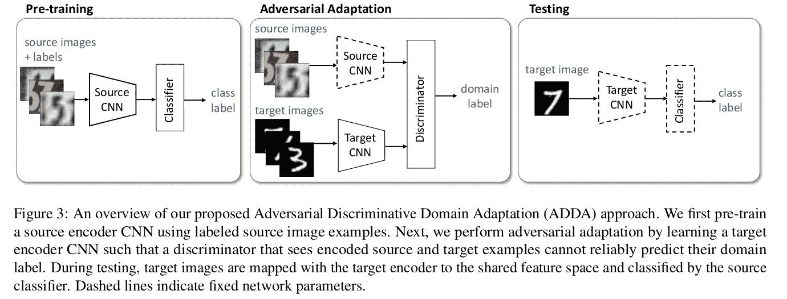

# 关于对抗性歧视性领域适应的思考

> 原文：<https://towardsdatascience.com/thoughts-on-adversarial-discriminative-domain-adaptation-f48e3938d518?source=collection_archive---------8----------------------->

我偶然浏览了一下[这篇论文](https://arxiv.org/pdf/1702.05464)讨论了当测试图像属于不同于训练集的域时的图像分类。

当我们有模型训练的情况时，例如动物的 2D 图片，并且面临需要对动物的 3D 图像进行分类的情况时，领域适应就发挥作用了。虽然它们属于同一个类(马)，但模型很困惑，因为它们看起来不同于它从中学习特征的马的图像。

本文主要介绍了一种称为对抗鉴别域自适应的技术，它采用了 GAN 的思想，通过使用鉴别器来区分来自源域和目标域的图像。

由于图像可以属于不同的域，我们首先学习到一个公共特征空间的映射，以便我们可以将一个域不变向量馈送给我们的鉴别器。我们在这里使用一个判别模型，并试图通过一个编码器(足够接近一个生成器，但不完全是一个)来学习映射。鉴别器接收来自两个域的映射，并判断图像是否属于源域。

ADDA 为其鉴别器使用损失函数，使其完全依赖于其目标分布。优化损失函数基本上试图标记目标分布图像，就好像它们属于源域一样。对于映射，我们对源域和目标域使用联合权重，仅仅是因为由于不同的域，在一个域中学习的特征不需要在另一个域中相同。

**建筑:**

Architecture for ADDA. (Source: [https://arxiv.org/pdf/1702.05464.pdf](https://arxiv.org/pdf/1702.05464.pdf))

我们使用两种不同的 CNN 来学习映射。我们首先使用典型的图像分类技术训练源 CNN 和源分类器。在这一步之后，我们修复了源 CNN 和分类器。

然后，在领域适应步骤中，我们通过标准的广告过程训练鉴别器和目标 CNN。我们在这个阶段维护源映射并学习目标映射。

最后，在测试阶段，我们使用目标映射对测试图像进行编码，并在其上运行分类器。

感谢阅读！