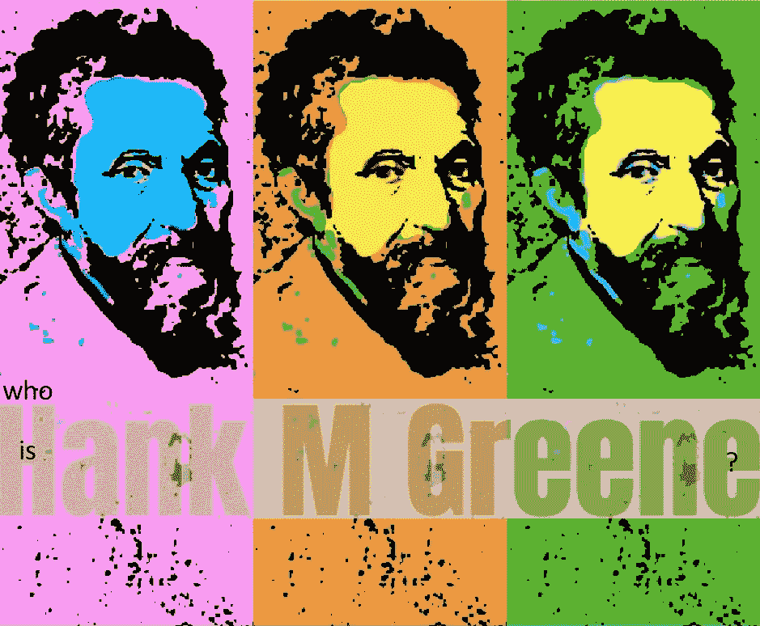

# 关于人工智能的想法，只是为了好玩。

> 原文：<https://towardsdatascience.com/thoughts-on-artificial-intelligence-just-for-fun-e80167dd319a?source=collection_archive---------4----------------------->

electric Paul Klee, 1983, by Malcolm P. Dickson, Private collection

> "艾已经半个多世纪了，背上了太多的包袱."卡洛斯·佩雷斯

人脑中大约有**个** **千亿个神经元**。

100,000,000,000

这就需要在带有神经网络的计算机中模拟大量的神经元——也许是为了达到通常意义上的“智能”。稍后会有更多关于智力和一千亿个神经元的内容。

卡洛斯·佩雷兹(Carlos E. Perez)最近发表了一份关于人工智能现状的最精彩的概述，人工智能景观的不同领域，在其历史背景下，“[人工智能的许多部落](https://medium.com/intuitionmachine/the-many-tribes-problem-of-artificial-intelligence-ai-1300faba5b60#.gmpi7uvx2)”。写得很好，推荐给任何对当前人工智能领域感兴趣的人。

本着透明的精神，我的激情属于卡洛斯·e·佩雷斯(Carlos E. Perez)所描述的“生物灵感主义者”一类，“创造更接近神经元在生物学中出现的模型的人”支持小说此外，更重要的是，考虑改善成瘾行为对人类状况的影响。也就是说，知道该做什么，如何影响成瘾背后的神经元。我认为，这些神经元 DNA 的计算机模型是一个好地方，可以开始为这些神经元生成一个影响因素和结果行为的详尽列表，有可能支持改善成瘾的方法。这只是个人猜测。正如我在这篇文章的结尾所指出的，我只是一个观察者和提问者，边走边学。

这种方法的理由是什么？**漫长的游戏。**

> **“智力**有许多不同的定义，包括一个人的[逻辑](https://en.wikipedia.org/wiki/Logic)、[理解](https://en.wikipedia.org/wiki/Understanding)、[自我意识](https://en.wikipedia.org/wiki/Self-awareness)、[学习](https://en.wikipedia.org/wiki/Learning)、[情感知识](https://en.wikipedia.org/wiki/Emotional_knowledge)、[计划](https://en.wikipedia.org/wiki/Plan)、[创造力](https://en.wikipedia.org/wiki/Creativity)和[解决问题](https://en.wikipedia.org/wiki/Problem_solving)。它可以更概括地描述为感知信息，并将其作为知识(T21)应用于环境或背景中的适应性行为的能力维基百科“情报”

因此，尽管机器学习和深度学习为当前人类的追求增加了巨大的价值，但将术语“智能”应用于这些努力似乎并不正确，因为这个术语是如何被他人使用和解释为具有特定含义的——特别是自我意识的能力。

# 漫长的游戏

考虑一下自我意识意味着什么，思考，然后在某种程度上或多或少地利用逻辑感来处理输入，理解输入。考虑一下**理解**意味着什么。

如果你是有自我意识的，知道并理解关于一个物体、一个实体、它的行为、它相对于它的背景的目的、关于它的一切的一切，那么关于缺乏对那个物体、那个实体的理解的摩擦会在哪里？从定义上来说，不会有任何摩擦——事实上，你会知道这个物体和它所在的系统的一切。我们每个人都有特定的心智能力，而他们所处的系统是一个额外的限制因素。随着智能系统的增长超过人类的智能能力，那么也许这些人工智能系统在理论上能够更多地了解我们以及我们如何与我们的环境互动，甚至可能有助于指导我们改善互利的结果。

继续关于人工智能的长期博弈。让我们考虑一下云架构为神经网络提供了什么——高级别的云接口，是硬件和软件之间的抽象层——神经网络和软件所驻留的实际处理器、内存、存储和网络。价值—基于需求的透明硬件可扩展性。回到开篇——人脑中有多少神经元？一千亿。暂且不考虑在神经网络架构内的计算机上模拟人脑神经元及其所有 DNA 复杂性(对某个基因的 DNA 链的影响，例如， [Tet3，蛋白质编码基因](http://www.hopkinsmedicine.org/news/media/releases/neurons_constantly_rewrite_their_dna))之间的比较，仅一千亿个神经元所需的计算机能力就取决于模型的设计水平。作为点的一千亿个神经元的模型网络，不包括神经元的内部网络，将比每个神经元及其内部组成部分的模型需要更少的计算机资源，仅 DNA 就需要大量的计算机资源。[Bitesize Bio](http://bitesizebio.com/profile/yevgeniy-grigoryev/)[上的 Yevgeniy Grigoryev](http://bitesizebio.com/8378/how-much-information-is-stored-in-the-human-genome/) 估计，大约需要 1.5 千兆字节来表示 1 个 DNA 序列(以字节计的整个二倍体人类基因组)。

1.5 千兆字节 x 100 亿个神经元= 1500 亿千兆字节或 150 x 10 的 9 次方

十亿千兆字节= 1 艾字节，因此我们需要 150 艾字节。

那有多大？

据说 5 艾字节相当于人类说过的所有单词

我们继续前进。

> 卡耐基梅隆大学计算机科学教授齐夫·巴尔-约瑟夫说:“神经科学中有很多关于计算模型的工作，这些计算模型不仅考虑了抑制性神经元的更多细节，还考虑了驱动这些神经元的蛋白质等等。”Larry Hardesty，2017 年 1 月 9 日，模型阐明了抑制性神经元的目的

有趣的是，是的，我知道这是一个延伸，**几乎令人恐惧，因为我们有能力创建这个基本的测试** **作为今天的神经网络计算机模型**，神经科学有一个可测试的模型[来确定新生儿的“意识”](http://www.livescience.com/41398-baby-awareness.html)——理论上可以应用于基于计算机的意识模型，一旦有了，作为一个测试。

> “……Filippetti 和她的同事测试了 40 名出生 12 小时至 4 天的新生儿。婴儿坐在屏幕前实验者的腿上。在屏幕上，一段视频显示一个婴儿的脸被画笔抚摸。研究人员要么在屏幕上显示抚摸的同时用刷子抚摸婴儿的脸，要么将抚摸延迟五秒钟。
> 
> 接下来，婴儿们看了同样的视频，但是颠倒了。同样，研究人员在颠倒图像的同时抚摸婴儿的脸，或者将抚摸延迟三秒钟。
> 
> Filippetti 告诉 LiveScience，和这么小的婴儿一起工作是一个挑战。
> 
> “就婴儿完全清醒和有反应的实际时间而言，这是具有挑战性的，”她说。
> 
> 为了确定婴儿是否像在[橡胶手错觉](http://www.livescience.com/28694-non-amputees-feel-phantom-limb.html)中一样，将他们在屏幕上看到的面部抚摸与他们自己的身体联系起来，研究人员测量了婴儿在每种情况下看屏幕的时间。注视时间是婴儿研究中使用的标准测量方法，因为婴儿不能回答问题或口头表明他们的兴趣。
> 
> 研究人员发现，当抚摸与婴儿在自己脸上的感觉相符时，婴儿看屏幕的时间最长。这只适用于正面朝上的图像；婴儿似乎没有把翻转的面孔和他们自己的联系起来。
> 
> 这些发现表明，婴儿生来就具有建立身体意识所需的基本机制……”婴儿生来就有一些自我意识，《生活科学》，2013 年 11 月 21 日

“长期游戏”的要点是，首先，在创造真正的人工智能方面，我们比我们想象的更近和更远，使用我们通常所说的智能作为基线。我们比我们想象的更接近了，因为我们正在学习人类神经元如何支持人类意识，以及如何使用计算机模型来复制这些过程。也许，我们比我们想象的还要遥远，因为支持这样一个模型所需要的纯粹的计算机能力。也就是说，我们创建新计算模式的速度正在加快，例如云、容器和无服务器计算。

最后，当我们调查人工智能的当前状态时，这些系统被用作支持人类活动的工具。想想人类使用工具的历史。随着时间的推移，我们的历史一直是关于人和工具的协同关系。电脑只是工具。带起搏器，人工肺，假肢等。我们已经走上了将技术融入我们生活的道路，可以说几乎一直都是如此。然而，尽管我们使用工具，我们仍将是独一无二的人类。

**关于我们所走道路的总结:**

> ”布林评论说，尽管离谷歌大脑的杰夫·迪恩(Jeff Dean)只有几个纸夹的距离，但他没有看到深度学习的到来。**如果创建谷歌的布林本人都无法预测深度学习的进步，那么我们对来自其他竞争人工智能部落的许多其他从业者又能说些什么呢？**那是既得利益者？总之，不要相信你的常驻人工智能专家，他可能属于不同的部落。”卡洛斯·佩雷斯

你可能会说你对你写的东西一无所知！我咯咯地笑着回应道，“千真万确”，因此有了参考文献。既然我们同意这一点，让我们讨论一下参考文献的有效性。干杯。

参考资料:

《人工智能的众多部落》[https://medium . com/intuition machine/The-Many-Tribes-problem-of-Artificial-Intelligence-ai-1300 faba 5b 60 # . gmpi 7 uvx 2](https://medium.com/intuitionmachine/the-many-tribes-problem-of-artificial-intelligence-ai-1300faba5b60#.gmpi7uvx2)

支持 DNA 研究的神经网络:预测 DNA-蛋白质结合的卷积神经网络架构，2016，[https://www.ncbi.nlm.nih.gov/pmc/articles/PMC4908339/#!po=31.1594](https://www.ncbi.nlm.nih.gov/pmc/articles/PMC4908339/#!po=31.1594)

[“儿童神经科学”https://faculty.washington.edu/chudler/what.html](https://faculty.washington.edu/chudler/what.html)

[“生物神经网络和人工神经网络有什么区别？](http://cogsci.stackexchange.com/questions/7880/what-is-the-difference-between-biological-and-artificial-neural-networks)"[http://cog sci . stack exchange . com/questions/7880/什么是生物和人工神经网络的区别](http://cogsci.stackexchange.com/questions/7880/what-is-the-difference-between-biological-and-artificial-neural-networks)

维基百科，“情报”[https://en.wikipedia.org/wiki/Intelligence](https://en.wikipedia.org/wiki/Intelligence)

哈佛科学家认为他们已经找到了意识的物理来源

婴儿生来就有一些自我意识[http://www.livescience.com/41398-baby-awareness.html](http://www.livescience.com/41398-baby-awareness.html)

厄尔·米勒因在认知神经科学方面的杰出成就而获得戈德曼-拉基奇奖，这位神经科学家因其在模拟大脑回路引起认知方面的作用而获得认可。[http://news . MIT . edu/2016/earl-miller-receives-Goldman-rakic-prize-in-cognitive-neuroscience-1101](http://news.mit.edu/2016/earl-miller-receives-goldman-rakic-prize-in-cognitive-neuroscience-1101)

脑细胞的 DNA 不同[https://www . science news . org/article/brain-cells % E2 % 80% 99-DNA 不同](https://www.sciencenews.org/article/brain-cells%E2%80%99-dna-differs)

单个人类神经元的体细胞突变追踪发育和转录历史[http://science.sciencemag.org/content/350/6256/94](http://science.sciencemag.org/content/350/6256/94)

神经元不断改写自己的 DNA[http://www . Hopkins medicine . org/news/media/releases/neurons _ Constantly _ Rewrite _ Their _ DNA](http://www.hopkinsmedicine.org/news/media/releases/neurons_constantly_rewrite_their_dna)

模型揭示了抑制性神经元的目的

维基百科，心灵上传，[https://en . Wikipedia . org/wiki/Mind _ uploading # Computational _ complexity](https://en.wikipedia.org/wiki/Mind_uploading#Computational_complexity)

维基百科，神经计算模型【https://en.wikipedia.org/wiki/Models_of_neural_computation 

人类基因组中储存了多少信息？[http://bitesizebio . com/8378/人类基因组储存了多少信息/](http://bitesizebio.com/8378/how-much-information-is-stored-in-the-human-genome/)

自我浮现在脑海中:构建意识大脑

兆字节、千兆字节、兆兆字节……它们是什么？[http://www.whatsabyte.com/](http://www.whatsabyte.com/)

谁是汉克·m·格林？

“我就是我说过的我，一个讲故事的人。但是，你可能会问，我从哪里来，要到哪里去？十是我去哪里的钥匙，它决定了我从哪里来。”

读一读汉克·m·格林@[https://sites.google.com/view/time-a-trilogy/](https://sites.google.com/view/time-a-trilogy/)写的《第一册:十》的草稿

推特@hankmgreene 或[https://twitter.com/hankmgreene](https://twitter.com/hankmgreene)

https://www.facebook.com/hankmgreene

Flipboard: HankMGreene

