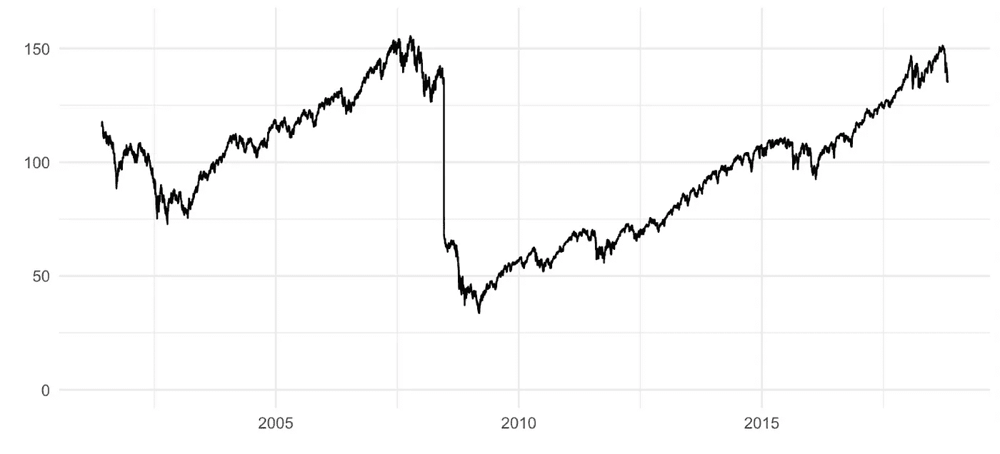

# 关于公制设计的思考

> 原文：<https://towardsdatascience.com/thoughts-on-metric-design-51a4c3b773a0?source=collection_archive---------11----------------------->

我注意到，当我在硅谷提起“指标”这个话题时，人们似乎要么爱我，要么恨我。跟踪并尽可能采取一些你认为能抓住你的业务或产品的重要方面的措施，对一些人来说是提高生产力的灵丹妙药，对另一些人来说则是短视的创造力杀手。不管你对定义和跟踪指标的好处有多强烈的感觉，如果你决定这样做，花时间去思考指标设计的原因和方法是值得的。我们最近在 [Wealthfront](https://medium.com/u/5a23996c5db9?source=post_page-----51a4c3b773a0--------------------------------) 做了一些这样的事情，我想我应该分享一下我从这个过程中学到的东西。

# 关于度量的资源

有无数的书籍和[的 TED 演讲](https://www.ted.com/talks/john_doerr_why_the_secret_to_success_is_setting_the_right_goals?language=en)(甚至[的公司](https://www.betterworks.com/))致力于度量的主题。不同的人使用不同的名字和缩写，他们以稍微不同的方式定义和使用度量，但是他们最终得到了相同的点。我不会总结所有的细节，我会列出我在 Wealthfront 定义业务和产品指标的过程中参考过的资源。

*   [衡量什么最重要](https://www.amazon.com/Measure-What-Matters-Google-Foundation/dp/0525536221)——[约翰·杜尔登](https://medium.com/u/9ee9b0ebeddf?source=post_page-----51a4c3b773a0--------------------------------)
*   [用数据取胜](http://tomtunguz.com/winning-with-data/)——[汤姆·东格斯](https://medium.com/u/9986533c3db3?source=post_page-----51a4c3b773a0--------------------------------)
*   [创建数据驱动的组织](https://www.amazon.com/Creating-Data-Driven-Organization-Practical-Trenches-ebook/dp/B012UDK3KG) — [卡尔·安德森](https://medium.com/u/49c5eedcb61b?source=post_page-----51a4c3b773a0--------------------------------)
*   [如何为你的产品选择正确的 UX 指标](https://library.gv.com/how-to-choose-the-right-ux-metrics-for-your-product-5f46359ab5be)——[凯瑞·罗登](https://medium.com/u/2f55211eacc1?source=post_page-----51a4c3b773a0--------------------------------)
*   [在人群之上](http://abovethecrowd.com/)——[比尔·格利](https://medium.com/u/512799633b56?source=post_page-----51a4c3b773a0--------------------------------)

# 度量的用途是什么

指标可用于前瞻性和回顾性。

## 未来的

我所说的前瞻性是指使用一个指标作为评估决策潜在影响的框架。这种度量的使用有助于解决的一个问题是团队之间对于他们试图优化什么的分歧。就度量标准达成一致使团队能够就不同项目的相对优先级进行富有成效的讨论。没有度量标准，关于团队应该做什么的争论可能会脱轨，因为对每个人的工作目标没有共同的理解。例如，我选择“实验运行次数”作为数据科学团队的内部指标，这有助于我对我们纠正到达率偏差的工作进行优先排序。预期使用指标的一个额外步骤是设定移动指标的目标，尽管这不是必需的，也不意味着指标与绩效评估相关。

## 回顾的

一旦团队前瞻性地使用度量标准，他们就可以考虑回顾性地使用它们。这意味着将度量的变化作为评估项目或团队的机制。这是反对度量的人容易有问题的用例，尤其是当度量被用作个人或团队认可和晋升的基础时。当一个团队对他们的度量没有高度的控制时，或者如果影响他们的度量的外部因素不能被适当地考虑时，这个用例可能是具有挑战性的。Wealthfront 的一个例子可能是依赖于市场的指标，如管理下的资产变化(AUM)。

# 这是一个多么好的衡量标准

一个有用的指标应该是有意义的、可测量的和可移动的。

## 有意义的

首先，指标应该捕捉对业务直接或间接重要的东西。对于 Wealthfront 来说，一个直接重要的指标可能是净存款或新客户资金账户的数量。间接重要的指标可能是那些更高级别的指标中的一个。例如，在其他条件不变的情况下，减少客户流失意味着更少的客户取钱，这将增加净存款。虽然这似乎是显而易见的，但它通常是团队最难达成一致的部分。

## 可测量的

如果一个指标不能被测量，那么它就不能被追溯使用。如果不清楚该指标是否可以或应该移动，那么在前瞻性地使用时也会很有挑战性。例如，众所周知，口碑很难准确衡量或评估。如果结果是你的客户已经在谈论你的产品了，那么试图增加这个指标可能是徒劳的。有些指标无法直接测量，但仍有潜在价值。例如，[客户终身价值](https://en.wikipedia.org/wiki/Customer_lifetime_value)是估算的，而不是测量的(至少在有用的时间范围内)。然而，这可能是一种健康的方式来组织关于优先考虑哪些产品和功能的讨论。

## 动产

最后，一个好的度量标准需要是可移动的，至少在理论上是如此。如果一个团队不能影响它，一个度量标准在未来和过去都是无用的。例如，税前、费用前回报对 Wealthfront 来说是一个糟糕的指标，因为我们无法控制全球投资市场，我们也无法改变它们。然而，保留将是一个有效的指标，因为我们可以通过改变我们的产品来取悦我们的客户并解决他们的问题，从而使他们留下来。即使一个指标是估计的而不是测量的，它仍然是可移动的，就像 CLV 的情况一样。

The price of VTI (“the market”) would make a poor metric because it is not moveable (unless you control Donald Trump’s Twitter account)

# 衡量标准有局限性

度量不需要做所有的事情。

## 平衡力

我在 Wealthfront 工作过的许多团队遇到的一个挑战是担心他们提出的指标有一些盲点或弱点。例如，我们的财务规划团队希望有一个衡量指标来捕捉[路径](https://blog.wealthfront.com/introducing-path/)的参与度。但是，他们担心这一指标可能会被过度优化，以至于客户登录的频率超过了对他们有益的程度。当我指出他们的另一个面积指标有效地衡量了我们客户的财务成果的质量时，我们同意这将对冲过度指数化参与的风险。 [Keith Rabois](https://medium.com/u/4f50d3e8ae9e?source=post_page-----51a4c3b773a0--------------------------------) 将衡量制衡指标的实践称为“[配对指标](http://startupclass.samaltman.com/courses/lec14/#annotations:4948357)”。

## 文化

降低指标盲点风险的另一个因素是使用它们的文化。例如，我们 Wealthfront 的公司价值观和产品原则分别概述了我们的行为方式和我们如何制造产品。这些工件和它们所代表的文化使得一个团队不太可能做一些对我们的客户或我们的业务不利的事情，因为这是优化他们的一个度量的简单方法。例如，我们或许可以通过使在我们这里销户变得极其困难来减少提款(像美国银行、大通银行、富国银行和其他大银行那样做)，但这将与我们的原则和价值观产生强烈的矛盾，因此永远不会发生。

# 衡量行动，而不是言语

选择捕捉行为而非情绪的指标。

## 接近度

度量是你所重视的东西的代理。如果你想一想你真正想用你的标准捕捉什么，你会发现有些人比其他人更接近这个理想。例如，客户的推荐可能比他们的会议时间长短更能衡量他们的快乐程度。这是因为推荐是一时高兴的结果，这两个事件在事件的因果图中紧密相连。不难想象，一个更长的会议可能是由无数与快乐完全无关的因素驱动的。从这个意义上说，推荐比会话长度更“接近”愉悦。接近度可以是一个有用的维度，用于在两个指标之间进行选择，或者问自己是否有更好的东西可以抓住你真正想要衡量的东西(或者，如果你真的迷失了，你开始重视什么)[参见上面“有意义的”一节。])

> “从不衡量用户的快乐”——[凯西·科济尔科夫](https://medium.com/u/2fccb851bb5e?source=post_page-----51a4c3b773a0--------------------------------)

## 阿尼玛斯

都说行动胜于言语。我持更严厉的观点，认为语言是无声的。你的客户*告诉*你的话是在转移注意力，除非这与他们的所作所为有强烈且持续的关联(我还没有在野外遇到过这种情况。)例如，如果你在入职流程结束后对用户进行调查，平均评分为 4.9，但只有不到 10%的人转化为付费客户，那么你就是一个使用 NPS 的傻瓜。客户有很多理由对你和他们自己撒谎，这些样本中的选择偏差足以让它们变得毫无用处。此外，听取社交媒体上抱怨最大声的少数(可能)用户的声音是加倍愚蠢的。无论你是否将它作为一个明确的衡量标准，放弃决策权以感知 Twitter 情绪是对职责的放弃。唯一重要的是你的客户做什么。

# 简单地说

无论您计划前瞻性地还是回顾性地使用指标，请记住确保它们是有意义的、可测量的和可移动的。不要担心你的度量标准之间是否有差距，只要它们相互平衡，并且你在你相信的文化和价值观的背景下使用它们。无论你做什么，请衡量行动而不是语言。