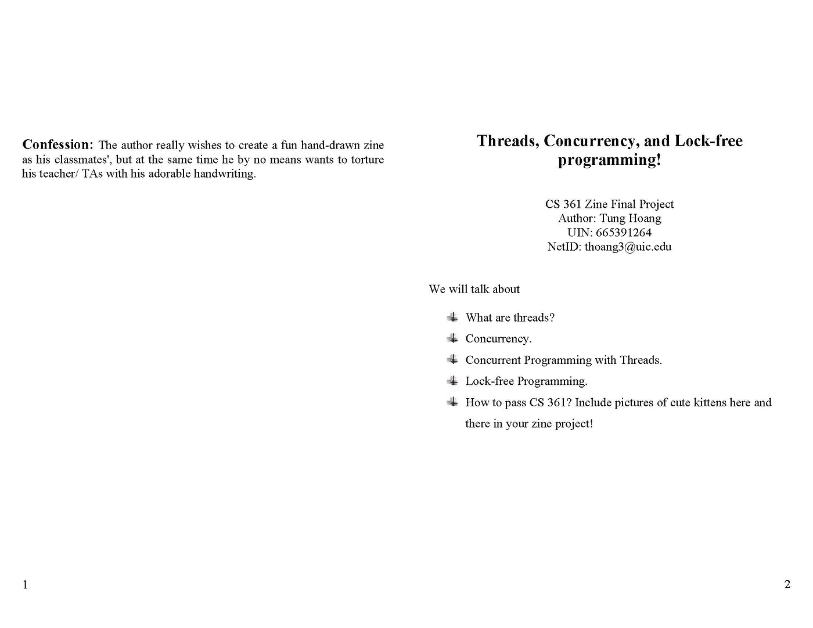
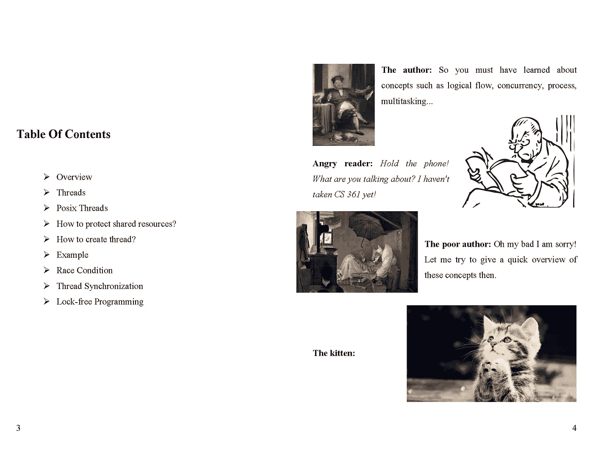
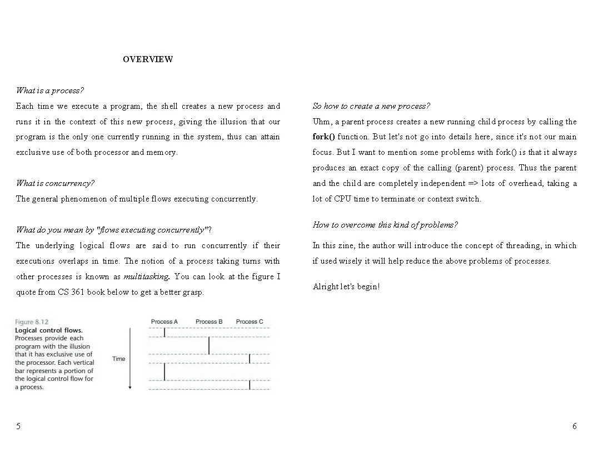
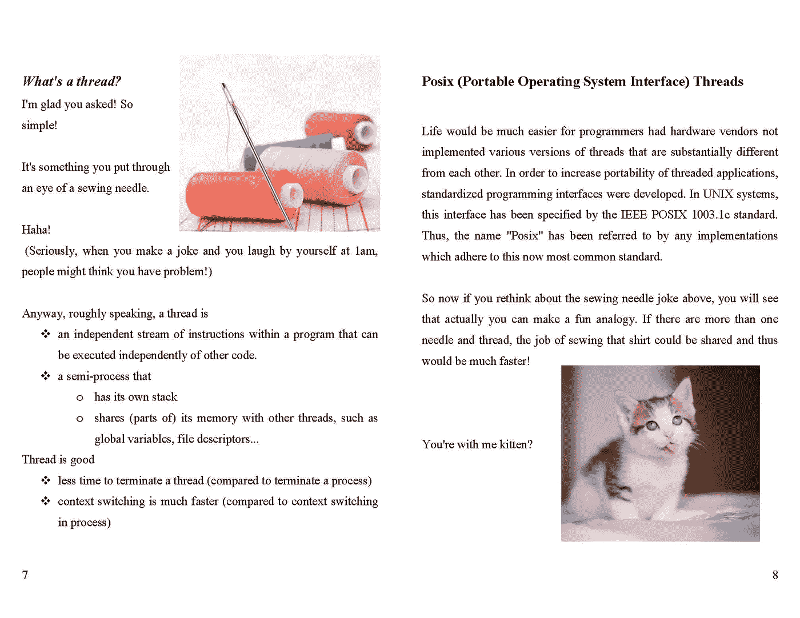
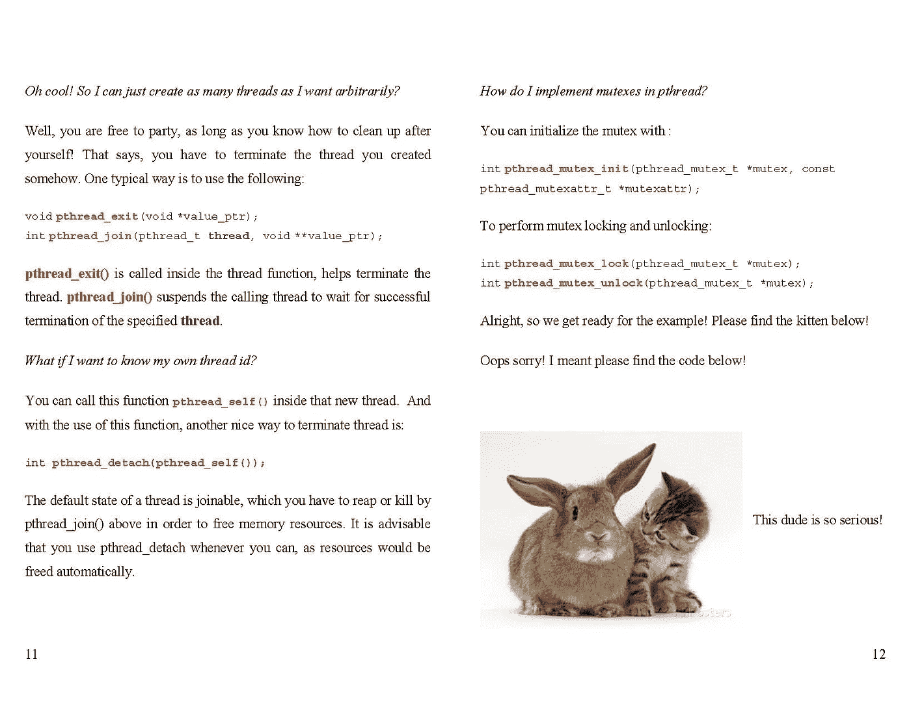
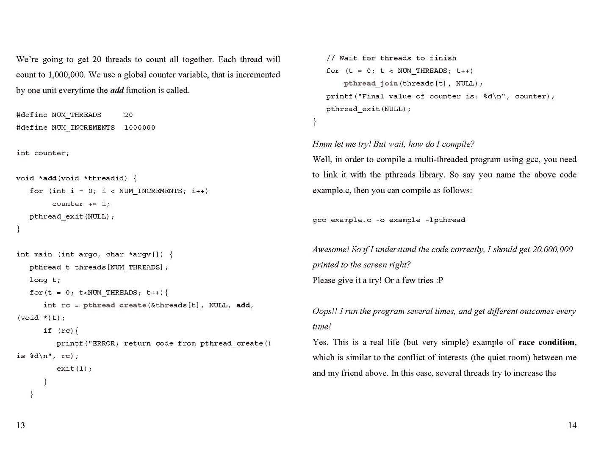
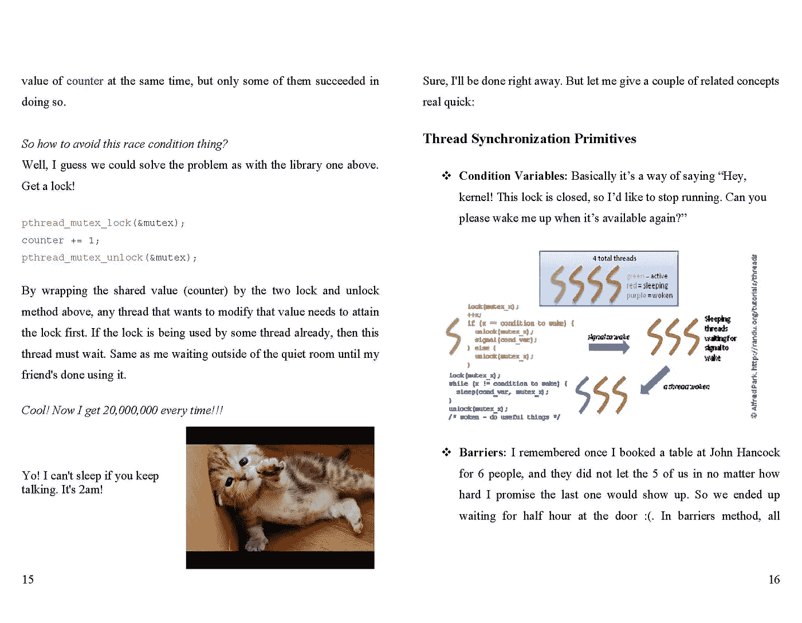
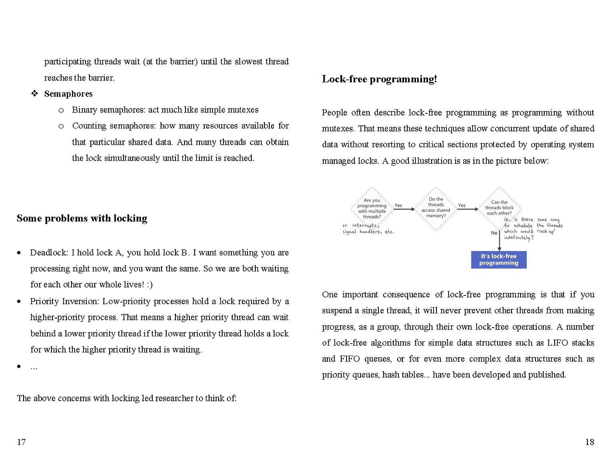
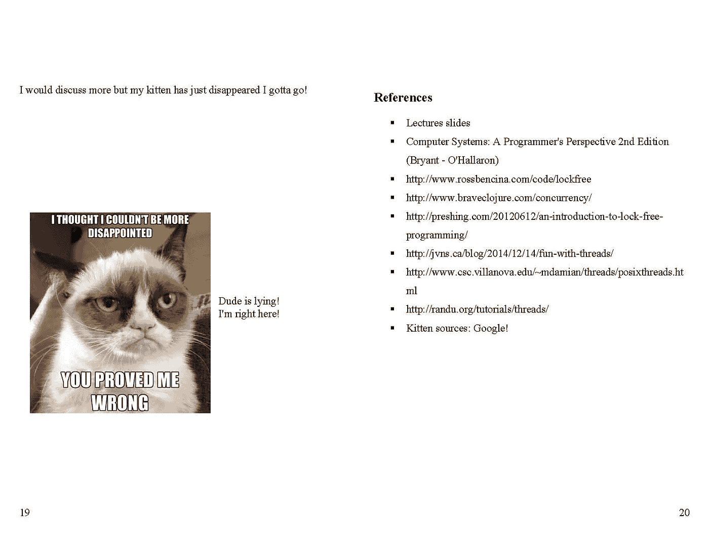

# 解释线程和并发概念

> 原文：<https://towardsdatascience.com/threads-and-concurrency-concepts-explained-2b0aa3b49b5a?source=collection_archive---------10----------------------->

我目前的工作要求我编写代码，如果代码是按顺序编写的，可能会花很多时间来执行。一个示例任务是将几个视频剪辑提取到帧中，以便用于训练我的深度学习模型。对于总持续时间为 4 小时的 96 个剪辑，序列代码将花费 1 小时用于帧提取。具有讽刺意味的是，我的电脑只有一个核心工作，而其余的闲置。这就是线程和并行处理可以介入并产生影响的地方！

不久前我在计算机系统课程中获得的关于线程和并行处理的知识现在已经帮助我显著地改进了我的代码。不用说，一旦代码被重写，运行同样的任务会快几倍。具体来说，在上面的例子中，现在只需要大约 11 分钟，因此在我的 CPU 上大约快了 5-6 倍(6 个内核/ 12 个逻辑处理器)。

那么什么是并行处理呢？粗略地说，并行处理是指你有一个很长的任务，可以分解成独立的子任务(也就是说有些任务不能分解，例如子任务可能是依赖的，因此为这些任务并行编写代码是没有用的)。然后，子任务被分布在本地计算机或网络上的处理器上，以最小化总执行时间。子任务可以是应用于相同数据的不同函数，或者是应用于数据分布的相同函数。

穿线呢？我想和你分享我在计算机系统课程中写的最后一个 zine 项目。希望这将为您提供线程和并发的概述。如果你不知道 zine 项目，请查看 [wiki、](https://en.wikipedia.org/wiki/Zine)这个[链接中的 zines 简史](https://blogs.lib.unc.edu/rbc/index.php/2017/10/25/a-brief-history-of-zines/)，以及如何在这个[链接中制作 zine](http://www.rookiemag.com/2012/05/how-to-make-a-zine/)。此外，因为我教授是小猫的忠实粉丝，她有时会在讲座幻灯片中与我们分享令人敬畏的图片，所以如果你在我的杂志项目中到处看到一些，不要感到惊讶:)

请找到下面的项目！

我希望你喜欢这篇文章。希望它也能启发你改进你的代码。在我的下一篇文章中，我将与您分享一些示例用例。和往常一样，请随时在下面给我反馈！

干杯，