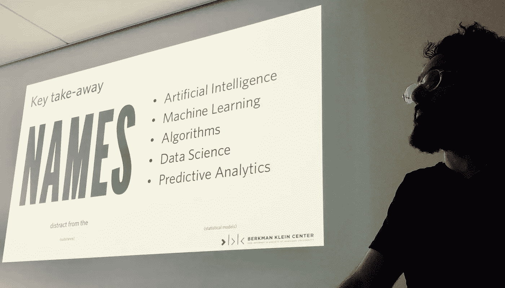
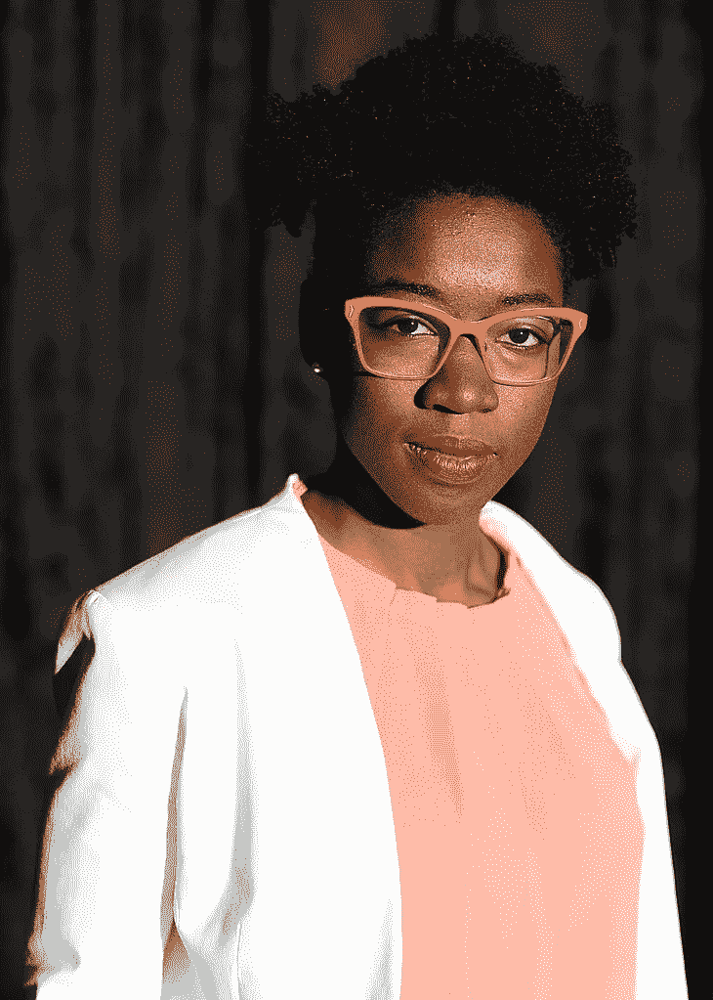

# 你应该问任何人的三个问题——人工智能或机器学习

> 原文：<https://towardsdatascience.com/three-questions-to-ask-artificial-intelligence-ai-machine-learning-6402c23ecf89?source=collection_archive---------8----------------------->

## 人工智能和机器学习看起来像黑匣子吗？这里有一些基本的问题，可以打开他们的盖子，以更批判性的方式接近他们。

Key take-away from Momin M. Malik: All the hyped names distract from the substance that it is just statistics.

你可能很难想到一家大型企业不谈论使用人工智能来解决他们目前面临的至少一些问题。似乎无处不在。

但这是什么呢？记者们如何报道它而不求助于 AI 将军的好莱坞图片:一台可以做任何事情的机器，从熨烫你的衬衫到奴役人类？

幸运的是，[哈佛大学](https://cyber.harvard.edu/node/91474)[伯克曼克莱恩中心](https://cyber.harvard.edu/)的数据科学博士后 Momin M. Malik 对于当你遇到一家公司或政府机构销售“由人工智能驱动”的东西时应该问什么样的关键问题有一些想法。

Momin M. Malik is a [data science postdoctoral fellow](https://cyber.harvard.edu/node/91474) at the [Berkman Klein Center for Internet & Society](https://cyber.harvard.edu/) at Harvard University,

# 1.型号是什么？

根据 Malik 的说法，人工智能、机器学习、预测分析和神经网络只是用来描述自 50 年代以来一直在研究的同一事物的一些名称。

但是创造一个无所不能的人工智能的想法已经被普遍抛弃，除了在好莱坞。电脑里并没有藏着有感知能力的人造生物。

**听到 AI，ML 等的时候。今天它要窄得多。这只是数学。许多名字偏离了现实，这只是统计模型，每个模型都有自己的用途。**

具体来说，你应该问这是不是一个[决策树](https://becominghuman.ai/understanding-decision-trees-43032111380f)？

如果是的话，你可能是幸运的，因为这些可以被普通人理解。其他像“神经网络”或“随机森林”这样的模型对人们来说太复杂了，难以理解。另一方面，决策树可能非常简单，它背后的数据科学家可以带你穿过它的分支。

# 2.预测精度如何(以及基于什么)？

机器学习基本基于两组数据:*训练数据*和*测试数据*。你把第一组数据输入机器，教会它数据集中的相互关系，并把它放入一个模型。

假设你用了泰坦尼克号*一半的乘客名单。该列表将包括乘客的年龄、性别、机票类型和票价，以及他们是死是活。那是你的*训练数据*。*

这些数据允许你建立一个模型，如果你知道新乘客的年龄、性别、机票类型和价格，这个模型可以估计新乘客存活的可能性。

乘客名单的另一部分可用于通过查看模型预测正确结果(活着还是死了)的频率来计算模型的准确性。那将是你的*测试数据。*

销售“人工智能驱动”软件的人可能会吹嘘自己的预测准确率接近 100%。但是像这样的数字可以用很多方法计算，你可以" [**过度拟合**](http://gregpark.io/blog/Kaggle-Psychopathy-Postmortem/) **"一个模型，它在你的测试数据上工作得很好，但是在现实世界中就不那么好了。**

麻省理工学院媒体实验室的研究员 Joy Buolamwini 最近的一项有趣的发现正好证明了这一点。

Joy Buolamwini is also the founder of the [Algorithmic Justice League.](https://www.ajlunited.org/) Photo by Niccolò Caranti (CC)

当她使用面部识别模型时，她发现该软件可以在她朋友和同事的脸上工作，但不能在她自己的脸上工作。直到她戴上白色面具，人工智能才注意到她。).

从那以后，她记录了多少商业面部识别算法在识别黑人女性方面如此糟糕，[以至于他们还不如抛硬币来决定他们的性别](http://news.mit.edu/2018/study-finds-gender-skin-type-bias-artificial-intelligence-systems-0212)，尽管他们在主要是白人(男性)的脸上测试时可能工作得很好。

具体的准确性数字可能不是非常重要，但询问它所依据的测试数据可能会揭示模型中的漏洞或通常对少数群体打击最大的固有偏见。

根据 Momin M. Malik 的说法，另一个危险信号是，如果模型使用的追溯数据只关注过去发生的事情。

模型的最佳测试是在模型建立后收集的数据。但是这种类型的测试通常不会进行。

在许多情况下，这可能是好的，但由于显而易见的原因，泰坦尼克号模型不应该被用来预测现代邮轮上的生存变化。

# 3.模型的目标是什么？训练数据与此相关吗？

最终，人工智能试图根据大量数据预测结果。所以你喂它什么很重要。有些可能只是噪音，隐含着不存在的意思。

泰坦尼克号乘客的头发颜色或他们名字中的字母数量可能不应该出现在存活率的模型中。

当你把所有东西都扔进模型而没有任何理论或思想支持时，这被称为“数据挖掘”。

另一个更复杂的问题是:尽管泰坦尼克号甲板上的男性溺水率比女性高得多，但这并不是因为他们的性别。这是因为规则，分配妇女和儿童的救生艇第一。但是模型不能告诉你，因为它不在数据中。

“机器学习的很多问题都是关于因果关系的。我们必须记住，预测是*唯一的*相关性，”这是 Momin M. Malik 的观点之一。

他在哈佛法学院的一次周四活动上展示了这些照片。你可以[发电子邮件](mailto:jhalen@cyber.harvard.edu)给伯克曼·克莱恩的研究员詹恩·海伦了解更多活动信息。如果你想更多地了解计算机擅长什么以及它们非常非常不擅长什么，莫明·m·马利克推荐梅雷迪思·布鲁萨德的《[人工智能》。它现在在我的阅读清单上。](https://mitpress.mit.edu/books/artificial-unintelligence)

拉托亚·彼得森也写过“[为什么记者需要了解人工智能”](https://en.ejo.ch/specialist-journalism/why-journalists-need-to-understand-artificial-intelligence):

**“…为了让我们真正让公众了解人工智能革命的全部潜力，我们需要在更强大的知识库上工作。”**

尽管像我这样的记者应该更好地向销售或使用人工智能的人提出关键问题，但一些人呼吁对算法进行实际审计。哈佛商学院的这篇文章“[为什么我们需要审计算法](https://hbr.org/2018/11/why-we-need-to-audit-algorithms)”说得好:

“为了金融市场和其他利益相关者的利益，公司长期以来一直被要求发布经审计的财务报表。这是因为——就像算法一样——公司的内部运作对外部的人来说就像“黑箱”一样(……)难道我们不应该让具有社会影响力的“黑箱”算法接受类似的审查吗？"

哈佛科学家建议提出以下问题:

1.  我如何最佳地建模和使用这些数据中的模式？
2.  这个数据样本能恰当地代表潜在的现实吗？
3.  基于当今现实的分布是合适的吗？

麻省理工学院媒体实验室的图灵盒项目是另一件值得关注的事情。2019 年，他们计划发布审计算法软件。

如果你已经走了这么远，感谢你的阅读。今年我在麻省理工学院做我的骑士科学新闻奖学金，在那里我花时间研究[技术和新闻的关系](https://medium.com/@magnusbjerg/the-journalist-developer-relationship-or-why-im-in-cambridge-right-now-318f3300bad1)。任何想法或想法都[非常欢迎](https://twitter.com/magnusbjerg)。

 [## 为什么我现在在剑桥

### 探索开发者和记者之间的关系…

medium.com](https://medium.com/@magnusbjerg/the-journalist-developer-relationship-or-why-im-in-cambridge-right-now-318f3300bad1)