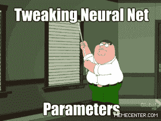

# 不应该使用深度学习的三个理由

> 原文：<https://towardsdatascience.com/three-reasons-that-you-should-not-use-deep-learning-15bec517b622?source=collection_archive---------4----------------------->

Tweaking neural network hyperparamters can be tricky business. Even Peter Griffin has trouble with it!

> 我为学习者写了一份名为《强大的知识》的时事通讯。每一期都包含链接和最佳内容的关键课程，包括引文、书籍、文章、播客和视频。每一个人都是为了学习如何过上更明智、更快乐、更充实的生活而被挑选出来的。 [**在这里报名**](https://mighty-knowledge.ck.page/b2d4518f88) 。

**深度学习**在过去几年里一直是人工智能领域最热门的事情。事实上，这真的激发了科学家、政府、大公司和几乎所有人对人工智能的兴趣！这确实是一门非常酷的科学，具有潜在的巨大的实际和积极的应用价值。它被用于金融、工程、娱乐以及消费产品和服务。

但是我们真的应该到处使用它吗？每当我们做出新的东西时，我们应该自动进行深度学习吗？

有一些情况下，它真的不适合使用深度学习，以及一些为什么你会选择走另一条路的原因。让我们探索它们…

## (1)它对小数据不太适用

为了实现高性能，深度网络需要非常大的数据集。我们拥有的**标签** **数据**越多，我们的模型表现就越好。获得良好注释的数据既昂贵又耗时。雇人手动收集图像并贴上标签根本没有效率。在深度学习时代，数据无疑是你最有价值的资源。

在最新研究中取得高性能的网络，往往是在[几十万](http://cocodataset.org/#home)甚至 [*几百万*](https://en.wikipedia.org/wiki/ImageNet) 样本上训练出来的。对于许多应用程序来说，这样的大型数据集并不容易获得，而且获取起来既昂贵又耗时。对于较小的数据集，回归、随机森林和 SVM 等经典 ML 算法通常优于深度网络。

## (2)实践中的深度学习既困难又昂贵

深度学习仍然是一项非常前沿的技术。你肯定可以像很多人一样得到一个快速简单的解决方案，特别是使用广泛可用的 API，如 [Clarifai](https://clarifai.com/) 和谷歌的 [AutoML](https://cloud.google.com/automl/) 。但如果你想做一些相当定制的东西，这样的服务不会削减它。除非你愿意把钱花在研究上，否则你会有点局限于做一些至少和其他人做的事情稍微相似的事情…

这也很昂贵，不仅因为获取数据和[计算能力](https://www.tomshardware.com/news/ethereum-effect-graphics-card-prices,34928.html)所需的资源，还因为雇佣[研究人员](https://www.nytimes.com/2018/04/19/technology/artificial-intelligence-salaries-openai.html)。深度学习研究现在非常热门，所以这三项费用都非常高。你最终还会有很高的开销，因为当做一些定制的事情时，你会花很多时间去尝试和破坏。

## (3)深层网络不容易解释

深层网络是非常“黑箱”的，因为即使现在研究人员也没有完全理解深层网络的“内部”。他们有很高的预测能力，但解释能力较低。由于缺乏理论基础，超参数和网络设计也是一个相当大的挑战。

最近有很多工具，比如显著图和[激活差异](https://arxiv.org/abs/1704.02685)，它们对某些领域非常有效，类似于下图所示的工具。但不幸的是，它们并不能完全适用于所有应用。这些工具经过精心设计，主要是为了确保您不会使网络过度适应数据集或专注于虚假的特定要素。仍然很难解释每个特征对深度网络的整体决策的重要性。

Visualizations of features in a deep convolutional neural network

另一方面，经典的最大似然算法，如回归或随机森林，由于涉及直接的特征工程，很容易解释和理解。此外，调整超参数和改变模型设计更加简单，因为我们对数据和底层算法有了更透彻的理解。当网络的结果必须被翻译并交付给公众或非技术受众时，这些尤为重要。我们不能只说“我们卖了那支股票”或“我们在那个病人身上用了这种药”*因为我们的深层网络这么说*。我们需要知道原因。不幸的是，到目前为止，我们所有关于深度学习的证据都是经验性的。

# 喜欢学习？

在 twitter 上关注我，我会在这里发布所有最新最棒的人工智能、技术和科学！也在 [LinkedIn](https://www.linkedin.com/in/georgeseif/) 上和我联系吧！