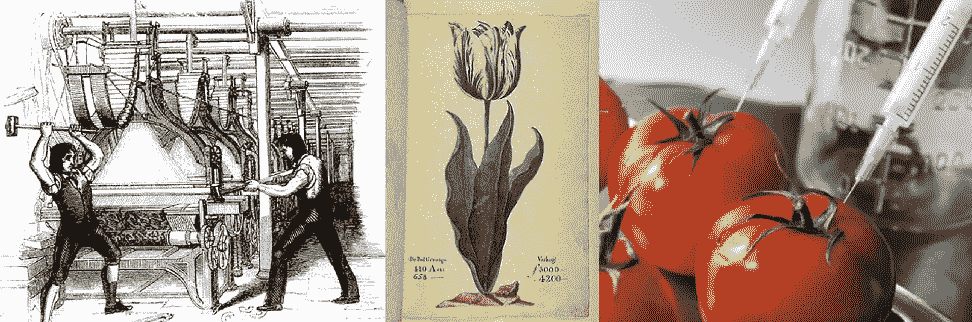

# 对人工智能重新品牌化三思的三个理由

> 原文：<https://towardsdatascience.com/three-reasons-to-think-twice-about-ai-re-branding-d0c8e7c11e5d?source=collection_archive---------6----------------------->

(Image details are given in footnotes)

> “当我使用一个词时，”汉仆·邓普蒂用相当轻蔑的语气说，“它的意思就是我选择它的意思——不多也不少。'
> 
> “问题是，”爱丽丝说，“你能不能让单词有这么多不同的意思。” *—刘易斯·卡罗尔，透过镜子*

“人工智能”或简称“AI”是一个不透明的术语，没有公认的定义，范围也有争议。它通常被用来代表一种或多种不同的技术，这些技术有能力给整个世界带来实质性的、变革性的和破坏性的变化。由于它所代表的技术的影响力越来越大，它在新闻报道中的出现频率越来越高。[许多组织都在争先恐后地将其纳入营销材料，并将其融入内部流程。](http://www.computerweekly.com/feature/Is-artificial-intelligence-hype-sowing-damaging-confusion)鉴于目前围绕这个词的热议，肯定“跟上这个项目”并利用这种高水平的兴趣是有意义的吗？为什么你不想让人们看到你的公司时马上想到“人工智能”？

在科学和技术社区内，使用人工智能作为标签，几十年来一直被视为有问题的。在机器学习、数据科学、图像分析和自然语言处理等研究领域，这个术语很少被提及。也许现在是我们这些在这些领域工作的人或者对该领域的历史有更深理解的人思考我们如何与我们的雇主和利益相关者接触的时候了:特别是，我们如何围绕这些新兴技术进行有效的沟通，同时将所有这些技术聚集在一个过度宣传的品牌下的固有风险降至最低。下面，我提出了人工智能标签在科学界不受欢迎的三个相互关联的原因，并通过一个论点扩展了每个原因，即我们为什么要对这个术语在工业中的过度采用保持谨慎。

# **1。*历史*论证**

> 不记得过去的人注定要重蹈覆辙。——*乔治·桑塔亚纳*

我们现在已经看到两个 [AI winters](https://en.wikipedia.org/wiki/AI_winter) 了。当这些发生时，研究资金枯竭，项目被封存，工作岗位流失，科学进步受到限制。人工智能历史上的下一个重大故障将会不同，它将不会是一个冬天，而[会有更多的反弹](https://www.theguardian.com/science/2017/nov/01/artificial-intelligence-risks-gm-style-public-backlash-experts-warn)。现在这似乎是必然的了；剩下的问题更多的是反弹会有多大。[如果目前关于自动化对就业市场的影响的预测成为现实，这可能是相当大的一笔](https://www.technologyreview.com/s/603465/the-relentless-pace-of-automation/)。在这种情况下，预计会看到与禽流感相关的负面宣传越来越多，就像前两个禽流感冬天一样，个人和组织会争相通过明显(1)远离这个术语来实现损害限制。如果余波达到政治层面，学术研究活动可能会受到深刻影响。面对公众压力，政治层面的反应可能会引发下意识的、而非深思熟虑的监管反应。

# 2.“教育公众”的论点

> "任何足够先进的技术都和魔法没什么区别。"
> ——*亚瑟·C·克拉克*

对于大多数在可能被视为人工智能的领域工作的人来说，存在着精确、准确和有意义的标签。让我们使用它们。如果我们从事数据科学，就这么说吧(2)。如果我们正在开发增强现实硬件，就这么说吧。如果我们专注于自然语言处理，那么让我们明确这一点。如果我们在机器人技术中结合机器学习方法，那么让我们用那种精确度来描述它。将这些不同的技术融合在一个抽象的标签下，给原本清晰明了的技术蒙上了一层不必要的神秘面纱。如果我们希望更广泛的公众对将影响他们的发展有一个明智的理解，让我们尽可能使用准确和有意义的术语来帮助创造这种理解。

如果人工智能将成为许多人认为的巨大、包罗万象、改变生活的范式转变、引发奇点的“东西”，那么它将影响科学的每个领域和地球上每个人的生活。因此，这个术语将变得比现在更加模糊不清……包含了几乎所有的东西，意味着几乎所有的东西。会比现在更不具体，更有问题。如果大多数普通人认为人工智能是有效的“魔法”，那么科学和技术社区将在他们所面临的最重要的教育挑战中失败。

# 3.“语义”论点

> *"* 机器能否思考的问题……和潜艇能否游泳的问题一样重要。 *—埃德格·w·迪杰斯特拉*

我们用了一个词——智力——几个世纪以来，人们一直在争论这个词的含义，我们把它纳入了一个用来定义一门科学学科的术语。因此，结果是我们创造了一个本身也无法定义的表达。由此产生的关于人工智能现在意味着什么的广泛观点(不幸的是，对许多人来说是“天网”)经常会破坏有价值的讨论或辩论。关于某种形式的机器学习方法与特定挑战的相关性的技术对话，可能会立即被类似“什么是智能？”这样的感叹词边缘化，“机器真的能变得有意识吗？”或者“机器会接管吗？”以这种方式“离题”的对话通常是无法恢复的(3)。

值得强调的是，事实上，数据科学(个人数据、隐私权)和自动化(围绕无人驾驶汽车的问题、对就业的影响)领域出现了许多至关重要的[哲学和伦理问题](https://www.nature.com/news/robotics-ethics-of-artificial-intelligence-1.17611)，需要紧急考虑。这并不是说这样的讨论是不相关的，而是在某个*特定领域*的背景下产生或正在进行的讨论需要某种程度的关注，才能有任何价值或取得任何成果。由于人工智能不是一个特定的领域，围绕这个术语的任何对话都很合理地向任何人开放，基于他们对人工智能对他们个人代表什么的看法。因此，这一术语已成为滋生混乱和误解的温床，并经常成为不同学科和利益之间分歧的爆发点。

# 反论点

一旦新技术碾过你，如果你不是压路机的一部分，你就是道路的一部分。”—斯图尔特·布兰德

当然，有一种观点认为人工智能是“瓶子里的精灵”:它现在实际上是一种不可阻挡的力量，有巨大的经济动力推动它；这意味着无论我们选择什么术语，它都会对我们产生影响。所有这些毫无疑问都是真的，这些都不能使上面的论点无效。然而，[“人工智能”的发展如果不承认或不参与上面提到的一些问题，可能会产生令人不安的社会后果，对未来的发展产生不利影响](https://www.wired.com/story/ai-research-is-in-desperate-need-of-an-ethical-watchdog/):

*   与企业相比，学术研究资金往往更容易受到政治因素的影响。由于人工智能的反弹，减少对人工智能或自动化研究的公共学术资助，仅仅意味着[更大比例的持续科学发展将越来越多地集中在少数强大的受利润驱动的公司](https://www.theguardian.com/science/2017/nov/03/why-we-cant-leave-ai-in-the-hands-of-big-tech)。
*   虽然[将自己标榜为人工智能可能符合强大公司的利益，因为他们可能会经受住任何这样的反弹](https://www.ft.com/content/3349ef84-268c-11e7-a34a-538b4cb30025)，但类似的市场定位(如果人工智能被视为负面)可能会在相对更大的程度上对中小型公司产生不利影响。
*   另一方面，尽管公众强烈反对人工智能，但经济力量对人工智能在行业中生存的保证可能会使行业和个人的观点两极分化(对于历史上的例子，考虑公众知识的质量差和围绕转基因和水力压裂的一般性辩论)[以及日益加剧的财富不平等](https://www.technologyreview.com/s/531726/technology-and-inequality/)。对人工智能来说，出现这种情况的可能性只会加强提高公众理解的理由。如果按照惯例，将许多底层技术毫无意义地合并在一个被贬低的术语中，那么建立这种理解的尝试将会变得混乱。

艾很清楚*现在是*瓶子里的妖怪。这种表达一直伴随着我们。当它是正确的表达方式时，让我们使用它。如果不是这样，鉴于我们手边有大量定义明确、普遍接受、准确且有意义的术语，让我们尽可能有效地与受众沟通。

*脚注:*

*(1)历史上，一些人工智能研究项目通过研究人员重新命名他们的工作，或者使用现有的术语，新的标签或者两者的结合(统计学，机器学习，统计学习)，度过了人工智能的冬天。)*

*(2)经常有人声称或观察到数据科学是一个不可定义或模糊的术语。这正日益成为一小部分个人或组织的自私论点，并且严重夸大了事实。数据科学领域的大多数人都非常清楚自己在做什么。然而，数据科学目前是一个热门术语，因此它很容易被滥用，例如在寻求项目资金时，或被寻求就业的个人滥用。它可以服务于那些在数据科学边缘工作或超越数据科学边缘的人的利益，尝试扩展该术语的含义，以便他们自己的活动适合它。*

*(3)希望我已经阐明，这不是一个反对广泛辩论的论点，也不是反对我们当前科学发展背景下的一般哲学问题的论点。也不是反对讨论智力或意识的意义。*

*图片(从左到右):
-两个反对增加机械化的人看到机器弄坏了一台提花织机——维基百科。
——“总督”郁金香，在 1637 年“郁金香狂热”崩溃的高峰期，其球茎售价约为普通房屋价格的五倍——维基百科。
-用注射器注射西红柿的图像是一种常见的图形，用于表示对转基因生物的担忧——exposingtruth.com。*