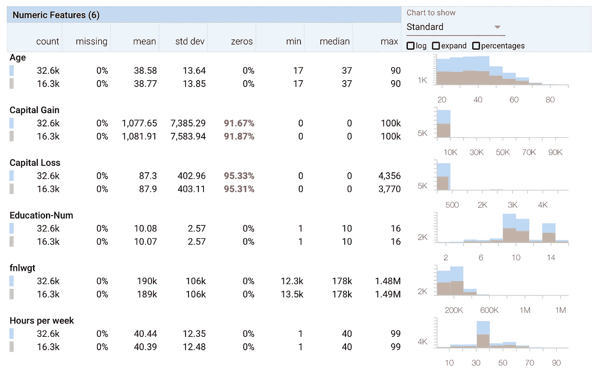
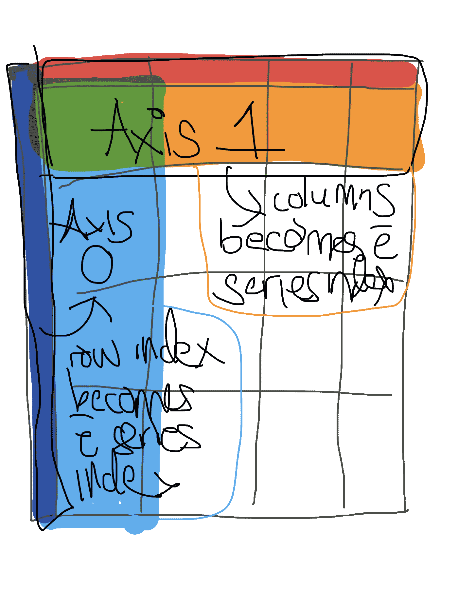
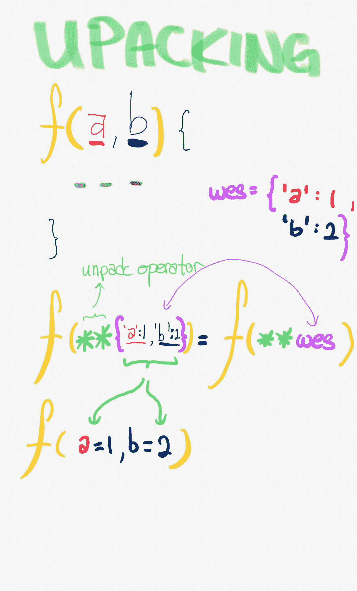

# 收拾熊猫

> 原文：<https://towardsdatascience.com/tidying-up-pandas-4572bfa38776?source=collection_archive---------4----------------------->


对于那些使用熊猫模块的人来说，你会很快意识到的第一件事是，做任何事情都有不止一种方法。

本文的目的是展示我们如何通过从 R 的`dplyr`和`tidyverse`库汲取灵感来限制这种情况。

由于来自学术界，R 通常是我周围人的通用语言(计算生物学/生物信息学或统计学)。和他们一样，我迷上了著名的`tidyverse`元包，它包括`dplyr`(之前的`plyr`、ply(e)r)、`lubridate`(时间序列)和`tidyr`。

> *PS。在我写这篇文章的时候，我意识到这不仅仅是* `*tidyverse*` *，而是整个 R 生态系统，我已经开始喜欢上它了，同时也喜欢上了宏基因组学和计算生物学。*

为了方便从 R 起步的人，`pandas`是 python 的 dataframe 模块。像 H2Oai 的[数据表](https://datatable.readthedocs.io/en/latest/using-datatable.html)这样的其他包是存在的，它在很大程度上受到 R 自己的[数据表](https://cran.r-project.org/web/packages/data.table/vignettes/datatable-intro.html)库的启发。

在他的演讲中，[Hadley Wickham](https://youtu.be/dWjSYqI7Vog?t=2m7s)(dplyr 包的创建者)他提到我们真正需要的表格操作只是一些函数:

*   过滤器
*   挑选
*   安排
*   使突变
*   group_by
*   概括
*   合并

然而，我认为你需要比以上更多的东西。

比如知道 R 的`apply`函数族，会有很大帮助。或者像`summary`或`str`这样的汇总统计函数，尽管现在我大多使用`skimr::skim`进行汇总。

```
skim(iris) 
## Skim summary statistics 
## n obs: 150  
## n variables: 5  
##  
## ── Variable type:factor ────────────────────────────────────────────────────────────────────────────────────────────────── 
## variable missing complete n n_unique top_counts ordered 
## Species 0 150 150 3 set: 50, ver: 50, vir: 50, NA: 0 FALSE 
##  
*## ── Variable type:numeric ─────────────────────────────────────────────────────────────────────────────────────────────────*
*##      variable missing complete   n mean   sd  p0 p25  p50 p75 p100     hist*
*##  Petal.Length       0      150 150 3.76 1.77 1   1.6 4.35 5.1  6.9 ▇▁▁▂▅▅▃▁*
*##   Petal.Width       0      150 150 1.2  0.76 0.1 0.3 1.3  1.8  2.5 ▇▁▁▅▃▃▂▂*
*##  Sepal.Length       0      150 150 5.84 0.83 4.3 5.1 5.8  6.4  7.9 ▂▇▅▇▆▅▂▂*
*##   Sepal.Width       0      150 150 3.06 0.44 2   2.8 3    3.3  4.4 ▁▂▅▇▃▂▁▁*
```

事实上，skimr 的输出看起来真的很像 Google 的 Facets。正如您所看到的，打印基本的分布统计和直方图。



因此，在这篇文章中，我将尽力演示`tidyverse`词汇表与`pandas` DataFrame 方法的一对一映射。

为了演示，我们将使用著名的[鸢尾花数据集](https://en.wikipedia.org/wiki/Iris_flower_data_set)。

```
# python 
import seaborn as sns 
iris = sns.load_data("iris")
```

我选择使用 seaborn 导入 iris 数据集，而不是使用 sklearn 的`datasets.load_iris`，这是因为后者将数据集导入为 numpy 数组，而不是 pandas DataFrames。

在导入一个表之后，我做的第一件事就是在 data.frame 上运行`str`函数(不完全等同于`pd.DataFrame.info()`方法)并检查是否有 NAs。

```
# R
str(iris)
> 'data.frame':   150 obs. of  5 variables:
 $ Sepal.Length: num  5.1 4.9 4.7 4.6 5 5.4 4.6 5 4.4 4.9 ...
 $ Sepal.Width : num  3.5 3 3.2 3.1 3.6 3.9 3.4 3.4 2.9 3.1 ...
 $ Petal.Length: num  1.4 1.4 1.3 1.5 1.4 1.7 1.4 1.5 1.4 1.5 ...
 $ Petal.Width : num  0.2 0.2 0.2 0.2 0.2 0.4 0.3 0.2 0.2 0.1 ...
 $ Species     : Factor w/ 3 levels "setosa","versicolor",..: 1 1 1 1 1 1 1 1 1 1 ...# python 
iris.info(null_counts=True)
<class 'pandas.core.frame.DataFrame'>
RangeIndex: 150 entries, 0 to 149
Data columns (total 5 columns):
sepal_length    150 non-null float64
sepal_width     150 non-null float64
petal_length    150 non-null float64
petal_width     150 non-null float64
species         150 non-null object
dtypes: float64(4), object(1)
memory usage: 5.9+ KB
```

# 过滤器

现在，进入下一个功能。与 R 的`filter`最接近的方法是`pd.query`方法。在下面的例子中，截止值已经被定义为一个变量。

```
# R
iris %>% filter(sepal.width > cutoff)# python
## Method 1: 
iris[iris.sepal_width > cutoff]## Method 2:
iris.query("sepal_width > @cutoff”)
```

在 python 中有两种方法可以做到这一点。

方法 1 可能是你会发现大多数 python 爱好者使用的方法。

不过在我看来，`pd.DataFrame.query()`和`dplyr::filter()`的映射更为紧密。

> *使用 query 的一个缺点是…遵循* `*pep8*` *约定的 linters，比如* `*flake8*` *，会抱怨* `*cutoff*` *变量没有被使用，尽管它已经被声明:* `*sepal_width > @cutoff*` *。这是因为 linter 无法识别在查询的引用参数中使用的* `*cutoff*` *变量。*

>注意:令人惊讶的是，filter 在 pySpark 中有所回报。:)

```
# python (pyspark)type(flights) 
pyspark.sql.dataframe.DataFrame# filters flights which are > 1000 miles long flights.filter('distance > 1000')
```

# 挑选

这让人想起 SQL 的`select`关键字，它允许您选择列。

```
# R 
iris %>% select(sepal.width, sepal.length)# Python 
iris.loc[:, [["sepal_width", "sepal_length"]]]
```

最初，我认为下面的`df[[’col1’, 'col2’]]`模式会是一个很好的地图。但是我很快意识到我不能做类似于`select`的柱状切片。

```
# R 
iris %>% select(Sepal.Length:Petal.Width)# Python  
iris.loc[:, "sepal_length":"petal_width"]
```

关于`loc`方法需要注意的一点是，当选择只有一行时，它可能返回一个序列而不是一个数据帧。因此，您必须对感兴趣的行进行切片，以便输出返回一个数据帧。

```
# Pythoniris.loc[1, :]  # returns a Series 
iris.loc[[1],:] # slicing returns a dataframe
```

但是`select`真正令人惊叹的是，它能够让*取消选择*列，这是`loc`方法中所没有的。

你必须使用`.drop()`方法。

```
# R
df %>>% select(-col1) # Python
df.drop(columns=["col1"])
```

> *注意我必须添加参数* `*columns*` *，因为 drop 不仅可以用于删除列，该方法还可以基于它们的索引删除行。*

和`filter`一样，`select`也用在 pySpark 上！

```
# python (pySpark)# shows the column xyz of the spark dataframe.
df.select("xyz").show()# alternative  
df.select(df.xyz)
```

# 安排

通过 arrange 函数，可以按照特定的列对表格进行排序。

```
# R 
df %>% arrange(desc(col1))# Python 
df.sort_values(by="col1", ascending=False) 
# everything is reversed in python fml.
```

# 使突变

`dplyr`的`mutate`实际上是 R 的`apply`的升级版。

> ***注意*** *: R 的许多其他应用如* `*mapply*` *和* `*lapply*` *但是可以在很大程度上被 purrr 库中的新函数所取代。*

```
# R 
df %>% mutate(new = something / col2, newcol = col+1 )# Python 
iris.assign(new = iris.sepal_width / iris.sepal, 
newcol = lambda x: x["col"] + 1 )
```

默认情况下，`tidyverse`的`mutate`函数获取整列并对其进行矢量化操作。如果你想逐行应用这个函数，你必须将`rowwise`和`mutate`连接起来。

```
# R
# my_function() does not take vectorised input of the entire column 
# this will failiris %>% 
    rowwise %>% 
    mutate(new_column = my_function(sepal.width, sepal.length))
```

为了使用`.assign`方法达到同样的效果，您应该在函数中嵌套一个`apply`。

```
# Pythondef do_something(col): 
    #set_trace() 
    if re.search(r".*(osa)$", col): 
        value = "is_setosa" 
    else: value = "not_setosa" 
        return value iris = iris.assign( 
    transformed_species = lambda df: df.species.apply(do_something) 
)
```

如果你很懒，你可以把两个匿名函数链接在一起。

```
# Pythoniris = iris.assign( transformed_species = lambda df: df.species.apply(do_something_string))
```

# 绕道:申请

来自 R 的`apply`帮助文档:

```
apply(X, MARGIN, FUN, ...)
```

其中`MARGIN`的值对于(行、列)取`1`或`2`，即。如果您想应用于每一行，您可以将轴设置为`0`。

然而，在 pandas axis 中，什么值(索引 I 或列 j)将用于应用函数输入参数的索引。

be 使用的`0`是指数据帧的索引，轴`1`是指列。



因此，如果你想进行行操作，你可以设置轴为 0。

```
# Rdf %>% apply(0, function(row){ ... do some compute ... })
```

> *自从* `*plyr*` *和后来的* `*dplyr.*`之后就很少这样做了

然而在熊猫身上没有`plyr`。因此，如果您想要进行逐行操作，我们必须返回使用 apply，但是，轴现在是 1 而不是 0。我最初发现这非常令人困惑。原因是因为`row`实际上只是一个`pandas.Series`，它的索引是父 p 和 as。DataFame 的列。因此，在本例中，轴指的是将哪个轴设置为索引。

```
# pythoniris.apply(lambda row: do_something(row), axis=1)
```

有趣的是，我在 R 中没有使用的模式是在列上使用 apply，在这个例子中是`pandas.Series`对象。

```
# pythoniris.sepal_width.apply(lambda x: x**2) # if you want a fancy progress bar, you could use the tqdm functioniris.sepal_width.apply_progress(lambda x: x**2) # If u need parallel apply # this works with dask underneath  import swifteriris.sepal_width.swifter.apply(lambda x : x**2)
```

在 R 中，有一个常见的习惯用法，我经常在`groupby`的平行版本中使用，如下所示:

```
# Runique_list %>% 
lapply(function(x){ 
    ... 
    df %>% filter(col == x) %>% do_something() # do something to the subset 
    ... 
}) %>% do.call(rbind,.)
```

如果你想要一个平行版本，你只需要把`lapply`改成`mclapply`。

此外，还有来自 r 的`parallel` / `snow`图书馆的`mclapply`

```
# Rncores = 10 # the number of cores 
unique_list %>% 
    mclapply(function(x){ 
    ... 
    df %>% filter(col == x) %>% do_something() # do something to the subset 
    ... 
}, mc.cores=ncores) %>% 
do.call(rbind,.)
```

另外，在 PySpark 中，您可以将整个表分成几个分区，并行地进行操作。

```
# Python (pySpark)(
    dd.from_pandas(my_df,npartitions=nCores)
        .map_partitions(lambda df : df.apply( lambda x : nearest_street(x.lat,x.lon),axis=1))
        .compute(get=get) # imports at the end)
```

为了达到同样的目的，我们可以使用`dask`，或者使用`swiftapply`模块的更高级别的包装器。

```
# Python# you can easily vectorise the example using by adding the `swift` method before `.apply` 
series.swift.apply()
```

# 分组依据

pandas 中的`.groupby`方法相当于 R 函数`dplyr::group_by`返回一个`DataFrameGroupBy`对象。

> *tidy verse 中有* `*ungroup*` *函数对分组后的数据帧进行解组，为了达到同样的效果，不存在一对一的映射函数。*
> 
> *一种方式是完成*`*groupby*`*->-*`*apply*`*(两步法)和送料应用同一个功能* `*apply(lambda x: x)*` *。这是一个身份函数。*

# 概括

在熊猫中，`summarise`功能的对等物是`aggregate`，缩写为`agg`功能。你必须把这个和`groupby`结合起来，所以这又是一个类似的两步`groupby` - > `agg`转换。

```
# R r_mt = mtcars %>% 
    mutate(model = rownames(mtcars)) %>% 
    select(cyl, model, hp, drat) %>% 
    filter(cyl < 8) %>% 
    group_by(cyl) %>% 
    summarise( 
        hp_mean = mean(hp),
        drat_mean = mean(drat), 
        drat_std = sd(drat), 
        diff = max(drat) - min(drat) 
    ) %>% 
    arrange(drat_mean) %>% 
    as.data.frame
```

用 Python 编写的相同系列的转换如下:

```
# Python def transform1(x): 
    return max(x)-min(x) def transform2(x): 
    return max(x)+5 
    py_mt = ( 
        mtcars
            .loc[:,["cyl", "model", "hp", "drat"]] #select      
            .query("cyl < 8") #filter 
            .groupby("cyl") #group_by 
            .agg({ #summarise, agg is an abbreviation of aggregation     
                    'hp':'mean', 
                    'drat':[
                        'mean', 
                        'std', 
                        transform1, 
                        transform2] # hmmmmmm
            })
            .sort_values(by=[("drat", "mean")]) 
# multindex sort (unique to pandas) ) py_mt
```

# 合并

R 本身支持`merge`函数，类似地，熊猫也有`pd.merge`函数。

```
# R df1 %>% merge(df2, by="common_column")# Pythondf1.merge(df2, how="inner", on="common_column")
```

除了`merge`功能，还有`join`功能。dplyr 中还存在其他连接，例如`left_join`、`right_join`、`inner_join`和`anti_join.`

# 原地

在 R 中有一个复合赋值管道操作符`%<>%`，它类似于一些 pandas 函数*中的`inplace=True`参数，但不是所有的*。:(很明显，熊猫将会完全取代……

# 排除故障

在 R 中，我们有`browser()`函数。

请注意，这不适用于 Jupyter 的 IRKernel。

```
# R 
unique(iris$species) %>% 
    lapply(function(s){ 
        browser() 
        iris %>% filter(species == s) 
        ....
     })
```

它会让你*进入*功能，如果你想做一些调试，这是非常有用的。

在 Python 中，有`set_trace`函数。

```
# Pythonfrom IPython.core.debugger import set_trace(
    iris
        .groupby("species") 
        .apply(lambda groupedDF: set_trace())
) 
```

最后但同样重要的是，如果你真的需要使用一些 R 函数，你总是可以依赖于`rpy2`包。对我来说，我主要用这个来绘图。ggplot2 ftw！抱歉 matplotlib 和 seaborn

```
%load_ext rpy2.ipython
```

> *有时使用 r 安装 r 包会有问题。你可以运行*

`conda install -r r r-tidyverse r-ggplot`

此后，您可以在同一个 Jupyter 笔记本中交替使用 R 和 Python。

```
%%R -i python_df -o transformed_dftransformed_df = python_df %>% 
    select(-some_columns) %>% 
    mutate(newcol = somecol * 2)
```

> *注:* `*%%R*` *是细胞魔法，* `*%R*` *是线条魔法。这意味着如果你有一个多行 r 函数/代码，使用前者。*

如果你需要输出像一个正常的熊猫数据帧打印，你可以使用百分之一魔术

```
%R some_dataFrame %>% skim
```

# 迂回:省略

在 R 中，您可以做的一个巧妙的技巧是将参数传递给内部函数，而不必在外部函数的函数签名中定义它们。

```
# R 
#' Simple function which takes two parameters `one` and `two` and elipisis `...`,somefunction = function(one, two, ...){ 
     three = one + two 
     sometwo = function(x, four){ 
         x + four 
     } 
     sometwo(three, ...) # four exists within the elipisis  
} 
# because of the elipisis, we can pass as many parameters as we we want. the extras will be stored in the elipisissomefunction(one=2, two=3, four=5, name="wesley")
```

在 python 中，`**kwargs`代替了`...`。下面是对其工作原理的解释。

## 说明

首先，双星号`**`被称为*解包*操作符(它被放在函数签名之前，例如`kwargs`，所以合起来看起来像`**kwargs`)。

> *约定是将该变量命名为* `*kwargs*` *(代表****k****ey****w****orded arguments)但它可以被命名为任何名称。*

大多数描述 unpack 操作符的文章都会以**这个**解释开始:字典被用来传递函数的参数。

```
# Pythonadictionary = { 'first' : 1, 'second': 2 } 
def some_function(first, second): 
    return first + second 
some_function(**adictionary) # which gives 3
```



但是你也可以改变这一点，将`**kwargs`设置为一个函数签名。这样做可以让您在调用函数时键入任意数量的函数签名。

签名-值对被包装到一个名为`kwargs`的字典中，该字典可以在函数内部访问。

```
# Python 
# dummy function which prints `kwargs`def some_function (**kwargs): 
    print(kwargs) 
some_function(first=1, second=2)
```

前两种情况并不排斥，你实际上可以~*~它们混合在一起。即。有署名的还有一个`**kwargs`。*

```
*# Python 
adictionary = { 
    'first' : 1,
    'second': 2,
    'useless_value' : "wesley"
} def some_function(first, second, **kwargs): 
    print(kwargs) return first + secondsome_function(**adictionary)*
```

*输出将是:`{'useless_value': 'wesley'}`*

*它允许 python 函数接受您提供的任意多的函数签名。将直接使用在函数声明期间已经定义的那些。没有出现在其中的可以从 kwargs 中访问。*

*通过将`**kwargs`作为内部函数中的一个参数，您基本上是将字典展开到函数 params 中。*

```
*# Pythondef somefunction(one, two, **kwargs): 
    print(f"outer function:\n\t{kwargs}") 
    three = one + two 
def sometwo(x, four): 
    print(f"inner function: \n\t{kwargs}") 
    return x + four returnsometwo(three, **kwargs) 
somefunction(one=2, two=3, four=5, name=“wesley”)*
```

*外部功能:`{“four":5, “name":"wesley"}`。*

*里面里面夸尔格斯:`{“name":"jw"}.`*

*现在让我们将它与原始的 R 省略号进行比较:*

```
*# R #' Simple function which takes two parameters `one` and `two` and elipisis `...`,somefunction = function(one, two, ...){ 
    three = one + two 
    sometwo = function(x, four){ 
        x + four 
    } 
    sometwo(three, ...) # four exists within the elipisis  
} 
# because of the elipisis, we can pass as many parameters as we we want. the extras will be stored in the elipisissomefunction(one=2, two=3, four=5, name="wesley")*
```

# *结论*

*虽然在熊猫身上做同样的事情有很多方法，比 dplyr (tidyverse)规定的方法更多。我希望内部 R 用户在用 pandas 编码时标准化代码库，提高代码可读性。*

*此外，来到 Honestbee 后，让我措手不及的是所需的 SQL 数量。*

*这一点我感觉是来到工业界对学术界最大的偏离。公司中的数据以数据库/数据湖(不太常见)和数据流的形式有序存储。不再有一个大的平面数据文件。*

*虽然有 dbplyr 包，但我强烈建议您花点时间熟悉一下 SQL，尤其是查询 RDS 和 Redshift 的 postgreSQL。*

## *更新:*

> *Sparklyr 对 rstudio 的人们竖起了大拇指*

*我们已经完成了将`tidyverse`动词映射到熊猫的尝试，希望你发现这是有益的！回头见！*

**原载于 2018 年 12 月 16 日*[*ethe Leon . github . io*](https://etheleon.github.io/articles/tidying-up-pandas/)*。**