# 剩余寿命——使用 Flask 和 PythonAnywhere 在 Web 上模拟预期寿命并制作原型

> 原文：<https://towardsdatascience.com/time-left-to-live-modeling-life-expectancy-and-prototyping-it-on-the-web-with-flask-and-68e3a8fa0fe4?source=collection_archive---------9----------------------->

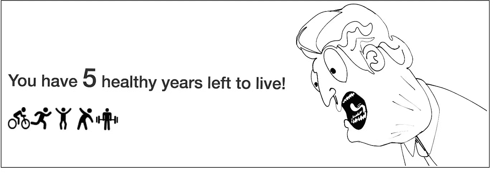

Source: Lucas Amunategui

对预期寿命建模显然属于统计学领域，但当你以互动和教育的形式将它扩展到互联网时，它就变成了应用数据科学。在本演练中，我们将把一个简单的线性回归模型与 Flask web 应用程序联系起来，实质上是将一个等式转换成一个交互式工具，整个世界都可以从中进行游戏和学习。

让我们谈谈预期寿命。虽然我认为这个话题是一个重要的认知工具，但我先向那些觉得它令人沮丧的人道歉。它和那些互动银行工具一起提醒你，你还没有多少钱可以退休。

我们将使用 PythonAnywhere.com 的[来安装这个模型，这是一个易于使用的免费实验网络服务平台。我们还将使用有趣的图形和简单的语言，以确保它切中要点，引人入胜。你可以在 TimeLeftToLive.com](https://www.pythonanywhere.com/)[的](http://www.timelefttolive.com/)查看完成版。

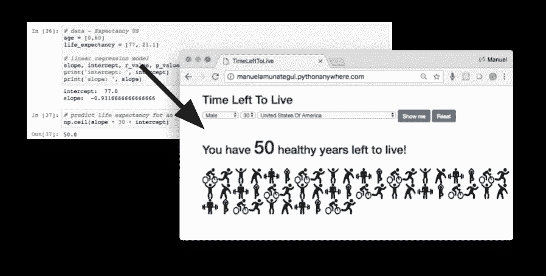

Traditional output versus fun & Interactive

这是一个令人惊讶的简单模型，使用顶级统计学家收集的可靠数据来构建。两个最重要的消息来源是世界卫生组织(世卫组织)和中央情报局。这里我们将使用[世界卫生组织(世卫组织)全球健康观察站的数据](http://www.who.int/gho/en/)。

# 死亡率数据

我们将使用“出生时的预期寿命(岁)”和“60 岁时的预期寿命(岁)”的综合数据集。这将为我们的线性回归提供两个点，我们可以很容易地从中提取任何其他年龄。还是那句话，对此不能全信！这些只是平均水平，预期寿命每天都在提高！从世卫组织网站:

# ****简单线性回归和预测预期寿命****

> *****线性回归模型试图用直线来解释两个或多个变量之间的关系。* [ReliaSoft 的实验设计和分析参考](http://reliawiki.org/index.php/Simple_Linear_Regression_Analysis)****

****我们将使用 [scipy.stats 包](https://docs.scipy.org/doc/scipy/reference/tutorial/stats.html)进行线性回归。让我们看一个简单的例子来说明如何使用线性回归进行预测。我们创建了两个预期寿命的虚拟数据集，一个是新生儿的，另一个是 60 岁的:****

```
**import pandas as pd
import matplotlib.pyplot as plt# create fictitious data set 
simple_life_dataset = pd.DataFrame({'Age':[0, 60], 'Life Expectancy':[90, 30]})
simple_life_dataset.head()**
```

****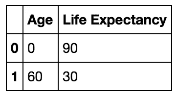****

****Life expectancy at 0 and 60 years old****

****现在我们将这些数据输入到**stats . Lin regressive**函数中。我们将只使用它的两个输出，斜率**和截距**。这两个值和 y = mx+b 的直线方程，将为我们提供估算任何年龄预期寿命所需的一切。****

```
**import numpy as np
from scipy import stats
slope, intercept, r_value, p_value, std_err = stats.linregress(simple_life_dataset['Age'],simple_life_dataset['Life Expectancy'])
print('intercept: ', intercept)
print('slope: ', slope)('intercept: ', 90.0)
('slope: ', -1.0)**
```

****那么，根据我们虚构的数据，一个 20 岁的人还能活多少年？我们将 stats . Lin regressive 的输出应用于 [y = mx+b](https://www.mathsisfun.com/equation_of_line.html) 线方程:****

******预期寿命估计值=斜率*年龄+截距******

```
**np.ceil(slope * 20 + intercept)70.0**
```

****我们还有 70 年的寿命。如果我们把虚构的数据集和新的估计值一起画出来:****

```
**fig, axes = plt.subplots(figsize=(5,5))
x = [0,20,60]
y = [90, 70, 30]
axes.plot(x,y, color='blue', linestyle='--', marker='o')
fig.suptitle('Life Expectancy')
axes.set_xlabel('age')
axes.set_xlim([-5,100])
axes.set_ylabel('life_expectancy')
axes.set_ylim([0,100])
plt.show()**
```

****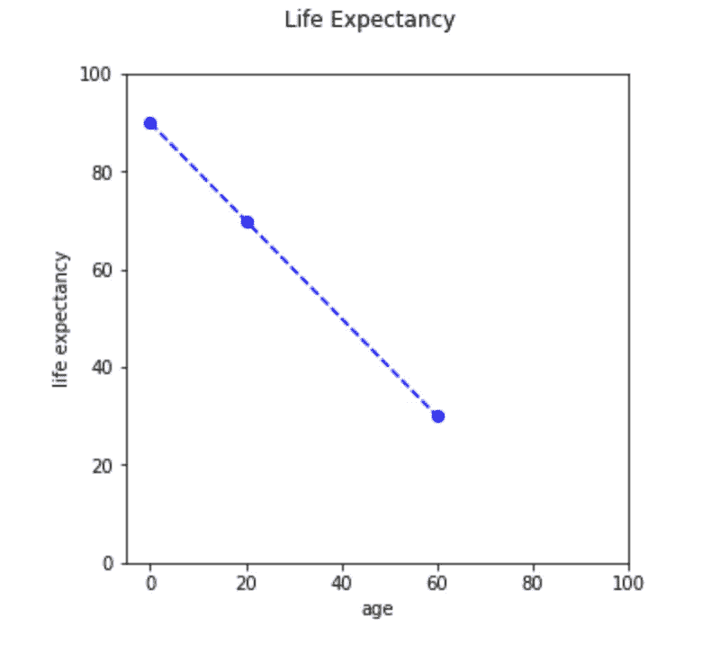****

****The linear relationship between age and life expectancy according to our fictitious data****

# ****世卫组织死亡率数据****

****我们下载真实数据保存到本地吧。然后，让我们进行与上面完全相同的练习:****

```
**# load WHO longevity data
# http://apps.who.int/gho/data/node.main.688
who_list = pd.read_csv('http://apps.who.int/gho/athena/data/GHO/WHOSIS_000001,WHOSIS_000015?filter=COUNTRY:*&x-sideaxis=COUNTRY;YEAR&x-topaxis=GHO;SEX&profile=verbose&format=csv')# save a local copy of the data set for our Flask prototype later on
who_list.to_csv('WHOSIS_000001,WHOSIS_000015.csv')

# Keep only useful features fix case display of country text
who_list = who_list[['GHO (DISPLAY)', 'YEAR (CODE)' , 'COUNTRY (DISPLAY)', 'SEX (DISPLAY)', 'Numeric']]
who_list['COUNTRY (DISPLAY)'] = [ctry.title() for ctry in who_list['COUNTRY (DISPLAY)'].values]# print a few rows
who_list[who_list['COUNTRY (DISPLAY)']=='France'].head(10)**
```

****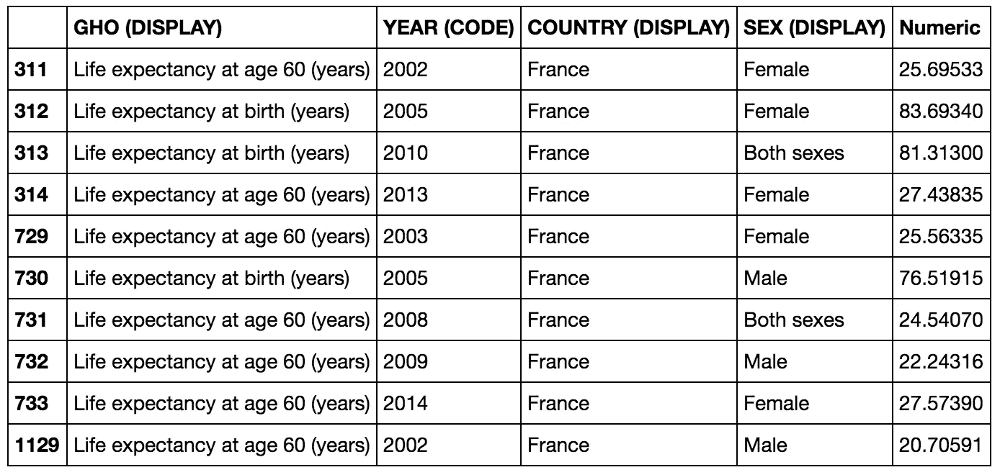****

****`WHO longevity data for France`****

****我是一个 49 岁的美国人，让我们预测一下我还能活多少年(yikes！).首先让我们看看数据，这真的很有趣。根据最新数据，美国新生儿男性的预期寿命是 77 岁，而根据最新数据，美国 60 岁男性的预期寿命是 22 岁，总共是 82 岁，给出了什么？这是统计学的复杂性之一，对一个 60 岁的人取平均值意味着这个人已经活了 60 年，这被称为[生存偏差](https://en.wikipedia.org/wiki/Survivorship_bias)。这对于我们来说意味着，这个模型对于接近于 0 的人来说有点悲观，对于接近于 60 的人来说有点乐观。****

```
**country = 'United States Of America'
sex = 'Male'# pull latest entries for birth and 60 years for a country and gender
sub_set = who_list[who_list['COUNTRY (DISPLAY)'].str.startswith(country, na=False)]
sub_set = sub_set[sub_set['SEX (DISPLAY)'] == sex]# sort by year in descending order to work with the latest read
sub_set = sub_set.sort_values('YEAR (CODE)', ascending=False)
sub_set_birth = sub_set[sub_set['GHO (DISPLAY)'] == 'Life expectancy at birth (years)'] 
sub_set_60 = sub_set[sub_set['GHO (DISPLAY)'] == 'Life expectancy at age 60 (years)'] print('sub_set_birth:')
print(sub_set_birth.head(5))
print('sub_set_60:')
print(sub_set_60.head(5))sub_set_birth: GHO (DISPLAY)  YEAR (CODE)  \
16046  Life expectancy at birth (years)         2015   
17532  Life expectancy at birth (years)         2014   
15326  Life expectancy at birth (years)         2013   
12318  Life expectancy at birth (years)         2012   
17531  Life expectancy at birth (years)         2011COUNTRY (DISPLAY) SEX (DISPLAY)   Numeric  
16046  United States Of America          Male  76.93852  
17532  United States Of America          Male  76.76836  
15326  United States Of America          Male  76.45519  
12318  United States Of America          Male  76.43168  
17531  United States Of America          Male  76.29261 sub_set_60: GHO (DISPLAY)  YEAR (CODE)  \
7481   Life expectancy at age 60 (years)         2015   
7900   Life expectancy at age 60 (years)         2014   
9935   Life expectancy at age 60 (years)         2013   
16044  Life expectancy at age 60 (years)         2012   
16211  Life expectancy at age 60 (years)         2011              COUNTRY (DISPLAY) SEX (DISPLAY)   Numeric  
7481   United States Of America          Male  22.07029  
7900   United States Of America          Male  21.95811  
9935   United States Of America          Male  21.72074  
16044  United States Of America          Male  21.72548  
16211  United States Of America          Male  21.61596**
```

****让我们从世卫组织数据集中提取两个最新的数据点，并绘制出来:****

```
**# create data set with both points as shown in first example
lf_at_birth = sub_set_birth['Numeric'].values[0]
lf_at_60 = sub_set_60['Numeric'].values[0]# let's organize our data and plot
age = [0,60]
life_expectancy = [lf_at_birth, lf_at_60]fig, axes = plt.subplots(figsize=(5,5))
x = age
y = life_expectancy
axes.plot(x,y, color='blue', linestyle='--', marker='o')
fig.suptitle('Life Expectancy')
axes.set_xlabel('age')
axes.set_xlim([-5,100])
axes.set_ylabel('life expectancy')
axes.set_ylim([0,100])
plt.show()**
```

****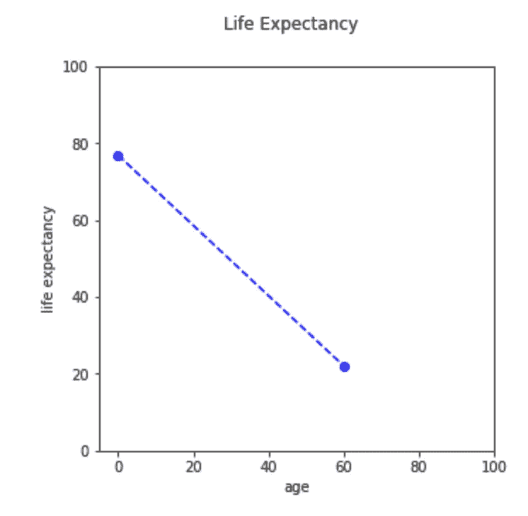****

****现在，让我们估计一下我的预期寿命:****

```
**# model 
slope, intercept, r_value, p_value, std_err = stats.linregress(age, life_expectancy)
print('intercept: ', intercept)
print('slope: ', slope)

# predict life expectancy for an 49-year-old male in the USA:
np.ceil(slope * 49 + intercept)('intercept: ', 76.938519999999997)
('slope: ', -0.91447049999999985)
33.0**
```

****还有 33 年，最好让它们有价值！现在，让我们将上述所有代码封装到一个函数中，这样我们就可以很容易地用其他参数预测其他年龄(当我们将其移植到 Flask 时，这将使我们的生活变得容易得多)。****

```
**def get_life_expectancy(age, country, sex):
    # pull latest entries for birth and 60 years
    sub_set = who_list[who_list['COUNTRY (DISPLAY)'].str.startswith(country, na=False)]
    sub_set = sub_set[sub_set['SEX (DISPLAY)'] == sex]
    sub_set = sub_set.sort_values('YEAR (CODE)', ascending=False)
    sub_set_birth = sub_set[sub_set['GHO (DISPLAY)'] == 'Life expectancy at birth (years)'] 
    sub_set_60 = sub_set[sub_set['GHO (DISPLAY)'] == 'Life expectancy at age 60 (years)'] 

    # not all combinations exsits so check that we have data for both
    if len(sub_set_birth['Numeric']) > 0 and len(sub_set_60['Numeric']) > 0:
        # create data set with both points as shown in first example
        lf_at_birth = sub_set_birth['Numeric'].values[0]
        lf_at_60 = sub_set_60['Numeric'].values[0]

        # model 
        slope, intercept, r_value, p_value, std_err = stats.linregress([0,60],[lf_at_birth, lf_at_60])

        # predict for the age variable
        return(np.ceil(slope * age + intercept))
    else:
        return None**
```

****让我们做一个快速测试:****

```
**# test the function out using a 22-year-old Japanese female:
get_life_expectancy(22, 'Japan', 'Female')66.0**
```

****66 岁的生活听起来是对的。****

# ****使用 Flask 和 Pythonanywhere 构建我们的模型原型****

****[PythonAnywhere.com](https://www.pythonanywhere.com/)是一个在互联网上快速原型化你的 Python 交互式想法和模型的好方法。在 PythonAnywhere.com[注册一个免费账户——你需要一个有效的电子邮件地址。](https://www.pythonanywhere.com/)****

# ****设置 Flask Web 框架****

****接下来，让我们用 Flask web 服务平台在 PythonAnywhere 上创建一个 web 服务器。这是非常容易做到的。在' **Web** 选项卡下，点击'**添加新的 web app** 蓝色按钮。并接受默认设置，直到您到达“**选择一个 Python Web 框架**”并点击“ **Flask** ”，然后是最新的 Python 框架。****

****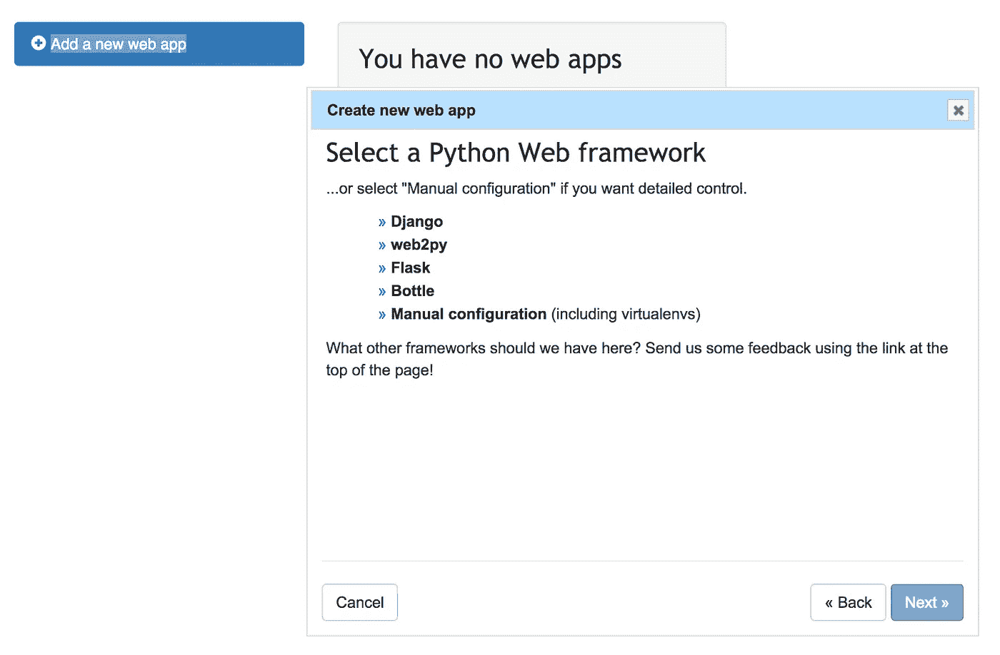****

****您将进入登录配置页面，点击绿色的“**重新加载您的 account.pythonanywhere.com**”按钮，并使用您的新 URL 进行一次旋转:****

****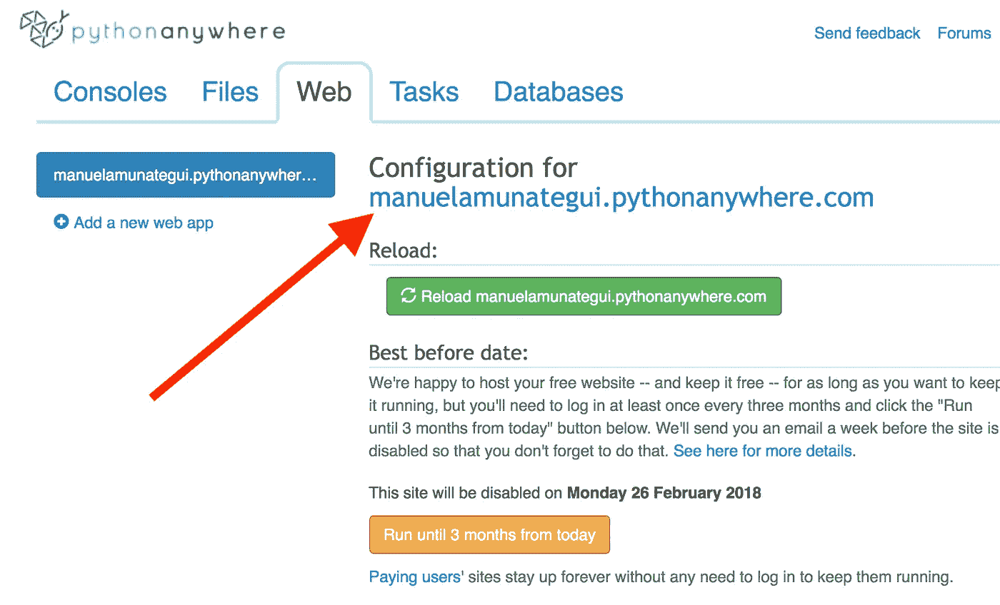****

****您应该看到一个简单但真实的网页，带有来自 Flask 的' **Hello！**消息:****

****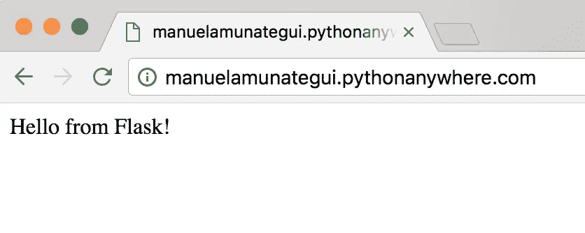****

# ****上传预期寿命网页代码****

****现在我们需要用我们的预期寿命代码替换 Flask 通用框架代码。点击“**文件**选项卡，在您的 root 帐户下创建一个名为“**life _ expectations**的新文件夹。在该文件夹中，上传我们之前下载并保存的' **WHOSIS_000001，WHOSIS_000015.csv** '数据。创建一个名为' **flask_app.py** 的 Python 文件，并在下面粘贴' flask_app.py '代码。****

```
**from flask import Flask, render_template, request, url_for
import pandas as pd
import numpy as np
from scipy import stats
import logging
import datetime
import os.path
from flask import Markupapp = Flask(__name__)
app.config["DEBUG"] = True# constructor - load once (otherwise setup a local csv copy to save on bandwidth usage)
BASE_DIR = os.path.dirname(os.path.abspath(__file__))
app.logger.error(BASE_DIR)
src = os.path.join(BASE_DIR, 'WHOSIS_000001,WHOSIS_000015.csv')
who_list = pd.read_csv(src)
who_list = who_list[['GHO (DISPLAY)', 'YEAR (CODE)' , 'COUNTRY (DISPLAY)', 'SEX (DISPLAY)', 'Numeric']]
who_list['COUNTRY (DISPLAY)'] = [ctry.title() for ctry in who_list['COUNTRY (DISPLAY)'].values]
country_list = sorted(set(who_list['COUNTRY (DISPLAY)'].values))def get_life_expectancy(age, country, sex):
    # pull latest entries for birth and 60 years
    sub_set = who_list[who_list['COUNTRY (DISPLAY)'].str.startswith(country, na=False)]
    sub_set = sub_set[sub_set['SEX (DISPLAY)'] == sex]
    sub_set = sub_set.sort_values('YEAR (CODE)', ascending=False)
    sub_set_birth = sub_set[sub_set['GHO (DISPLAY)'] == 'Life expectancy at birth (years)']
    sub_set_60 = sub_set[sub_set['GHO (DISPLAY)'] == 'Life expectancy at age 60 (years)'] # not all combinations exsits so check that we have data for both
    if len(sub_set_birth['Numeric']) > 0 and len(sub_set_birth['Numeric']) > 0:
        # create data set with both points as shown in first example
        lf_at_birth = sub_set_birth['Numeric'].values[0]
        lf_at_60 = sub_set_60['Numeric'].values[0] # model 
        slope, intercept, r_value, p_value, std_err = stats.linregress([0,60],[lf_at_birth, lf_at_60]) # predict for the age variable
        return(np.ceil(islope * age + intercept))
    else:
        return None@app.route('/', methods=['POST', 'GET'])
def interact_life_expectancy():
    # select box defaults
    default_age = 'Select Age'
    selected_age = default_age
    default_sex = 'Select Gender'
    selected_sex = default_sex
    default_country = 'Select Country'
    selected_country = default_country # data carriers
    string_to_print = ''
    healthy_image_list = [] if request.method == 'POST':
        # clean up age field
        selected_age = request.form["age"]
        if (selected_age == default_age):
            selected_age = int(29)
        else:
            selected_age = selected_age # clean up sex field
        selected_sex = request.form["sex"]
        if (selected_sex == default_sex):
            selected_sex = 'Both sexes' # clean up country field
        selected_country = request.form["country"]
        if (selected_country == default_country):
            selected_country = 'United States Of America' # estimate lifespan
        current_time_left = get_life_expectancy(age=int(selected_age), country=selected_country, sex=selected_sex)

        if (current_time_left is not None):
            # create output string
            string_to_print = Markup("You have <font size='+10'>" + str(int(np.ceil(current_time_left))) + "</font> healthy years left to live!")
        else:
            string_to_print = Markup("Error! No data found for selected parameters")
            current_time_left = 1 # healthy years
        healthy_image_list = []
        # squat.png, stretch.png, jog.png
        healthy_years_left = int(np.ceil(current_time_left))
        image_switch=0
        if (healthy_years_left > 0):
            for y in range(healthy_years_left):
                if image_switch == 0:
                    healthy_image_list.append('static/images/Cycling.png')
                elif image_switch == 1:
                    healthy_image_list.append('static/images/Jogging.png')
                elif image_switch == 2:
                    healthy_image_list.append('static/images/JumpingJack.png')
                elif image_switch == 3:
                    healthy_image_list.append('static/images/Stretching.png')
                elif image_switch == 4:
                    healthy_image_list.append('static/images/WeightLifting.png')
                else:
                    healthy_image_list.append('static/images/Yoga.png')
                    image_switch = -1
                image_switch += 1 return render_template('main_page.html',
                            country_list = country_list,
                            default_country = selected_country,
                            default_age=selected_age,
                            default_sex=selected_sex,
                            string_to_print = string_to_print,
                            healthy_image_list = healthy_image_list)**
```

****您的'**life _ expectation**'文件夹应该如下所示:****

****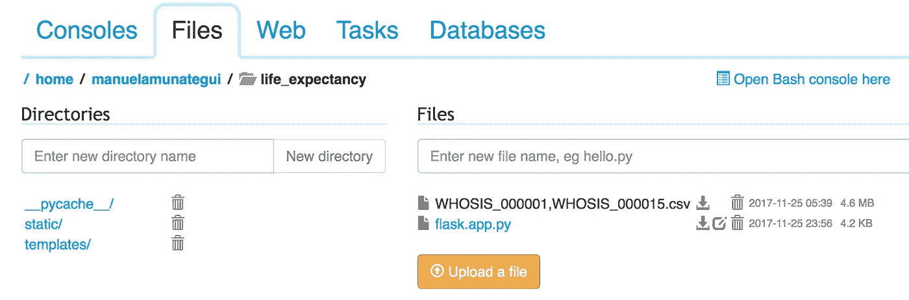****

****仍然在'**life _ expectations**下创建另一个名为' **static** 的文件夹，并在其下创建另一个名为' **images** 的文件夹，并上传以下六个运动图标(不幸的是，您一次只能上传一个):****

************************************************

****您的“图像”文件夹应该如下所示:****

****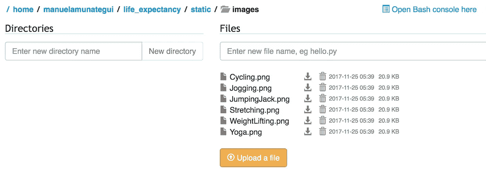****

****返回到'**life _ expectations**文件夹，创建'**模板**文件夹。Templates 文件夹将存储我们的 HTML 模板，Flask 将使用这些模板动态显示我们的内容。在“**模板**文件夹下，创建一个名为“ **main_page.html** 的文件，粘贴以下动态 html 代码:****

```
**<!DOCTYPE html>
<HTML lang="en">
<HEAD>
  <TITLE>TimeLeftToLive.com</TITLE>
  <META charset="utf-8">
  <META name="viewport" content="width=device-width, initial-scale=1">
  <link rel="stylesheet" href="https://maxcdn.bootstrapcdn.com/bootstrap/3.3.7/css/bootstrap.min.css">
  <script src="https://ajax.googleapis.com/ajax/libs/jquery/3.2.1/jquery.min.js"></script>
  <script src="https://maxcdn.bootstrapcdn.com/bootstrap/3.3.7/js/bootstrap.min.js"></script>
</HEAD>
<BODY>
<DIV class="container">
  <DIV class="row">
    <H2><a href='http://www.TimeLeftToLive.com' target='_blank'>TimeLeftToLive.com</a></H2>
    <H4>More Data Science and Machine Learning Articles at <a href='http://amunategui.github.io' target='_blank'>amunategui.github.io</a></H4><BR> <FORM id='submit_params' method="POST" action=""> <SELECT class="selectpicker" name="sex">
          <option value="" selected></option>
          <option>Both sexes</option>
          <option>Female</option>
          <option>Male</option>
      </SELECT><SELECT class="selectpicker" name="age">
                    <option value="{{default_age}}" selected>{{default_age}}</option>
                   
                       <option value="{{age}}">{{age}}</option>
                   
                  </SELECT><SELECT class="selectpicker"  name="country">
            <option value="{{default_country}}" selected>{{default_country}}</option>
            
              <option value="{{country}}">{{country}}</option>
            
          </SELECT> <button type="submit" class="btn btn-primary">Show me</button>
       <button type="button" class="btn btn-primary" onclick="location.href='/';" value="Reset">Reset</button></FORM>
<BR>
<H2>{{string_to_print}}</H2>
<BR>
<TABLE>
<TR>

  
    </TR><TR>
  
  <td></td></TR>
</TABLE>
</BODY>
</HTML>**
```

****您的'**模板**'文件夹应该如下所示:****

****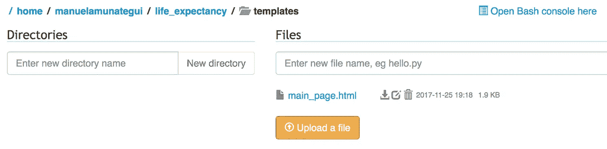****

# ****虚拟文件刷新****

****返回到' **Web** 选项卡，将'**源代码**从:****

```
**/home/manuelamunategui/mysite/**
```

****到****

```
**/home/manuelamunategui/life_expectancy/**
```

****点击下面几行的'**/var/www/manuelamnategui _ python anywhere _ com _ wsgi . py**'链接，编辑下面一行代码:****

```
**project_home = u'/home/manuelamunategui/mysite'**
```

****到****

```
**project_home = u'/home/manuelamunategui/life_expectancy'**
```

****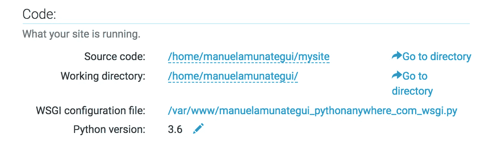****

****点击绿色的“**重新加载你的 account.pythonanywhere.com**”按钮，带着你的新网址和交互式网络应用去兜风吧！****

# ****恭喜你！****

****在那里！恭喜那些走到这一步的人！并利用这些简单的工具和技术来展示您的 Python 想法！****

****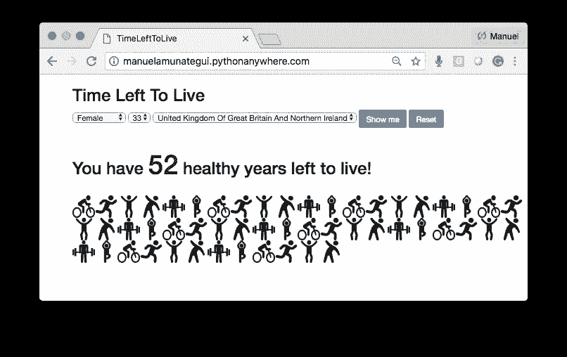****

****感谢阅读！****

****曼努埃尔·阿穆纳特吉****

****免费电子书《成为数据科学家——赞美你的技术研究的基本技巧》的作者****

****在 [amunategui.github.io](http://amunategui.github.io/) 获取更多信息****