# Python 中的时间序列分析:简介

> 原文：<https://towardsdatascience.com/time-series-analysis-in-python-an-introduction-70d5a5b1d52a?source=collection_archive---------0----------------------->


**用于时间序列建模的可加模型**

时间序列是日常生活中最常见的数据类型之一。金融价格、天气、家庭能源使用量甚至体重都是可以定期收集的数据示例。几乎每个数据科学家都会在日常工作中遇到时间序列，学习如何对它们建模是数据科学工具箱中的一项重要技能。分析和预测周期性数据的一个强大而简单的方法是[加法模型](https://en.wikipedia.org/wiki/Additive_model)。这个想法很简单:将时间序列表示为不同尺度的模式组合，比如每天、每周、每季度和每年，以及总体趋势。你的能源消耗可能在夏天上升，在冬天下降，但是随着你提高你家的能源效率，总的趋势是下降的。加法模型可以向我们展示两种模式/趋势，并根据这些观察结果做出预测。

下图显示了将时间序列分解为总体趋势、年度趋势和周趋势的加法模型。

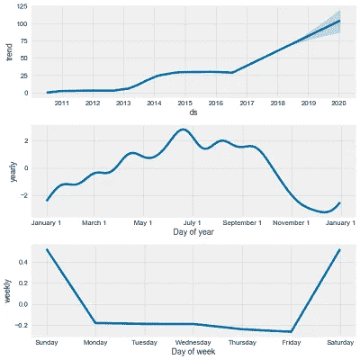

Example of Additive Model Decomposition

本文将介绍一个使用 Python 和脸书开发的 [Prophet 预测包为金融时间序列数据创建附加模型的示例。在这个过程中，我们将介绍使用 pandas 的一些数据操作，使用 Quandl 库和](https://research.fb.com/prophet-forecasting-at-scale/)访问[财务数据，以及使用 matplotlib](https://www.quandl.com/tools/python) 进行[绘图。我在有指导意义的地方加入了代码，我鼓励任何人查看 GitHub 上的](https://matplotlib.org/) [Jupyter 笔记本](https://github.com/WillKoehrsen/Data-Analysis/tree/master/additive_models)以获得完整的分析。这个介绍将向你展示你自己开始建模时间序列所需的所有步骤！

免责声明:现在到了令人厌烦的部分，我不得不提到，当谈到财务数据时，[过去的表现不是未来表现的指标](https://seekingalpha.com/article/2453345-past-performance-is-not-an-indicator-of-future-results)，你不能用这里的方法致富。我选择使用股票数据，因为它很容易在每天的频率上获得，而且玩起来很有趣。如果你真的想变得富有，学数据科学是比玩股市更好的选择！

## **检索财务数据**

通常，花费在数据科学项目上的大约 80%的时间是获取和清理数据。多亏了 quandl 金融库，这个项目的这个比例降低到了 5%。Quandl 可以从命令行与 pip 一起安装，让您用一行 Python 就可以访问数千个财务指标，并且每天允许多达 50 个请求，无需注册。如果你注册了一个免费账户，你会得到一个允许无限请求的 api 密匙。

首先，我们导入所需的库并获取一些数据。Quandl 自动将我们的数据放入 pandas dataframe，这是数据科学的首选数据结构。(对于其他公司，只需用股票代码替换“TSLA”或“通用汽车”即可。您也可以指定日期范围)。

```
# quandl for financial data
import quandl
# pandas for data manipulation
import pandas as pdquandl.ApiConfig.api_key = 'getyourownkey!'# Retrieve TSLA data from Quandl
tesla = quandl.get('WIKI/TSLA')# Retrieve the GM data from Quandl
gm = quandl.get('WIKI/GM')
gm.head(5)
```


Snapshot of GM data from quandl

关于 quandl 的数据几乎是无限的，但我想重点比较同一行业的两家公司，即特斯拉和通用汽车。特斯拉是一家令人着迷的公司，不仅因为它是 111 年来第一家成功的美国汽车初创公司，还因为在 2017 年的[中，尽管只销售了 4 种不同的汽车，但它仍是美国最有价值的汽车公司](https://www.recode.net/2017/8/2/16085822/tesla-ford-gm-worth-car-manufacturer-elon-musk-earnings)。最有价值汽车公司头衔的另一个竞争者是通用汽车公司，该公司最近显示出拥抱汽车未来的迹象，制造了一些非常酷(但看起来不酷)的全电动汽车。


Not a very hard choice

我们可以轻松地花费数小时来搜索这些数据，并将其下载为 csv 电子表格文件，但是，多亏了 quandl，我们在几秒钟内就获得了所有需要的数据！

# 数据探索

在我们开始建模之前，最好通过绘制一些探索图来了解一下结构和范围。这也将允许我们寻找需要纠正的异常值或缺失值。

熊猫数据帧可以很容易地用 matplotlib 绘制。如果任何图形代码看起来吓人，不要担心。我还发现 matplotlib 不直观，经常从堆栈溢出或文档中复制并粘贴示例来获得我想要的图形。编程的规则之一是不要重新发明一个已经存在的解决方案！

```
# The adjusted close accounts for stock splits, so that is what we should graph
plt.plot(gm.index, gm['Adj. Close'])
plt.title('GM Stock Price')
plt.ylabel('Price ($)');
plt.show()plt.plot(tesla.index, tesla['Adj. Close'], 'r')
plt.title('Tesla Stock Price')
plt.ylabel('Price ($)');
plt.show();
```

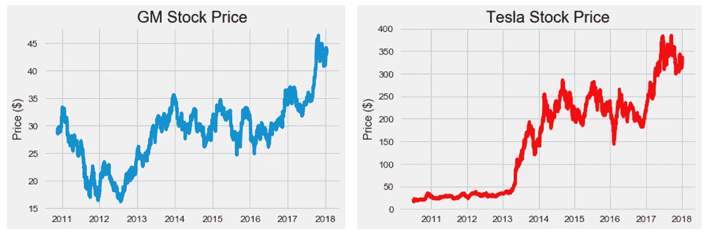

Raw Stock Prices

仅从股价上比较两家公司并不能说明哪家更有价值，因为公司的总价值(市值)还取决于股票数量(市值=股价*股票数量)。Quandl 没有股票数量的数据，但我可以通过快速的谷歌搜索找到两家公司的平均年度股票。虽然不精确，但对我们的分析来说足够精确了。有时候我们不得不用不完美的数据来凑合！

为了在我们的数据框架中创建一列市值，我们使用了一些 pandas 的技巧，比如将索引移动到一列(reset_index ),同时使用 ix 索引和修改数据框架[中的值。](https://pandas.pydata.org/pandas-docs/stable/generated/pandas.DataFrame.ix.html)

```
# Yearly average number of shares outstanding for Tesla and GM
tesla_shares = {2018: 168e6, 2017: 162e6, 2016: 144e6, 2015: 128e6, 2014: 125e6, 2013: 119e6, 2012: 107e6, 2011: 100e6, 2010: 51e6}gm_shares = {2018: 1.42e9, 2017: 1.50e9, 2016: 1.54e9, 2015: 1.59e9, 2014: 1.61e9, 2013: 1.39e9, 2012: 1.57e9, 2011: 1.54e9, 2010:1.50e9}# Create a year column 
tesla['Year'] = tesla.index.year# Take Dates from index and move to Date column 
tesla.reset_index(level=0, inplace = True)
tesla['cap'] = 0# Calculate market cap for all years
for i, year in enumerate(tesla['Year']):
    # Retrieve the shares for the year
    shares = tesla_shares.get(year)

    # Update the cap column to shares times the price
    tesla.ix[i, 'cap'] = shares * tesla.ix[i, 'Adj. Close']
```

这为特斯拉创造了一个“上限”栏。我们对 GM 数据做同样的处理，然后合并两者。[合并](https://pandas.pydata.org/pandas-docs/stable/generated/pandas.DataFrame.merge.html)是数据科学工作流的重要组成部分，因为它允许我们在共享列上连接数据集。在这种情况下，我们有两个不同公司在相同日期的股票价格，因此我们希望连接日期列上的数据。我们执行“内部”合并，只保存同时出现在两个数据帧中的日期条目。合并后，我们重命名这些列，这样我们就知道哪一列对应哪一家汽车公司。

```
# Merge the two datasets and rename the columns
cars = gm.merge(tesla, how='inner', on='Date')cars.rename(columns={'cap_x': 'gm_cap', 'cap_y': 'tesla_cap'}, inplace=True)# Select only the relevant columns
cars = cars.ix[:, ['Date', 'gm_cap', 'tesla_cap']]# Divide to get market cap in billions of dollars
cars['gm_cap'] = cars['gm_cap'] / 1e9
cars['tesla_cap'] = cars['tesla_cap'] / 1e9cars.head()
```

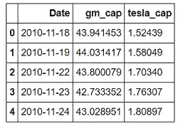

Merged Market Capitalization Dataframe

市值以十亿美元计。我们可以看到，在我们的分析期开始时，通用汽车的市值大约是特斯拉的 30 倍！事情会在整个时间线上保持不变吗？

```
plt.figure(figsize=(10, 8))
plt.plot(cars['Date'], cars['gm_cap'], 'b-', label = 'GM')
plt.plot(cars['Date'], cars['tesla_cap'], 'r-', label = 'TESLA')
plt.xlabel('Date'); plt.ylabel('Market Cap (Billions $)'); plt.title('Market Cap of GM and Tesla')
plt.legend();
```

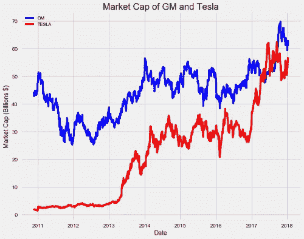

Market Capitalization Historical Data

在数据过程中，我们观察到特斯拉的快速增长和通用汽车的小幅增长。2017 年期间，特斯拉的价值甚至超过了通用汽车！

```
import numpy as np# Find the first and last time Tesla was valued higher than GM
first_date = cars.ix[np.min(list(np.where(cars['tesla_cap'] > cars['gm_cap'])[0])), 'Date']
last_date = cars.ix[np.max(list(np.where(cars['tesla_cap'] > cars['gm_cap'])[0])), 'Date']print("Tesla was valued higher than GM from {} to {}.".format(first_date.date(), last_date.date()))**Tesla was valued higher than GM from 2017-04-10 to 2017-09-21.**
```

在此期间，特斯拉卖了大约 [48，000 辆](https://en.wikipedia.org/wiki/Tesla,_Inc.#Production_and_sales)，而[通用卖了 1，500，000 辆](http://gmauthority.com/blog/gm/general-motors-sales-numbers/)。在一段时间内，通用汽车的销量是特斯拉的 30 倍，但其价值却低于特斯拉！这无疑展示了一个有说服力的高管和一个高质量(尽管数量非常少)产品的力量。虽然特斯拉的价值现在低于通用汽车，但一个好问题可能是，我们能期待特斯拉再次超过通用汽车吗？什么时候会这样？为此，我们求助于加法模型进行预测，或者换句话说，预测未来。

# 用先知建模

[2017 年 Python 和 R 发布了脸书先知包](https://facebook.github.io/prophet/docs/quick_start.html)，全世界的数据科学家都欢欣鼓舞。Prophet 设计用于分析具有日常观察的时间序列，这些观察显示不同时间尺度上的模式。它还具有高级功能，可以对假日对时间序列的影响进行建模，并实现自定义的变点，但我们将坚持使用基本功能来启动和运行模型。Prophet 和 quandl 一样，可以从命令行安装 pip。

我们首先导入 prophet，并将数据中的列重命名为正确的格式。日期列必须称为' ds '，而我们要预测的值列必须称为' y '。然后，我们创建 prophet 模型并使其符合数据，就像 Scikit-Learn 机器学习模型一样:

```
import fbprophet# Prophet requires columns ds (Date) and y (value)
gm = gm.rename(columns={'Date': 'ds', 'cap': 'y'})# Put market cap in billions
gm['y'] = gm['y'] / 1e9# Make the prophet model and fit on the data
gm_prophet = fbprophet.Prophet(changepoint_prior_scale=0.15)
gm_prophet.fit(gm)
```

当创建 prophet 模型时，我将 changepoint 设置在 0.15 之前，高于默认值 0.05。该超参数用于控制[趋势对变化](https://facebook.github.io/prophet/docs/trend_changepoints.html)的敏感程度，数值越高越敏感，数值越低越不敏感。这个值用于对抗机器学习中最基本的权衡之一:[偏差与方差](https://en.wikipedia.org/wiki/Bias%E2%80%93variance_tradeoff)。

如果我们太接近我们的训练数据，称为[过拟合](https://elitedatascience.com/overfitting-in-machine-learning)，我们有太多的方差，我们的模型将不能很好地推广到新数据。另一方面，如果我们的模型没有捕捉到训练数据中的趋势，那么它就不合适，并且有太多的偏差。当模型拟合不足时，增加变点先验允许模型更灵活地拟合数据，如果模型拟合过度，减少先验会限制灵活性。变点先验比例的影响可以通过用一系列值做出的图形预测来说明:

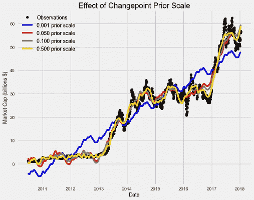

变点先验比例越高，模型就越灵活，越符合训练数据。这可能看起来正是我们想要的，但是学习训练数据太好可能会导致过度拟合，并且无法准确地对新数据进行预测。因此，我们需要在拟合训练数据和能够推广到新数据之间找到恰当的平衡。由于股票每天都在变化，我们希望我们的模型能够捕捉到这一点，所以在尝试了一系列值后，我增加了灵活性。

在创建 prophet 模型的调用中，我们还可以指定变点，当时间序列从增加到减少，或从缓慢增加到快速增加时，会出现这些变点(它们位于时间序列中速率变化最大的位置[)。转折点可能对应于重大事件，如产品发布或市场中的宏观经济波动。如果我们不指定变点，prophet 将为我们计算它们。](https://facebook.github.io/prophet/docs/trend_changepoints.html)

为了进行预测，我们需要创建一个所谓的未来数据框架。我们指定要预测的未来周期数(两年)和预测频率(每天)。然后，我们用我们创建的先知模型和未来数据框架进行预测:

```
# Make a future dataframe for 2 years
gm_forecast = gm_prophet.make_future_dataframe(periods=365 * 2, freq='D')# Make predictions
gm_forecast = gm_prophet.predict(gm_forecast)
```

我们未来的数据框架包含特斯拉和通用汽车未来两年的估计市值。我们可以用 prophet plot 函数可视化预测。

```
gm_prophet.plot(gm_forecast, xlabel = 'Date', ylabel = 'Market Cap (billions $)')
plt.title('Market Cap of GM');
```

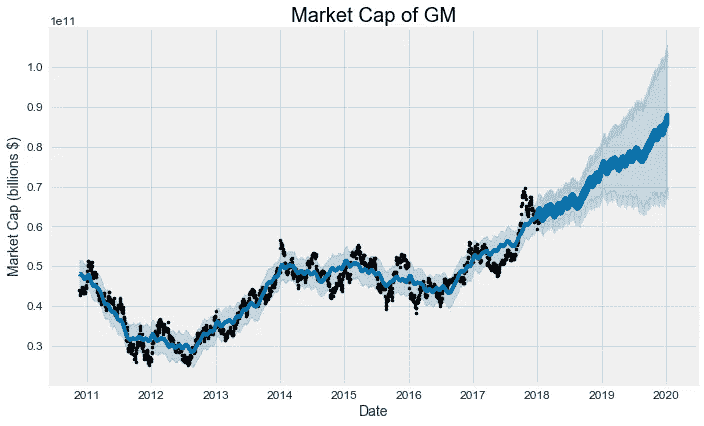

黑点代表实际值(注意它们如何在 2018 年初停止)，蓝线表示预测值，浅蓝色阴影区域是不确定性([始终是任何预测](https://medium.com/@williamkoehrsen/a-theory-of-prediction-10cb335cc3f2)的关键部分)。由于初始不确定性会随着时间的推移而传播和增长，因此预测的不确定性区域会越来越大。这可以在[的天气预报中观察到，天气预报的时间越长越不准确](http://www.nytimes.com/2012/09/09/magazine/the-weatherman-is-not-a-moron.html)。

我们还可以检查由模型识别的变更点。同样，变点表示时间序列增长率显著变化的时间(例如，从增加到减少)。

```
tesla_prophet.changepoints[:10]**61    2010-09-24
122   2010-12-21
182   2011-03-18
243   2011-06-15
304   2011-09-12
365   2011-12-07
425   2012-03-06
486   2012-06-01
547   2012-08-28
608   2012-11-27**
```

为了比较，我们可以看看这段时间内[谷歌对特斯拉](https://trends.google.com/trends/explore?date=2010-09-01%202013-01-01&q=Tesla%20Motors)的搜索趋势，看看变化是否一致。我们在同一张图上绘制了变化点(垂直线)和搜索趋势:

```
# Load in the data 
tesla_search = pd.read_csv('data/tesla_search_terms.csv')# Convert month to a datetime
tesla_search['Month'] = pd.to_datetime(tesla_search['Month'])
tesla_changepoints = [str(date) for date in tesla_prophet.changepoints]# Plot the search frequency
plt.plot(tesla_search['Month'], tesla_search['Search'], label = 'Searches')# Plot the changepoints
plt.vlines(tesla_changepoints, ymin = 0, ymax= 100, colors = 'r', linewidth=0.6, linestyles = 'dashed', label = 'Changepoints')# Formatting of plot
plt.grid('off'); plt.ylabel('Relative Search Freq'); plt.legend()
plt.title('Tesla Search Terms and Changepoints');
```

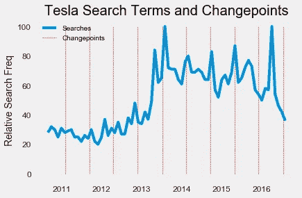

Tesla Search Frequency and Stock Changepoints

特斯拉市值的一些变化点与特斯拉搜索频率的变化一致，但不是全部。由此，我会说相对谷歌搜索频率并不是一个很好的股票变化指标。

我们仍然需要弄清楚特斯拉的市值何时会超过通用汽车。由于我们对未来两年都有预测，合并数据框架后，我们可以在同一张图上绘制两家公司。在合并之前，我们重命名列以跟踪数据。

```
gm_names = ['gm_%s' % column for column in gm_forecast.columns]
tesla_names = ['tesla_%s' % column for column in tesla_forecast.columns]# Dataframes to merge
merge_gm_forecast = gm_forecast.copy()
merge_tesla_forecast = tesla_forecast.copy()# Rename the columns
merge_gm_forecast.columns = gm_names
merge_tesla_forecast.columns = tesla_names# Merge the two datasets
forecast = pd.merge(merge_gm_forecast, merge_tesla_forecast, how = 'inner', left_on = 'gm_ds', right_on = 'tesla_ds')# Rename date column
forecast = forecast.rename(columns={'gm_ds': 'Date'}).drop('tesla_ds', axis=1)
```

首先，我们将只绘制估计值。估计值(在 prophet 软件包中称为“yhat ”)消除了数据中的一些噪声，因此它看起来与原始图略有不同。平滑程度将取决于变点先验比例-更高的先验意味着更灵活的模型和更多的起伏。

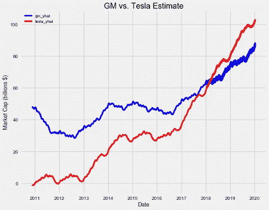

GM and Tesla Predicted Market Capitalization

我们的模型认为，特斯拉在 2017 年短暂超越通用汽车只是一个噪音，直到 2018 年初，特斯拉才在预测中永远击败通用汽车。确切的日期是 2018 年 1 月 27 日，所以如果这种情况发生，我会很高兴地因为预测未来而受到表扬！

制作上图时，我们忽略了预测中最重要的部分:不确定性！我们可以使用 matplotlib(参见[笔记本](https://github.com/WillKoehrsen/Data-Analysis/blob/master/additive_models/Additive%20Models%20for%20Prediction.ipynb))来显示有疑问的区域:

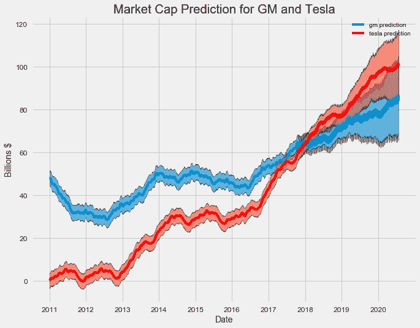

这是预测的一个更好的表示。这表明两家公司的价值都有望增加，但特斯拉的增长将比通用汽车更快。同样，不确定性随着时间的推移而增加，正如预测所预期的那样，特斯拉的下限低于通用汽车在 2020 年的上限，这意味着通用汽车可能会保持领先地位。

## 趋势和模式

市值分析的最后一步是查看整体趋势和模式。Prophet 使我们能够轻松地可视化整体趋势和组件模式:

```
# Plot the trends and patterns
gm_prophet.plot_components(gm_forecast)
```

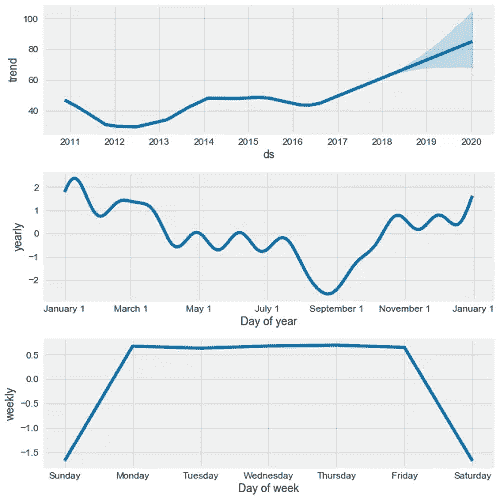

General Motors Time Series Decomposition

趋势非常明显:通用汽车的股票正在上涨，并将继续上涨。每年的模式很有趣，因为它似乎表明通用汽车的价值在年底增加，并在夏季缓慢下降。我们可以尝试确定在一段时间内通用汽车的年度市值和平均月销售额之间是否存在相关性。我首先从谷歌收集每月的汽车销量，然后用 groupby 计算几个月的平均值。这是另一个关键的数据科学操作，因为我们经常想要比较不同类别的统计数据，例如特定年龄组的用户，或者来自一个制造商的车辆。在这种情况下，我们希望计算每个月的平均销售额，因此我们将这些月份组合在一起，然后计算销售额的平均值。

```
gm_sales_grouped = gm_sales.groupby('Month').mean()
```

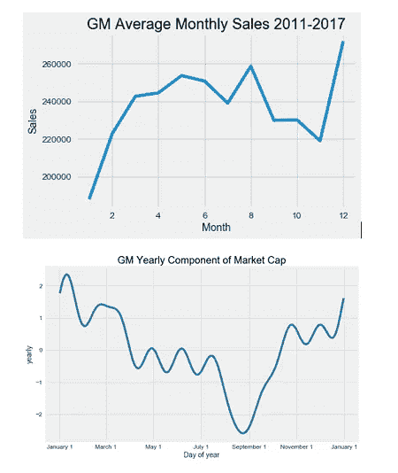

看起来月销售额与市值并不相关。8 月单月销量第二高，正好在市值最低点！

查看每周趋势，似乎没有任何有意义的信号(周末没有记录股票价格，所以我们查看一周内的变化)。这是意料之中的，因为经济学中的[随机游走理论](https://www.investopedia.com/terms/r/randomwalktheory.asp)指出，股票价格每天都没有可预测的模式。正如我们的分析所证明的，从长期来看，股票往往会增加，但在日常尺度上，即使有最好的模型，我们也几乎没有可以利用的模式。

简单看一下[道琼斯工业平均指数](https://en.wikipedia.org/wiki/Dow_Jones_Industrial_Average)(股票交易所 30 家最大公司的市场指数)就能很好地说明这一点:

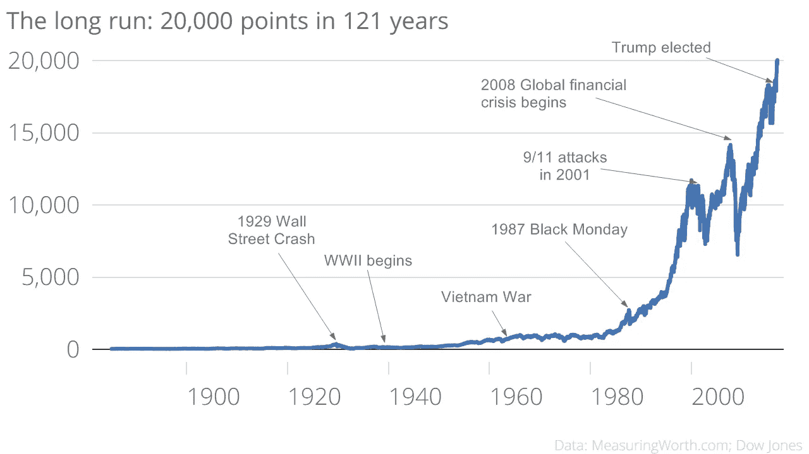

Dow Jones Industrial Average ([Source](http://www.cityam.com/257792/dow-jones-industrial-average-breaks-20000-first-time))

很明显，这个信息是回到 1900 年，投资你的钱！或者在现实中，当市场下跌时，不要退出，因为根据历史，它会重新上涨。总的来说，每天的波动太小，甚至看不到，如果我们像数据科学家一样思考，我们会意识到，与投资整个市场并长期持有相比，每天玩股票是愚蠢的。

Prophet 还可以应用于更大规模的数据测量，如国内生产总值，这是一个国家经济总体规模的衡量指标。我根据美国和中国的历史 GDP 建立了先知模型，做出了以下预测。

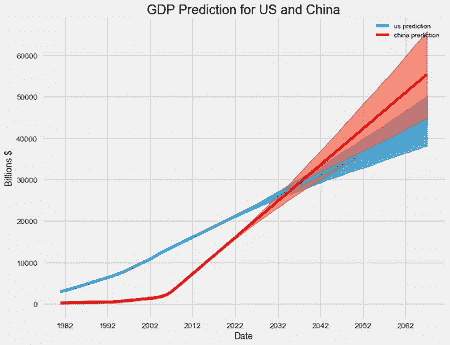

中国 GDP 超过美国的确切日期是 2036 年！由于观察频率低(GDP 每季度测量一次，但 prophet 使用每日数据效果最佳)，该模型存在局限性，但它提供了一个基本预测，不需要宏观经济知识。

有许多方法可以对时间序列建模，从[简单的线性回归](https://onlinecourses.science.psu.edu/stat501/node/250)到[带有 LSTM 细胞的递归神经网络](http://colah.github.io/posts/2015-08-Understanding-LSTMs/)。加法模型是有用的，因为它们开发快，训练快，提供可解释的模式，并做出具有不确定性的预测。Prophet 的能力令人印象深刻，我们在这里只是触及了皮毛。我鼓励你利用这篇文章和笔记本来探索 Quandl 提供的一些[数据或者你自己的时间序列。请继续关注时间序列分析的未来工作，以及 prophet 在我日常生活中的应用，参见我在](https://www.quandl.com/search?query=)[上的帖子，使用这些技术来建模和预测体重变化。](/data-science-a-practical-application-7056ec22d004)作为探索时间序列的第一步，Python 中的附加模型是必由之路！

一如既往，我欢迎反馈和建设性的批评。可以在 wjk68@case.edu 找到我。