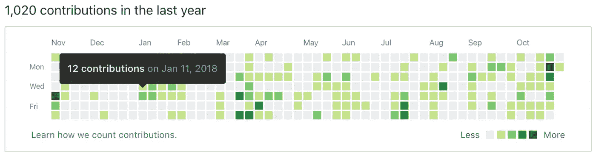
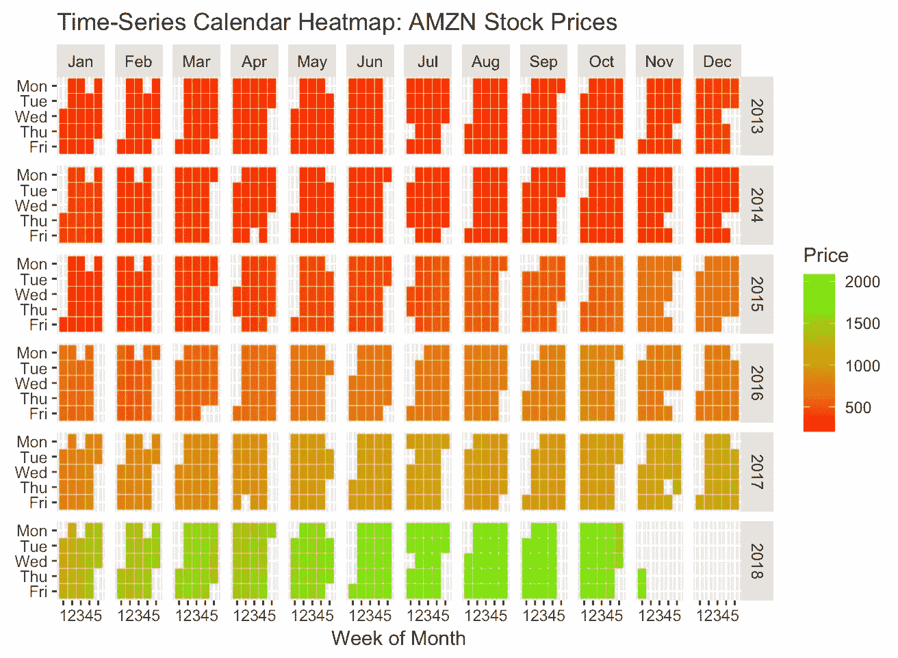
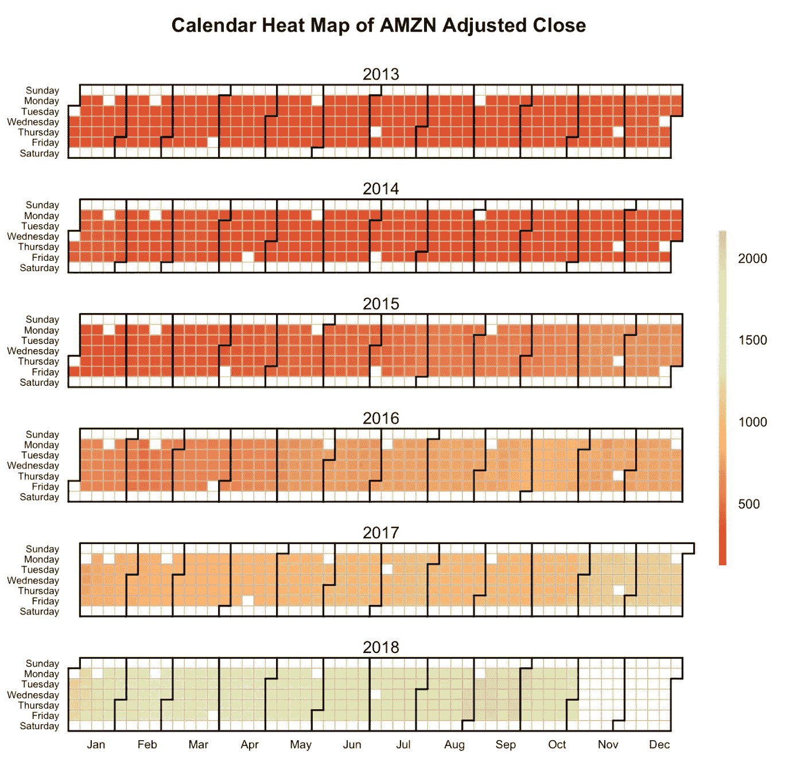

# 时序日历热图

> 原文：<https://towardsdatascience.com/time-series-calendar-heatmaps-9f576578fcfe?source=collection_archive---------12----------------------->

## 一种可视化时间序列数据的新方法


## 介绍

时间序列是按时间顺序编制索引的一系列数据。时间顺序可以用天、周、月或年来表示。可视化时间序列数据的最常见方法是使用简单的折线图，其中横轴绘制时间增量，纵轴绘制所测量的变量。可以使用`ggplot2`中的`geom_line()`或简单使用`Base R`中的`plot()`功能来实现可视化。

在本教程中，我将介绍一个名为**时序日历热图**的新工具来可视化时序数据。我们将看看如何使用`ggplot2`绘制时间序列日历热图。我们还将探索由 Paul Bleicher 编写的`calendarHeat()`函数(在 GPL 许可下作为开源发布),它提供了一种创建可视化的简单方法。

## 动机

如果你曾经去过 GitHub，你肯定会偶然发现下面的图表，它显示了一个用户在过去一年中所做的贡献。瓷砖的颜色代表贡献的数量(如图表右下角的图例所述)。在这里，日历热图提供了一种直观的方式，在类似日历的视图中直观地显示用户一年中所做的提交数量，从而很容易识别日常模式或异常情况。



Heatmap from Github

另一个很好的例子可以在下面这篇由《华尔街日报》发表的文章中找到，这篇文章显示了 70 年来美国所有 50 个州的感染人数。

[http://graphics.wsj.com/infectious-diseases-and-vaccines/](http://graphics.wsj.com/infectious-diseases-and-vaccines/)

在这里，日历热图可以很容易地识别各种疾病感染人数的年度模式。

## 个案研究

为了说明日历热图的使用，我们将可视化亚马逊过去 5 年的股票价格(NASDAQ: AMZN)。我们将关注调整后的收盘价，该收盘价将通过`tidyquant`包获得。

## 包装

我们将安装并导入`tidyquant`包来获取亚马逊的股票价格。我们还将安装并导入`ggplot2`来执行可视化。`calendarHeat()`的 R 代码可以通过 Paul Bleicher 的 Github 页面下载。

```
*# install tidyquant* install.packages('tidyquant', repos = "http://cran.us.r-project.org")
library(tidyquant) *#install ggplot2* install.packages("ggplot2", repos = "http://cran.us.r-project.org") library(ggplot2) *#Load the function to the local through Paul Bleicher's GitHub page* source("https://raw.githubusercontent.com/iascchen/VisHealth/master/R/calendarHeat.R")
```

## 加载数据

```
amznStock = as.data.frame(tidyquant::tq_get(c("AMZN"),get="stock.prices")) *# get data using tidyquant* 
amznStock = amznStock[year(amznStock$date) > 2012, ] *# Using data only after 2012*Using ggplot2
```

## **使用**

使用`ggplot2`创建日历热图的过程有些麻烦。在制作热图之前，我们需要将数据整理成正确的形状。下面的代码列出了如何使用`ggplot2`管理创建日历热图的数据的步骤。

```
library(plyr)
library(plotly)amznStock$weekday = as.POSIXlt(amznStock$date)$wday *#finding the day no. of the week*amznStock$weekdayf<-factor(amznStock$weekday,levels=rev(1:7),labels=rev(c("Mon","Tue","Wed","Thu","Fri","Sat","Sun")),ordered=TRUE) *#converting the day no. to factor* amznStock$monthf<-factor(month(amznStock$date),levels=as.character(1:12),labels=c("Jan","Feb","Mar","Apr","May","Jun","Jul","Aug","Sep","Oct","Nov","Dec"),ordered=TRUE) *# finding the month* amznStock$yearmonth<- factor(as.yearmon(amznStock$date)) *#finding the year and the month from the date. Eg: Nov 2018* amznStock$week <- as.numeric(format(amznStock$date,"%W")) #finding the week of the year for each date amznStock<-ddply(amznStock,.(yearmonth),transform,monthweek=1+week-min(week)) *#normalizing the week to start at 1 for every month* p <- ggplot(amznStock, aes(monthweek, weekdayf, fill = amznStock$adjusted)) + geom_tile(colour = "white") + facet_grid(year(amznStock$date)~monthf) + scale_fill_gradient(low="red", high="green") + xlab("Week of Month") + ylab("") + ggtitle("Time-Series Calendar Heatmap: AMZN Stock Prices") + labs(fill = "Price") p
```



Calendar Heatmap using `ggplot2`

## 使用 `calendarHeat()`

`calendarHeat()`使流程变得更加简单。我们只需要调用函数并指定以下五个参数。

*   `date`:需要绘制数据的日期。
*   `values`:与这些日期相关联的值。
*   `color`:调色板。默认为 r2g(红转绿)。其他预定义选项有 r2b(红到蓝)和 w2b(白到蓝)。您可以通过定义如下所示的向量来创建自己的调色板。
*   `ncolors`:热图的颜色数量
*   `varname`:图表标题

```
r2g <- c("#D61818", "#FFAE63", "#FFFFBD", "#B5E384") calendarHeat(amznStock$date, amznStock$adjusted, ncolors = 99, color = "r2g", varname="AMZN Adjusted Close")
```



Calendar Heatmap using calendarHeat()

## 何时使用`ggplot2?`中的`calendarHeat()` v/s `geom_tile`

`calendarHeat()`是一个预定义的函数，因此它在如何修改图形方面提供的灵活性较小。为了用除了在`calendarHeat()`函数中指定的五个参数之外的其他方式更新数字，我们需要修改底层代码。`ggplot2`另一方面提供了灵活性，因为我们从头开始构建可视化。

此外，`ggplotly`可以与`ggplot2`图表集成，使其更具交互性。例如，通过使用`ggplotly`我们将能够计算每天的价格。`calendarHeat()`另一方面，不能与`ggplotly`集成(不确定是否有现有的包可以帮助实现相同的功能)。

说到方便，`calendarHeat()`提供了一种更简单的方法来构建图表。我们只需要调用一个函数，一个相对标准的数据集就可以很容易地可视化，而不需要做太多的数据筛选。

## 什么时候应该使用日历热图？

当“每日值”或“星期几”值很重要时，日历热图很有用。如果我们想查看全年的每日数值，那么日历热图特别有用。

另一方面，如果我们想看到一个趋势(例如:季节性、形状、平稳性等。)，日历热图帮助不大。这些也不能描绘月度或年度趋势。如果我们希望看到数据的总体趋势，那么简单的折线图是更好的方法。

## 参考

[https://www.r-bloggers.com/ggplot2-time-series-heatmaps](https://www.r-bloggers.com/ggplot2-time-series-heatmaps)、[https://www . rdocumentation . org/packages/iClick/versions/1.4/topics/calendar heat](https://www.rdocumentation.org/packages/iClick/versions/1.4/topics/calendarHeat)、[https://github . com/iascchen/vis health/blob/master/R/calendar heat。R](https://github.com/iascchen/VisHealth/blob/master/R/calendarHeat.R) ，[https://www . tableau . com/about/blog/2017/2/viz-variety-show-heat maps-66330](https://www.tableau.com/about/blog/2017/2/viz-variety-show-heatmaps-66330)