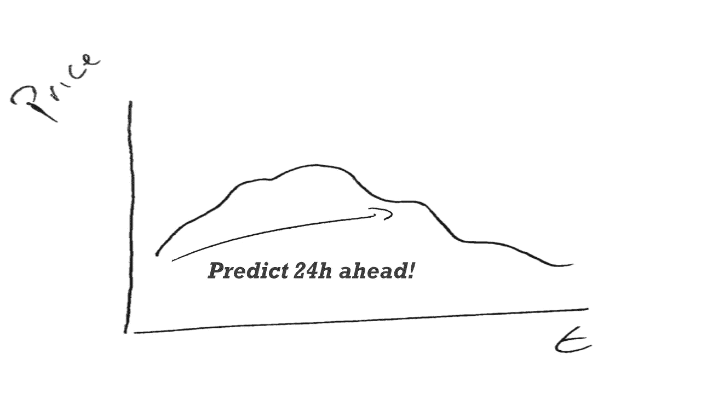
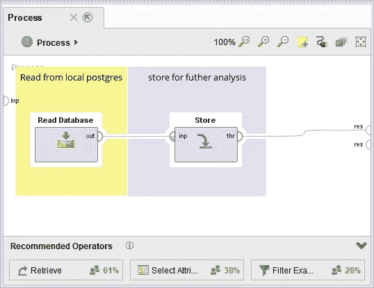
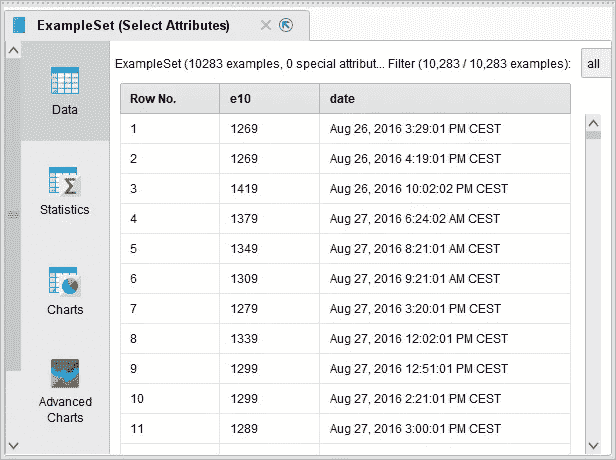
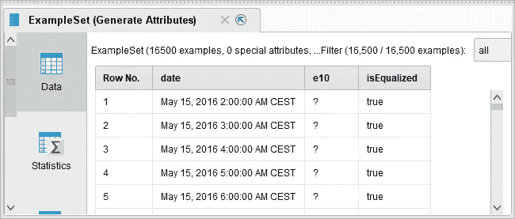
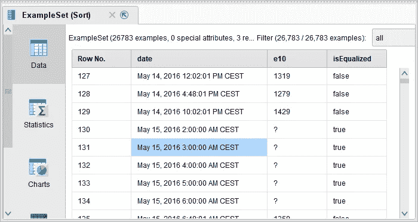
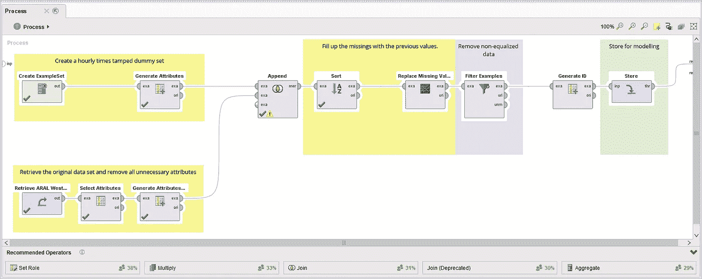
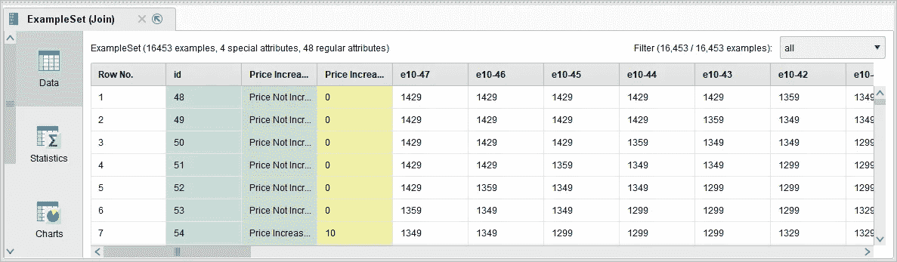
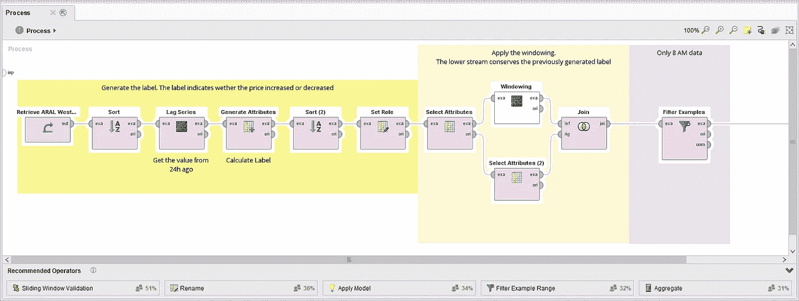
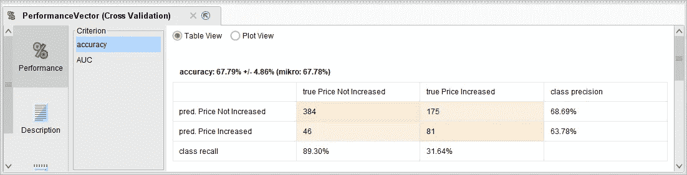

# 最佳气体补充的时间序列预测

> 原文：<https://towardsdatascience.com/time-series-forecasting-for-optimal-gas-refill-88650b1cf029?source=collection_archive---------4----------------------->


Aral petrol station in the mountainous region of Bamberg — [Reinhold Möller](https://commons.wikimedia.org/wiki/File:Aral_Tankstelle_Bamberg_Berg_065709-PSD.jpg)

你有没有遇到过这样的情况，当你开车经过一个加油站，当你昨天支付的价格比现在高很多时，你变得沮丧？别担心！我们可以用数据科学来克服这个问题！我们可以把这个问题变成一个预测问题。在这篇文章中，我们将建立一个模型来预测你应该今天还是明天补充。



The idea of the data science solution. We want to forecast if the price increases by looking at the past.

# 数据

2013 年，德国联邦政府决定建立一个中央组织，收集德国所有加油站的油价数据。所有加油站都被迫提供气价变化。数据是公开的，有很多应用程序可以让你看到这些数据。我们将使用这些数据来解决我们的预测问题。数据可以从[https://creativecommons.tankerkoenig.de/](https://creativecommons.tankerkoenig.de/)下载。数据存储为 PostgreSQL 转储。包含了 2015 年 5 月以来的所有气价。解压缩数据后，您可以使用以下命令将它们放入本地 PostgreSQL 数据库:

```
C:\Program Files\PostgreSQL\10\bin>psql.exe -U postgres -f “C:\…\history.dump”
```

在 [RapidMiner](https://rapidminer.com/) 中实现这一点很容易:你需要将 PostgreSQL 数据库连接到你的工作室，并使用 *Read Database* 操作符。



RapidMiner process to get the data into it. The Read Database operator contains the SQL-script which is posted below.

在我的特例中，我想为一个加油站这样做:位于多特蒙德 Westfalendamm 的 ARAL 加油站。这是德国 RapidMiner 办公室正前方的加油站。因此，我们使用一个快速 SQL 查询来获取这个加油站的所有数据:

```
SELECT * FROM gas_station_information_history
JOIN gas_station
ON gas_station.id = gas_station_information_history.stid
WHERE gas_station.street = ‘Westfalendamm’ AND brand = ‘ARAL’
```

存储后，我们可以看看数据。

# 数据准备

两个基本属性是“日期”和“e10”，其中 e10 表示含 10%乙醇的标准气体。



A view of the data. E10 is premium gasoline. The original data set also contains the prices for diesel as well as additional data on the station.

这里的问题是数据没有等距的时间戳。它只记录数据的每次变化。我们想要生成什么样的数据集:

```
Aug 26, 2016, 4PM — 1269Aug 26, 2016, 5PM — 1269Aug 26, 2016, 6PM — 1269….
```

这将使我们的数据每小时均衡一次。为此，我们首先创建一个示例集，如下所示:



Data set after equalization

我们将它附加到原始集合中，对其进行排序，得到下表:



The original data set and the equalized data set combined. We can fill the missing data using the previous values to get the price at a given time.

我们用最后一个存在的前一个值来填充缺失的值，并通过过滤“isEqualized”来过滤掉原始数据。RapidMiner 流程如下所示:



RapidMiner process for the preprocessing.

数据集现在是干净的，我们可以继续进行特征生成和建模。

# 特征生成

首先，我们生成一个标签。请记住，我们想要解决这个问题:*我是今天还是明天再加注？*因此，我们的标签是当前价格和 24 小时内价格之间的差异。由此我们可以生成一个表示价格上涨的二项式标签。

下一步是特征生成。首先，我们对数据进行窗口处理。窗口意味着我们在当前行中包含过去 48 小时的所有价格。结果数据集如下所示:



Windowed data set in RapidMiner. e10–47 indicates the price 47 hours before, e10–46 the price 46h ago and so.

因为我早上 8 点到达办公室，所以我想预测现在或明天早上 8 点补充是否有意义。因此，我只查看上午 8 点的数据，并过滤掉其余的数据。特征准备的完整 RapidMiner 过程如下所示:



我们为每个数据点生成一个特征向量。这已经足够训练一个模特了。

# 系统模型化

我们现在有了一个可以学习的完美数据集。我用一个广义线性模型来预测我们的标签。对于这样的第一次尝试，结果是好的:



Confusion Matrix for the GLM. The confusion matrix is estimated using a 10-fold Cross Validation.

该模型的 AUC 为 0.7。虽然这并不完美，但仍然比默认模型要好！