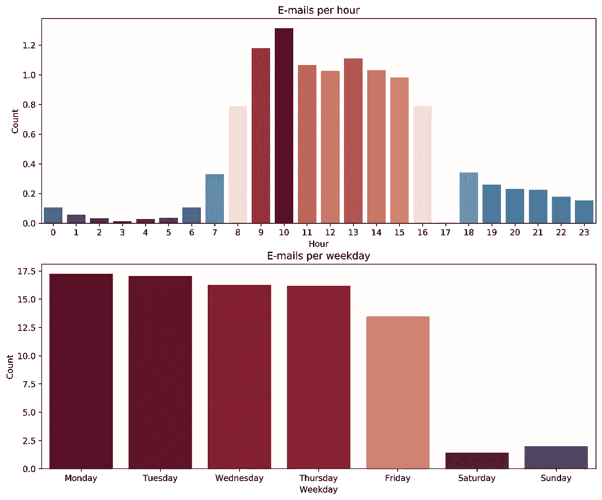
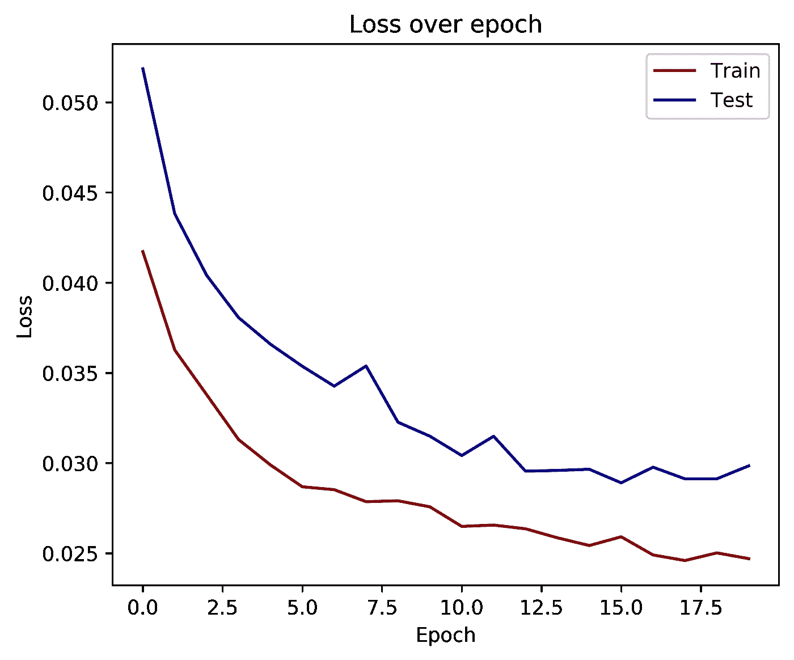
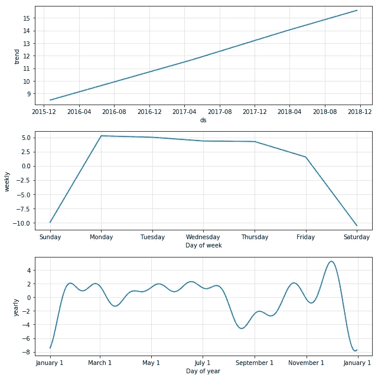
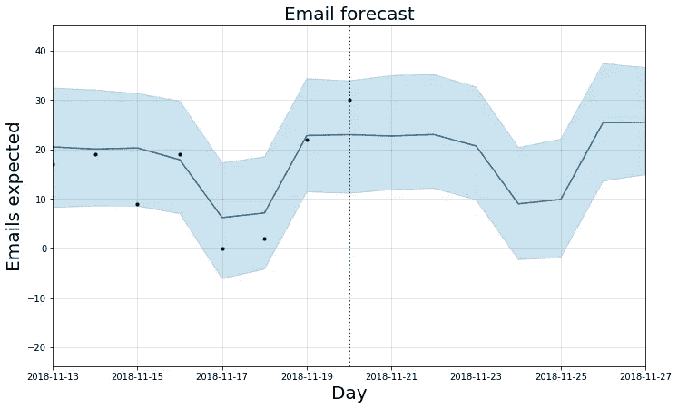

# 基于 LSTMs 和 Prophet 的时间序列预测

> 原文：<https://towardsdatascience.com/time-series-forecasting-with-lstms-and-prophet-predict-your-email-workload-48bf9cdb1580?source=collection_archive---------6----------------------->


*Image via* photodune.net *under license to mtstrauss*

## 预测您的电子邮件工作量

ime 系列预测为测试数据科学算法提供了一个绝佳的平台。毕竟，如果一个人能够预测未来，那该有多好？用于演示预测算法的典型数据集是股票图表、销售和气象数据。在这里，我们将尝试一些与每个在线用户更相关的东西，即你将收到的电子邮件的数量。根据一份电子邮件统计报告，2014 年，上班族平均每天收到 85 封电子邮件。让我们试着根据你的历史收件箱数据做一个准确的预测。为此，我们将探讨使用 LSTMs 和脸书的先知。这里的目标是如何为不同的算法准备数据，并提供一个定性的概述，而不是微调。可以说，结果会因你通常收到的电子邮件数量以及你用于训练的数据而有很大差异。

# 收集数据

我们首先在`imapclient`包的帮助下用我们自己的收件箱创建一个数据集。一个很好的介绍可以在自动化枯燥的东西上找到，第 [16](https://automatetheboringstuff.com/chapter16/) 章。我们将加载过去三年(从 2016 年 1 月 1 日开始)的所有电子邮件，并获取主题和日期。我们使用`pandas`将它转换成数据帧。

```
A total of 12738 e-mails loaded.
```

在我的例子中，我们现在有 12738 封电子邮件用于培训。请注意，上面的代码是针对装满电子邮件的收件箱的。如果你已经将你的电子邮件分类在不同的文件夹中，相应地调整代码。有些人，包括我自己，会立即删除不重要的电子邮件。然后，模型的输出是重要消息的数量，而不是实际的电子邮件。另请注意，一些电子邮件提供商(如谷歌)会阻止连接，称他们不允许从“不太安全”的应用程序连接到他们的服务。这可以在他们的设置中启用。原则上，你也可以查看本地邮箱。查看`mailbox`套餐可能是一个好的开始。

# 数据探索

现在，让我们先做一些可视化数据探索，并绘制每小时和每天的电子邮件数量。为此，我们将使用`pandas`及其重采样和`groubpy`功能。通过使用`sum()`和`count()`参数，我们可以对每个时间间隔进行标准化。此外，我们使用`seaborn`进行可视化。



Figure 1: Exploring the data

从数据中，我们可以看到一个独特的模式，即分布遵循典型的周一至周五 9-5 时间表，上午 10 点收到的电子邮件最多。由于每小时电子邮件的峰值数量仅略高于一封电子邮件，因此尝试对此数据集进行每小时预测没有什么意义。因此，我们将尝试预测每天的电子邮件工作量。

# 初步考虑:预测不可预测的事情

在我们深入研究我们的模型之前，有必要考虑一下我们问题的一些主要限制。可以说，接收电子邮件的时间点在某种程度上是随机的，因此无法预测。在大多数情况下，发送者并不知道对方是谁；因此，我们可以假设它们在统计上是独立的。作为估计，我们可以将我们的过程近似为泊松过程，其标准偏差等于其平均值的平方根。对于大约 12 封电子邮件，我们预计 RMSE 至少为 3.5，这完全是由于我们分布的随机性(`sqrt(11.95) ~ 3.461`)。
为了进一步阅读，我推荐阅读关于[二郎分布](https://en.wikipedia.org/wiki/Erlang_distribution)的文章，该分布被开发用于检查在某个时间段内打电话的次数。

# 计算基线

为了创建基线模型，我们可以使用来自历史数据的查找表。在过去的某一天，我收到了多少封电子邮件？为了对模型进行基准测试，我使用一个移动窗口来创建我的查找表，并计算第二天的预测差异。

```
RMSE for BASELINE 7.39
```

对于基线模型，我们得到 7.39 的 RMSE，我认为，相对于至少 3.5 的预期 RMSE，这是一个不错的值。

## 与 LSTM 的电子邮件预测

作为更高级的模型，我们将使用长短期记忆(LSTM)神经网络。关于 LSTMs 的精彩介绍可以在[这里](https://machinelearningmastery.com/time-series-prediction-lstm-recurrent-neural-networks-python-keras/)找到。对于我们的模型，我们将使用 6 天的窗口大小，并让模型预测第七天。

```
RMSE for LSTM 7.90
```



Figure 2: Training the LSTM

通过观察损失，我们可以看到 LSTM 网络正在学习，并且在预测未来价值方面变得越来越好。我们还可以看到，RMSE 比基线模型差一点。虽然名义上的差异并不大，但它与基线模型的接近程度确实令人瞩目。这表明网络能够学习一周的工作结构，在周末你会收到较少的电子邮件。

另一件值得一提的事情是，我们不能直接比较基线的 RMSE 和 LSTM。这是因为我们为基线的滚动预测转移了训练数据，而 LSTM 只看到了 80%的训练数据。你也可以这样做来训练 LSTM；然而，这在计算上将更加昂贵。

## 先知的电子邮件预测

接下来，我们将使用脸书的[先知库](https://github.com/facebook/prophet)创建一个模型。这是一个加法模型，我们可以用每年、每周和每天的季节性来拟合非线性趋势。同样，为了对模型进行基准测试，我们将把数据分成训练集和测试集，并计算 RMSE。与基线模型类似，我们将增加拟合数据的数量，并计算 RMSE。

```
RMSE for PROPHET 6.96
```

从 RMSE 基准测试来看，Prophet 模型是数据集性能最好的模型。现在让我们试着理解这是为什么。为此，我们绘制了模型的组成部分，以更好地理解模型正在做什么。这可以通过在我们的模型上使用`performance_metrics`函数来完成。

```
from fbprophet.diagnostics import performance_metrics
prophet_model.plot_components(prophet_forecast)
```



Figure 3: Components of the Prophet model

通过检查 Prophet 模型的组件，我们可以看到它可以识别数据中的关键趋势。总的趋势是电子邮件的总体增长。每周季节性准确地描述了工作日/周末时间表。一年中的季节性表现在重大节日，即新年期间电子邮件很少，但圣诞节前会增加。9 月份也是低点，9 月份是数据集所在国家的重要节假日。因此，可以理解为什么性能相当好。

# 综合起来:电子邮件预测

最后，我们将部署 Prophet 模型作为预测工具。为此，我们再次登录 IMAP 服务器，并使用自 2016 年 1 月 1 日以来的所有历史数据来训练我们的预测模型。在训练模型之后，我们绘制前一周的历史数据和下一周的预测。



Figure 4: E-mail forecast for the upcoming week

# 讨论

LSTMs 和脸书的 prophet 提供了一种直接的方法，可以相当准确地预测电子邮件数据。当考虑到模型的基本机制时，我认为这是可以理解的。LSTM 预测是基于一组最后的值，因此我们不太容易因季节性变化，并已经考虑了当前的趋势。与此形成对比的是，prophet 模型作为一个附加系统在建模方面做得很好，它发现并展示了季节性。当谈到规划未来的工作量或人员配备时，我发现这是您正在寻找的信息。现在可以对模型进行微调。这类问题的一个关键挑战是，如果你只有零星的事件，内在的随机性将是不可预测的。
最后，我们不要忘记，我们已经有了一个很好的基线模型，它强调预测模型不一定总是需要复杂的 ML 算法。