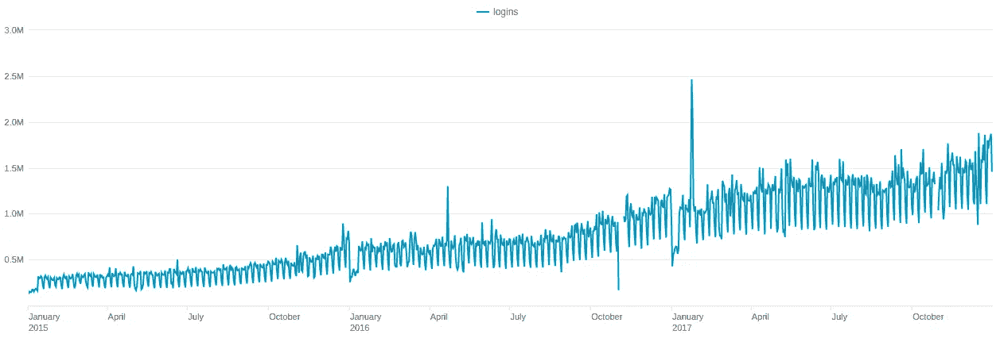
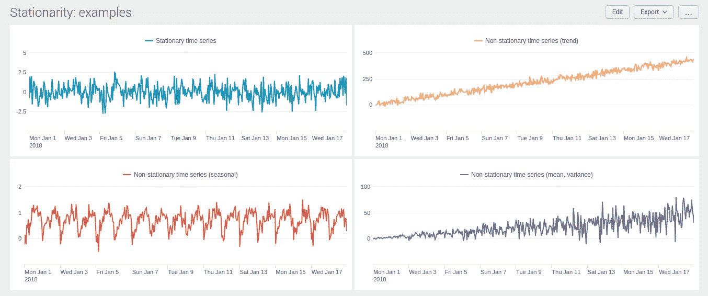
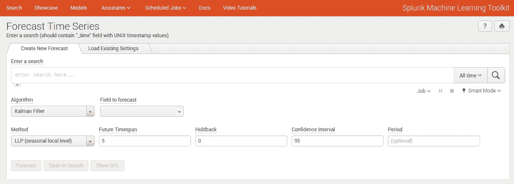
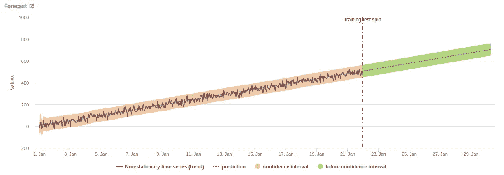
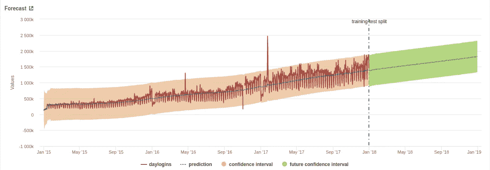
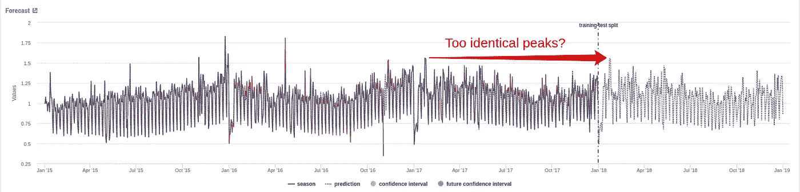
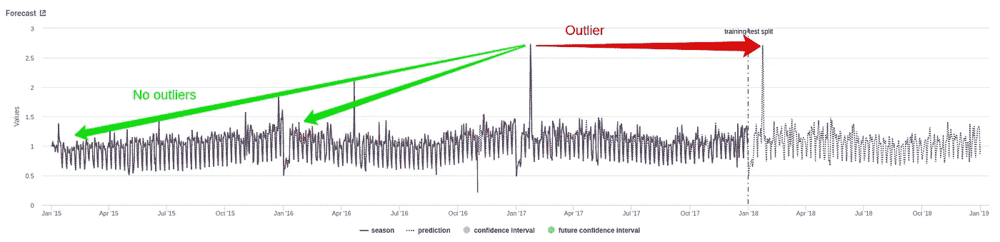
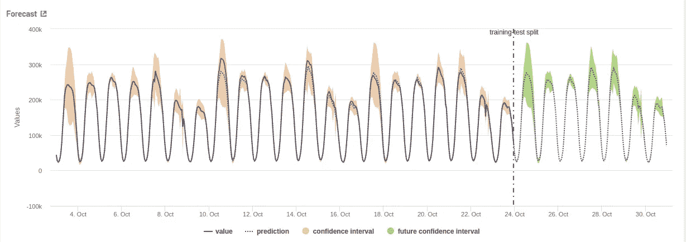
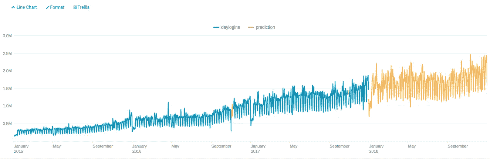

# 使用 Splunk 进行时间序列预测。第一部分介绍&卡尔曼滤波器。

> 原文：<https://towardsdatascience.com/time-series-forecasting-with-splunk-part-i-intro-kalman-filter-46e4bff1abff?source=collection_archive---------3----------------------->

## 让我们考虑一个比调整仪表板上的输入字段更实际的任务。

时间序列预测是数据分析中一项非常典型的任务。Splunk ML Toolkit 为此任务提供了两种众所周知的方法:卡尔曼滤波和 ARIMA。不幸的是，当遇到实际问题时，这些方法有时会失败。因此，让我们仔细研究一下它们，然后考虑 Splunk 中时间序列预测的一些其他技术。

# 工作

好了，我们来定义一个目标。让我们使用 Splunk 来监控一些指标，例如登录系统的次数、数据库中的事务数等。我们希望分析我们业务的增长(例如，为了容量规划和资源管理)。作为分析的一部分，我们希望根据过去几年的数据预测一年的登录次数。



Number of logins (max hour per day) from 2015 to 2017

如你所见，这是一个很普通的任务。但是让我们用灵活性的要求使它变得更复杂。因为监控不是唯一的指标，我们的方法或算法必须非常通用，以预测几乎任何指标，而无需用户进行大量调整。毕竟，我们需要构建一个具有这种功能的仪表板:用户选择一个指标，指定几个调优参数，并获得所选指标一年的适当预测。

# 趋势、季节性和平稳性

我们来刷新一下关于时间序列的一些基本概念。一般来说，时间序列可以分解成几个部分:趋势部分、季节部分和残差部分。**趋势**是时间序列值变化的一个大致方向。例如，上升趋势意味着时间序列的值平均比以前的值大。**季节性成分**代表数据中的一些周期性波动。例如，夜间的登录次数总是比白天少，工作日的登录次数总是比周末多。**残差分量**是时间序列值和确定性分量(趋势、季节性)之间的差值，通常代表某种噪声。

有两种主要的模型来处理这些组件。在**加法模型**中，初始时间序列表示为分量之和，在**乘法模型**中表示为它们的乘积。有时候，选择哪种模式可能是一个艰难的选择。一般来说，如果季节性波动的幅度随着时间的推移而增加，则乘法模型更为可取。

对于每个时间序列，我们可以计算均值、方差和自相关。如果这些参数随时间保持不变，则时间序列是**稳定的**。在下图中，您可以找到一些平稳(蓝色)和非平稳(黄色、红色、紫色)时间序列的示例。



Examples of stationary and non-stationary time series

‘蓝色’系列的均值和方差分别等于 0 和 1，所以这个系列是平稳的。“黄色”系列显示出增加的趋势，即平均值不是常数。“红色”序列表现出明显的日季节性，即自相关函数在滞后 24、48……小时时有一个局部最大值，而且它也不是常数。“紫罗兰”系列表现出增加的趋势和扰动，即均值和方差也不是常数。

真实世界的时间序列很少是平稳的。但是有很多技术和变换可以把它们变成静态的。

让我们打开 ML Toolkit 并尝试预测我们的系列。

# 卡尔曼滤波器

卡尔曼滤波是一种产生未知变量估计值的算法，这种估计值往往比基于单一测量值的估计值更准确(抱歉，我复制了来自[维基文章](https://en.wikipedia.org/wiki/Kalman_filter)的定义)。换句话说，卡尔曼滤波器将时间序列作为输入，并执行某种平滑和去噪。在此之后，可以预测平滑的序列。但是应该考虑到卡尔曼滤波首先是去噪，而不是预测。这就是为什么预测的结果可能有点不合适。

进入*助手>预测时间序列*，选择*卡尔曼滤波器*作为算法。



Let’s get it started

ML 工具包提供了几种预测方法:

*   LL(地方水平)仅预测时间序列的地方水平(没有任何趋势或季节性)；
*   LLT(本地级别趋势)仅预测趋势；
*   LLP(季节性当地水平)仅预测季节性成分；
*   LLP5(结合了 LLT 和 LLP)考虑了趋势和季节性。

## 玩具示例

首先，让我们尝试将卡尔曼滤波器应用于上述示例中的一个非平稳时间序列，以检查平滑能力。让我们选择“黄色”系列—它只是恒定趋势和正态分布噪声的总和。我是通过这个 SPL 查询得到它的(`normal`是一个定制的外部命令，它从分别在`loc`和`scale`参数中指定的字段返回一个具有均值和方差的正态分布值):

```
| gentimes start=”01/01/2018" increment=1h
| eval _time=starttime, loc=0, scale=20
| normal loc=loc scale=scale 
| streamstats count as cnt
| eval gen_normal = gen_normal + cnt
| table _time, gen_normal
| rename gen_normal as “Non-stationary time series (trend)”
```

好的，让我们用“LLT”算法应用卡尔曼滤波器，未来时间跨度= 200，置信区间= 95。



Kalman filtering with LLT forecasting

看起来不错。滤波器真正去除正态分布的噪声，并预测实际趋势。

## 真实的谈话

现在让我们尝试预测我们的登录次数。我们的时间序列显然包括趋势和季节成分，所以让我们选择预测算法= LLP5，未来时间跨度= 365(预测一年)，周期= 365(因为我们预计这个季节周期是最长的)。



Kalman filter with LLP5 forecasting of number of logins

嗯……很明显，结果有点出乎意料。似乎过滤器认为我们的数据波动是一种噪音。因此，滤波器消除了这种噪声，只保留了趋势分量。但有点令人困惑的是，算法中负责季节性成分的“LLP”部分根本不起作用。反正这个预测是不能接受的。

然而，也有一线希望。首先，置信区间的上下界对于离群点检测非常有用。第二，不可否认，趋势成分的预测相当不错。所以，让我们试着过滤掉所有的异常值，从初始数据中去除趋势成分。请注意，初始时间序列的方差随着时间的推移而增加。这就是为什么乘法模型似乎更适合我们的情况。所以，让我们用初始值除以趋势分量的值。

```
| inputlookup daylogins.csv
| timechart span=1d fixedrange=f max(daylogins) as daylogins
| predict “daylogins” as prediction algorithm=”LLT” future_timespan=365 period=365 lower”95"=lower”95" upper”95"=upper”95"
| eval daylogins = case(daylogins < ‘lower95(prediction)’, ‘lower95(prediction)’, daylogins > ‘upper95(prediction)’, ‘upper95(prediction)’, 1=1, daylogins)
| eval season = daylogins / prediction
| table _time, season
| where _time<strptime(“2018–01–01”, “%F”)
```

这里我在 SPL 使用了一个`predict`命令。这是一个卡尔曼滤波的命令，你可以通过点击“预测时间序列”仪表板上的“显示 SPL”按钮来检查它。

将方法更改为 LLP，然后单击“预测”。



Forecast of seasonal component

嗯，还不错。主要的季节性特征(比如新年后的大衰退)几乎被完美地捕捉和预测。

> 俄罗斯有一个延长的新年假期。它开始于 1 月 1 日，持续约 8-10 天(实际持续时间每年不同)。它指出，在那些日子里，许多地区的用户活动比其他日子少得多。

但是，一如既往，细节决定成败。看看新年假期后预测的峰值。好像和一年前一样。实际上，它们看起来太相似了。请注意，在 2015 年和 2016 年，没有任何类似的峰值。如果关闭异常值移除，相似性会变得更加明显。



Forecast seems to be just a copy of the last period of data

预测中会重复 2017 年 2 月的异常值，但不会重复 2016 年 5 月的异常值。因此，似乎卡尔曼滤波器与 LLP 算法高估了最后一段时间的价值(在我们的情况下是最后 365 天)，而不理会相应的前一段时间的价值。

同样的情况也发生在除夕夜的旺季。

然而，卡尔曼滤波的这种特性并没有使这种预测完全不充分。如果我们真的只想依赖最近一段时间的数据，这可能会有用。例如，我们将根据前几周的数据预测一周的登录次数，以便实时检测关键问题。如果登录次数显著减少，这可能意味着认证服务器的可用性或类似的一些问题。对于这种监控，我们可以创建一个简单明了的预测，只需将新数据与置信区间的界限进行比较。



Week forecast for the data completeness check

好吧，让我们回到最初的一年预测。尽管有明显的缺点，我们的时间序列的季节成分的预测是相当合理的。因此，让我们将预测的趋势分量乘以预测的季节分量，以恢复到所需的登录次数。

```
| inputlookup daylogins.csv 
| timechart span=1d fixedrange=f max(daylogins) as daylogins 
| predict "daylogins" as prediction algorithm="LLT" future_timespan=365 lower"95"=lower"95" upper"95"=upper"95" 
| eval daylogins = case(daylogins < 'lower95(prediction)', 'lower95(prediction)', daylogins > 'upper95(prediction)', 'upper95(prediction)', 1=1, daylogins) 
| eval season = daylogins / prediction 
| predict "season" as season_prediction algorithm="LLP" future_timespan=365 period=365 lower"0"=lower"0" upper"0"=upper"0"
| eval prediction = prediction * season_prediction
| table _time, daylogins, prediction
| eval prediction = if(isnull(daylogins), prediction, null)
| where _time<strptime("2019-01-01", "%F")
```



Forecast of number of logins using Kalman filtering

看起来很不错。注意，我最终在没有 ML Toolkit Assistant GUI 的情况下在纯 SPL 实现了这个预测。因此，我可以将该搜索插入到任何应用程序的任何仪表板中(只需考虑知识对象的权限)。我需要指定的唯一参数是季节成分的周期(即多重季节性情况下的最大季节周期)。您可以允许用户通过简单的输入文本框在仪表板上指定此参数，默认值为 365。还可以使用傅立叶变换或分析自相关函数来自动计算最大季节周期(我想我们稍后会谈到这一点)。

## 未完待续…

下面我们简单回顾一下 Splunk 中的卡尔曼滤波器。

*   这是一个简单而有用的时间序列预测工具。
*   人们只需一个 SPL 命令就可以轻松创建预测，而无需调整大量参数。
*   滤波器(顾名思义)在平滑噪声时间序列方面表现良好。

但是这种简单意味着缺乏灵活性。

*   你根本无法控制季节周期。在多重季节性的情况下，你只能依靠过滤器的内部算法。
*   季节性预测很少考虑最后一段时间以外的值。
*   没有任何类似“平滑系数”的参数用于“去噪灵敏度”的调节。因此，滤波器有时会执行非常激进的平滑，并且会导致有价值信息的丢失。

好吧，今晚到此为止。在下一部分，让我们更仔细地看看 Splunk 中的 [ARIMA](https://en.wikipedia.org/wiki/Autoregressive_integrated_moving_average) 。敬请期待！