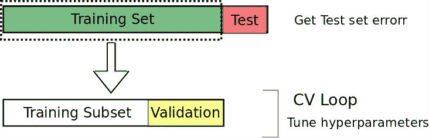
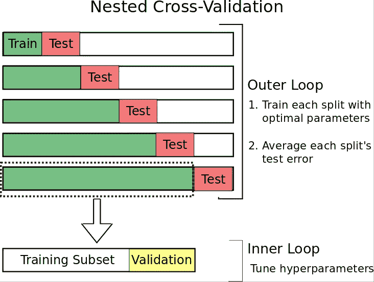
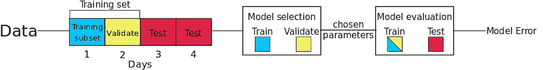
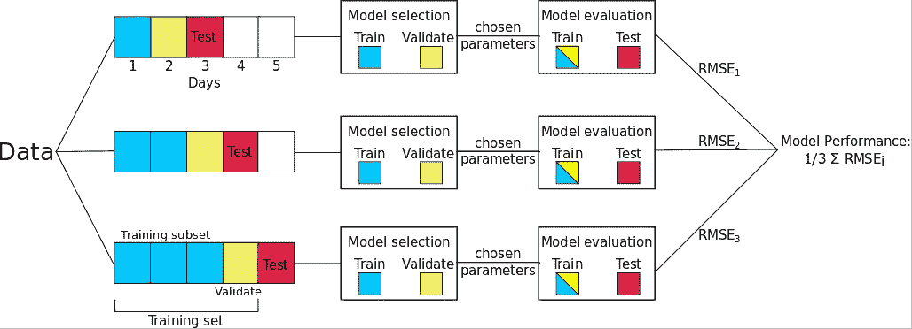
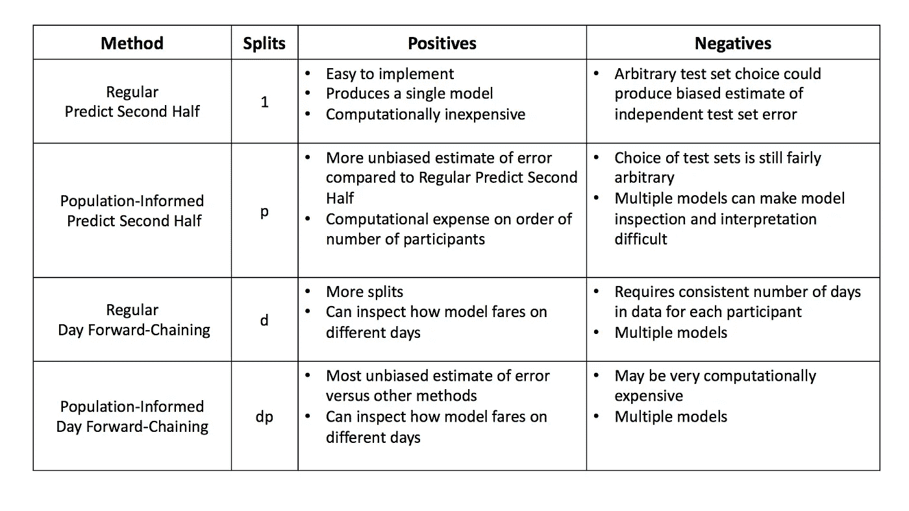

# 时序嵌套交叉验证

> 原文：<https://towardsdatascience.com/time-series-nested-cross-validation-76adba623eb9?source=collection_archive---------0----------------------->

这篇博文讨论了对时间序列数据使用传统交叉验证的缺陷。具体来说，我们解决了 1)在不导致数据泄漏的情况下分割时间序列，2)使用嵌套交叉验证来获得独立测试集的无偏误差估计，以及 3)使用包含多个时间序列的数据集进行交叉验证。

## 用例

这篇文章是对缺乏关于如何对包含多个时间序列的数据使用交叉验证的在线信息的回应。

这篇文章将帮助任何有时间序列数据的人，特别是多个*独立的*时间序列。这些方法是为医学研究中多个参与者的时间序列医学数据而设计的。

## 交叉验证

交叉验证(CV)是一种用于调整超参数和产生模型性能的稳健测量的流行技术。两种最常见的交叉验证是*k*-折叠交叉验证和保留交叉验证。

由于文献中术语的差异，我们明确定义了我们的 CV 程序。首先，我们将数据集分成一个称为*训练集*的子集和另一个称为*测试集*的子集。如果需要调整任何参数，我们将训练集分成一个*训练子集*和一个*验证集*。在训练子集上训练模型，并且选择最小化验证集上的误差的参数。最后，使用选择的参数在完整的训练集上训练模型，并记录测试集上的误差。

Figure 1: Example of hold-out cross-validation. The data is split into a training set and a testing set. Then the training set is split again to tune hyperparameters- one part is used to train the model (training subset) and the other part (validation set) is used to validate the model.

## *为什么时间序列的交叉验证不同？*

在处理时间序列数据时，传统的交叉验证(如 *k* -fold)不应使用，原因有二:

1.  **时间依赖性**

对于时间序列数据，在分割数据时必须特别小心，以防止数据泄漏。为了准确地模拟“真实世界的预测环境，我们站在现在并预测未来”(Tashman 2000)，预测者必须保留在用于拟合模型的事件之后按时间顺序发生的事件的所有数据。因此，对于时间序列数据，我们使用保留交叉验证，而不是使用 *k* 折叠交叉验证，其中数据的子集(*暂时分割*)被保留用于验证模型性能。例如，参见图 1，其中测试集数据按时间顺序排在训练集之后。类似地，验证集按时间顺序排在训练子集之后。

2.**任意选择测试集**

您可能会注意到，图 1 中测试集的选择是相当随意的，这种选择可能意味着我们的测试集误差是对独立测试集误差的糟糕估计。为了解决这个问题，我们使用了一种叫做嵌套交叉验证的方法。嵌套 CV 包含一个用于误差估计的外环和一个用于参数调整的内环(见图 2)。内部循环的工作方式与前面讨论的完全一样:将训练集分为训练子集和验证集，在训练子集上训练模型，并选择使验证集上的误差最小化的参数。然而，现在我们添加了一个外部循环，它将数据集分成多个不同的训练和测试集，并且对每次分割的误差进行平均，以便计算模型误差的稳健估计。这是有利的，因为:

> 嵌套的交叉验证过程提供了真实误差的几乎无偏的估计。(瓦尔马和西蒙，2006 年)

Figure 2: Nested CV Example

## 时间序列的嵌套 CV 方法

我们建议用两种方法对单一时间序列的数据进行嵌套 CV。我们将处理这样一个场景，其中我们有来自一个医疗患者/参与者的多天数据:

1.  预测下半年
2.  日正向链接

**预测下半年**

第一种类型，预测后半部分，是嵌套 CV 的“基本情况”,只有一个训练/测试分割。这样做的好处是这种方法易于实现；然而，它仍然受到任意选择的测试集的限制。数据的前半部分(在时间上分开)被分配给训练集，后半部分成为测试集。验证集的大小可以根据给定的问题而变化(例如，在图 3 的示例中是 1 天的数据)，但是确保验证集在时间上在训练子集之后是很重要的。

Figure 3: Predict Second Half Nested Cross-Validation

**日前向连锁**

预测后半部分嵌套交叉验证方法的一个缺点是，任意选择保留测试集会对独立测试集产生预测误差的有偏估计。为了更好地估计模型预测误差，通常的方法是创建许多训练/测试分割，并对所有分割的误差进行平均。我们使用的技术称为日前向链，基于一种称为前向链的方法(在文献中也称为滚动原点评估(Tashman 2000 年)和滚动原点重新校准评估(Bergmeir 和 bentez 2012 年))。使用这种方法，我们连续地将每一天作为测试集，并将所有以前的数据分配到训练集中。例如，如果我们的数据集有五天，那么我们将产生三个不同的训练和测试分割，如图 4 所示。请注意，在本例中，我们有三次拆分，而不是五次，因为我们需要确保至少有一天的培训和验证数据可用。该方法产生许多不同的训练/测试分割，并且对每个分割的误差进行平均，以便计算模型误差的稳健估计。

Figure 4: Day Forward-Chaining Nested Cross-Validation

请注意，在我们的示例中，我们使用“Day”正向链接；然而，一次也可以迭代每个*数据点*(但这将意味着更多的分割)*，而不是迭代跨越*天*。*

## 多个时间序列的嵌套交叉验证

既然我们有两种分割单个时间序列的方法，我们讨论如何处理具有多个不同时间序列的数据集。同样，我们使用两种类型:

**常规**

对于“常规”嵌套交叉验证，如何进行训练/验证/测试分割的基本思想与之前相同。唯一的变化是拆分现在包含了来自我们数据集中每个参与者的数据。例如，如果有两个参与者，参与者 A 和 B，则训练集将包含来自参与者 A 的前半天的数据和来自参与者 B 的前半天的数据。同样，测试集将包含每个参与者的后半天的数据。

**人口知情**

对于“群体知情嵌套交叉验证”,我们利用不同参与者数据之间的**独立性**。这使得我们可以打破严格的时间顺序，至少在个体的数据之间(在个体的数据内部仍然是必要的)。由于这种独立性，我们可以稍微修改常规的嵌套交叉验证算法。现在，测试和验证集只包含来自一个参与者的数据，比如说参与者 A，并且*来自数据集中所有其他参与者的所有*数据都允许出现在训练集中。请参见图 5，了解这对于群体通知日正向链接嵌套交叉验证是如何工作的。该图显示，参与者 A 的第 18 *天*是测试集(红色)，之前的三天是验证集(黄色)，训练集(绿色)包含来自参与者 A 之前的所有数据，以及来自其余参与者的 *all* 数据(本例中为 *B* 、 *C* 、 *D* 和 *E* )。需要强调的重要一点是，正是由于这些参与者的时间序列的独立性，使用其他参与者的“未来”观察结果不会造成数据泄漏。

Figure 5: Population-Informed Day Forward-Chaining, where, in addition to Day Forward-Chaining method (left subfigure) for Participant A, we also allow all other participants’ data to be in the training set (right subfigure). Note that the grey bars indicate when the participant was sleeping.

## 其他重要的嵌套交叉验证注意事项

最后，我们总结了不同嵌套交叉验证方法的优缺点，特别是在计算时间和独立测试集误差估计的偏差方面。分割数量假设数据集包含 *p* 名参与者和 *d* 名参与者的数据。

## 总结:

我们首先回顾了交叉验证，列举了使用嵌套交叉验证背后的基本原理。我们讨论了如何分割时间序列数据而不导致数据泄漏，特别建议了两种方法:1)预测下半年和 2)日前向链接。然后，我们讨论了如何使用两种方法处理多个*独立的*时间序列:1)常规方法和 2)群体通知方法。

## **引文**:

C.伯格梅尔和 J. M .贝尼特斯。时间序列预测器评估的交叉验证的使用我 *nf。Sci。，*2012 年 5 月 191:192–213。ISSN 0020–0255。doi:10.1016/j . ins . 2011 . 12 . 028 . URL h[TTP://dx . doi . org/10.1016/j . ins . 2011 . 12 . 028 .](http://dx.doi.org/10.1016/j.ins.2011.12.028.)

长度 j .塔什曼。预测准确性的样本外检验:分析与评述。国际预测杂志，16(4):437–450，2000 年。URL https://ideas . repec . org/a/eee/int for/v16y 2000 i4p 437-450 . html

南瓦尔玛和西蒙。使用交叉验证进行模型选择时误差估计的偏差。BMC 生物信息学，7(1):91，2006 年 2 月。ISSN 1471–2105。doi:10.1186/1471–2105-7–91。