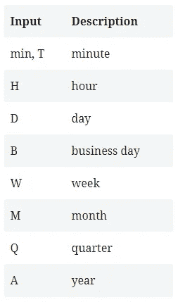
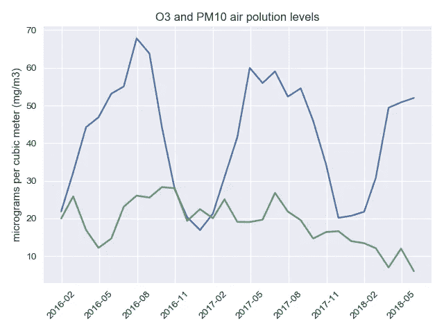

# 在 pandas 中使用日期时间索引

> 原文：<https://towardsdatascience.com/tips-on-working-with-datetime-index-in-pandas-2bcedf956d70?source=collection_archive---------5----------------------->


Photo by Jordan Benton from Pexels

## 对一个人有用的东西可能对另一个人有用

正如您从标题中所理解的，它并不是 Python 中时间序列或日期时间数据类型的完整指南。因此，如果你期望从 A 到 Z 得到深入的解释，那就错了。说真的。关于这个话题有一篇精彩的[文章](https://jakevdp.github.io/PythonDataScienceHandbook/03.11-working-with-time-series.html)，解释得很好，很详细，也很直白。不要在这个上浪费你的时间。

对于已经读到这一部分的人，我会告诉他们，你肯定会在这里找到有用的东西。再说一次，说真的。我找到了我关于时间序列的笔记，并决定把它整理成一篇小文章，里面有一些通用的提示，我想这些提示在你处理日期的 80%到 90%的情况下都是适用的。所以很值得分享不是吗？

我有一个数据集，其中包含自 2016 年以来马德里每小时的空气污染物测量值，因此我将以它为例。

# 导入数据

默认情况下，当使用`read_csv()`导入 csv 文件时，pandas 将使用第一列作为索引，因此如果您的日期时间列不是第一列，您将需要显式指定它`index_col='date'.`

pandas 的美妙之处在于它可以在导入过程中预处理您的 datetime 数据。通过指定`parse_dates=True`，pandas 将尝试解析索引，如果我们传递整数或名称的列表，例如 if [1，2，3]–它将尝试将第 1、2、3 列分别解析为单独的日期列，列表列表，例如 if [[1，3]]–将第 1 和第 3 列合并，解析为单个日期列，dict，例如{'foo' : [1，3]}–将第 1、3 列解析为日期，并调用结果“foo”。如果您使用其他方法导入数据，您可以在其后使用`pd.to_datetime`。

我使用以下代码导入了我的数据:

```
import pandas as pd
import globpattern = 'data/madrid*.csv'
csv_files = glob.glob(pattern)
frames = []for csv in csv_files: 
    df = pd.read_csv(csv, index_col='date', parse_dates=True)     frames.append(df)
df = pd.concat(frames)
df.head()Out[4]: 
                     BEN  CH4   CO  EBE  NMHC     NO   NO_2  NOx  
date                                                                          
2016-11-01 01:00:00  NaN  NaN  0.7  NaN   NaN  153.0   77.0  NaN  
2016-11-01 01:00:00  3.1  NaN  1.1  2.0  0.53  260.0  144.0  NaN  
2016-11-01 01:00:00  5.9  NaN  NaN  7.5   NaN  297.0  139.0  NaN  
2016-11-01 01:00:00  NaN  NaN  1.0  NaN   NaN  154.0  113.0  NaN   
2016-11-01 01:00:00  NaN  NaN  NaN  NaN   NaN  275.0  127.0  NaN
```

这些数据是从 24 个不同的站点收集的，涉及 14 种不同的污染物。我们不打算分析这些数据，为了简单一点，我们将只选择一个站，两种污染物，并删除所有 NaN 值(危险！请不要在不了解后果的情况下在家里重复)。


```
df_time = df[['O_3', 'PM10']][df['station'] == 28079008].dropna() df_time.head() Out[9]: 
                     O_3  PM10
date                          
2016-11-01 01:00:00  4.0  46.0
2016-11-01 02:00:00  4.0  37.0
2016-11-01 03:00:00  4.0  31.0
2016-11-01 04:00:00  5.0  31.0
2016-11-01 05:00:00  6.0  27.0
```

现在，当我们准备好数据后，我们就可以玩日期时间索引了。

# 选择值

尽管默认的 pandas datetime 格式是 ISO8601(“yyyy-mm-DD hh:mm:ss”)，但当使用部分字符串索引选择数据时，它可以理解许多其他不同的格式。例如:

```
**df_time.loc['2016-11-01'].head()** Out[17]: 
                     O_3  PM10
date                          
2016-11-01 01:00:00  4.0  46.0
2016-11-01 02:00:00  4.0  37.0
2016-11-01 03:00:00  4.0  31.0
2016-11-01 04:00:00  5.0  31.0
2016-11-01 05:00:00  6.0  27.0**df_time.loc['November 1, 2016'].head()** Out[18]: 
                     O_3  PM10
date                          
2016-11-01 01:00:00  4.0  46.0
2016-11-01 02:00:00  4.0  37.0
2016-11-01 03:00:00  4.0  31.0
2016-11-01 04:00:00  5.0  31.0
2016-11-01 05:00:00  6.0  27.0**df_time.loc['2016-Nov-1'].head()** Out[19]: 
                     O_3  PM10
date                          
2016-11-01 01:00:00  4.0  46.0
2016-11-01 02:00:00  4.0  37.0
2016-11-01 03:00:00  4.0  31.0
2016-11-01 04:00:00  5.0  31.0
```

都产生相同的输出。所以我们可以自由使用任何对我们来说更舒适的东西。我们还可以选择整个月的数据:

```
**df_time.loc['2016-11'].head()** Out[20]: 
                     O_3  PM10
date                          
2016-11-01 01:00:00  4.0  46.0
2016-11-01 02:00:00  4.0  37.0
2016-11-01 03:00:00  4.0  31.0
2016-11-01 04:00:00  5.0  31.0
2016-11-01 05:00:00  6.0  27.0**df_time.loc['2016-11'].count()** Out[24]: 
O_3     715
PM10    715
dtype: int64
```

如果我们想选择整年，情况也是如此:

```
**df_time.loc['2016'].head()** Out[31]: 
                     O_3  PM10
date                          
2016-11-01 01:00:00  4.0  46.0
2016-11-01 02:00:00  4.0  37.0
2016-11-01 03:00:00  4.0  31.0
2016-11-01 04:00:00  5.0  31.0
2016-11-01 05:00:00  6.0  27.0**df_time.loc['2016'].count()** Out[32]: 
O_3     8720
PM10    8720
dtype: int64
```

如果我们想对数据进行切片并找到某个特定时间段的记录，我们继续使用`loc`访问器，所有规则与常规索引相同:

```
**df_time.loc['2017-11-02 23:00' : '2017-12-01'].head()** Out[34]: 
                     O_3  PM10
date                          
2017-11-02 23:00:00  5.0  30.0
2017-11-03 00:00:00  5.0  25.0
2017-11-03 01:00:00  5.0  12.0
2017-11-03 02:00:00  6.0   8.0
2017-11-03 03:00:00  7.0  14.0**df_time.loc['2017-11-02 23:00' : '2017-12-01'].count()** Out[35]: 
O_3     690
PM10    690
dtype: int64
```

# 重采样

Pandas 具有简单、强大且高效的功能，用于在频率转换期间执行重采样操作(例如，将秒数据转换为 5 分钟数据)。这在金融应用中极为常见，但不限于此。

`resample()`是一个基于时间的 groupby，其后是对其每个组的归约方法。

`resample`功能非常灵活，允许我们指定许多不同的参数来控制频率转换和重采样操作。`sum`、`mean`、`std`、`sem`、`max`、`min`、`median`、`first`、`last`、`ohlc`、
是`resample()`返回对象的方法

```
# Converting hourly data into monthly data
**df_time.resample('M').mean().head()** Out[46]: 
                  O_3       PM10
date                            
2016-01-31  21.871622  19.990541
2016-02-29  32.241679  25.853835
2016-03-31  44.234014  16.952381
2016-04-30  46.845938  12.189076
2016-05-31  53.136671  14.671177
```

对于向上采样，我们可以指定一种向上采样的方法，以便在创建的间隙上进行插值:

```
# Converting hourly data into 10-minutely data
**df_time.resample('10Min').mean().head()** Out[47]: 
                     O_3  PM10
date                          
2016-01-01 01:00:00  8.0  17.0
2016-01-01 01:10:00  NaN   NaN
2016-01-01 01:20:00  NaN   NaN
2016-01-01 01:30:00  NaN   NaN
2016-01-01 01:40:00  NaN   NaN**df_time.resample('10Min').mean().ffill().head()** Out[48]: 
                     O_3  PM10
date                          
2016-01-01 01:00:00  8.0  17.0
2016-01-01 01:10:00  8.0  17.0
2016-01-01 01:20:00  8.0  17.0
2016-01-01 01:30:00  8.0  17.0
2016-01-01 01:40:00  8.0  17.0
```

我们可以使用以下方法来填充 NaN 值:*'填充'，'回填'，' ffill '，' bfill '，'最近的'。*在[文档](https://pandas.pydata.org/pandas-docs/stable/generated/pandas.core.resample.Resampler.fillna.html)中可以找到更多相关细节。或者我们可以通过以下方法使用插值来实现:*'线性'，'时间'，'索引'，'值'，'最近'，'零'，'线性'，'二次'，'三次'，'重心'，' krogh '，'多项式'，'样条'，'分段 _ 多项式'，' from _ 导数'，' pchip '，' akima '。*同样，关于这一点的更深入的解释可以在[熊猫文档中找到。](https://pandas.pydata.org/pandas-docs/stable/generated/pandas.core.resample.Resampler.interpolate.html#pandas.core.resample.Resampler.interpolate)

和重采样频率:



# 形象化

Datetime Index 的另一个令人惊叹的特性是绘图简单，因为 matplotlib 会自动将其视为 x 轴，所以我们不需要显式指定任何内容。

```
import seaborn as sns
sns.set()
df_plot = df_time.resample('M').mean()
**plt.plot(df_plot)** plt.title('Air polution by O3 and PM10')
plt.ylabel('micrograms per cubic meter (mg/m3)')
plt.xticks(rotation=45)
plt.show()
```



正如在开始时所承诺的——一些小技巧，在大多数情况下，在处理日期时间数据时会有所帮助。对我来说——又一个将思想转化为知识的更新者和组织者。都赢了。有人会觉得它有用，有人可能不会(我在第一段就警告过:D)，所以实际上我希望每个阅读这篇文章的人都会觉得它有用。

这是知识最令人兴奋的特点——当你分享它时，你不会失去任何东西，你只会有所收获。要写一篇文章，需要一些研究，一些验证，一些学习——基本上你最终会获得更多的知识。

知识只是一种工具。应用与否是你的责任。归根结底，你知道多少并不重要，重要的是你如何运用这些知识。但那已经是另一个故事了…

感谢您的阅读，度过不可思议的一周，学习，传播知识，明智地使用它，并将其用于行善🙂

*最初发表于*[*【sergilehkyi.com】*](http://sergilehkyi.com/tips-on-working-with-datetime-index-in-pandas/)*。*