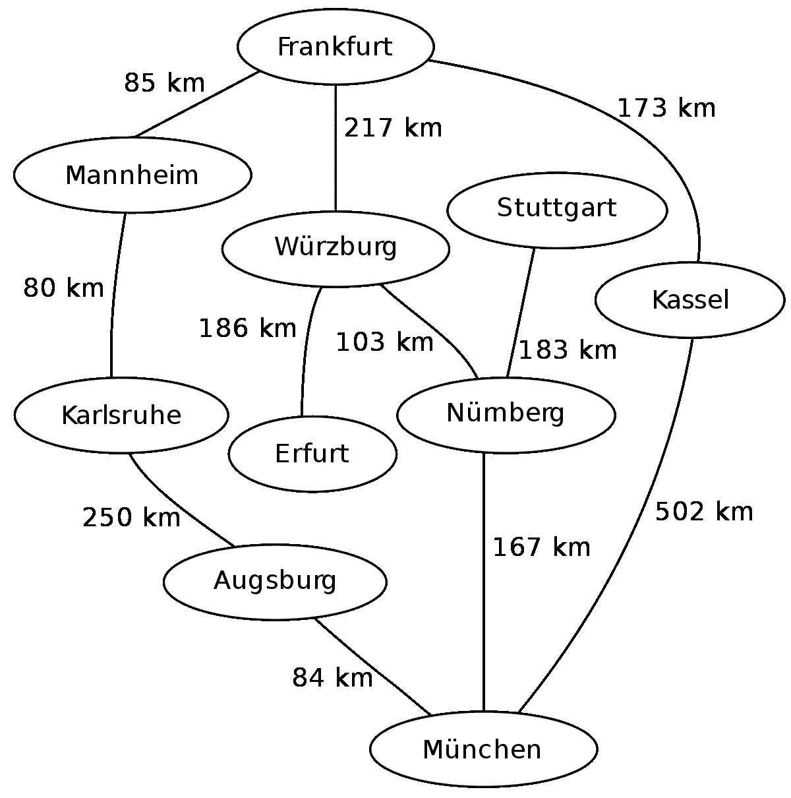
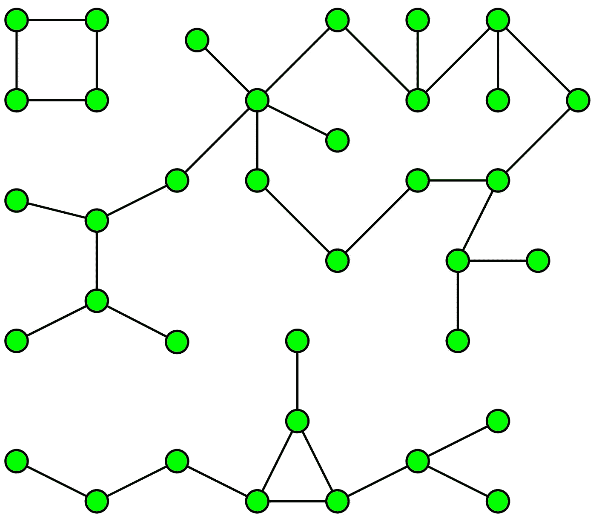

# 数据科学家，你需要知道的一个图算法

> 原文：<https://towardsdatascience.com/to-all-data-scientists-the-one-graph-algorithm-you-need-to-know-59178dbb1ec2?source=collection_archive---------4----------------------->


Photo by [Alina Grubnyak](https://unsplash.com/@alinnnaaaa?utm_source=medium&utm_medium=referral) on [Unsplash](https://unsplash.com?utm_source=medium&utm_medium=referral)

图表为我们提供了一种非常有用的数据结构。它们可以帮助我们找到数据中的结构。随着机器学习和大数据的出现，我们需要获得尽可能多的关于我们数据的信息。学习一点图论当然可以帮助我们。

这里有一个由 UCSanDiego 在 Coursera 上开设的[大数据图形分析课程，我强烈推荐学习图论的基础知识。](https://coursera.pxf.io/YgKbbe)

我在这篇文章中要关注的算法之一叫做**连通域**。为什么它很重要。我们都知道聚类。

*你可以用非常通俗的术语把连通分量看作是一种硬聚类算法，它在相关/连通的数据中寻找聚类/孤岛。举一个具体的例子:假设您有关于连接世界上任何两个城市的道路的数据。你需要找出世界上所有的大洲以及它们包含的城市。*

# 你将如何实现这一目标？来吧，考虑一下。

从零售角度来看**:比方说，我们有很多客户使用很多账户。使用连通分量算法的一种方法是在数据集中找出不同的族。我们可以基于相同的信用卡使用、相同的地址或相同的手机号码等假设客户之间的边界(道路)。一旦我们有了这些连接，我们就可以在相同的上运行连接组件算法来创建单独的聚类，然后我们可以为这些聚类分配一个家族 ID。我们可以使用这些家庭 id 根据家庭需求提供个性化建议。我们还可以使用这个家族 ID，通过创建基于家族的分组特征来推动我们的分类算法。**

**在**财务视角**中:另一个用例是使用这些家庭 id 来捕获欺诈。如果一个帐户过去曾有过欺诈行为，那么关联的帐户也很有可能容易受到欺诈。**

**足够多的用例。让我们从一个用 Python 编写的简单的 graph 类开始，用代码开始我们的开发。**

**从现在开始，这篇文章将更多地围绕代码展开。**

**您当然可以使用我们的新图形类。在这里，我们试图建立一些图表。**

```
Output:
Vertices of graph:
['a', 'c', 'b']
Edges of graph:
[['a', 'd', 2], ['c', 'b', 5], ['c', 'e', 5], ['c', 'd', 3], ['b', 'c', 2]]
Add vertex:
Vertices of graph:
['a', 'c', 'b', 'z']
Add an edge:
Vertices of graph:
['a', 'c', 'b', 'z']
Edges of graph:
[['a', 'z', 1], ['a', 'd', 2], ['c', 'b', 5], ['c', 'e', 5], ['c', 'd', 3], ['b', 'c', 2], ['z', 'a', 1]]
Adding an edge {"x","y"} with new vertices:
Vertices of graph:
['a', 'c', 'b', 'y', 'x', 'z']
Edges of graph:
[['a', 'z', 1], ['a', 'd', 2], ['c', 'b', 5], ['c', 'e', 5], ['c', 'd', 3], ['b', 'c', 2], ['y', 'x', 1], ['x', 'y', 1], ['z', 'a', 1]]
```

**现在让我们做一些有趣的事情。**

**出于理解的目的，我们将使用上面的 graph 类。python 中有许多模块，我们可以用来做我接下来要做的任何事情，但是为了理解这些方法，我们将从头开始编写所有的东西。
让我们从一个示例图开始，我们可以用它来达到我们的目的。**

****

```
Vertices of graph:
['Mannheim', 'Erfurt', 'Munchen', 'Numberg', 'Stuttgart', 'Augsburg', 'Kassel', 'Frankfurt', 'Wurzburg', 'Karlsruhe']
Edges of graph:
[['Mannheim', 'Frankfurt', 85], ['Mannheim', 'Karlsruhe', 80], ['Erfurt', 'Wurzburg', 186], ['Munchen', 'Numberg', 167], ['Munchen', 'Augsburg', 84], ['Munchen', 'Kassel', 502], ['Numberg', 'Stuttgart', 183], ['Numberg', 'Wurzburg', 103], ['Numberg', 'Munchen', 167], ['Stuttgart', 'Numberg', 183], ['Augsburg', 'Munchen', 84], ['Augsburg', 'Karlsruhe', 250], ['Kassel', 'Munchen', 502], ['Kassel', 'Frankfurt', 173], ['Frankfurt', 'Mannheim', 85], ['Frankfurt', 'Wurzburg', 217], ['Frankfurt', 'Kassel', 173], ['Wurzburg', 'Numberg', 103], ['Wurzburg', 'Erfurt', 186], ['Wurzburg', 'Frankfurt', 217], ['Karlsruhe', 'Mannheim', 80], ['Karlsruhe', 'Augsburg', 250]]
```

**假设给我们一张图表，上面有德国的城市以及它们之间各自的距离。**你想知道如何从法兰克福(起点)到慕尼黑**。可能有许多方法可以遍历该图，但您需要找到从法兰克福到慕尼黑至少需要访问多少个城市)这个问题类似于在未加权的图中找出节点之间的距离。**

**我们这里使用的算法叫做**广度优先搜索**。**

**我们在上面这段代码中所做的是创建一个队列，并根据级别遍历它。我们以法兰克福为起点。我们循环通过它的邻近城市(曼海姆、维尔茨堡和卡塞尔)并把它们推入队列。我们跟踪他们处于什么水平，以及我们到达他们的路径。因为我们弹出队列的第一个元素，我们确信我们将按照城市等级的顺序访问城市。**

**查看这篇关于 BFS 的[帖子](https://medium.com/basecs/breaking-down-breadth-first-search-cebe696709d9)，了解更多关于排队和 BFS 的信息。**

```
({'Augsburg': 3,
  'Erfurt': 2,
  'Frankfurt': 0,
  'Karlsruhe': 2,
  'Kassel': 1,
  'Mannheim': 1,
  'Munchen': 2,
  'Numberg': 2,
  'Stuttgart': 3,
  'Wurzburg': 1},
 {'Augsburg': ':->Frankfurt->Mannheim->Karlsruhe',
  'Erfurt': ':->Frankfurt->Wurzburg',
  'Frankfurt': ':',
  'Karlsruhe': ':->Frankfurt->Mannheim',
  'Kassel': ':->Frankfurt',
  'Mannheim': ':->Frankfurt',
  'Munchen': ':->Frankfurt->Kassel',
  'Numberg': ':->Frankfurt->Wurzburg',
  'Stuttgart': ':->Frankfurt->Wurzburg->Numberg',
  'Wurzburg': ':->Frankfurt'})
```

**我做这个例子是为了展示 BFS 算法是如何工作的。我们可以扩展这个算法，在一个不连通的图中找出连通的部分。假设我们需要在图中找到几组不相连的顶点。**

**例如，下图有 3 个不相连的子图。**我们能找到哪些节点属于某个特定的子图吗？****

****

```
[['Kassel',
  'Munchen',
  'Frankfurt',
  'Numberg',
  'Augsburg',
  'Mannheim',
  'Wurzburg',
  'Stuttgart',
  'Karlsruhe',
  'Erfurt'],
 ['Bangalore', 'Kolkata', 'Delhi', 'Mumbai'],
 ['NY', 'ALB', 'TX']]
```

**上面的代码类似于前面的 BFS 代码。我们将图的所有顶点保存在节点列表中。我们从节点列表中取出一个节点，并在其上启动 BFS。当我们访问一个节点时，我们从节点列表中删除该节点。每当 BFS 完成时，我们从节点列表中的另一个节点开始，直到节点列表为空。**

**如您所见，我们能够在数据中找到不同的组件。仅仅通过使用边和顶点。这个算法可以在不同的数据上运行，以满足我上面介绍的任何用例。**

**但通常使用零售案例的连接组件将涉及大量数据，您将需要扩展该算法。**

# **PySpark 中的连接组件**

**下面是这篇论文中关于 MapReduce 中[连接组件的实现，以及 Google Research 中](https://ai.google/research/pubs/pub43122)之后的实现。阅读 PPT 以更好地理解实施。一些现成的代码供您使用。**

# **或者在 PySpark 中使用 GraphFrames:**

**要安装图表框架:**

**我在命令行上运行:py spark—packages graphframes:graph frames:0 . 5 . 0-spark 2.1-s _ 2.11，它打开了我的笔记本，并在我尝试在笔记本中导入后安装了 graph frames。**

**要格式化的字符串为:graphframes:(最新版本)-spark(你的 spark 版本)-s_(你的 scala 版本)。**

***查看* [本指南介绍如何使用 GraphFrames](http://go.databricks.com/hubfs/notebooks/3-GraphFrames-User-Guide-python.html) 了解更多信息。**

**GraphFrames 库实现了 CC 算法以及各种其他图形算法。**

**上面的帖子有很多代码，但希望对你有所帮助。我花了很多时间来实现算法，所以想让它对人们来说很容易。**

**如果你想阅读更多关于图算法的内容，这里有一个由 UCSanDiego 在 Coursera 上开设的[大数据图分析课程，我强烈推荐你学习图论的基础知识。](https://coursera.pxf.io/YgKbbe)**

**请随时在 [LinkedIn](https://www.linkedin.com/in/rahulagwl/) 上与我联系，在 [Twitter](https://twitter.com/MLWhiz) / [Medium](https://medium.com/@rahul_agarwal) 上关注我，或者给我发消息征求意见。继续收听，继续学习。**

**首先发表在我的博客 mlwhiz.com[这里](http://mlwhiz.com/blog/2018/12/07/connected_components/)。**

# **参考**

1.  **[Python 中的图形](https://www.python-course.eu/graphs_python.php)**
2.  **[图论博客简介](https://medium.com/basecs/a-gentle-introduction-to-graph-theory-77969829ead8)**
3.  **[加州大学圣地亚哥分校 Coursera 大数据课程的图表分析](https://www.coursera.org/learn/big-data-graph-analytics?ranMID=40328&ranEAID=lVarvwc5BD0&ranSiteID=lVarvwc5BD0-uD3tAFL0mCUdzcfwDd6FTQ&siteID=lVarvwc5BD0-uD3tAFL0mCUdzcfwDd6FTQ&utm_content=2&utm_medium=partners&utm_source=linkshare&utm_campaign=lVarvwc5BD0)**