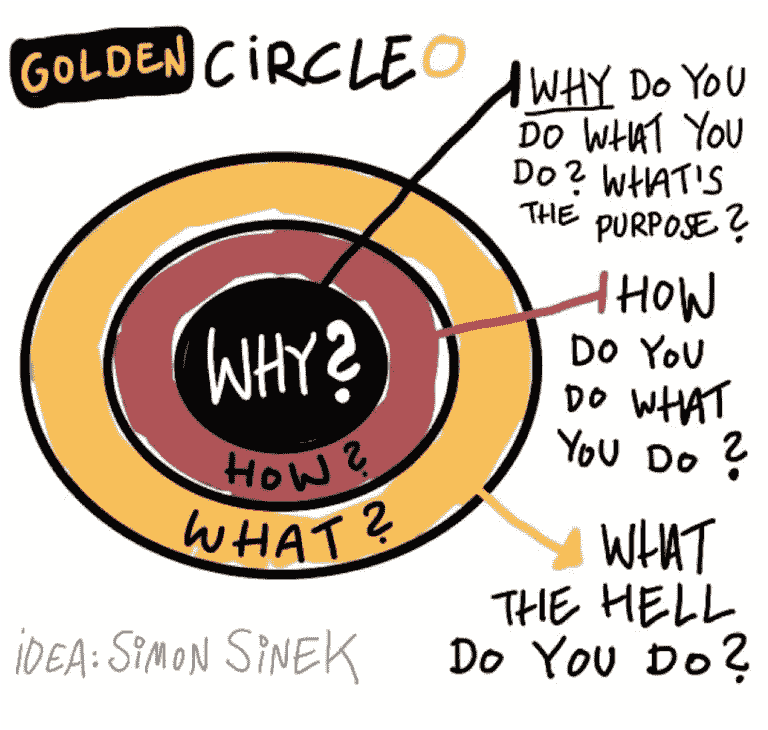
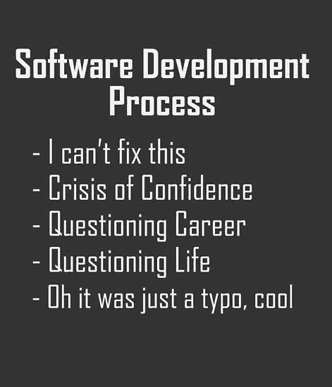

# 做还是不做(数据科学家)

> 原文：<https://towardsdatascience.com/to-be-or-not-to-be-a-data-scientist-13684ba7422?source=collection_archive---------5----------------------->

每次我试图想出一个合适的新标题时，快速的谷歌搜索都会让我意识到这个话题已经被讨论过很多次了，而且大多数相关的标题都被取了出来。我觉得标题有意义比独特更重要，于是就选了上面的这个。请不要评判我。

仍然值得讨论这个问题的原因是缺乏对转行、学习新技能和适应不断变化的生活的挑战部分的覆盖。在这篇文章中，我不会列出“成为数据科学家的 10 大资源”，但我会告诉你我从一名具有基本编程知识的机械工程师到一名从事深度学习的数据科学家的旅程。

**从为什么开始**

前阵子，我读了西蒙·西内克的书《从为什么开始》。这是我决心改变职业生涯的开始，它让我努力思考做我喜欢的事情。

图片来自 FramingTheDialogue.com 的[。](http://www.framingthedialogue.com/archives/start-with-why/)

如果你有时间，可以看看[西蒙的 Ted 演讲](https://www.ted.com/talks/simon_sinek_how_great_leaders_inspire_action)，然后回来。如果你没有时间，直接跳过——这不是强制性的。

**如何通过做自己喜欢的事情获得报酬**

每天醒来兴奋地去工作，去解决有挑战性和有意义的问题——这是我的目标，这是我的原因。有了“为什么”,我就开始讨论“如何”和“什么”。事实证明，找出原因是一个相对简单的过程，从一些个人反思开始。相反，弄清楚如何做和做什么是一个更困难的过程，而不是一条直线。

当时我在石油和天然气行业工作，在上游石油和天然气行业担任项目经理，前途无量。我甚至还在攻读石油工程的硕士学位。虽然这很有趣，但我没有跳下床去上班。可以肯定的是，这份工作有许多积极的方面，我很喜欢。在项目团队中工作是一种独特的体验，需要建立有意义的关系，作为一个非常注重结果的人，我在建设实体项目中找到了乐趣。不幸的是，我没有找到我想要的智力挑战。

我决定只要有机会，我就会追随我的兴趣。当时，数据科学并不像今天这样普遍，但我知道数据是有价值的，这个领域正在快速发展。另外，我喜欢和它一起工作。

我发现自己在偏远的澳大利亚中部工作，一周工作两个星期，突然有了额外的时间。晚上，在每天工作 12 个小时管理项目后，我会抓紧时间吃晚饭，呆在房间里，然后编程。在两周的休假期间，我将继续开发股票市场交易工具(当时我已经参与了几年)，并开始掌握 web 抓取、结构化和非结构化数据的数据挖掘、数据清理、数据可视化和应用程序开发。

我当时并不知道，但这是成为一名数据科学家的核心部分——数据处理技能。除了在股票市场上赚几个钱之外，没有一件事是有目的的；我只是追求个人兴趣。在花了几年时间为澳大利亚市场进行交易、分析和开发工具后，我开始写一个金融专栏。有一段时间，我和妻子环游世界一年。这种情况一直持续到我去德国攻读双学位(机器人学硕士和 MBA)。大约在同一时间，我也开始“正式”自学数据科学。

这有助于我在攻读工程学位期间学习微积分、线性代数和微分方程。我有一些 C++和 Matlab 的经验，但我不能称自己为程序员。我还认为，成为一名数据科学家所需的原始数学技能并不复杂。Khan Academy 上的几本入门，YouTube 上的几个视频，就足以让你变得危险。

我的学业继续着，有点痴迷。我会在早上起床，学习 2-3 个小时，然后去上学。有了双学位，我打算为转行打下坚实的基础。它带有奖学金；这是著名的德国工程界，这是显而易见的。同时，我可以兼职学习数据科学。

原来我讨厌回到学校。结构、不灵活以及缺乏任何与数据科学相关的东西困扰着我。老实说，我从来都不是结构化学习的狂热爱好者，并且很享受在数据科学世界中记录我的冒险经历。我对这所大学或学生没有任何不满；这不是我想做的。我在学校学的是有限元分析和材料工程，我想做的就是回去研究机器学习。这是一个迷人的主题，其可能性令人难以置信。

回想起 Sinek 先生的话和我开始这段旅程的“为什么”,我觉得学校不会把我带到那里。当然，这将导致一个有趣的职业生涯，但我就是不喜欢它。和妻子聊了几个晚上后，我退出了这两个项目，开始了一份数据分析师的工作。这是获得数据工作报酬的第一步，我会在晚上继续学习机器学习。

几个月过去了，我学习得更多了。我所有的业余时间都花在了学习、编码、学习上。我学习了 Spark、Python，研究了大多数传统的机器学习方法，学会了理解神经网络的所有细节，并开始构建自己的项目。我和妻子搬到了保加利亚，我将在那里开办一家咨询公司，我继续研究深度学习。我身后有两股激励的风。

1.  如果我想和最有趣的人一起工作，解决令人兴奋的问题，我需要站在这个领域的最前沿。
2.  我每天早上起来都兴奋地想在我选择的领域里学到新的东西。

事后看来，坚持下去并不困难。我被一种兴趣和一种偏执驱使着。总是认为我知道的不够多，我继续学习。另外，我玩得很开心，所以感觉不像工作。

最终，我从书本中站起来，发现自己作为一名数据科学家已经相当精通。从第一天开始编程到现在已经四年了。我的工作让我能够从事前沿的深度学习模型。我们实施上个月可能已经出来的新模型设计，并开始产生新的独特想法。

**关于从为什么开始的几点注意事项**

我想在此稍作停顿，澄清我的原因、方式和内容:

*   **为什么**——我想每天醒来都兴奋地去工作，这样我的生活会更充实。
*   **如何**——在令我着迷的领域找到一份职业，与有动力和兴趣的人一起应对有趣的挑战，并在该领域的前沿工作。
*   什么？我碰巧是一名数据科学家

数据科学从来都不是目标。如果你决定成为一名数据科学家开始你的旅程，你可能会成为一名优秀的数据科学家。你也可能会发现你讨厌它。你愿意花两周时间清理十个来源的数据，再花一周时间进行特性工程，然后测试你的模型，发现它毫无价值吗？

你愿意理解螺母和螺栓——数学，概念，优化是如何工作的？当你的朋友去酒吧，在他们高薪的工程职业生涯中前进的时候，你会花时间在清晨和深夜学习吗？如果不是，那么数据科学(可能)不适合你。我说可能是因为总有例外。我试着为自己设定高标准，这可能不一定适用于其他人，所以对此要有所保留。

**战斗当前**

作为一个领域，数据科学正在快速变化。你越深入，就越难跟上。你需要致力于学习和研究，仍然愿意回到那些首要原则，与数据搏斗。你需要一系列令人眼花缭乱的技术、分析和个人技能。你停止学习的那一天，就是你开始落伍的那一天。想象一下，如果你不喜欢你正在做的事情，那会有多累。

**精英管理**

到目前为止，数据科学更多的是基于精英而不是证书。它向许多不同的人开放了这个领域，吸引了比其他领域更喜欢它的人。随着大学开始向人们收取正式学位的费用，数据科学的这一方面正在逐渐衰落——这并不是说这本身有什么问题，而是它将人们吸引到了一个否则他们不会花时间的领域。在数据科学这样的领域，如果你不热爱它，就很难跟上。没有动力，你会发现自己很快就会落后。

**数据科学既艰难又令人沮丧**

Via ForeverStudent.com

作为一名数据科学家，就像作为一名软件工程师一样，可能会非常令人沮丧、困难，并且需要大量的时间投入，但这是非常值得的。话虽如此，它可能不会满足你的为什么。对大多数人来说，肯定不是。我恳求你从为什么而不是什么开始。追随你的兴趣，因为这些兴趣也包含机会。可能不是数据科学(统计学上也不是)，但如果你专心致志，你会有所发现。每天都要学习，把精力集中在机会所在的地方。如果你这样做了，你会得到一份令人兴奋的职业，让你的生活变得更有意义。

我相信正确的方法可以让任何人爱上他们的职业。如果我的妻子正在阅读——对不起，但是你将不得不分享。