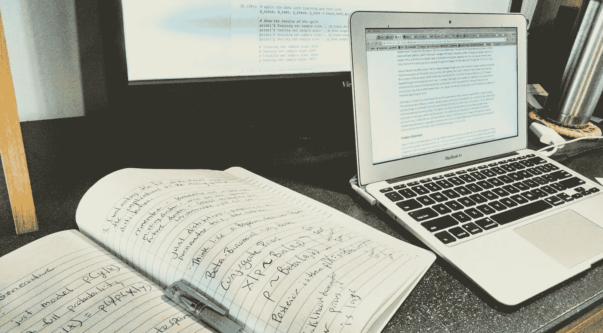

# 要更好的学习数据科学，用科学！

> 原文：<https://towardsdatascience.com/to-learn-data-science-better-use-science-ffaae3d56bea?source=collection_archive---------5----------------------->

Learning Data Science? Make the most of your learning by using evidence-based methods! Students who take notes by hand perform better on conceptual assessments.

如果你正在学习一项新技能，想想你是如何学习的。

我的计划是再也不做学生了。我喜欢学习。我喜欢学习的过程，作为一名教师和科学家，我不断地参与这个过程。我以为我已经不再扮演学生的角色了。我错了。我回来了。然而，这一次，我在用一种新的方式思考我的学习过程——用一种科学的方式。

## *拥抱学习的科学*

人们花了很多精力去理解我们是如何学习的。我发现，在学习数据科学时，牢记循证学习方法有助于我用 Python 编码、构建机器学习算法，以及成为学员而不是导师。以下三个想法帮助我保持专注和乐观。

## **(1)成长心态:**

今年，我的孩子们从三年级回家，带着指引他们成长心态的讲义。他们的教室里有专门介绍这个概念的公告板，他们被教导说，固定的心态就是当你认为你的智力、技能和天赋是固定的，不会改变。相反，有一个成长的心态意味着相信特质可以发展和改变(Dweck 2006)。通过工作、研究和学习，一个人的智力、技能和才能可以得到发展。有很多关于如何在学校应用成长思维的方法，对于个人，甚至对于组织。我的孩子被教导说，发展成长思维就像说“我还不擅长长除法”一样简单。

如果你正在尝试一些新的东西，或者如果你休学了一段时间，现在又回来了，或者如果你正在一个非传统的轨道上进入一个分析领域…你可能已经有了一个成长的心态。如果你已经有了一个成长的心态，并且正在学习新的技能，我说抓住这个概念，拥抱它，培养它；它可能是帮助你攀登眼前的数据科学之山的要素之一。当我用[跳板](http://Springboard.com)完成我的数据科学项目的第一个顶点项目的初步探索性数据分析阶段时，我引导我内心的三年级学生，并提醒自己“我还没有运行我的第一个机器学习算法。”

## **(2)主动学习:**

简单来说，[主动学习](https://en.wikipedia.org/wiki/Active_learning)就是边做边学。在大学 STEM(科学、技术、工程&数学)课程中，主动学习方法改善了学生的学习( [Freeman et al. 2014](http://www.pnas.org/content/111/23/8410) )。一些教育工作者有意融入主动学习技巧。如果你参加了课堂辩论，在课堂讨论中发言，在讲座中被要求与邻座“思考-分享”,设计并完成了自己的研究实验，或者在课堂上做了报告，你就是一个积极的学习者。这里的对比是被动学习或“舞台上的圣人”，在传统的学术环境中，你可能通过听讲座的被动方法接收所有内容。已经进行了大量的研究来比较主动和被动学习，包括试图确定有效教学和学习的最佳循证方法( [AAAS 2009](http://visionandchange.org/files/2011/03/VC-Brochure-V6-3.pdf) ， [Derting 等人 2016](http://advances.sciencemag.org/content/2/3/e1501422.full) )。

如果你真的想成为一名数据科学家，如果你加入了数据科学训练营，如果你通过交互式在线教程学习 Python 或 R，在这些教程中，你可以输入代码并运行它(例如，DataCamp、Mode Analytics、Codecademy)，你将通过主动学习获得技能。你可能会遇到一些纯粹被动学习的在线讲座——这很好，并不意味着你不会学到概念和想法。但是当你学习数据科学和提高你的编码和分析技能时，你将会学习这些技能，因为你正在积极地实践它们。花点时间承认每个迷你项目、深夜代码调试、黑客成功和你的顶点项目的每一部分的重要性。

## **(3)手抄笔记:**

最后一个学习概念很简单。研究表明，用笔和纸手工做笔记，可以增加你学习和记忆的信息量([穆勒&奥本海默 2014](http://journals.sagepub.com/doi/abs/10.1177/0956797614524581) )。与打字的学生相比，手写笔记的学生在概念评估中表现更好。显然，当你写下这个概念时，你与这个概念的联系比你在课堂上打笔记时更具体。当我在大学授课时，我在第一天描述这项研究，但我不要求学生手写笔记。我认为学生们可能有他们自己打笔记的原因，这是一种个人偏好。

## 结论:

现在我回到了学生座位上，我已经在几个笔记本上写满了凌乱而忙碌的笔记，关于支持向量机和 K 近邻分类器之间的关键差异，关于自然语言处理的方法，关于如何进行信息面试。我通过写下来来学习。我在边做边学。我正在学习所有关于数据科学的知识，因为我相信我可以发展新的技能。不管我课程的下一个大主题是什么:“我还没有掌握那种类型的分析”。

## **来源:**

AAAS。2009.本科生物学教育的愿景与变革:行动的呼唤。华盛顿 DC:美国科学促进协会。

德廷，T.L .，埃伯特-梅，d .，汉高，T.P .，马赫尔，J.M .，阿诺德，b .，帕斯莫尔，H.A. 2016。STEM 高等教育中教师专业发展的评估:结果的可持续性。科学进展，2(3)，e 1501422–e 1501422。【http://doi.org/10.1126/sciadv.1501422 

德韦克，卡罗尔。2006.心态:成功的新心理学。

Freeman、Eddy、S.L .、McDonough、m . Smith、M.K .、Okoroafor、n . Jordt、h .和 Wenderoth、M.P. 2014。主动学习提高了学生在科学、工程和数学方面的表现。美国国家科学院学报，111(23)，8410–8415。[http://doi.org/10.1073/pnas.1319030111](http://doi.org/10.1073/pnas.1319030111)

穆勒私人助理奥本海默医学博士。2014.钢笔比键盘更强大:手写笔记优于笔记本笔记，《心理科学》，第 25 卷，第 6 期，第 1159-1168 页。[https://doi.org/10.1177/0956797614524581](https://doi.org/10.1177/0956797614524581)