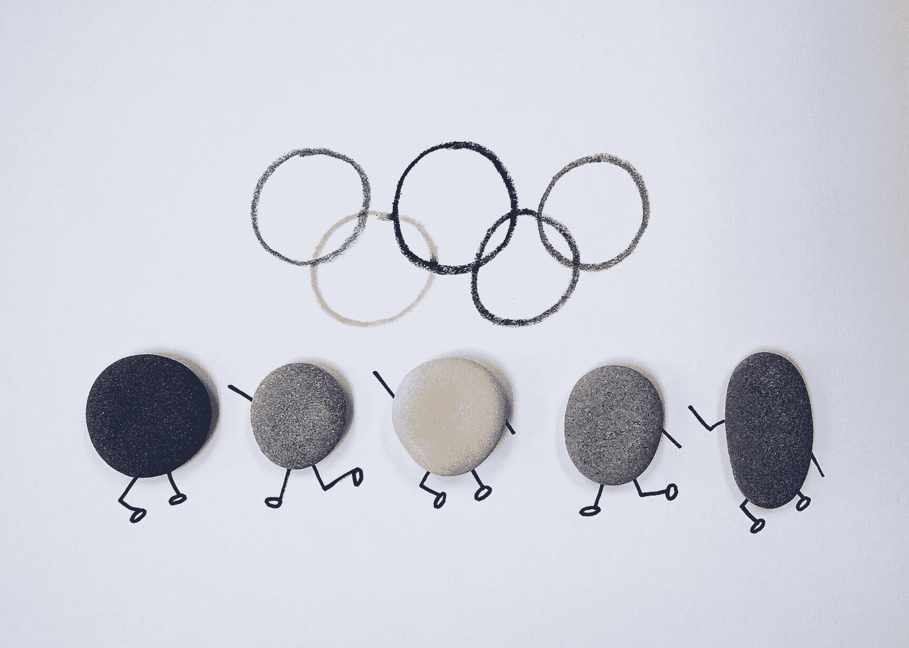
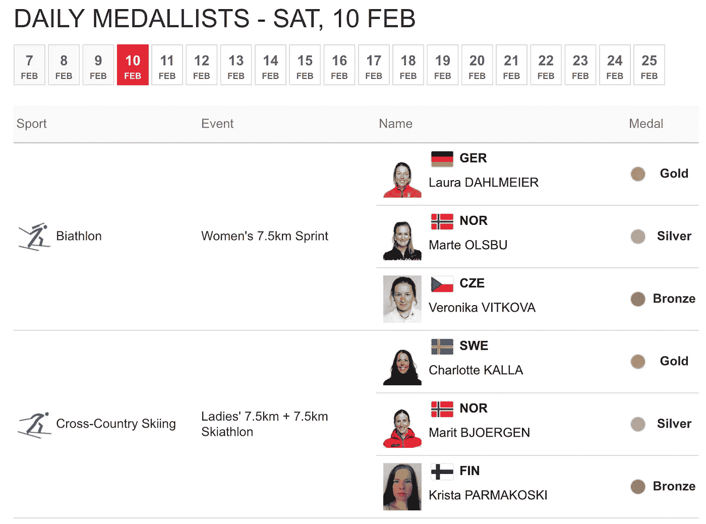
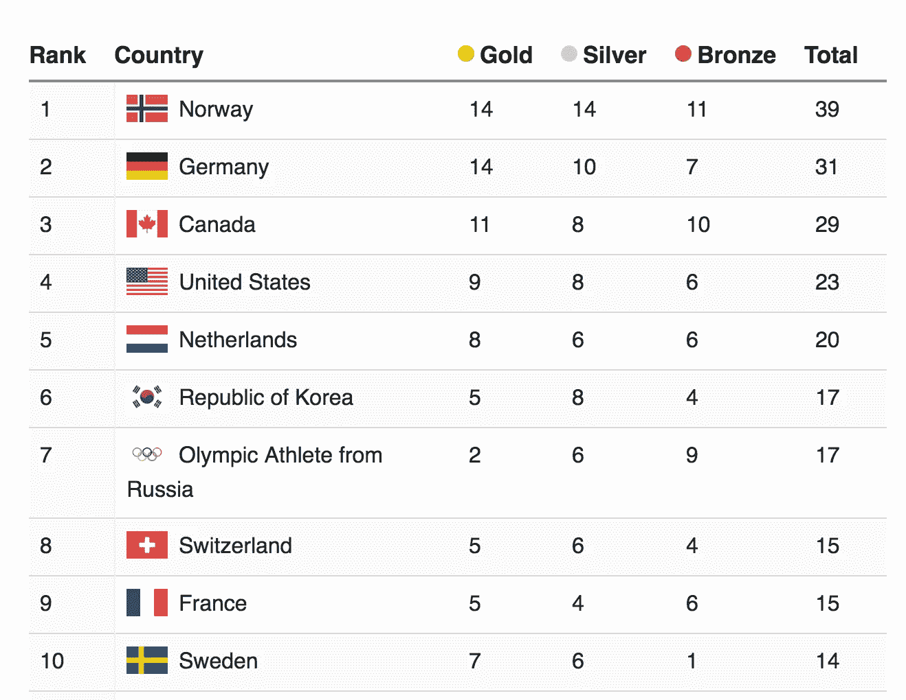
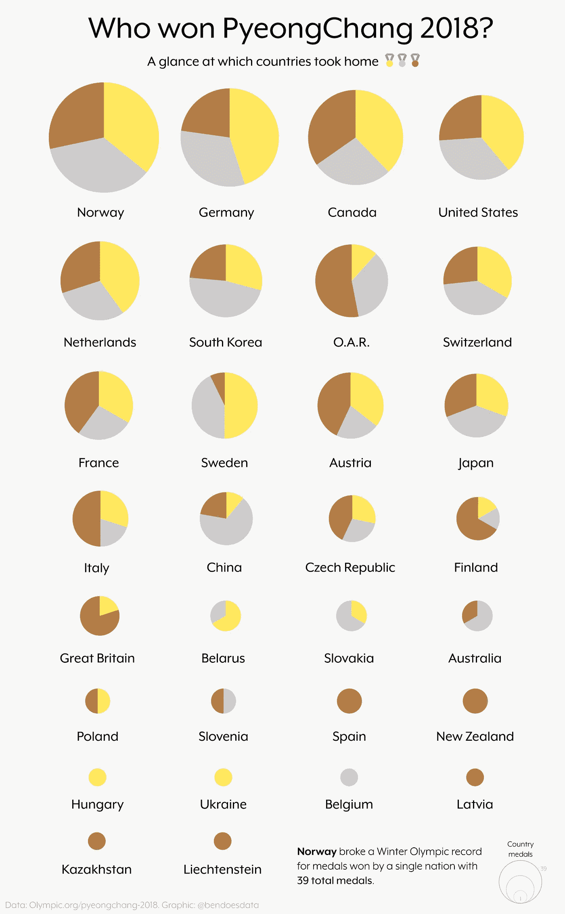
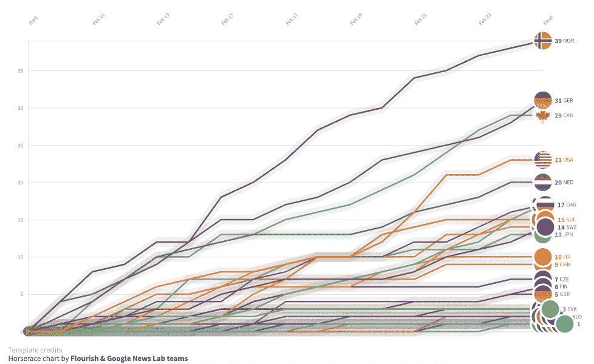

# 要理解某些东西，请将其可视化:探索 2018 年平昌冬季奥运会的奖牌结果

> 原文：<https://towardsdatascience.com/to-understand-something-visualise-it-exploring-the-medal-results-of-the-pyeongchang-winter-9cfab4bf0c21?source=collection_archive---------7----------------------->

我不太喜欢运动。但每隔两年，我突然发现自己对世界上最伟大的运动员的体育统计数据和比赛结果着迷了。奥运会激发了我潜在的体育爱好者，在这辉煌的两周里，我对体育运动百无聊赖。

今年，单调乏味的生活打破了我对冬季奥运会的兴趣。因此，当奥运会于 2 月 25 日结束时，我发现自己非常不了解各国在整个奥运会期间的表现。

很自然地，我浏览了标题，寻找谁赢得了什么的亮点。很快，奖牌榜就填满了我的浏览器窗口。

奥运会官方网站信息量很大，给了我每天的奖牌获得者，这太棒了。

但这并没有真正给我一个我一直在寻找的广泛的概览，所以我继续寻找。

[时间](https://www.olympic.org/pyeongchang-2018/results/en/general/daily-medallists-date=2018-02-10.htm)以熟悉的格式提供了标准的最终奖牌数，所以越来越近了。但我仍然觉得我错过了过去两周发生的很多事情。

我一直在寻找一些更微妙的东西，最终导致[这个来自彭博的奖牌追踪器](https://www.bloomberg.com/graphics/2018-pyeongchang-olympics-medal-counter/?utm_content=graphics&utm_campaign=socialflow-organic&utm_source=twitter&utm_medium=social&cmpid%3D=socialflow-twitter-graphics)。通过将奖牌与国家 GDP 和人口等有趣的变量结合起来，这一项脱颖而出。我喜欢能够在奖牌榜旁边的表格中看到这种情况。

但即便如此，我还是有疑问:是不是有一个国家自始至终主宰着奥运会？就奖牌数而言，有没有最后一分钟的逆转？顶级国家之间的奖牌分布有什么不同？

这些都是旧数据表无法回答的问题。

# 要理解某事，想象它

今年的冬奥会有很多精彩的视觉报道(特别是: [NYT](https://www.nytimes.com/news-event/winter-olympics-2018) 、[卫报](https://www.theguardian.com/sport/2018/feb/25/pyeongchang-winter-olympics-2018-the-games-of-new-horizons-russia)、[彭博](https://www.bloomberg.com/winter-olympics-2018))。但是一眼看去，我很难找到任何好的奖牌结果的可视化数据。所以我开始做我自己的。

这里应该注意的是，从技术上讲，表格是数据可视化。事实上，这是赋予数字视觉结构的最古老的记录形式之一。但是有些问题不能用表格来回答(或者即使可以，与其他形式的数据可视化相比，也要花费不合理的长时间)。

所以首先:谁赢得了平昌 2018？他们赢得的金牌总数也是最多的吗？谁是失败者？

当然，一个表格可以显示这一点。但是我想要能快速直观地告诉我这些信息的东西。

# 平昌 2018 谁赢了，怎么赢的？

我首先使用[数据抓取器扩展](https://chrome.google.com/webstore/detail/data-scraper-easy-web-scr/nndknepjnldbdbepjfgmncbggmopgden)从时间的奖牌结果表中抓取数据。如果你没听说过 Data Scraper，它很牛逼(TL；dr 这是一种不用写代码就能从网上抓取数据的快捷方式)。

除了奖牌类型的分类之外，我还想看到奖牌总数的可视化结果。我最近还受到了一些更抽象的体育数据的启发，即视觉运动员制作的海报。在 Adobe Illustrator 中修修补补了一段时间后，下面是我最终得到的结果。

对我来说，一系列被想象成小倍数的饼图是有意义的。圆圈的总大小代表获得的奖牌数(也是按照信息图中从多到少的顺序排列)。颜色分类显示金、银和铜。我还认为，在页面底部加入破纪录的事实，作为挪威今年在奥运会上如何占据主导地位的一点背景，是有意义的。

话虽如此，我的一位同事指出(相当正确)，从信息设计的角度来看，这是一个有争议的选择。在不太专业的情况下，使用每个饼图的半径大小和百分比分解开始混淆视觉隐喻，打破了信息设计中的可访问性和准确性规则。出于这个目的，我认为规则有时是要被打破的。我的目标是一个更抽象的概览；更准确的图形应该包括标签和/或悬停功能，以便于访问。

Illustrator 通常不是我的首选数据工具，但我很难找到可以将多个小饼状图作为模板的工具。我也没有时间从头开始编码，所以这似乎是一个合理的(虽然有点乏味)解决方案。我回答了我的第一组问题:现在我可以以表格之外的格式看到最终结果。

# 奥运会每天的奖牌总数是如何变化的？

太好了！现在我有一个漂亮的信息图表，总结了奖牌的结果。但它并没有真正重温每天是如何颁发奖牌的。它只显示总数。冬奥会激动人心的一部分是看着个别运动员为他们的国家取得成功，以及这将如何影响这个国家的奖牌总数。

这个有点棘手。首先，尽管我知道在哪里可以找到这些数据(olympics.org ),但这绝不是人们所说的“整洁”的数据。它存在于多个页面上。

获取这些数据的聪明、有效的方法是使用 urllib、requests 和 BeautifulSoup 的某种组合编写一些 Python 来创建一个 web scraper 并下载数据进行清理。不幸的是，这一天我感觉特别顽固，只是不停地点击使用 DataScraper(比使用 Python 花费的时间要长得多)。自我提醒:有一天我会更加自律，并看到用 Python 写脚本的长期好处，以备后用。

最终，我有一个非常混乱的数据集要开始清理。经过一番争论，我整理了所有的东西，以显示每一天，哪些国家获得了奖牌(以及他们获得了什么类型的奖牌)。

我使用了一个数据透视表来计算奥运会每天颁发的奖牌总数。因为开放数据很酷，你可以查看和使用我从谷歌电子表格中整理出来的任何数据。详细信息和注释在自述文件中。

最终，我终于能够开始想象。我一直想尝试新的 data viz 工具，所以我决定这将是我的首选工具。此外，他们有一个可视化选举竞赛的漂亮模板。我不会可视化选举数据，但通过对设置进行足够的修改，我能够重新标记和格式化，以匹配我的冬季奥运会数据。

我喜欢这种形式，因为它让你看到在两周内游戏是如何进行的。另外，我可以添加图像链接，包括国旗，而不是纯色泡沫。[全交互版本](https://public.flourish.studio/visualisation/24217/)允许你悬停在气泡上并重放图形。现在，这里有一个漂亮的 GIF 版本作为预览。

View the full interactive [here](https://public.flourish.studio/visualisation/24217/)

# 更大、更富有的国家更有可能获胜吗？

从历史上看，大国似乎在全球体育比赛中表现强劲。但是冬奥会也是这样吗？

这就是彭博桌开始派上用场的地方。我做了一个快速的抓取，把它放入一个电子表格中(查看这里的)。我知道，可视化这种可能的相关性的最佳图表可能是散点图/气泡图之类的东西，所以可视化的选项几乎是无限的。但是最近我发现 [DataWrapper](https://www.datawrapper.de/) 已经成为我创建易于发布的快速图表的首选资源。

来自彭博的简单表格给了我一个问题的提示:美国排在第四位，但是像中国和英国这样的大城市不在前十位。但同样，可视化数据让一切变得更加清晰。虽然 GDP 和人口在某些情况下可能有所帮助，但它似乎不会在很大程度上影响冬奥会的成功。(免责声明:就 GDP 而言，中国和美国是两个相对较大的异常值，这不可避免地会影响相关性。话虽如此，挪威和荷兰与其他国家相比，都处于国内生产总值的中等水平，而且都在奥运会上表现出色，因此这似乎强化了一个事实，即较小的国家实际上可以取得成功。)

[Full chart](https://datawrapper.dwcdn.net/k8hjE/3/)

# 滑雪板是兴奋剂。halfpipe 是怎么倒下的？

单板滑雪是冬奥会期间我最喜欢的项目。虽然我能够观看一些单板滑雪项目(slopestyle 很吸引人)，但我没有赶上所有的半管滑雪。这是一个大败笔。

奥运会官方成绩页面友好地提供了几乎每个项目的每次跑步的分数。所以在取下一些之后，我把它扔进了 DataWrapper，看看我能找到什么。

虽然每个滑雪者都有三次跑步，但我选择只包括前两次跑步，这样我就可以使用这个距离图。我感兴趣的是想象哪些滑雪板运动员是稳定的，哪些在压力下表现良好。不出所料，肖恩·怀特似乎是两者兼而有之。

然后，我把每个滑雪运动员按照他们的国家分组，以了解哪些国家培养出了最有天赋的滑雪运动员。将这张图表与[奥运网站](https://www.olympic.org/pyeongchang-2018/results/en/snowboard/results-men-s-halfpipe-fnl-000100-.htm)给你的视图类型进行比较。桌子不公平。

[Full chart + link to data](https://datawrapper.dwcdn.net/bjogG/2/)

# 外卖

桌子很棒。它们信息丰富、直观，是一种组织数字的通用方式。但是如果你想探索像奖牌成绩或比赛分数这样的信息，你必须将它们可视化。

我错过的冬奥会项目比我希望的要多。但以我自己有点书呆子气的方式，我觉得我可以通过钻研数据以不同的方式体验它们。

*有问题吗？评论？很酷的数据集？在下面留言或者在 Twitter 上找到我***。**