# ToneNet:音乐风格的转变

> 原文：<https://towardsdatascience.com/tonenet-a-musical-style-transfer-c0a18903c910?source=collection_archive---------2----------------------->

作者:南加州大学 Vesta 团队。

CSCI:599 深度学习及其应用

suraj Jayakumar(sjayakum @ USC . edu)、拉凯什·拉梅什(rakeshr@usc.edu)、(thalasta@usc.edu 帕拉德普·塔拉斯塔

# **简介:**

最近，生成对抗网络在视觉领域的成功，如风格转换，启发我们在音乐领域尝试这些技术。音乐一代主要钻研两个最重要的东西:作曲和演奏。作曲侧重于宋立科的积木符号、音调、音高和和弦。而演奏则侧重于演奏者如何演奏音符。这种独特性定义了音乐的风格。

# **数据集和预处理:**

我们有大约 200 首钢琴专用歌曲(MIDI 文件),分类为爵士乐和古典音乐，训练数据的平均长度约为 4 分钟。

首先，我们量化每一个 MIDI 文件，以符合特定的时间间隔，从而消除表演者的不精确性。其次，我们将输入的 MIDI 文件编码到一个 T ×P 矩阵中，其中 T 是歌曲中的时间步长数，P 是乐器中的音高数(例如，对于有 88 个键的钢琴，我们有 88 个音高)。此外，在矩阵的每个值中，我们使用 2-D 向量对关于音符的信息进行编码，即，[1-1]音符发音，[0-1]音符持续而[0-0]音符关闭。

类似地，我们生成 T ×P 形状的输出矩阵，但这里我们对歌曲的力度进行编码，即播放的下一个键的音量(1-127 ),而不是音符信息。

数据集链接:[钢琴数据集](http://imanmalik.com/assets/dataset/TPD.zip)【注:钢琴数据集配有 [CC-BY 4.0 许可证](https://creativecommons.org/licenses/by/4.0/)。如果使用这个数据集，请参考这篇[论文](https://arxiv.org/abs/1708.03535) :]

数据集链接(SeqGAN) : [诺丁汉数据库](http://ifdo.ca/~seymour/nottingham/nottingham.html)

# 建筑设计

# **序列间**

序列到序列模型在过去被证明在各种领域对于风格转换非常有效，特别是在语言(机器翻译)中

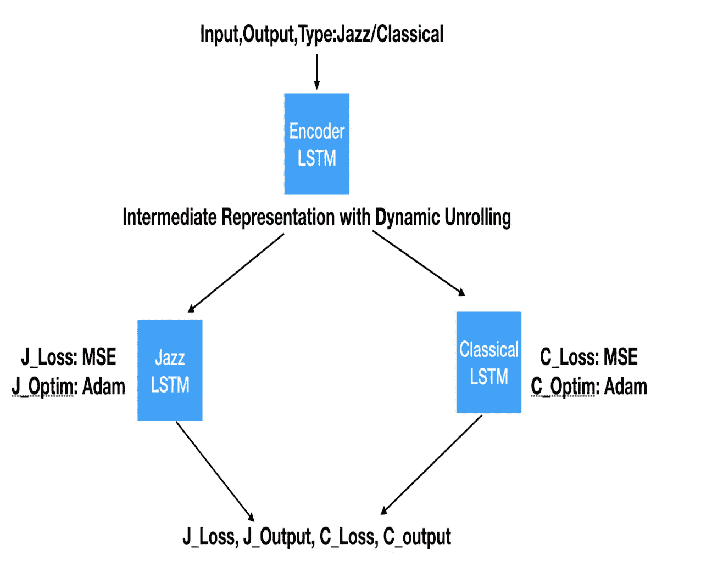

**基线— seq2seq**

注意:基线架构在很大程度上借用了本文[的内容](https://arxiv.org/abs/1708.03535)。请参考同。还可以查看 Iman Malik 的 StyleNet，了解更多关于基线音乐风格转换的信息

歌曲的预处理 MIDI 文件被传递到具有动态 RNN 展开的编码器 LSTM，以处理不同歌曲中的不同时间步长并保持一致性。来自编码器的中间输出被传递到对应于其风格的 LSTM，其学习音乐流派的内部动态。

输入歌曲被反馈给相反流派的 LSTM。在风格转换过程中，输出被解码回一个 MIDI 文件，该文件代表风格转换后的 MIDI 文件。

**基于注意力的 seq2seq**

这个架构被进一步调整，以利用注意力机制，这样我们就可以对歌曲中我们希望网络更加重视的部分进行加权，尤其是中间的即兴部分。

来自编码器 LSTM 的输出通过注意机制传递(Luong 的版本)。这个包装器的输出被传递到解码器单元。

注意力计算发生在每个解码器时间步骤，其中我们计算与每个上下文向量相关联的注意力权重，该权重用于计算注意力向量，该注意力向量然后最终用于计算分数。

**加工和后处理**

要进行风格转换的歌曲(比如爵士歌曲)通过编码器传递到相反的风格(古典)，我们收集输出(古典输出)并使用此信息叠加到原始歌曲上，但使用 ToneNet 生成的古典速度。

**车型评测**

为了评估 ToneNet 的整体性能，我们将一首输入样本爵士乐歌曲传递到 ToneNet 上，并获得风格转换的古典歌曲。这种输出被反馈到网络中，我们试图将输入的歌曲重新生成为爵士乐类型，并与原始歌曲进行比较。原始歌曲和再生歌曲之间的这种数值 MSE 比较将决定 ToneNet 的性能。

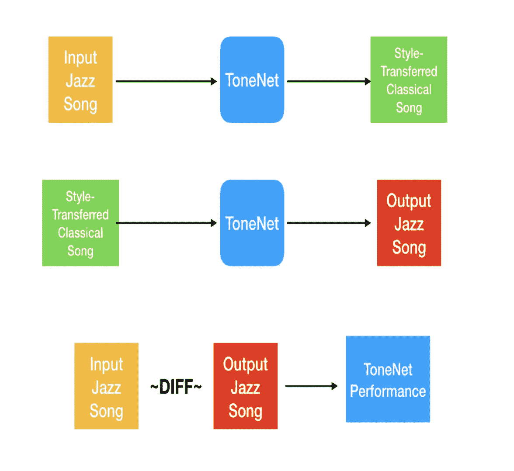

# **VAE-甘**

**架构:**

提出的架构是 VAE-甘(变分自动编码器生成对抗网络)的架构。通过将变分自动编码器与生成对抗网络相结合，我们可以在 GAN 鉴别器中使用学习到的特征表示作为 VAE 重建目标的基础。这使得训练过程明显更加稳定，因为生成器具有关于它试图生成的真实世界实体的信息，而不是在每次迭代中猜测真实世界实体应该是什么。此外，编码器学习图像到潜在空间的映射，这非常有用。

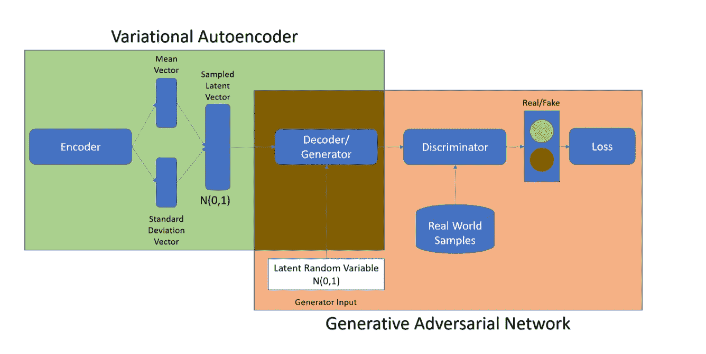

**变型自动编码器**

VAE 由两个网络组成，将数据样本 x 编码为潜在表示 z，并将潜在表示解码回数据样本。

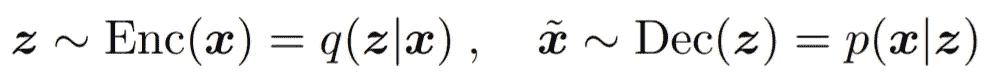

VAE 损失减去预期对数似然(重建误差)和先前正则化项的总和

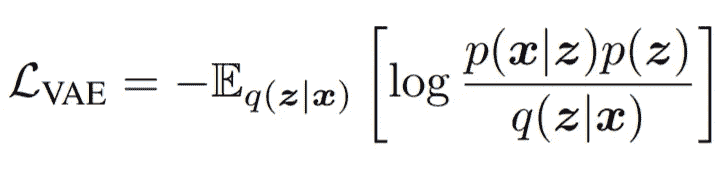

**生成对抗网络**

GAN 由两个网络组成:生成器网络 Gen(z)将潜伏期 z 映射到数据空间，而鉴别器网络分配 x 是实际训练样本的概率 y = Dis(x) ∈ [0，1]以及 x 由我们的模型通过 x = Gen(z)与 z∞p(z)生成的概率 1y。

在我们的设计中，我们用多个 88(时间步长数)X 88(音符数)图像来表示 midi 文件(钢琴轨道),其中每个像素值都是一个时间步长内给定音符的相应音量。

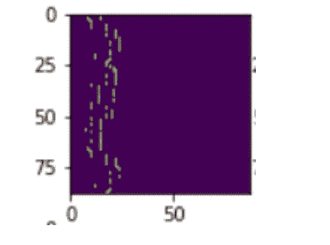

**为什么是干的？**

这是作为问题陈述的一个分支实现的，其中我们想要创建对应于不同类型的封面。这要求我们有能力从头开始创作完整的歌曲。对此的进一步扩展将是实现循环 GAN，其中该架构可以用作导致音乐风格转换的构建块。简单的 GAN 对于训练来说是不稳定的，并且我们丢失了潜在空间和生成的歌曲之间的映射。因此，我们使用 VAE 氮化镓架构。Midi 文件被转换成图像，以便更容易处理，因为基于卷积神经网络的 GAN 明显更稳定，更容易训练。

**后处理**

这里，输出包含 88×88 的图像，这些图像对应于生成的音乐的量化时间步长、音符和音量。我们需要将图像转换成相应的歌曲表示。我们正在构建一个新的 midi 文件，其量化间隔与我们在预处理过程中设置的相同，音符和音量与从生成的图像中获得的信息相对应。

**结果**

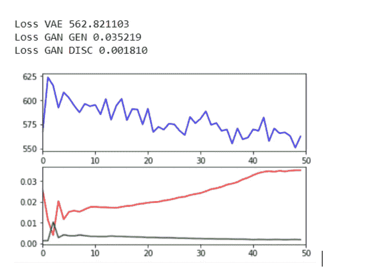

*VAE-重建*

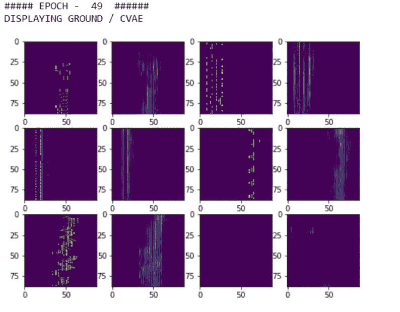

*利用噪声生成*

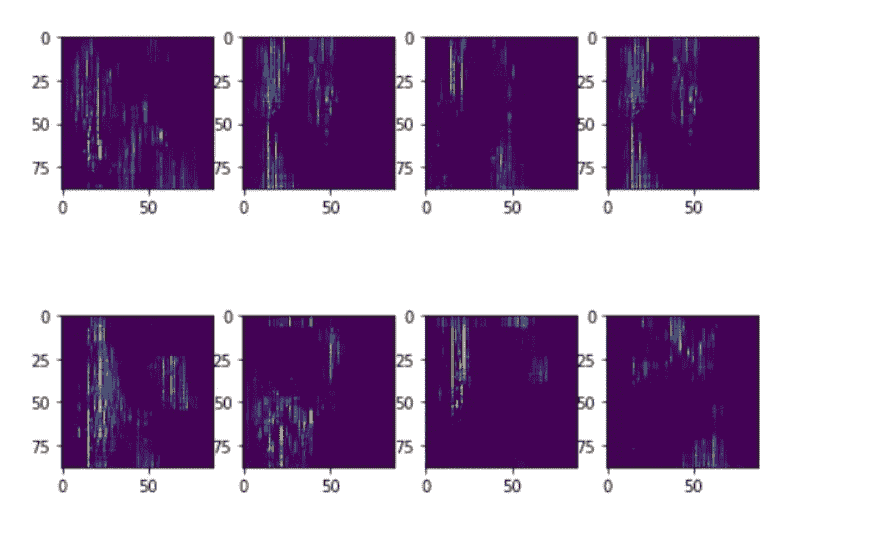

**想法**

***为什么建筑不起作用:-*** 我们认为它不起作用的原因是因为我们做了一个简单的假设，即只用时间步长、音符和音量来表达歌曲。还缺少其他关键部分，如音符开始和结束时间。由于量化，每个音符在输入中都表示为一个单独的笔画。这会给生成的音乐带来刺耳的声音。从结果可以明显看出，模型正在学习如何以相对较好的方式重建输入，并且生成的音乐在结构上与输入歌曲表示非常相似。例如，大多数音符被设定为 0 音量，平均每次有 2-3 个音符活跃，这表示正常的钢琴音乐。彼此靠近的音符通常一起演奏，重复的模式信息被采集。这表明模型运行良好，这里的错误在于世界假设，而不是用于完成这项任务的架构。

**调查结果**

VAE-GAN 明显比 GAN 更稳定。我们的许多简单的 GAN 实现导致生成器收敛到这样的模式

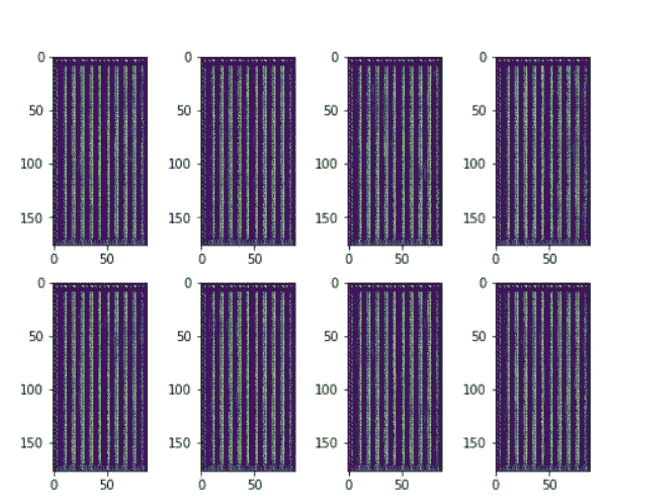

无论我们训练多少个纪元，发电机都不会改进。当使用 VAE-甘时，这种情况从未发生。

在训练模型时，动态调整学习速率非常有帮助。这是用来重新调整学习速度的确切代码。这确保了生成器和鉴别器都以稳定的速度改进，并且都不会超过对方。这里，learning_rate 是一个恒定值，它从 4e-4 开始，每个时期衰减 0.99。

> generator _ learning _ rate = max(learning _ rate，min(learning _ rate *(training _ loss _ gan _ g _ loss/training _ loss _ gan _ d _ loss)，gen_learning_rate*20))
> 
> discriminator _ learning _ rate = min(learning _ rate，learning _ rate *(training _ loss _ gan _ d _ loss/training _ loss _ gan _ g _ loss))

**未来前景**

更好的输入和输出表示，更大的潜在空间，更多的训练样本，运行更多的时期。我们仍然相信这种架构可以用于进行音乐生成，但是存在某些限制，例如关于扩展序列的信息没有被保留，不像我们使用基于 LSTM 的模型那样。把这个扩展到 CycleGAN。

# 序列-GAN

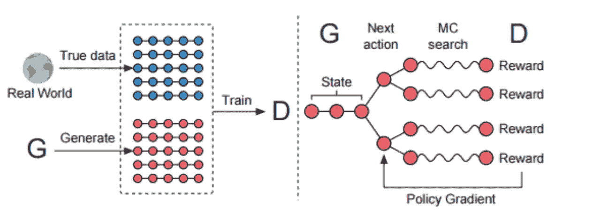

这里使用的架构是 SeqGAN。以下步骤用于实现 SeqGAN 以生成音乐:

1.  建立一个递归发电机模型，在每个时间步从其 softmax 输出中取样。
2.  将采样序列传递给递归鉴别器模型，该模型区分采样序列和真实数据序列。
3.  在标准 GAN 损耗下训练鉴频器。
4.  用一个强化(政策梯度)目标训练生成器，其中每个轨迹被分配一个单独的情节奖励:由鉴别器分配给生成序列的分数。

**生成式模型**

基于 LSTM 的 RNN 模型被用于对映射输入嵌入表示 x1，.。。序列 x1，.。。，xT 转化为隐藏状态 h1，…，hT 的序列。

> ht = g(ht1，xt)

softmax 输出层 z 将隐藏状态映射到输出令牌分布中。

> p(yt|x1，.。。，xt) = z(ht) = softmax(c + V ht)，(10)

其中参数是偏置向量 c 和权重矩阵 v

**判别模型**

我们使用基于 CNN 的鉴别器，因为 CNN 最近在更准确地分类令牌序列方面非常有效。

我们首先将输入序列 x1，…，xT 表示为:

> E[1:T] =x1 ⊕x2 ⊕…⊕xT

其中 xt ∈ Rk 是 k 维令牌嵌入，而⊕是构建矩阵 E[1:T] ∈ T×k 的串联算子。然后，核 w ∈ l×k 对 l 个令牌的窗口大小应用卷积运算，以产生新的特征图:

> ci =ρ(w⊗e[I:I+L1]+b)，

其中，⊗算子是元素乘积的总和，b 是偏差项，ρ是非线性函数。我们在鉴别器的模型中使用 relu 作为非线性函数，并且 CNN 具有以下配置步长=[1，1，1，1]，padding =“VALID”。

最后，我们在特征图上应用最大时间池操作

> c ̃=最大值{c1，…，CTL+1 }

最后，我们应用基于汇集特征映射的高速公路架构，以在完全连接层之前增强性能，其中 sigmoid 激活给出了所生成的序列是真实的概率。

*鉴别器交叉熵损失函数:*

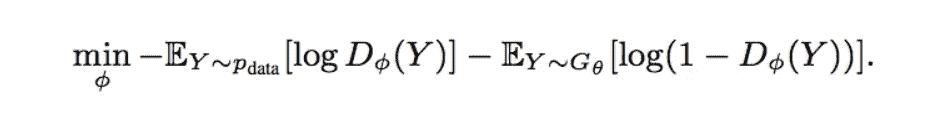

**为什么 Seq-GAN**

由于同样的原因，作为使用 VAE 干，我们尝试序列干创造相应的不同流派的封面。这要求我们有能力从头开始创作完整的歌曲。对此的进一步扩展将是实现循环 GAN，其中该架构可以用作导致音乐风格转换的构建块。简单的 GAN 对于训练来说是不稳定的，并且我们丢失了潜在空间和生成的歌曲之间的映射。因此，我们使用 Seq-GAN 架构，它可以像 RNNs 一样提供反馈。

**预处理:**

给定的音乐流被分成音符和和弦。音符按照我们用于其他模型的标准预处理进行处理

**后处理:**

生成的轨道被映射回它们各自的乐谱形式，并且 80 的恒定速度被用于再生。

**思想:**

SeqGANs 工作良好，这是因为从鉴别器到发生器中的 LSTMs 使用了反馈机制。这有助于序列生成，让它看过去生成的序列。尽管序列生成对于随机的新音乐输出工作良好，但是它不能用于控制风格转换的输出生成，因为编码器使用的潜在向量表示不能按照我们的输入音乐来指导生成。

**模型评估:**

我们使用 BLEU 作为评估度量来模拟离散钢琴键模式和连续音高数据模式的均方误差。

# 培训和设置

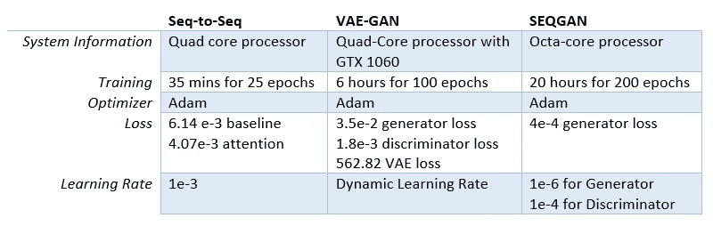

# 结果

# 序列对序列

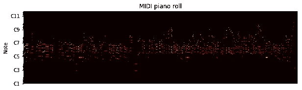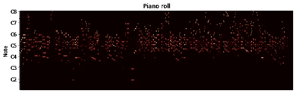

INPUT JAZZ PIANO SONG FOR TONE-NET

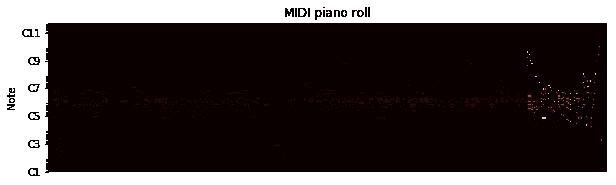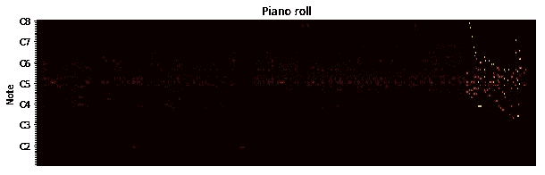

OUTPUT CLASSICAL SONG (STYLE TRANSFERED)

正如你可以很容易地认为，有一个明确的风格转换输入歌曲(爵士乐)到一个新的流派(古典)。可以观察到，网络已经理解了古典流派的动态。该网络剪切了爵士音乐的高音，使得在古典形式的输出中听起来非常流畅和愉快。

# 序列-GAN

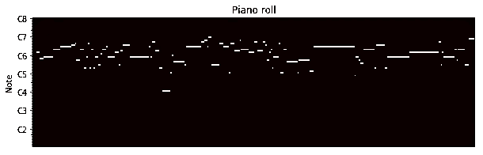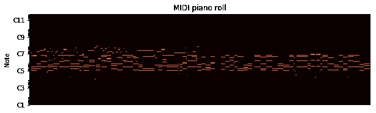

SEQUENCE-GAN OUTPUT

正如我们可以从上面的音频中发现的，对于给定的潜在输入，存在很多随机性。因此，我们必须控制这种随机性来生成音频，并在风格转换中使用 SeqGAN。

# VAE 甘

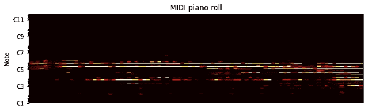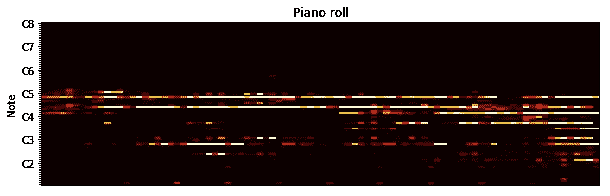

VAE-GAN SONG OUTPUT

# 参考

1.  [1] JazzML，[https://github.com/evancchow/jazzml](https://github.com/evancchow/jazzml)
2.  [2]https://github.com/jisungk/deepjazz.[deep jazz](https://github.com/jisungk/deepjazz.)
3.  [3] Magenta，Melody RNN(基于谷歌大脑的 LSTM 音乐生成)。
4.  [4] WaveNet，【https://arxiv.org/abs/1609.03499】T4(wave net:原始音频的生成模型)。
5.  [5]米迪特，[https://arxiv.org/abs/1703.10847.](https://arxiv.org/abs/1703.10847.)
6.  【6】音乐风格的神经翻译，[imanmalik.com/cs/2017/06/05/neural-style.html](http://imanmalik.com/cs/2017/06/05/neural-style.html)。
7.  [7] SeqGAN:具有策略梯度的序列生成对抗网，[https://arxiv.org/pdf/1609.05473.pdf](https://arxiv.org/pdf/1609.05473.pdf)
8.  [8]使用学习的相似性度量自动编码像素以外的内容，[https://arxiv.org/pdf/1512.09300.pdf](https://arxiv.org/pdf/1512.09300.pdf)

GITHUB 链接:[https://github.com/sjayakum/csci599-final-project](https://github.com/sjayakum/csci599-final-project)