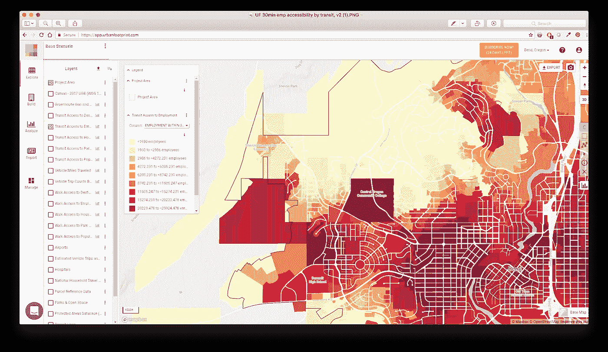
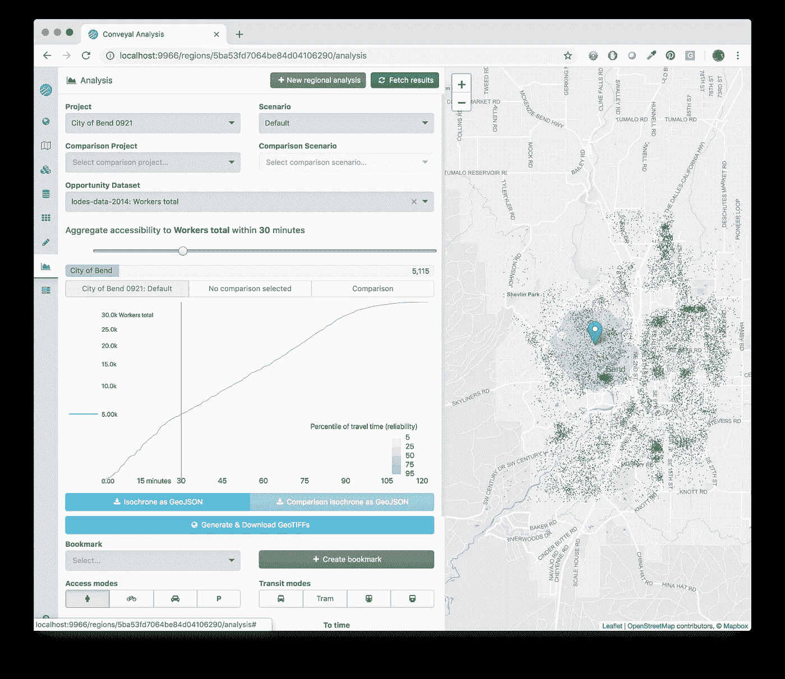
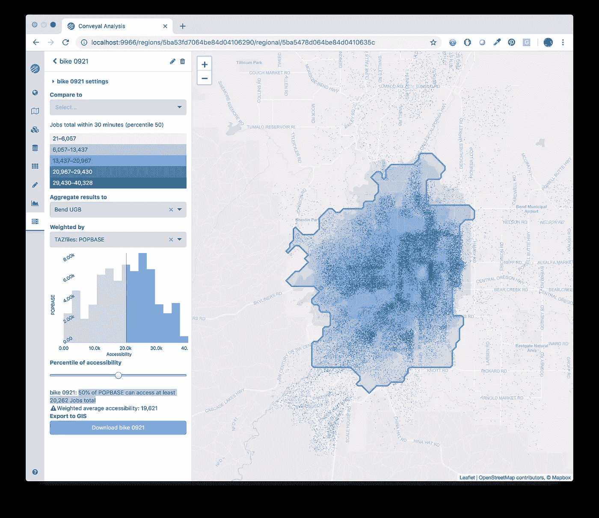
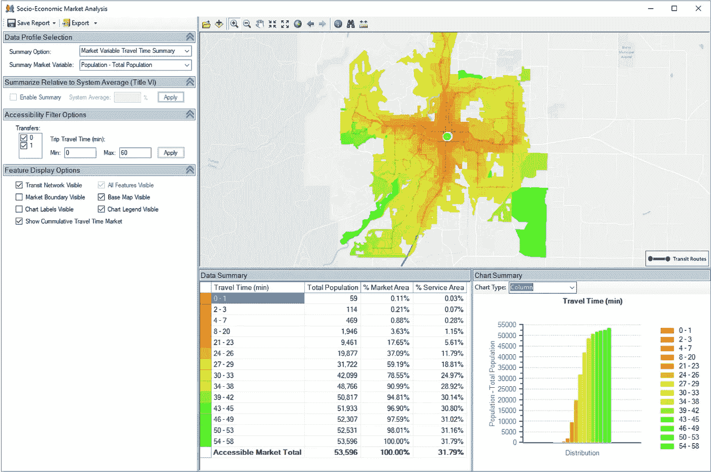
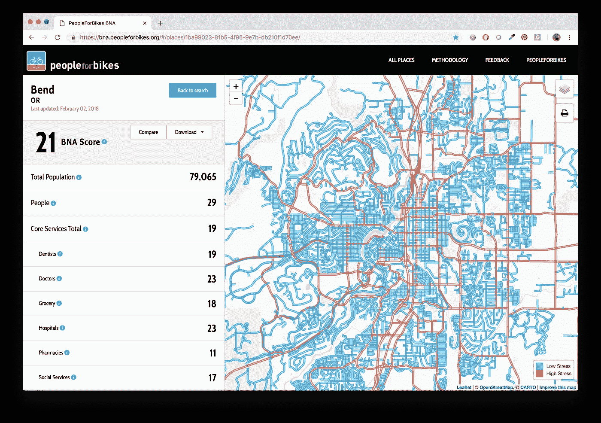

# 就业可达性分析工具综述

> 原文：<https://towardsdatascience.com/tools-for-analyzing-employment-accessibility-a-review-6f6466402224?source=collection_archive---------10----------------------->

## 我们实际上是如何进行这种分析的？

在我工作的俄勒冈州本德市，我们正处于制定 20 年交通计划的早期阶段。我们知道我们想要使用可达性指标来分析和比较未来的场景和潜在的交通项目，但是我们不确定具体如何去做。

随着这么多关于可达性映射的文章的出现，本德不可能是唯一一个环顾四周并想知道如何为自己测量的城市。这篇文章分享了我们学到的东西，希望能给其他有类似经历的城市一个好的开始。

或汽车或公共汽车或自行车。#悠悠悠悠

外面有很多闪亮的工具。当它们出现在我的电子邮件订阅源中时，看起来都很棒(我肯定它们都有好看的网站)，但是什么方法才真正符合我们的需求呢？尤其是对于像西雅图或纽约这样没有大都市资源的小城市来说。我调查了几种不同的工具和工作流程，看看它们是如何工作的，以及对 Bend 有什么意义。

从用户的角度来看，以下是我对以下内容的评论:

*   城市足迹
*   运输分析
*   t 测试
*   自行车网络分析，由[人供自行车](https://bna.peopleforbikes.org/)
*   锤子方法:QGIS 和 Postgres
*   Python 的乐趣:OSMnx(即将推出)
*   更贵的锤法:ArcGIS(即将推出？)

其中一些是开箱即用的解决方案，不需要 GIS 技能。其他的是原始代码或者需要一些使用来自 [OpenStreetMap](https://www.openstreetmap.org/about) 的数据的经验，OpenStreetMap 是一个免费的、可编辑的、主要由用户贡献的地图。我注意到了所需的技能。我相信还有其他方法——使用评论部分添加一个链接到用户友好的解释或写一个简短的广告。

# 要求

我在模拟 2040 年的交通场景。我们的目标是使用就业可及性来比较交通基础设施和服务中不同投资的影响，能够回答如下问题:*“如果有新的道路、新的自行车设施和缩短发车间隔的公交线路，我们未来的人口获得未来工作的难易程度如何？”*。这意味着我需要一个可以接受大量自定义数据输入的工具(但是这篇文章应该是相关的，即使你没有这些需求)。

我想要一个能够回答以下问题“是”的工具:

*   **它能模拟多种模式吗？**
    我想计算行人、自行车、汽车和公共交通可达性的单独指标。
*   我能输入自定义的人口和就业数据吗？
    我正在为 2040 年的未来状态建模，所以我不想使用当前的人口普查数据。如果这些输入不必针对特定地理区域进行汇总/分解，则加分(例如，我希望能够向其提供我所获得的最佳数据，无论是在税收地段、人口普查区块还是 TAZ 级别)
*   **我可以输入定制运输信息吗？**
    我希望能够模拟新的道路，特别是自行车/ped 链接，以及对运输路线和头道的修改。对于自行车，我想限制网络，这样我就只在交通压力低的连接上安排人们的路线(LTS)。对于行人，我们有一个不完整的人行道网络，所以我想限制网络，这样我们就不会在没有人行道的繁忙道路上安排行人。

额外的奖励点是那些易于使用、便宜或免费、运行速度快、支持友好的工具。

# [城市足迹](https://urbanfootprint.com/#interactive-scenario-building)

**它是什么:**[SIM-city](https://www.fastcompany.com/40548501/this-simcity-like-tool-lets-urban-planners-see-the-potential-impact-of-their-ideas)——像规划软件一样运行土地使用方案，计算可达性，并使规划者能够回答“如果……会怎样”的问题，而不必向顾问支付大笔费用并等待其他人运行模型。自由！

30-min accessibility by transit, Bend. The menu bar illustrates all the things this can do, and also the fact that it can be a bit clicky

**运作方式:** Urban Footprint 收取年费。这相当实惠(大约 6k 美元/年),对于你所得到的成本来说，低得惊人。我不知道这些家伙是怎么赚钱的，tbh。如果你把数据贡献给城市足迹，费用会更低。你还需要为佛罗里达大学的工作人员支付一次性费用，让他们准备好你的“画布”,这样它就能与准确的土地利用数据保持同步。或者你可以直接用他们的底图数据，不用付定制费。Bend 正在经历一场增长热潮，因此这幅画布对我们来说似乎并不完全准确；我们本想对它进行定制，以适应大量的新开发。您的里程可能会有所不同。

**书呆子因子:**零。对于没有 GIS 背景的人来说，这是直观和用户友好的。对于那些希望能够查看、共享和摆弄数据分析而不需要专业软件的员工来说，这将是一个很好的工具。支持团队友好且乐于助人。准备输入数据发送到 UF 的人需要一些 GIS 经验。

**它的优点:**我觉得这是一个非常强大的工具，在一个平台上结合了土地利用和交通分析。这里有大量不同的特性和功能。用友目前可以计算行人、公交和汽车的可达性。除了就业可达性，它还可以计算到学校和公园等其他目的地的可达性。有 30 天的演示可以加分，这样你就可以看看它是否符合你的需要。

**它没有做的事情(目前):**用友的用户界面目前不能运行自定义路网*的场景。它使用当前的 OpenStreetMap (OSM)道路数据和公共可用的交通数据(以 [GTFS](https://transitfeeds.com/) 格式)。我无法定制这些输入，以便输入我自己的道路数据或将自行车分析限制在低压力设施上。开发团队告诉我们，通过一些定制($？)，这些功能将来可能会提供。如果您只是运行当前道路网的方案，应该没问题，但您应该确保您所在区域的 OSM 数据看起来完整。在这一页的底部有注释。

用友的界面有点点击，但我很乐意接受，以换取一堆功能。

*在幕后，有大量的附加功能，它们只是没有出现在用户界面中(还没有？).本演示文稿提供了更多信息。

**其他评论:**我们对数据定制过程有些琐碎的担忧。从法律上讲，我们不能将我们最详细的就业数据交给第三方，所以我们需要在发送数据之前汇总这些数据。路由引擎让行人跳过一个狭窄的峡谷，并在城镇的一部分涉水而过，但这种类型的问题只发生在非常特殊的地理环境下，并且对于许多路由引擎来说是常见的；这似乎是更详细分析的一个缺点。我们可以只手动调整输出数据中的结果。

**总体来说:**我真的很喜欢这个。它没有满足我们对这个特定项目的需求，因为我们需要如此多的定制基础设施输入，但它对其他应用程序可能非常有用。

# [输送分析](https://www.conveyal.com/analysis/)

**是什么**:优雅的软件工具，旨在帮助规划者使用无障碍指标评估公共交通系统的变化。

Point-based accessibility: Drag-and-drop interface, easy to select the mode choice, nice results window

Regional accessibility results: Intuitive, interactive interface. (This is preliminary test data so don’t get too excited, fellow Bendites.)

**工作原理:**convetal 在该工具的托管版本中设置您的数据，并指导您如何使用它。联系他们定价(我没有，所以不能在里面称重)。

**书呆子因素:**使用该工具的托管版本，书呆子因素为零:非常直观，不需要特殊知识或经验。我没有在网络浏览器中登录这个工具的托管版本，而是在我的笔记本电脑上使用 Conveyal 发布的开源软件代码安装了整个系统，所以书呆子因素非常高。我建议采用前门方式。使用此工具后，如果您想要分析自定义道路网络，则需要一些使用 OSM 数据和 GIS 的经验。

**它做得好:**这是为了模拟公共交通的变化而设计的，天哪，它做得真好。分析采用 GTFS 公交数据，并使用它来可视化您的本地路线；该界面允许您与它们进行交互，以修改您的网络。真的很优雅。此外，分析允许您输入自己的道路网络数据(以 OpenStreetMap 的 PBF 格式)，这意味着我可以输入未来的交通网络来模拟未来的道路或限制自行车使用低压力设施。准备这些数据输入需要一些时间和精力。输入自定义的未来土地使用和人口数据非常简单，它将为您获取 2014 年的人口普查数据。计算运行得非常非常快。

这个工具还为我提供了各种输出:等时线、网格文件、图表和总体指标(例如，在 X 分钟内，Y%的 Bend 居民可以完成#####个工作)。它不仅仅返回我要求的结果，它还包括滑块，这样我就可以上下调整 X 或 Y。结果可以作为栅格下载。

**它没有做什么(目前):**这是一个比用友更专业的工具，所以它不是一个寻找通用土地使用和交通分析工具的地方(对我来说很好——那不是我现在正在寻找的)。我不确定如何计算公园或医院等土地使用地块的使用权，但我打赌这是 Conveyal 可以讨论的事情。有一些工作正在进行中，以适应这种分析低应力自行车设施，但这还不可用。

**其他评论:**convetal 有[篇很棒的博客文章](https://blog.conveyal.com/)总结了他们关于可访问性的想法。准备输入数据让我想到将 OSM 数据与城市形状文件融合在一起有多难，以及对此工具的需求。

**总的来说:**这是我最终使用的——它完成了工作，比开发我们自己的分析方法更快更容易。这对运输机构来说尤其有利(毕竟这是它的设计初衷)。

# [t 测试](https://tbest.org/)

**什么是** : TBEST(公交登机估计和模拟工具)是一种基于 ArcGIS 的交通工具，目前由俄勒冈州交通部开发。TBEST 具有许多详细的公共交通分析功能，它可以分析公共交通的可达性。

TBEST interface and Bend example

**工作原理:**该软件可以下载(免费)并与 ArcGIS 配合使用。它使用用户提供的输入道路网络、人口统计信息和 GTFS 数据。

**书呆子因素:**低，假设对 ArcGIS 有些熟悉。他们的网站上有培训材料，详细介绍了 TBEST 的功能和使用方法。

**擅长领域:**促进交通规划，提供非常详细的分析。TBEST 可以开发和运行未来的交通场景，预测未来的乘客量，充当 GTFS 编辑器，并促进人口统计、土地使用等的分析。离公交站很近。基于路线、停靠点和时间表来评估公交沿线的可达性分析。TBEST 还可以计算更详细的指标，比如基于所需传输次数的基于点的可访问性。

其他功能:TBEST 允许集成和编辑本地社会经济数据集(例如:MPO TAZ 文件，其中包含基本和未来一年的社会经济分布、来自区域交通需求模型的数据集、地块级别的土地使用数据以及为每个地块计算的一天中的人员交通活动级别。宗地数据由宗地编辑器补充，该编辑器允许规划者修改基准年的宗地分布，以代表未来一年的发展。)g

**它没有做什么:**其他模式的可访问性。行人进出公交系统的可达性是基于距离缓冲区而不是沿着道路/行人网络进行分析的。换句话说，该工具目前会告诉您附近的*是什么，而不一定会告诉您从某个中转站*可以到达的*是什么。TBEST 中目前不支持汽车和自行车可达性分析。*

**总的来说:**这不符合我的要求，因为它没有解决所有的模式。对于希望更好地了解和模拟其过境网络和潜在未来状态的过境机构来说，这可能是一个强有力的工具。

# [自行车网络分析](https://bna.peopleforbikes.org/#/)，由人换自行车

**是什么:**对美国数百个城市道路网络的交通压力水平(LTS)进行的基于基础设施的评估。想将此作为自行车分析的一部分，但没有 LTS 的数据？这可能是一个有用的估计。这也计算了各种各样的可访问性指标*** *，但它们的准确性取决于您的 OSM 便利设施和景点数据的完整性* ***

**工作原理:**自行车爱好者利用 OSM 的数据，根据特定的 [OSM 标签](https://docs.google.com/document/d/1HuAXQUnCEcv9aLZyIDHkLTJ5ZSKfB-U4MlJSmN-1BLk/edit)来推断道路网络的交通压力水平，并将其应用于美国各地的城市。分析是由 [Toole](https://tooledesign.com/) 和 [Azavea](http://www.azavea.com) 完成的，他们对[记录他们的方法学](https://bna.peopleforbikes.org/#/methodology)的检查结果感到惊讶，他们还公布了他们的权重和源代码。如果你更喜欢视频/音频，这里有一个关于他们流程的会议讨论。

你可以从网站下载计算的 LTS 网络。

Bicycle Network Analysis for Bend

**它的作用:**如果你很幸运，你所在的城市在列表中，你可以导出自行车网络数据以供使用。它还计算了一大堆可访问性指标，但是请阅读下面的注意事项。

**它没有做什么:**可达性指标基于 OSM 目前的便利设施等。对于像本德这样的城市来说，它并没有绘制出所有的便利设施，这可能会产生误导。对于一个已经绘制了详细地图的城市来说，这可以为您节省大量时间并为您进行计算。快乐中介:使用网络，对照你自己的工作/娱乐数据来运行。

总的来说: Bend 从以前的咨询合同和员工输入中获得了自己的、特定于城市的 LTS 数据。我们没有使用这个，但是它可能对其他人有价值。

# 锤子方法(QGIS 和 Postgres)

**它是什么:**一种使用免费工具的黑客方法，不需要特殊的用户界面、供应商费用或任何涉及合同的东西。这将使用与上述专用工具相同的方法——计算基于点的可达性，迭代“分析区域”网格，按人口对结果进行加权。区别？你可以自己完成计算的每一步，然后等待它运行一段时间。

**工作原理:** [克里斯·科勒](https://twitter.com/Chriskohler8)写了这篇 [QGIS 星球客座博文](https://twitter.com/Chriskohler8)。它得到了安妮塔·格拉泽(QGIS 的守护神)的祝福，所以看起来是一个很好的开始。这将生成行驶时间等时线，并可适用于自行车和 ped 应用。这需要在分析网格上运行，并按人口进行加权，以便计算 X%人口的就业可达性。

**书呆子因子:**非常高。这需要 GIS 知识和使用开源软件包的经验——这不仅仅是运行 QGIS 的问题，还需要处理 Postgres 和命令行工具。

**优势:**避免专业软件和供应商合同。免费。强迫你理解分析过程。允许输入的无限定制。

**它没有做什么:**克里斯的博文没有提到公交。这是一个更难的问题，因为运输中涉及到路线、站点和时间表。我很有信心，如果你花些时间深入研究，会有某种 QGIS 插件来处理这个问题，但我不能保证。

**总体而言:**这是我们的备用方法，我真的很高兴我们不必使用它。步骤越多，出错的机会就越多……但你越能真正定制分析。你喜欢呆在一个只有电脑显示器灯光的黑暗房间里吗？厉害！这个可能是给你的(不是评判)。

# Python 的乐趣: [OSMnx](https://github.com/gboeing/osmnx) (更多内容将陆续推出)

这个工具值得一提，它看起来真的很有用，但是我还没有时间去测试。

**工作原理:**这是一个基于 python 的工具，有很好的文档。它可以用于可访问性分析和许多其他应用程序。

**书呆子因子:**非常高。这比在 QGIS 中计算等时线更直接/自动化。但是它有一堆依赖关系。可能花更多的时间做准备，花更少的时间做分析。

擅长领域:避开专业软件和供应商合同。免费。强迫你理解分析过程。允许输入的无限定制。比 QGIS 方法更自动化。

**它没有做什么:**它没有解决中转问题。同样，我很有信心，如果你挖掘其他工具，会有办法解决这个问题。

总的来说:这是另一个我不必使用的备份，但这是我的一种愿望，并计划回来使用。

# 更昂贵的锤子方法:ArcGIS(更多内容即将推出)

**是什么:**如果我们使用基于 ESRI 的解决方案，我们的 it 部门会更高兴。如果你在市政府工作，那么你的 IT 部门可能也有类似的感受。网络分析功能不是 ArcGIS 许可的标准配置，由于某些原因，我们没有获得扩展模块。我们为此提交了一份内部申请。几个月后再来检查…

**警告**:我们的城市道路数据不是作为可路由网络构建的，因此可能需要额外的工作、开源工具或 OSM 数据来使该解决方案工作。

**其他评论:**OSM/开放数据社区和公共机构(比如我的)之间有时似乎有一条巨大的鸿沟，这条鸿沟实际上是在 ESRI 的道路上设置的。我了解到，无论一个工具有多好，除非它能以某种方式与 ArcGIS 兼容，否则许多机构都无法使用它。一些工具通过将结果作为栅格数据下载来实现这一点。如果在 ArcGIS 中有一种明确的使用方法(不需要命令行工具)，其他工具(如 Python 方法)会更有用。

> 注意:这些观点完全是我自己的，不代表本德市的观点。感谢 Seth Fitzsimmons 帮助我安装并运行了这些工具。