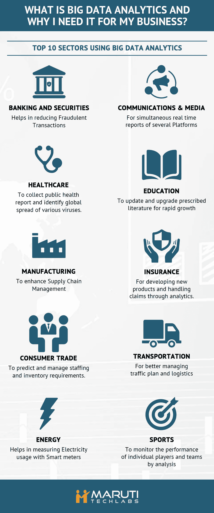

# 利用大数据分析的十大行业

> 原文：<https://towardsdatascience.com/top-10-sectors-making-use-of-big-data-analytics-be79d2301e79?source=collection_archive---------0----------------------->

大数据每天都在增长，并成为科技界一个非常流行的词。我们周围的许多人一直在谈论它，但他们知道它实际上意味着什么吗？

大数据不过是非结构化数据的集合。这些数据没有特定的格式，因此其数据集的大小通常很大，达到数十 TB，有时甚至超过数 Pb。术语“大数据”之前是使用数据库管理系统(DBMS)管理的超大型数据库(VLDBs)。

拥有如此多的业务相关数据为任何公司增加销售额或利润提供了一种非常合适的方式。但是为了做到这一点，我们需要利用大数据分析。那么[什么是大数据分析？](https://www.marutitech.com/big-data-analytics-need-business/)

[大数据分析](http://searchbusinessanalytics.techtarget.com/definition/big-data-analytics)是检查大量不同数据集(即大数据)的过程，以发现隐藏的模式、未知的相关性、市场趋势、客户偏好和其他有用信息，从而帮助组织做出更明智的业务决策。在[专业分析系统和软件](https://www.marutitech.com/big-data-analysis-structured-unstructured-data/)的推动下，大数据分析可以为各种商业利益指明方向，包括新的收入机会、更有效的营销、更好的客户服务、更高的运营效率以及超越竞争对手的竞争优势。

此外，借助 [Elasticsearch](https://www.marutitech.com/elasticsearch-big-data-analytics/) ，理解大数据变得更加容易。它用于网络搜索、日志分析和大数据分析。有许多其他工具，但 [Elasticsearch 更受欢迎](https://www.marutitech.com/elasticsearch-can-helpful-business/)，因为它易于安装，无需额外软件即可扩展到数百个节点，并且由于其内置的 REST API 而易于使用。

如果利用大数据分析，以下是受益最大的 10 大行业:

1.  **银行和证券**:通过网络活动监视器和自然语言处理器监控金融市场，减少欺诈交易。交易所委员会或交易委员会正在使用大数据分析，通过监控股票市场来确保没有非法交易发生。
2.  **通信和媒体**:在多个平台(手机、网络和电视)上同时对全球事件进行实时报道。作为媒体的一部分，音乐行业正在使用大数据来关注最新趋势，这些趋势最终被自动调谐软件用来生成朗朗上口的歌曲。
3.  **体育:**了解特定地区不同赛事的收视模式，并通过分析监控单个球员和球队的表现。板球世界杯、国际足联世界杯和温布尔登等体育赛事特别使用大数据分析。
4.  **医疗保健**:收集公共卫生数据，以便更快地应对个人健康问题，并确定埃博拉等新病毒株的全球传播。不同国家的卫生部整合了大数据分析工具，以适当利用普查和调查后收集的数据。
5.  **教育**:为各种快速发展的领域更新和升级规定的文献。世界各地的大学都在使用它来监控和跟踪学生和教师的表现，并通过出勤率来反映学生对不同科目的兴趣。
6.  **制造业**:利用大数据提升供应链管理，提高生产力。制造企业使用这些分析工具来确保以最佳方式分配生产资源，从而获得最大收益。
7.  **保险**:从开发新产品到通过预测分析处理索赔，无所不包。保险公司使用业务大数据来跟踪需求最大、收入最高的保单方案。
8.  **消费贸易**:预测和管理人员配备和库存需求。消费者贸易公司通过提供积分卡和跟踪积分卡来发展他们的贸易。
9.  **运输**:为了更好的路线规划、交通监控和管理以及物流。这主要是由政府纳入，以避免交通拥挤在一个地方。
10.  **能源**:通过引入智能电表减少漏电，帮助用户管理能源使用。负荷调度中心正在使用大数据分析来监控负荷模式，并根据不同的参数辨别能耗趋势之间的差异，并以此作为一种纳入夏令时的方式。

早期的大数据系统大多部署在内部，特别是在收集、组织和分析大量数据的大型组织中。但是云平台供应商，如亚马逊网络服务( [AWS](http://whatis.techtarget.com/definition/Amazon-Web-Services-AWS) )和微软，已经使得在云中建立和管理 Hadoop 集群变得更加容易。

慢慢地，许多公司开始转向大数据分析，以利用他们已经拥有的大量数据，但未能从中获得意义。