# 前 10 名 USAPL 原始国家总数

> 原文：<https://towardsdatascience.com/top-10-usapl-raw-national-totals-4a80ee754be1?source=collection_archive---------16----------------------->

随着 2018 年 USAPL 全国锦标赛明天开始，让我们回顾一下以前的全国比赛，看看我们现在的运动员面临着什么。随着举重运动的日益发展，新的记录不断被创造，登上领奖台的竞争空前激烈。鉴于美国队这些年在 IPF 世锦赛上的表现，特别是今年[比赛](https://www.powerlifting-ipf.com/championships/results/2018.html)的成绩，可以有把握地说美国是世界上最强的举重国家。

操纵来自 [OpenPowerlifting](https://www.openpowerlifting.org/) (使用 Python)的数据，我放大了在*全国*运动会上获得的 USAPL/IPF 原始总数( [USAPL](http://www.usapowerlifting.com/records/usapl-records-faq/) 承认以下国家记录:大学、高中、宪兵/消防、仅坐凳、仅深蹲、男子全国、女子全国和全国硕士)。我不包括阿诺德体育节的数字。

我保留除法运算，并考虑以下体重级别的男性和女性数据:

*   男子:59 公斤，66 公斤，74 公斤，83 公斤，93 公斤，105 公斤，120 公斤，120 公斤以上
*   女子:47 公斤，52 公斤，57 公斤，63 公斤，72 公斤，84 公斤，84 公斤以上

每个重量级的前 10 个总数如下所示。

# 前 10 名 USAPL 男士的原始总数

## 59 公斤

在 59 公斤级中，有四个最高纪录是由青少年创造的。就像我们将在下面的所有表格中看到的一样，去年在奥兰多举行的 Raw Nationals 在 USAPL 这个级别上取得了最高的总成绩。

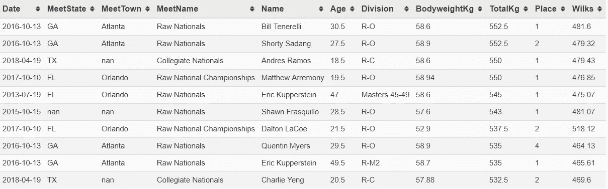

## 66 公斤级

基思·麦克霍尼在 66 公斤级中获得最多的总成绩，连续 4 年在公开级别中名列第一。世界冠军查尔斯·奥克波科(总杆数 688 杆)今年会在华盛顿州斯波坎市取代他成为美国第一吗？

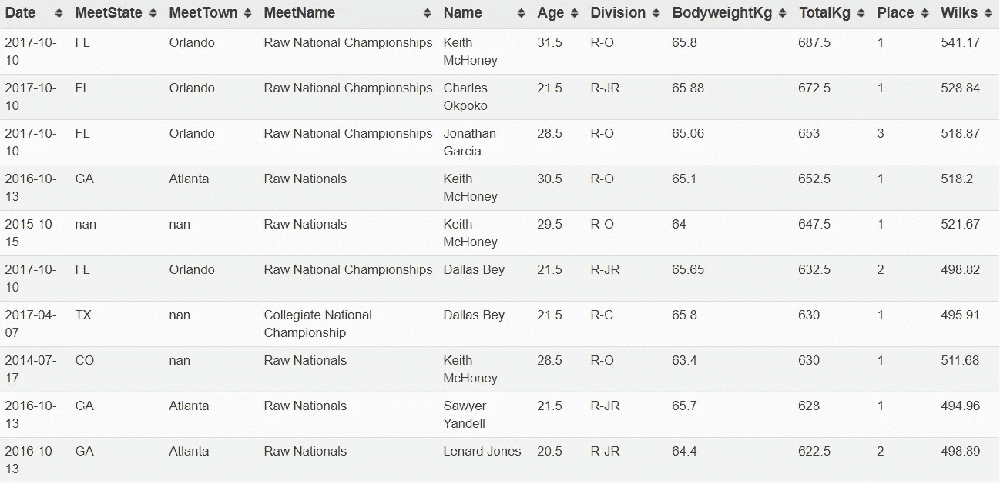

## 74 公斤

世界冠军泰勒·阿特伍德在 74 公斤级中获得最多的总成绩。他在去年全国赛上的成绩仅比今年世界纪录低 8 公斤。

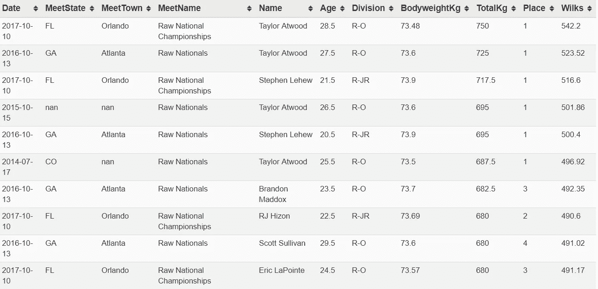

## 83 公斤

在全国比赛中，83 公斤的最高纪录是由约翰·哈克保持的。由于他没有参加今年的全国赛，Russel Orhii 会再次获得第一名吗？肖恩·诺列加在今年的马萨诸塞州和罗德岛州锦标赛中总共获得 785 分，高于奥尔希在世界锦标赛中的 783.5 分。

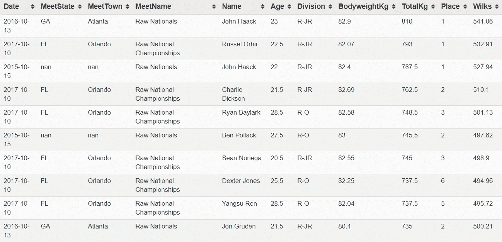

## 93 公斤

世界冠军 LS McClain 将在今年的黄金时段与 Ashton Rouska 正面交锋。两人去年总共赚了 840 公斤，这将是一场值得观看的表演。

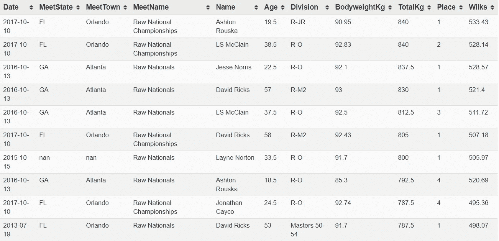

## 105 公斤

105kg 是我个人最喜欢看的。布莱斯·刘易斯和加勒特·布莱文斯在这个班里各有 3 个最高分。由于刘易斯今年没有参赛，让我们看看布莱文斯是否会获得第一名，他已经连续三年获得第二名。

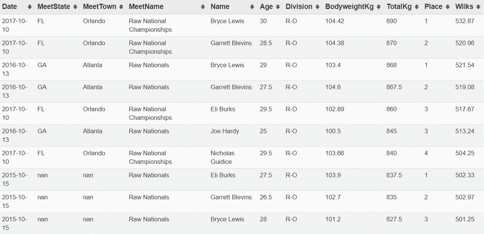

## 120 公斤

丹尼斯·科尼利厄斯会回来拿第一吗？

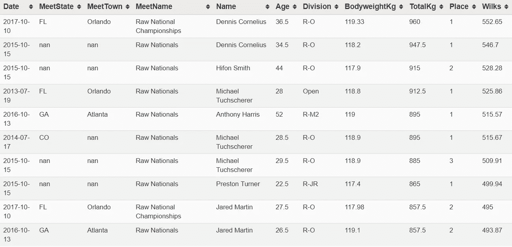

## 120 公斤以上

除了说雷·威廉姆斯是全美最强的男人还能说什么？是赚钱的时候了。

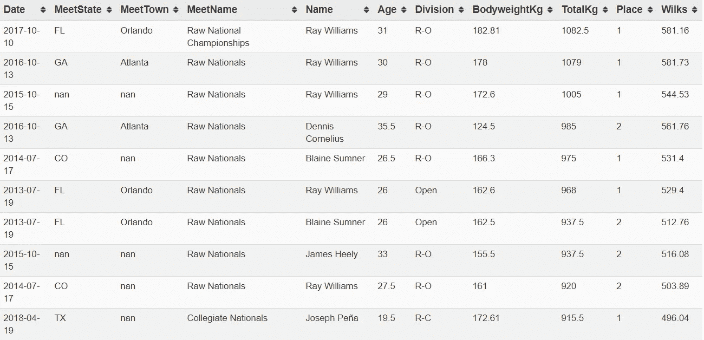

# 十大 USAPL 女性原始总数

## 47 公斤级

希瑟·康纳是一个值得关注的人，他今年 3 月在阿诺德斯完成了 4 倍体重的硬拉，确保了 558 威尔克斯。

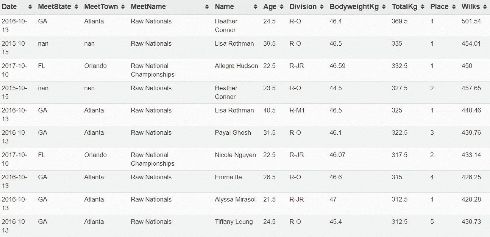

## 52 公斤级

三位女选手在 52 公斤级比赛中独领风骚——玛丽莎·英达、蒂娜·达内什曼德和苏珊娜·哈特维格-加里。这三位女性将在黄金时段进行正面交锋。

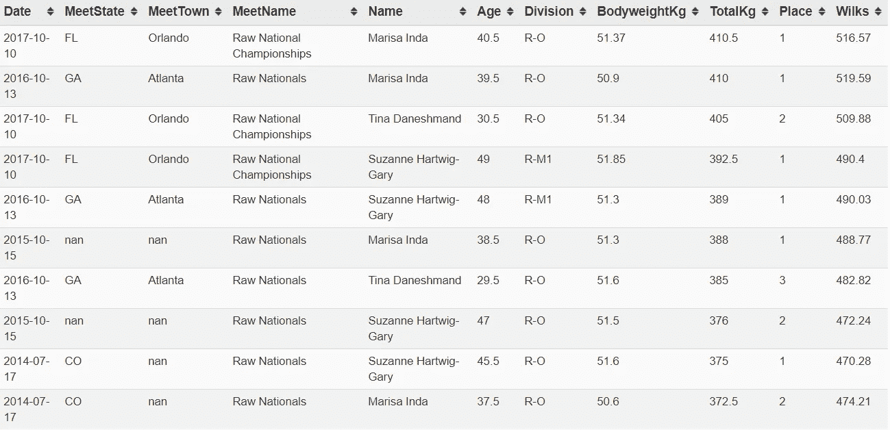

## 57 公斤级

世界冠军詹妮弗·米利肯今年将升级到 63 公斤级。在今年的全国比赛中，谁将取代她成为最强的 57 公斤级选手？

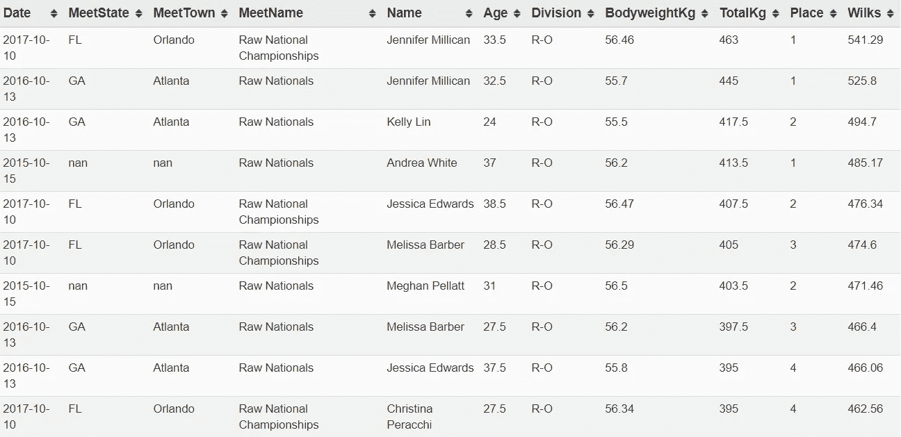

## 63 公斤

世界冠军珍妮·汤普森是 USAPL 运动员中总数最多的，为 6 人。她今年将再次面临激烈的竞争，詹妮弗·米利肯也加入了这个行列，对手是萨曼莎·卡尔霍恩，她今年以 221.5 公斤的成绩创造了新的硬拉世界纪录

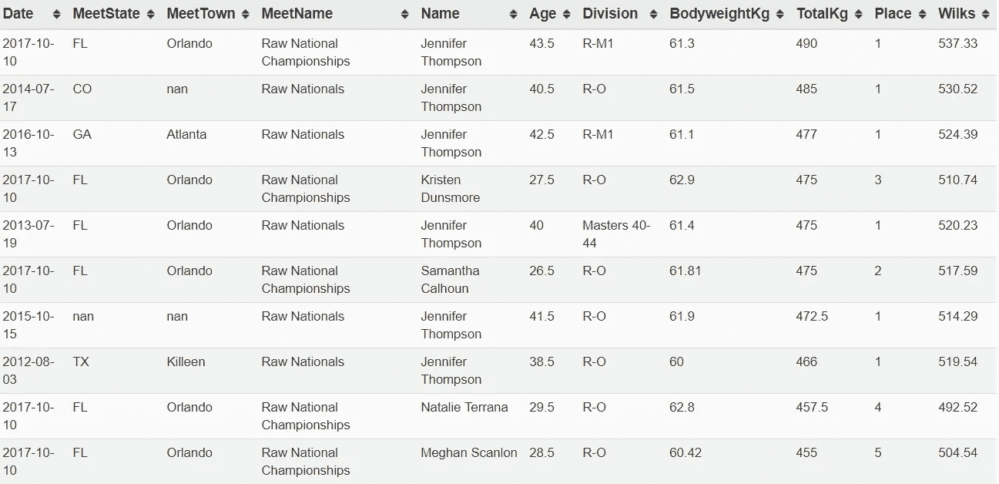

## 72 公斤级

金伯利·沃尔福德拥有 4 项全国最高记录。虽然很不幸，她不再参加 USAPL/IPF 的比赛(因此，今年不会出现)，但我预计她将与克洛伊·道布林和克里斯汀·邓斯莫尔(首次以 72 公斤级的身份参赛)进行一场激动人心的对决。

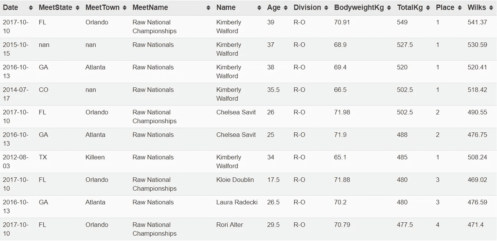

## 84 公斤

世界冠军丹妮拉·梅洛在全国比赛中保持着最高的总成绩。她在今年的阿诺德斯继续以 572.5 分打破这一纪录，并保持着 571 分的世界纪录。

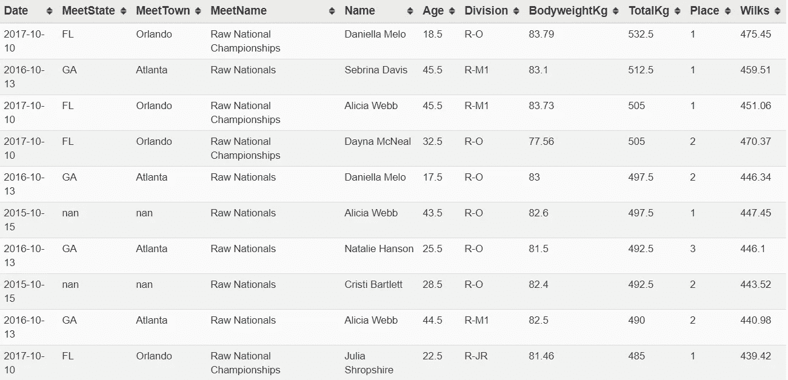

## 84 公斤以上

世界冠军博尼斯·布朗(前 Lough)会连续第五年重返榜首吗？

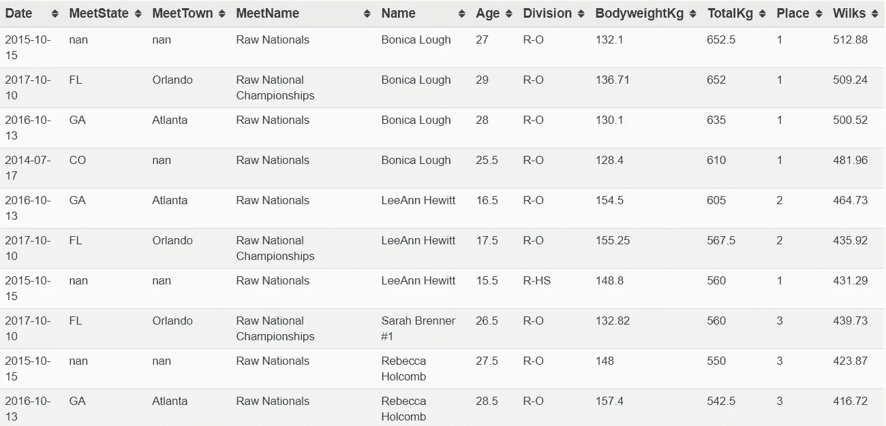

## 前 10 名 USAPL M/F 原始合计中最高合计数最多

如前所述，在 USAPL M/F 原始总额的前 10 名中，珍妮·汤普森拥有最多的最高总额，为 6。雷·威廉姆斯和金伯利·沃尔福德排名第二，各得 5 英镑；博尼卡·洛、苏珊娜·哈特维格-加里、基思·麦克霍尼、泰勒·阿特伍德和玛丽莎·英达各有 4 个孩子；丹尼斯·科尼利厄斯、布莱斯·刘易斯、李安·休伊特、加勒特·布莱文斯、迈克尔·图切勒、艾丽西娅·韦伯和大卫·里克斯各有 3 个。

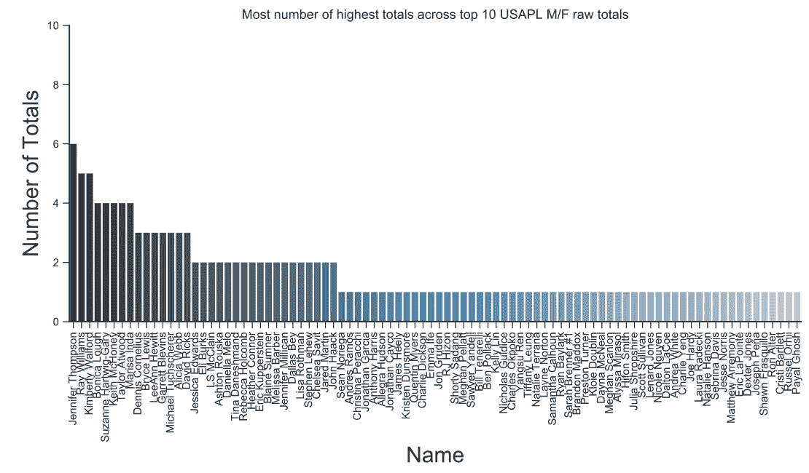

美国一年比一年强大。像举重社区的许多人一样，我很兴奋地看到今年的比赛将如何改变我上面介绍的数字。这个项目的完整 Jupyter 笔记本将会出版…最终。