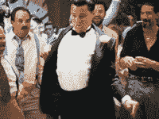
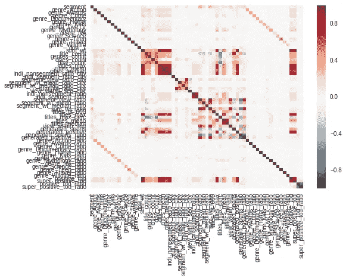
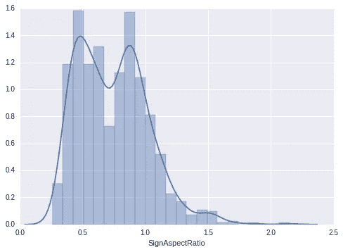
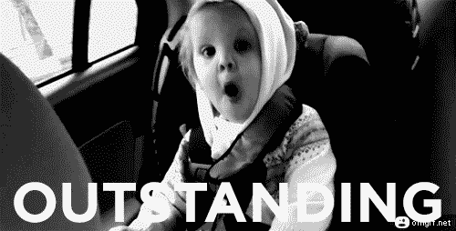
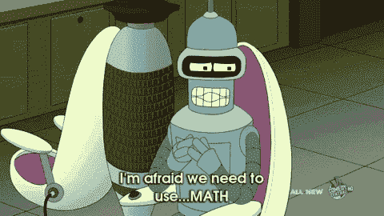

# 印度黑客机器学习挑战赛前 15 名

> 原文：<https://towardsdatascience.com/top-15-finish-in-indiahacks-machine-learning-challenge-a234d5fb4087?source=collection_archive---------6----------------------->

在几场艰苦的 Kaggle 比赛之后，Indiahacks ML challenge 看起来像是免费的！我对几千行代码记忆犹新，经过几周的努力，我在 800 多名参与者中排名第 14:)

**出现的问题**

*   市场细分(**由 Hotstar** 主持):基于每个用户之前的观看历史、观看的类型、每个节目的观看时间以及其他时间因素，我们必须预测特定的人群细分(auc 是误差度量)。现在这个细分市场的人口统计数据还不可用，我们所有的想法是观看特定类型/节目的人包含在这个细分市场中
*   路标预测(**由 Here** 主持):Here 的汽车在道路上行驶，捕捉各种路标的图像，顶部装有一个四向摄像头。给定这些图像周围的元数据，如每个凸轮与道路标志的角度、标志的纵横比，我们预测每个道路标志实际指向的位置(后、左、前或右)，m-logloss 是误差度量

[**我的方法**](https://github.com/shubh24/indiahacks-ml-2017) —我从几个启动脚本开始，以可理解的格式获取 jsons。像往常一样，用一个基本的随机森林提交获得了运行基础，它给出了一个相当高的准确性，只是用了给定的试探法。

这是为数不多的比赛之一，我真正关注的是可视化和理解问题陈述。通过比较不同类型的平均时间(热图),我发现板球显然不是我们细分市场的首选类型。

上图:所有工程特性相对于“细分市场”的热图

对于 roadsign 问题，我查阅了许多直方图，以了解哪些摄像机和各自的宽高比具有良好的预测能力。

上图:检测到左侧摄像头的 aspect_ratio 直方图，但路标指向前方。

**市场细分—特征工程**

*   **特征整理**:我通过观察它们与我们的目标变量的相关性来整理相似的特征。例如，“流派田径”、“流派羽毛球”、“流派拳击”、“流派板球”、“流派足球”、“流派方程式 1”、“流派方程式”、“流派曲棍球”、“流派印地亚夫萨”、“流派卡巴迪”、“流派体育”、“流派游泳”、“流派乒乓球”、“流派网球”、“流派排球”被组合成流派体育
*   **一天中的时间**:一天中的时间特征被分成正 _tod、超 _ 正 _tod 和剩余 _tod，同样基于它们与“段”的相关性
*   **工作日/周末**:我注意到周日是一个非常重要的特性，因为在 segment=0 行中，day_7 与其他日期的百分比更高。
*   **流派**:原 watch_time 考虑。此外，还考虑了一个类型的观看时间与总观看时间的比率。
*   **节目标题分析** —取每个标题观看时间的均值、中值、总和。segment=1 行与 segment=0 行的比率。这些基于平均值/中值的特性很有意义。还比较了个人观看时间——与细分市场或总体人口的中位数相比，该节目的观看时间有多长
*   **城市** —我试着开发一些基于城市的功能，但是没有得到太多的改进。

**市场细分—洞察**

热图对于判断某些功能的有效性非常有帮助。此外，具有 xgboost 功能重要性的验证管道帮助我缩小了我的假设——该细分市场的人口统计数据是中年全职妈妈。支持这一观点的数据:

*   几乎没人看板球，很多戏剧/家庭/爱情片都有人看。
*   一天中的高峰时间是下午(大约 14:00)和晚上(大约 22:00)。
*   周日对观看时间的贡献不如对其他人的贡献大。
*   顶级标题和观看次数，讲述了一个清晰的故事:)

**路标预测—特征工程**:

*   由于大部分特征是在纵横比和 detected_camera 中捕获的，所以我只使用了给定特征的一些变体:
*   `angle on right cam` = `angle on right cam` - 50
*   `angle on rear cam` = `angle on rear cam` - 180
*   `angle on left cam` = `angle on left cam` - 220
*   生成了一些集合特征(基于检测到的 _cam 和目标的组合的平均角度)。也用了角度的不同 w.r.t 这些共同的方式。
*   截断的 ID —我认为截断的 ID(没有最后一个字符的 ID)可能会有一些影响，所以包括了具有相同 truncated_ID 的行的计数(可能表示同一辆汽车具有快速连续的快照)。

**路标预测—洞察**:

基本上，只要从前摄像头捕捉到图像，路标就很有可能显示“前方”。除了在汽车可能急转弯的情况下长宽比高度倾斜的情况，以及前置摄像头从一个奇怪的角度捕捉到的图像。长宽比本质上是，路标的视在高度除以路标的视在宽度，当汽车急转弯时，路标的视在宽度大部分是倾斜的。

**模特— XGBoost 是爱情，XGBoost 是生活**

对于这两个问题，我运行了一个优化的(但是普通的)xgboost，不管是好是坏。我尝试了我的常规 go-to，随机森林，GBM，和非常低效的 keras 网，也尝试了失败的堆叠。

如果我花更多的时间在堆积，糟糕的计划和管理上，我本可以获得一些名次。这个问题在过去的两场比赛中都出现过，显然不是一个理想的情况。

反正我在 Hotstar 问题上得了 0.9990232 的 AUC，在 roadsign 问题上得了 0.18053 的 logloss，对自己的表现还算满意。期待下个月的 zonals 舞台，激动！

所以是的，就是这样。一场比赛结束，另一场比赛开始。ML 会上瘾！