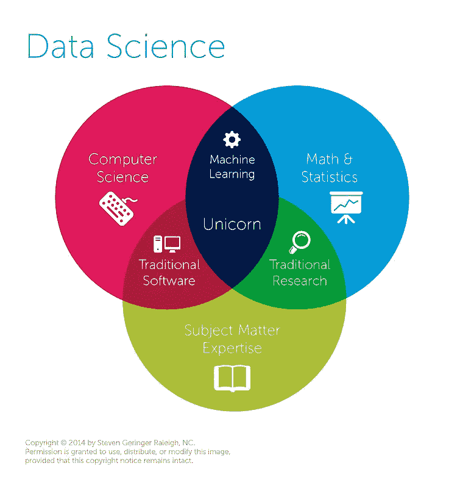
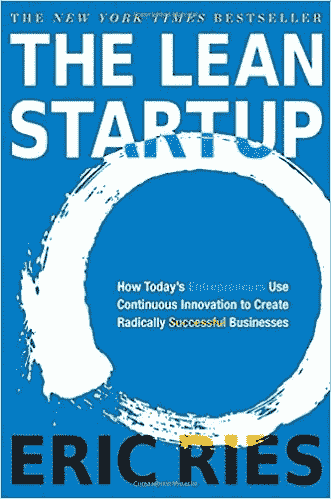
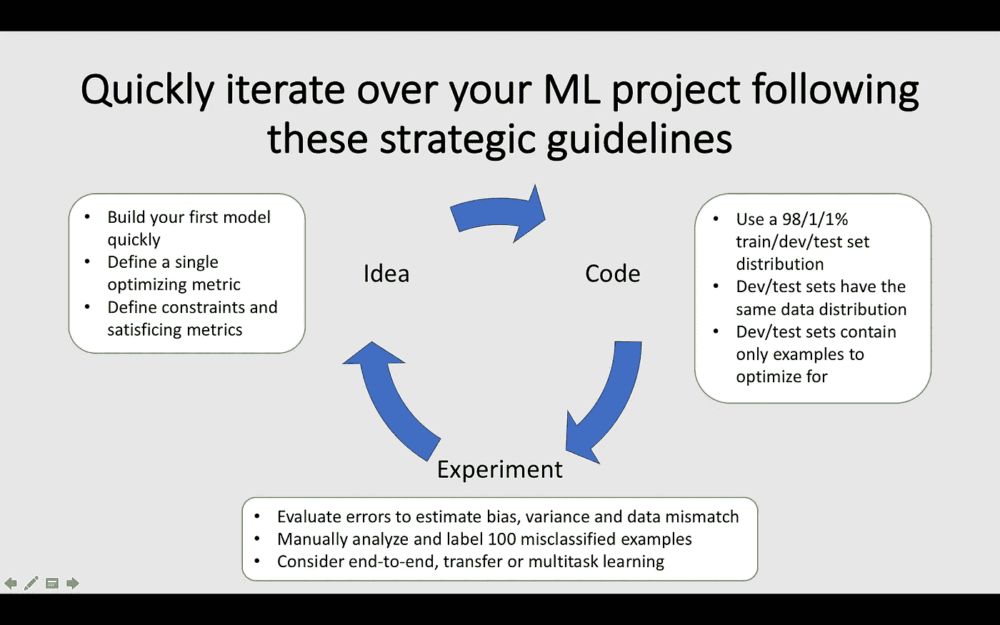
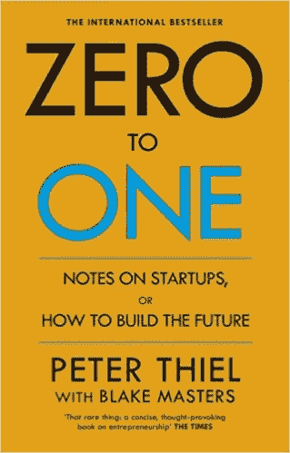
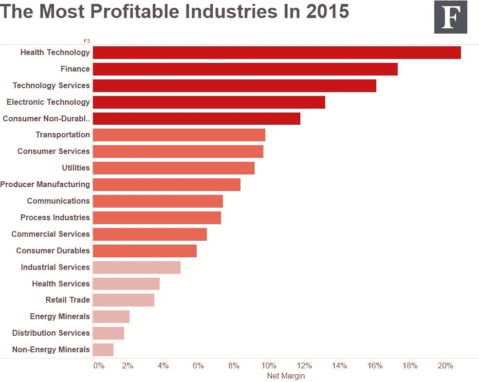
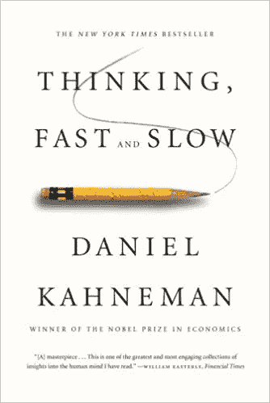
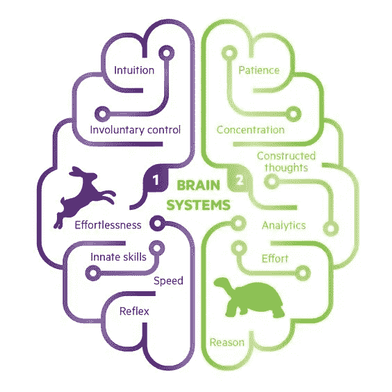
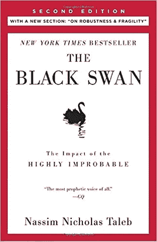
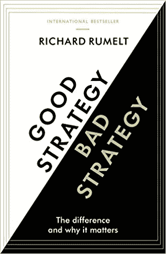

# 每个数据科学家都应该阅读的五大业务相关书籍

> 原文：<https://towardsdatascience.com/top-5-business-related-books-every-data-scientist-should-read-6e252a3f2713?source=collection_archive---------3----------------------->

## 这份改变思维方式的书籍精选清单将帮助你成为一名更好的数据科学家

根据 Drew Conway 的说法，数据科学独角兽是统计、编程和商业方面的专家。虽然已经说了很多并做了很多来帮助数据科学家变得更擅长数学和编码，但这篇文章帮助数据科学家提高了他们的商业思维。下面列出了一些关于商业和决策的书籍，最终将帮助你更好地理解和驾驭这个世界。

[https://goo.gl/T3zjv7](https://goo.gl/T3zjv7)

这些书不是理论性的。相反，这些书读起来很有趣，因为它们有科学依据，并且传达了重要的教训。

让我们开始阅读。🤓 📚

# [精益创业](https://www.amazon.com/Lean-Startup-Entrepreneurs-Continuous-Innovation/dp/0307887898/ref=sr_1_3?ie=UTF8&qid=1520063440&sr=8-3&keywords=lean+startup) —埃里克·里斯(2011)

《哈佛商业评论》称[精益创业改变了一切](https://hbr.org/2013/05/why-the-lean-start-up-changes-everything)。他们是对的，这本书应该改变你所做的一切。它的主要信息是省略所有不必要的工作，专注于测试你论文中最危险的假设。关注构建-测量-学习循环。

首先，你创造一个最小可行的产品，尽可能快和便宜地测试你最危险的假设。第二，你衡量客户的反应。你获得了多少付费客户？第三，你从指标中学习并改进产品或转向另一个想法。

作为一名数据科学家，精益创业方法可以很容易地应用到您的工作中。尽快创建一个模型。根据预定义的指标评估模型。这种方法行得通吗？需要更多数据吗？然后，您改进模型，直到它满足您的需求，您转向另一个用例，或者您完全废除这个项目。

请记住，你在一个项目上投入了多少努力并不重要。如果你发现现在的方法行不通，你之前的努力从来没有白费。你创造了知识，这将有助于你未来的进步。

吴恩达实际上创建了一门[课程](https://www.coursera.org/learn/machine-learning-projects)来改进你的算法，并坚持精益原则。点击查看本[课程的总结。](/structuring-your-machine-learning-project-course-summary-in-1-picture-and-22-nuggets-of-wisdom-95b051a6c9dd)

# 从零到一 —彼得·泰尔(2014)

经验丰富的硅谷企业家和投资者彼得·泰尔在这本即时经典中解释了他对商业的反直觉观点。本书最重要的观点是，你需要大胆创造全新的产品，并最终维持垄断。

泰尔认为，竞争最终会摧毁利润。提供类似产品的公司越多，你的利润空间就越小。考虑一下利润率，它描述了你每赚一美元实际能得到多少钱。根据 [NYU 研究](http://pages.stern.nyu.edu/~adamodar/New_Home_Page/datafile/margin.html)的数据，竞争激烈的建筑行业平均盈利 2c，而软件公司每 1 美元盈利 24c。作为一家企业，你需要不惜一切代价避免竞争。

Health tech was very profitable in 2015, while competitive distribution services were less profitable. Source: [https://goo.gl/R3Xjb1](https://goo.gl/R3Xjb1)

在你通过创造一种没有补充的产品从零到一之后，你需要创造一种垄断。垄断是保持健康利润的最有效的结构。谷歌或脸书永远不会承认他们拥有垄断地位，因为他们将面临更严格的监管审查，但他们是垄断者，他们从这一市场地位中受益。

这对您作为数据科学家的工作意味着什么？通过创造竞争对手无法提供的服务来支持你的公司！然后，通过拥有产品背后的技术或者创造网络效应，试图垄断产品。这可能意味着任何事情，从申请专利或提供最佳推荐服务，因为大多数用户使用你的服务。阅读泰尔关于如何创造和维持垄断的额外建议的书。

# [思考，快与慢](https://www.amazon.com/Thinking-Fast-Slow-Daniel-Kahneman/dp/0374533555/ref=sr_1_3?s=books&ie=UTF8&qid=1520065068&sr=1-3&keywords=thinking+fast+and+slow) —丹尼尔·卡内曼(2011)

在这本广受好评的书中，诺贝尔经济学奖获得者丹尼尔·卡内曼总结了几十年来关于人类行为的开创性研究。这本书解释了为什么我们的大脑有时会让我们失望。你从阅读本书中获得的见解将帮助你避免自己推理中的陷阱，并影响他人的决策，使之对你有利。

这本书的关键是，我们有两个层次的思维，称为直觉，或第一层次，和理性思维，称为第二层次。这两个层次都很重要，但服务于不同的目的。

一级思维是低能耗的，并且是持续不断的。它会观察你的环境并迅速做出决定。一个实质性的威胁即将来临。我应该因为刚刚听到的故事而改变对某个话题的看法吗？我如何理解环境？这些都是一级回答的问题。

一旦出现更难的问题，二级思维就开始发挥作用。二级思维是缓慢、努力和可靠的，涉及数学运算或复杂的逻辑推理。每当你需要理性而不是直觉的时候，激活第二层思维。

Source: [https://goo.gl/teTu5P](https://goo.gl/teTu5P)

作为一名数据科学家，这意味着你应该意识到思维的两个层面。警惕通过 1 级寻找简单的答案。理解当一级思维试图在不关注必要的统计数据和事实的情况下快速得出结论。承认密集使用二级思维会耗尽你的能量，并及时补充健康碳水化合物。

# 《黑天鹅》 —纳西姆·塔勒布(2007)

哲学家/交易者/统计学家纳西姆·塔勒布在本书中解决了我们对不确定性机会的视而不见。黑天鹅轶事是一个不可预见事件的隐喻。例如，人们相信所有的天鹅都是白色的，因为他们见过的所有天鹅都是白色的。但是当探险家第一次在澳大利亚发现黑天鹅时，这打破了他们对天鹅的先入为主的观念。

根据这个故事，塔勒布指出了我们思维中的各种陷阱，以及它如何影响我们的决策。作为人类，我们喜欢创造故事来解释过去，并低估机会在未来影响中的重要性。

Picture of a black swan. Source: [https://goo.gl/65dbcK](https://goo.gl/65dbcK)

对于数据科学家来说，这本书教你意识到不确定性并拥抱它。业务在高度不确定的环境中工作，这可能迫使公司改变策略或转向另一个产品用例。去尝试不同的方法和模型，也许，甚至是偶然，你会发现正确的解决方案。你永远不知道未来会有什么惊喜。

# [好战略/坏战略](https://www.amazon.com/Good-Strategy-Bad-difference-matters/dp/1781256179/ref=tmm_pap_swatch_0?_encoding=UTF8&qid=1520065115&sr=1-2) —理查德·鲁梅尔特(2011)

商业战略定义了一家公司**做什么**和不做什么**。战略的目标是在市场上比竞争对手拥有优势。**

**鲁梅尔特深入解释了好策略和坏策略的基石。一个好的战略体现在深入的诊断、指导性政策和一套连贯的行动。糟糕的战略是通过关注花费以达到目标，从问题的细节中吓跑，以及关注战略、使命和愿景模板来识别的。**

****

**Good strategy beats bad strategy. Source: [https://goo.gl/M6Tgdb](https://goo.gl/M6Tgdb)**

**然而，鲁梅尔特这本书的关键观点是，公司应该利用所有可用的资源来执行战略。这意味着，作为一名数据科学家，你需要首先挑战和理解公司战略。第二，你需要把你建议的项目和公司战略结合起来。了解公司战略将有助于您 A)确定可通过数据科学实现的价值驱动因素，B)帮助您推进项目，以及 C)了解公司未来的发展方向。**

# **关键要点**

*   **应用构建-测量-学习的精益方法**
*   **努力创造一种全新的产品，创造垄断**
*   **意识到直觉和理性思维**
*   **不要低估不确定性**
*   **理解商业战略并通过你的工作支持它**

**这些书将为你的思维增加另一个维度，并帮助你理解商业战略的某些方面。我鼓励你自己去探索和阅读这些书，它们包含了更多的智慧，读起来很有趣。**

**作为一名数据科学家，你想知道你的公司正在朝什么方向发展，为什么要实施某些措施，或者说服某人相信你的项目。我希望这些书能帮助你做到这一点。**

**如果你认为这篇文章是有帮助的，不要忘记展示你的💛穿过👏 👏 👏请在这里和 LinkedIn 上关注我，了解更多关于深度学习、在线课程、自动驾驶汽车和生活的信息。还有，你可能[喜欢](/https-medium-com-janzawadzki-working-as-a-data-scientist-at-scout24-48b15286e1a) [这些](/convolutional-neural-networks-for-all-part-i-cdd282ee7947) [帖子](/structuring-your-machine-learning-project-course-summary-in-1-picture-and-22-nuggets-of-wisdom-95b051a6c9dd)。如果你知道另一本对数据科学家有帮助的商业书籍，请评论！干杯！🙇**