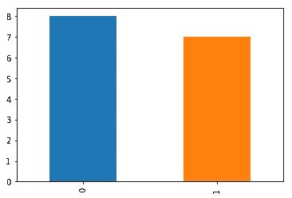
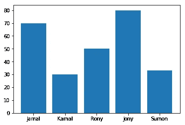
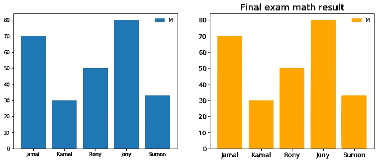
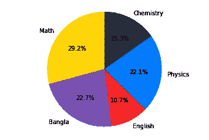

# Python 中排名前五的机器学习库

> 原文：<https://towardsdatascience.com/top-5-machine-learning-libraries-in-python-e36e3e0e02af?source=collection_archive---------9----------------------->

copyright: [https://unsplash.com/photos/_xhO_g8k1-w](https://unsplash.com/photos/_xhO_g8k1-w)

在这篇文章中，我们将了解被 ML 专家广泛使用的 python 中排名前 5 的机器学习库。

所以，我们要学的是:

*   [Numpy](http://www.numpy.org)
*   [熊猫](https://pandas.pydata.org)
*   [Matplotlib](https://matplotlib.org)
*   [SciKit-Learn](http://scikit-learn.org/stable/) 和
*   [NLTK](https://www.nltk.org)

# Numpy

[**NumPy**](http://www.numpy.org) 是用 Python 进行科学计算的基础包。它主要用于解决**矩阵**问题。

## 创建一个 Numpy **数组:**

## 创建**一维**数组:

## 创建一个由**个零组成的数组:**

## 创建编号的**序列**:

## 重塑一个**数组:**

有关**数字**的更多示例，请访问本[笔记本](https://github.com/78526Nasir/Top-5-Machine-Learning-Libraries-in-Python/blob/master/source%20codes/Numpy.ipynb)。

# 熊猫

[**Pandas**](https://pandas.pydata.org) 是用 python 编写的最流行的机器学习库，用于数据操作和分析。

## 创建一个**系列:**

> [系列](https://pandas.pydata.org/pandas-docs/version/0.23.4/generated/pandas.Series.html)是一个一维标记的数组状对象。

## 创建数据帧:

> [**数据帧**](http://pandas.pydata.org/pandas-docs/version/0.19/generated/pandas.DataFrame.html) 是一种二维标记数据结构。

## 数据帧的头部和尾部:

## 数据帧的统计描述:

## 访问单个和多个属性或列:

## 数据框架的一些基本任务:

## 数据帧上的条件搜索:

关于熊猫的更多例子，你可以访问笔记本。

# Matplotlib

> [**Matplotlib**](https://matplotlib.org) ，一个很棒的**数据可视化**库。

## 使用 Matplotlib 进行单属性分布:

results distribution

## 条形图:

Bar Chart

## 修改不同的参数:

Modified Bar Chart

## 饼图:

pie chart

关于 matplotlib 的更多例子，你可以访问这个[笔记本](https://github.com/78526Nasir/Top-5-Machine-Learning-Libraries-in-Python/blob/master/source%20codes/matplotlib.ipynb)。

# sci kit-学习

一个提供了一系列 [**有监督**](https://en.wikipedia.org/wiki/Supervised_learning) 和 [**无监督**](https://en.wikipedia.org/wiki/Unsupervised_learning) 学习算法的库。这个图书馆主要集中在**模型**的建造上。

## 使用 Sci-kit Learn 的端到端模型:

在本例中，我们将使用这个简单的 [**学生成绩**](https://github.com/78526Nasir/Top-5-Machine-Learning-Libraries-in-Python/blob/master/dataset/student_result.csv) 数据集。数据集包含两个可能的结果`0`和`1`。

> `0`表示学生**未通过**的考试，`1`表示**通过**。

我们的数据集包含标签，它只有两种可能的结果，这意味着它是一个**监督分类学习**问题。

*   **第一步:导入必要的库**

*   **第二步:加载数据集**

*   **步骤 3:将数据集分成训练和测试子集**

*   **第四步:模型训练**

*   **第五步:模型评估**

完整的笔记本可以在这个[链接](https://github.com/78526Nasir/Top-5-Machine-Learning-Libraries-in-Python/blob/master/source%20codes/Sci-kit%20Learn.ipynb)中找到。

# NLTK

**自然语言工具包(**[**【NLTK】**](https://www.nltk.org)**)**是**[**NLP**](https://en.wikipedia.org/wiki/Natural_language_processing)**(自然语言处理)的库。****

## **符号化:**

> **根据 techopedia 的说法，**记号化**是将一系列字符串分解成单词、关键词、短语、符号和其他称为记号的元素的行为。**

## **把一个句子标记成单词:**

## **把一段文字分成句子:**

## **使用 NLTK 进行词干分析:**

> **词干是从词尾去除词缀的过程。**

**完整的笔记本可以在这个[链接](https://github.com/78526Nasir/Top-5-Machine-Learning-Libraries-in-Python/blob/master/source%20codes/NLTK.ipynb)中找到。**

**今天就到这里:d。**

**完整的 **GitHub** 回购可以在这个 [**链接**](https://github.com/78526Nasir/Top-5-Machine-Learning-Libraries-in-Python) 中找到。**