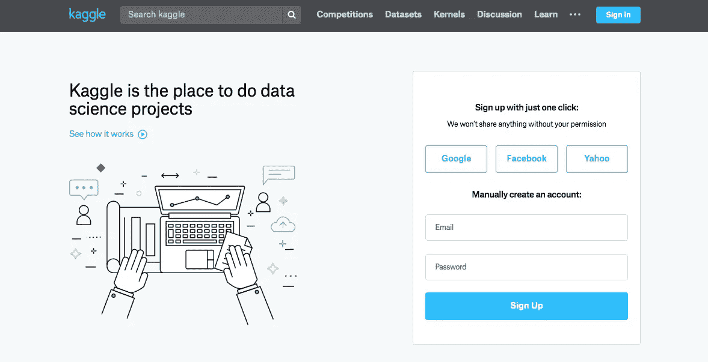
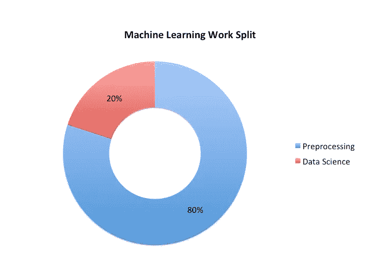
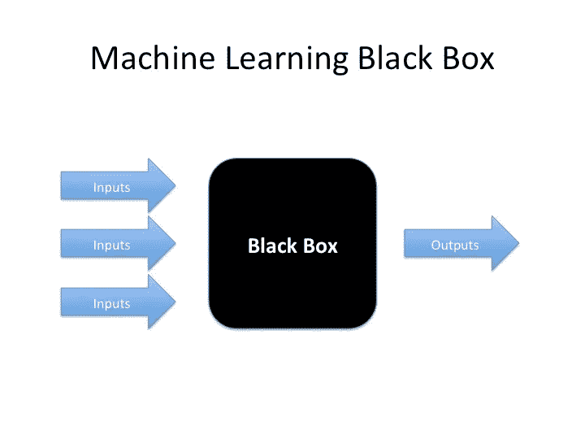
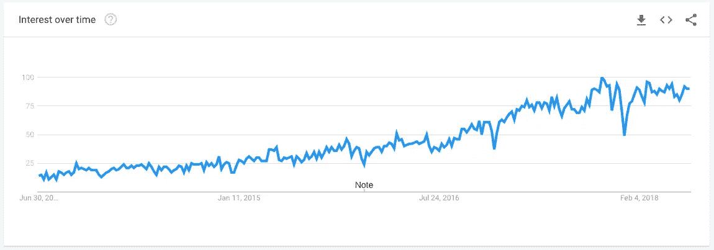
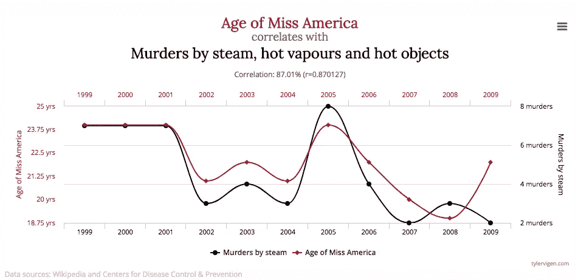
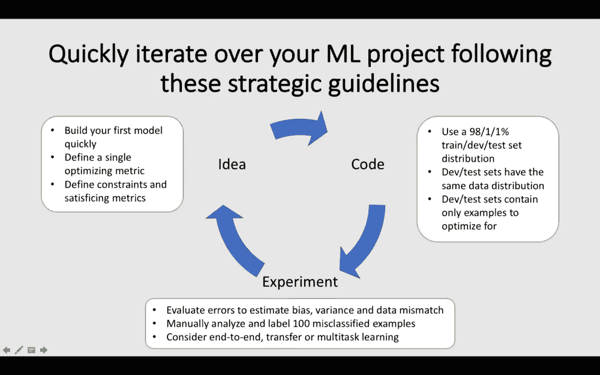

# 绿角数据科学家的 5 大错误

> 原文：<https://towardsdatascience.com/top-5-mistakes-of-greenhorn-data-scientists-90fa26201d51?source=collection_archive---------0----------------------->

## 你参加了在线课程，并获得了第一份数据科学工作。避免这些错误，马上就能成功。

你为最终成为一名数据科学家做了充分的准备。你参加了 Kaggle 比赛，你狂看 Coursera 的讲座。你觉得自己已经准备好了，但是作为一名现实生活中的数据科学家，工作将会与你的预期大相径庭。

本文考察了早期数据科学家的 5 个常见错误。这份名单是与[sébastien fou caud](https://www.linkedin.com/in/sfoucaud/)博士汇集在一起的，他在指导和领导学术界和工业界的年轻数据科学家方面拥有> 20 年的经验。这篇文章旨在帮助你更好地为现实生活中的工作做准备。

让我们开始吧。👩‍🏫👼🦄🐣

# 1.输入“一代卡格尔”

Source: [kaggle.com](http://www.kaggle.com) on June 30 18.

您参加了 Kaggle 挑战赛，并锻炼了您的数据科学技能。你能把决策树和神经网络堆叠起来，这很好。说实话，你不会像数据科学家那样做太多的模型堆叠工作。请记住，一般来说，您将花费 80%的时间预处理数据，20%的剩余时间构建您的模型。

成为“卡格尔一代”的一员在很多方面都有帮助。数据通常是非常干净的，这样你就可以花时间调整你的模型。但是在现实工作中很少出现这种情况，在现实工作中，您必须从具有不同格式和命名约定的不同来源收集数据。

做艰苦的工作，练习你将使用 80%时间的技能，数据预处理。[抓取图像](/https-medium-com-janzawadzki-sweet-or-cheat-build-a-sneaker-rater-after-finishing-andrew-ngs-2nd-course-49475fc75429)或者从 API 中收集。收集[天才](https://github.com/johnwmillr/LyricsGenius)的歌词。准备好解决特定问题所需的数据，然后摄取到笔记本中，实践机器学习生命周期。精通数据预处理无疑会让你成为一名数据科学家，对你的公司产生立竿见影的影响。

# 2.神经网络是治疗一切的良药

在计算机视觉或自然语言处理领域，深度学习模型优于其他机器学习模型。但是它们也有明显的缺点。

神经网络非常渴求数据。样本越少，决策树或逻辑回归模型往往越好。神经网络也是一个黑匣子。众所周知，它们很难解释和说明。如果产品所有者或经理开始质疑模型的输出，你必须能够解释模型。这对于传统模型来说要容易得多。

正如[詹姆斯·勒](https://medium.com/u/52aa38cb8e25?source=post_page-----90fa26201d51--------------------------------)在[的这篇博文](/a-tour-of-the-top-10-algorithms-for-machine-learning-newbies-dde4edffae11)中所解释的，有很多很棒的统计学习模型。对他们进行自我教育。了解它们的优缺点，并根据您的用例的约束应用模型。除非你在计算机视觉或自然语音识别的专业领域工作，否则最成功的模型很可能是传统的机器学习算法。你很快就会发现，通常最简单的模型，如逻辑回归，是最好的模型。

Source: Algorithm cheat-sheet from [scikit-learn.org](https://bit.ly/1IxDsim).

# 3.机器学习是产品

在过去的十年里，机器学习既享受又遭受了巨大的炒作。太多的初创公司承诺，机器学习是解决任何问题的良药。

Source: Google Trends for Machine Learning of the past 5 years

机器学习本身永远不应该是产品。机器学习是创造满足客户需求的产品的强大工具。如果客户受益于收到准确的商品推荐，机器学习可以提供帮助。如果客户需要准确识别图像中的对象，机器学习可以提供帮助。如果企业从向用户展示有价值的广告中受益，机器学习可以提供帮助。

作为一名数据科学家，您需要以客户目标为主要优先事项来规划项目。只有这样，你才能评估机器学习是否有帮助。

# 4.混淆因果关系和相关性

大约 90%的数据是在过去的[年](https://www.sintef.no/en/latest-news/big-data-for-better-or-worse/)中产生的。随着大数据的出现，机器学习从业者可以大量获得数据。有如此多的数据需要评估，学习模型发现随机相关性的机会增加了。

Source: [http://www.tylervigen.com/spurious-correlations](http://www.tylervigen.com/spurious-correlations)

上面的图像显示了美国小姐的年龄和被蒸汽、热蒸汽和热物体谋杀的总数。给定这些数据，学习算法将学习美国小姐的年龄影响特定对象谋杀数量的模式，反之亦然。然而，两个数据点实际上是不相关的，两个变量对另一个变量绝对没有预测能力。

当发现数据中的模式时，应用你的领域知识。这可能是一种关联还是因果关系？回答这个问题是从数据中得出行动的关键。

# 5.优化错误的指标

开发机器学习模型遵循敏捷生命周期。首先，您定义想法和关键指标。第二，你原型化一个结果。第三，你不断改进，直到满足关键指标。

在建立机器学习模型的时候，记得做人工误差分析。虽然这个过程是乏味的，并且需要努力，但是它将帮助您在接下来的迭代中有效地改进模型。参考下面的文章，从吴恩达的[深度学习专业化](https://www.coursera.org/learn/machine-learning-projects)中获得改善你的模型的额外技巧。

 [## 构建你的机器学习项目的 22 个智慧金块

### 完成一个机器学习项目很难。此摘要帮助您构建您的机器学习项目，以…

towardsdatascience.com](/structuring-your-machine-learning-project-course-summary-in-1-picture-and-22-nuggets-of-wisdom-95b051a6c9dd) 

年轻的数据科学家为公司提供了巨大的价值。他们刚刚参加完在线课程，可以立即提供帮助。他们通常是自学的，因为很少有大学提供数据科学学位，因此表现出巨大的承诺和好奇心。他们对自己选择的领域充满热情，渴望学习更多。要想在你的第一份数据科学工作中取得成功，就要小心上面提到的陷阱。

## 关键要点:

*   实践数据管理
*   研究不同模式的利弊
*   让模型尽可能简单
*   对照因果关系和相关性检查你的结论
*   优化最有前途的指标

如果你认为这篇文章是有帮助的，不要忘记展示你的💛穿过👏 👏 👏在 [Medium](https://medium.com/@janzawadzki) 和 [LinkedIn](https://www.linkedin.com/in/jan-zawadzki/) 上关注我，了解更多关于深度学习、在线课程、自动驾驶汽车和生活的信息。还有，[把](/top-5-business-related-books-every-data-scientist-should-read-6e252a3f2713) [这些](/convolutional-neural-networks-for-all-part-i-cdd282ee7947) [帖子](/the-deep-learning-ai-dictionary-ade421df39e4)查出来。请评论分享你的看法。干杯！🙇