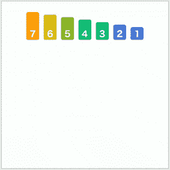
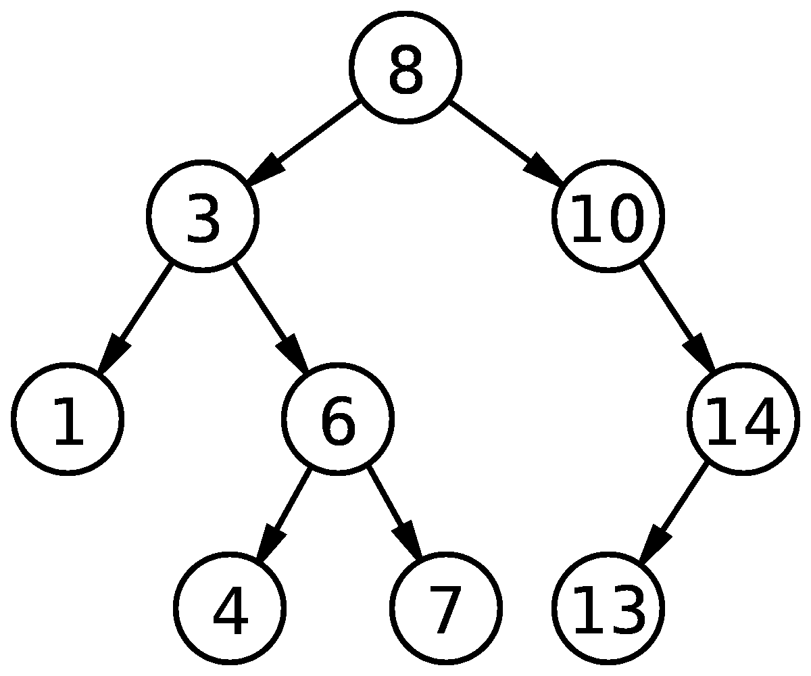
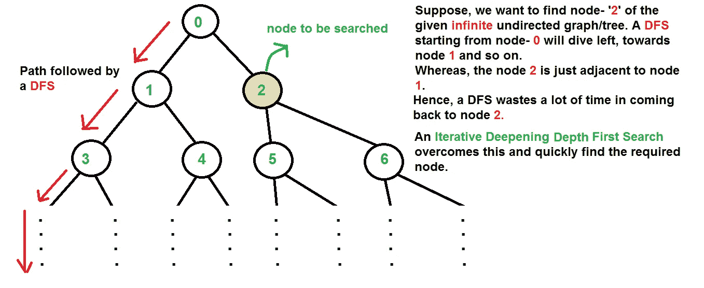

# 你真正需要知道的顶级算法和数据结构

> 原文：<https://towardsdatascience.com/top-algorithms-and-data-structures-you-really-need-to-know-ab9a2a91c7b5?source=collection_archive---------0----------------------->


source: geekrescue.com

如果你想成为一名软件工程师，但不知道从何入手，那就给你省点悬念:**是算法和数据结构**。

一旦你掌握了这些编程支柱的要点，你就会发现它们无处不在。你学习的算法和数据结构越多，它们就越有助于你成为软件工程师。

为了让你开始，让我们先深入研究一下搜索和排序，这是你离不开的两类算法。然后让我们快速浏览一下其余的景观，包括树、图表、动态编程等等。

# 搜索

粗略地说，有两类搜索算法你需要马上了解:**线性和二进制**。深度优先搜索(DFS)和广度优先搜索(BFS)也非常重要，但是我们将把它们留到下面的图形遍历部分。

# 线性搜索

线性和二进制算法如此命名是为了描述基于被搜索的输入大小的搜索将花费多长时间(时间复杂度)。

例如，使用线性搜索算法，如果您有 100 个项目要搜索，那么最糟糕的情况是，在遇到您想要的值之前，您需要查看输入中的每个项目。之所以称之为线性，是因为搜索所需的时间与搜索中的项目数量完全相关(100 个项目/输入=100 次检查/复杂性)

简而言之，线性=简单(算法没什么高明之处)。例如:假设你正在一排没有特定顺序的人中寻找你的朋友林。你已经知道林的长相，所以你只需要一个接一个地看着每个人，直到你认出或者认不出林。就是这样。这样做时，您将遵循线性搜索算法

# 二进位检索

二分搜索法之所以得名，是因为单词 Binary 的意思是“两个事物的或与之相关的”,算法的工作原理是将输入分成两部分，直到找到要搜索的项目。一半包含搜索项，另一半不包含。该过程继续进行，直到输入被拆分的点成为被搜索的项目。二分搜索法基本上只是一个高度自律的消除过程。它比线性搜索更快，**，但它只适用于有序序列。**

举个例子应该能更清楚地说明这一点。假设你想在一排人中间找到你的朋友宾(身高 5 英尺 5 英寸)，这些人的身高从左到右从矮到高排列。这真的是一条很长的线，你没有时间一个一个地看完整件事，把每个人的身高和宾的进行比较。你能做什么？


进入二分搜索法。你选择在队伍中间的人，测量他们的身高。他们身高 5 英尺 7 英寸。所以你马上就知道这个人，以及他们右边的人，不是宾。现在你已经把你的问题减半了，你把注意力转向线的剩余部分，再次选择中间的人。他们身高 5 英尺 4 英寸。所以你可以排除那个人和他们左边的任何人，再次把问题分成两半。诸如此类。经过五六次这样的分裂，你很快就找到了斌，而你找到林的时间只是他的几分之一。这样做，你就遵循了二分搜索法算法。

# 整理

作为开发人员，对项目列表进行排序是最常见的编程任务之一。这里我们来看两个最有用的排序算法:合并排序和快速排序。

# 合并排序

让我们假设，你需要从一个无序的群体中创建一个有序的人群，而不是遇到上面例子中有序的人群。你没有太多时间，所以你想出了一个加快速度的策略。

你先把挤在一起的一群人分成两部分。然后，你让两个组中的每一个再分成两个，如此类推，直到你完全与个人打交道。然后你开始将两个人配对，让每对中较高的一个站在另一个的右边。很快每个人都被组织成左右有序的一对。

接下来，您开始将有序对合并成有序的四个一组；然后将四个有序组合并成八个有序组；诸如此类。最后，你发现你有了一个完整的、按身高排序的人群，就像你上面遇到的那个人一样。不知不觉中，您已经按照 MergeSort 算法完成了您的壮举。



# 快速排序

QuickSort 有点太复杂了，不容易与人联系起来，所以让我们更接近代码。首先，让我们假设您有一个无序列表或数组，其中包含您想要排序的八个数字。

```
4    2    13   6    15    12    7    9
```

您可以使用合并排序，但是您听说快速排序通常更快，所以您决定尝试一下。您的第一步是在列表中选择一个称为轴心的数字。选择正确的枢轴数将决定快速排序的执行速度，选择好的枢轴有现成的公式可以遵循。但是现在，让我们保持简单，只使用数组中的最后一个数字作为我们的枢纽数字:9。

```
4    2    13   6    15    12    7    ***9***
```

为了便于下一步，我们将在数组的开头创建一个分隔符，并用井号表示。

```
#    4    2    13   6    15    12    7    ***9***
```

在我们的数组中，从左到右，我们的目标是将任何小于枢轴(9)的数字放在分隔符的左边，将任何大于(或等于)枢轴的数字放在分隔符的右边。我们从数组中的第一个数字开始:4。要将其移动到分隔符的左侧，我们只需将分隔符向上移动一个元素:

```
4    #    2    13   6    15    12    7    ***9***
```

我们对下一个数字做同样的事情:2。

```
4    2    #    13   6    15    12    7    ***9***
```

但是我们到了 13，它比枢轴数 9 大，并且已经在分隔符的右侧。所以我们不去管它。接下来我们来到 6，它需要到分隔符的左边。首先，我们把它和 13 交换位置:

```
4    2    #    6    13    15    12    7    ***9***
```

然后我们移动分隔符传递给它:

```
4    2    6    #    13    15    12    7    ***9***
```

接下来是 15，它已经在分隔符的右边，所以我们不去管它。那么我们有 12 个。同样的事情。但是 7，我们到达支点前的最后一个数字，需要和 6 一样的帮助才能移动。所以我们把 7 和 13 互换位置:

```
4    2    6    #    7    15    12    13    ***9***
```

然后，我们再一次移动分隔符传递给它:

```
4    2    6    7    #    15    12    13    ***9***
```

最后，我们来到我们的枢纽数字:9。按照与上面相同的逻辑，我们将 15 与 9 交换，以获得需要的枢纽数:

```
4    2    6    7   #    9    12    13    15
```

因为 9 左边的所有数字现在都小于 9，而 9 右边的所有数字都大于 9，所以我们完成了第一轮快速排序。接下来，我们将把分隔符两边的每一组四个数字作为一个新数组来应用快速排序。我们就不告诉你细节了，但是下一轮会给我们四对数字，让我们可以轻松地进行最后一轮的快速排序。最终结果将是下面的有序列表，它比简单的 MergeSort 花费更少的时间来生成:

```
2    4    6    7    9    12    13    15
```

# 排序算法备忘单

这些是最常见的排序算法，以及一些何时使用它们的建议。内化这些！到处都在用！

[**堆排序**](https://en.wikipedia.org/wiki/heapsort) **:** 当您不需要稳定排序，并且您更关心最坏情况性能而不是一般情况性能时。它保证为 O(N log N)，并使用 O(1)辅助空间，这意味着在非常大的输入上不会意外地耗尽堆或堆栈空间。

[**intro sort**](https://en.wikipedia.org/wiki/introsort)**:**这是一种快速排序，在达到一定的递归深度后切换到堆排序，以避开快速排序的 O(N)最坏情况。它几乎总是比普通的老式快速排序好，因为你得到了快速排序的一般情况，并保证了 O(N log N)性能。使用堆排序的唯一原因可能是在内存严重受限的系统中，O(log N)堆栈空间实际上非常重要。

[**插入排序**](https://en.wikipedia.org/wiki/insertionsort) :当 N 保证很小时，包括作为快速排序或合并排序的基础情况。虽然这是 O(N)，但它有一个非常小的常数，是一个稳定的排序。

[**冒泡排序**](https://en.wikipedia.org/wiki/bubblesort) **，** [**选择排序**](https://en.wikipedia.org/wiki/selectionsort) :当你在做一些快速而肮脏的事情，由于某种原因，你不能只使用标准库的排序算法。与插入排序相比，它们唯一的优势是实现起来稍微容易一些。

[**快速排序**](https://en.wikipedia.org/wiki/Quicksort) **:** 当您不需要稳定排序并且平均情况性能比最差情况性能更重要时。快速排序平均为 O(N log N)，最坏的情况下为 O(N)。一个好的实现使用 O(log N)辅助存储，以堆栈空间的形式进行递归。

[**归并排序**](https://en.wikipedia.org/wiki/mergesort) **:** 当你需要一个稳定的，O(N log N)排序时，这大概是你唯一的选择。它唯一的缺点是使用 O(N)辅助空间，并且常数比快速排序稍大。有一些就地归并排序，但是它们要么不稳定，要么比 O(N log N)差。即使是 O(N log N)就地排序也有比普通的合并排序大得多的常数，因此它们更多的是理论上的好奇，而不是有用的算法。

**非比较排序:**在一些相当有限的条件下**有可能突破 O(N log N)障碍，按 O(N)排序！这里有一些值得一试的例子:**

[**计数排序**](https://en.wikipedia.org/wiki/countingsort) **:** 在对有限范围内的整数进行排序时。

[**基数排序**](https://en.wikipedia.org/wiki/radixsort) **:** 当 log(N)显著大于 K 时，其中 K 为基数位数。

[**桶排序**](https://en.wikipedia.org/wiki/bucketsort) **:** 当你能保证你的输入近似均匀分布时。

# 更多必备算法和数据结构

尽管搜索和排序是进入算法和数据结构世界时最受信任、最常用的两种方法，但如果不谈论以下几个最受欢迎的方法，对这一领域的任何调查都是不完整的:

# 树

你将会看到很多树，因为它们是最常见的数据结构之一。它们也是最容易描绘和理解的数据结构之一。几乎所有关于树的术语都来自于家谱的概念。根据节点(即家族成员)相对于树中其他节点的位置，该节点被称为父节点、子节点、兄弟节点、祖先节点、后代节点等。

如果树具有某些属性，那么在树中存储项目允许我们以更有效的方式找到项目。(参见下面的[二叉查找树](https://en.wikipedia.org/wiki/Binary_search_tree)



# 图表

如果你想得到技术，树最终只是图的一个特例。所以在日常生活和计算机科学中，图无处不在也就不足为奇了。特别是，图的遍历是一件大事，有两种算法您可能想快速掌握:广度优先搜索(BFS)和深度优先搜索(DFS)。为了了解这两个基本算法需要什么，想象一下你在一座金字塔形状的摩天大楼的顶部，你需要搜索整个建筑来找到你的朋友 Fiz。然后你意识到金字塔大致相当于一个图，每个房间都是一个节点。

[**【广度优先搜索】**](https://en.wikipedia.org/wiki/Breath-first_search)

如果你从金字塔的顶端开始，一层一层地遍历金字塔，你将大致执行对你的朋友 Fiz 的广度优先搜索。查看下面的可视化，对这种类型的搜索及其行为有更好的直觉。


[**【深度优先搜索】**](https://en.wikipedia.org/wiki/Depth-first_search)

如果你一个电梯一个电梯地走，在垂直切片中遍历金字塔时，检查每一站最近的房间，而不是一层一层地走，你将大致执行深度优先搜索你的朋友 Fiz。同样，下面的可视化应该有助于使这一点更清楚。



source: geeksforgeeks.com

**动态编程**

如果你正面临一个巨大的、重量级的编程问题，你无法想象自己能解决，那么动态编程(DP)可能会帮助你。DP 会帮你把大问题变成小的子问题。每当 DP 解决一个子问题时，它保存结果，并最终将所有保存的结果放在一起，以便处理大问题。

**哈希**

近年来，我们查找数据的方式发生了巨大变化。虽然主要方法曾经是二分搜索法，但现在越来越多地成为散列查找。尽管我们在这里不做时间复杂度的比较，但可以说，当搜索包含数百万个条目的列表时，散列法通常要快得多。

**字符串模式匹配**

如果您听说过正则表达式(又名 regex)，那么您一定听说过字符串模式匹配。这里的想法是，你搜索的不是一个项目，而是许多项目共有的模式。例如，假设您正在一本书中搜索所有以问号结尾的句子:这是字符串模式匹配的工作。

还有更多…

我们已经走过了很多地方。但是我们仍然几乎没有暗示算法和数据结构世界的宏大范围。这里还有一些值得你深入研究的东西:

> **数据结构**:数组
> 链表
> 栈
> 队列
> 
> **算法:**素性测试
> 快速傅立叶变换
> 二进制取幂
> 平方取幂

# 软件成功的道路是由算法铺就的

如果没有别的，以上所有的都应该让你明白，如果你想成为一名软件工程师，算法和数据结构将会为你铺平道路(甚至可能会支付报酬)。对于坚如磐石的基础，你可能想从搜索(线性和二进制)和排序(SortMerge 和 QuickSort)开始。一旦你掌握了这些编程支柱的要点，是时候学习关于树、图遍历(BFS 和 DFS)、动态编程和字符串模式匹配的一切了。但真正的目标是开始体验算法和数据结构:思考现实世界问题的逐步解决方案，并根据简单的数据结构描绘复杂的场景。**如果你能掌握这一点，那么编码就会自然而然。**

如果你喜欢这篇文章，我的个人博客(jasonroell.com)上有更多类似的内容。看看吧，祝你有美好的一天！