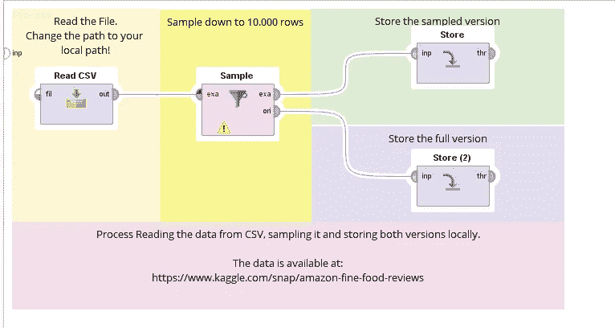
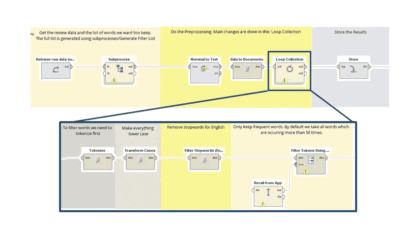
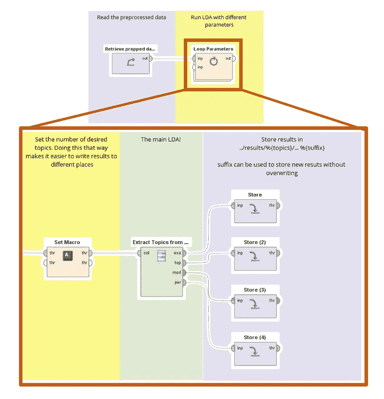
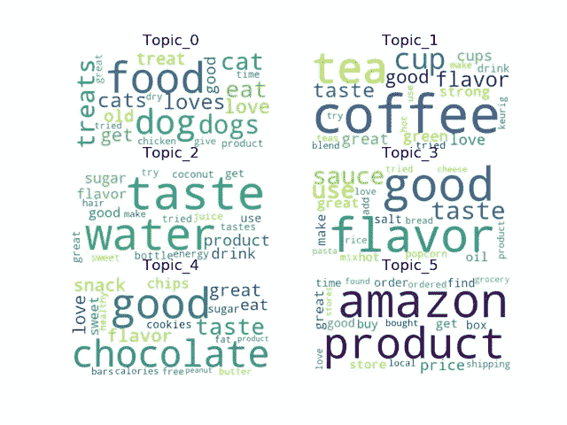
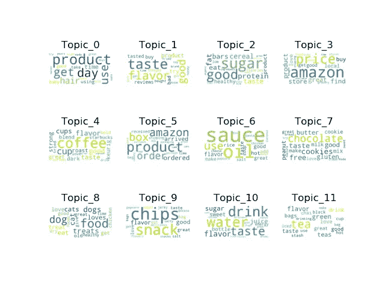

# 亚马逊评论的主题挖掘

> 原文：<https://towardsdatascience.com/topic-mining-on-amazon-reviews-ae76fc286c61?source=collection_archive---------15----------------------->

## 如何用 NLP 理解客户的声音？

互联网上充斥着对商品、商店和服务的评论。这些评论是产品经理更好地了解他们的客户的关键。在本教程中，我们将使用 [RapidMiner](https://rapidminer.com/) 和 Python 对亚马逊评论进行主题建模。

# 看一看数据

我们正在分析的数据来自 [kaggle](https://www.kaggle.com/snap/amazon-fine-food-reviews) 。总数据集由 564.033 条评论组成。除了文章的评论正文，我们还获得了一些更多的描述属性，如发布时间、有用性和用户产品 id。在这篇文章中，我们将重点放在文本本身。

Read In and sample process in RapidMiner.

由于运行时间的原因，我们将把评论的数量减少到 10，000。

# 预处理

像往常一样，在分析中，我们需要对数据进行一些预处理。对于这个分析，我们首先希望用 Transform Cases 操作符将所有内容转换成小写。稍后，我们还想删除像“the”这样的停用词。这些词在检测我们数据中的不同主题时没有用。如果它们有助于我们的建模，这通常是一个消极点——即产生一个“通用的”主题或类似的主题。

Preprocessing in RapidMiner. The left subprocess retrieves a frequency list and filters it for the top50 words.

我们进一步删除在文档中出现少于 50 次的所有单词。这有助于我们在获得良好结果的同时减少运行时间。

# LDA 和检测到的主题

为了检测主题，我们运行潜在的狄利克雷分析，或简称 LDA。这是一个任务是在数据集中寻找主题的算法。我们使用 RapidMiner 的操作工具箱扩展中的 Extract Topics from Documents (LDA)操作符来实现这一点。这背后的实现来自于 [MALLET](http://mallet.cs.umass.edu/) ，在 R & Python 中也有。

LDA 算法需要设置一些参数。除了预处理决策，我们还需要定义要搜索的主题数量、狄利克雷分布的先验知识以及优化迭代的次数。在本例中，我们将重点关注主题数量的定性分析。对于先验，我们使用 MALLET 的参数自动调整，对于迭代，我们使用 1000。

Main Setup for the LDA in RapidMiner. The outer Loop Parameter Operator varys the number of topics in each iteration.

如果您想对超参数进行定量优化，您可以使用作为性能向量公开的模型诊断。这里的问题是，你添加的主题越多，大多数性能指标通常会变得越好。这有点像集群中的问题，集群内的距离越短，添加的集群越多。因此，我决定定性地做这件事，用最重要的词的词云来观察聚类。

Most important words per topic for a total of six topics. Topic_5 can be identified as a “general” topic including a lot of texts on general amazon services, while the other are product categories.

Most important words per topic for a total of 12 topics. The generic topic is split into two — Topic_0 and Topic_3.

你可以在单词 clouds 中清楚地看到，你添加的越多，一些主题似乎就分裂成了副主题。当选择 6 个主题时，您可以看到 Topic_5 是通用 amazon 和产品相关主题的混合。如果你有 12 个主题，这个主题可以分成主题 0、主题 3 和主题 5。相似性，你可以看到“咖啡”和“茶”在 6 个主题的设置中是一个很好的主题，但在 12 个主题中有两个。

当然，决定选择什么主题应该与你的商业目标相一致。如果你有兴趣单独跟踪茶评论的数量，你不应该选择 6。话题回顾。

# 话题挖掘可以做什么？

我们已经看到了如何实现主题建模，但通常问题是:我为什么要在业务中这样做？

将主题挖掘应用于您的客户或内部数据可以轻松快速地使您的分析团队(甚至是领域专家和业务分析师)能够直观地识别数据中的因果关系和相关性，并帮助他们解决具有挑战性的业务问题，如客户流失和员工满意度。

最受欢迎的应用是:

*   社交媒体评论分析
*   案例系统处理
*   NPS 访谈分析

让我们来看看一些最常见的前进方式。

## 向下钻

手头有了主题分配，你可以把它放入普通的 BI 工具中。有没有一个特定的话题聚集的区域？我们在某个特定的周末遇到问题了吗？所有这些问题都可以从数据中找到答案。

## 分析话题趋势

有时候你对单一话题感兴趣。您想知道“交付时间”话题是否会随着时间的推移而增加。通过对每天与主题相关的文档数量进行时间序列预测，您可以创建一个警报信号。该信号通知用户或负责的业务单位，在作为主题的“交付时间”中存在峰值，并且在交付过程中可能存在瓶颈，从而允许企业解决该问题并保持良好的服务。

## 为进一步分析进行预处理

当然，您现在可以使用这些主题分布来进一步分析您的文本数据:

*   使用产品的主题分布作为进一步分析的输入，例如监督学习。
*   用于聚类以发现相似产品的主题分布。
*   对主题分布和其他属性进行异常检测，以发现“奇怪”的产品。

## 结论

在本文中，我们在亚马逊评论上使用了主题挖掘。正如你所看到的，这种技术可以很快使用，并产生可理解的结果。所有的流程、脚本和数据样本都可以在 [my github profile](https://github.com/MartinSchmitzDo/RapidMinerBlogMaterials) 上找到。