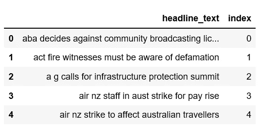
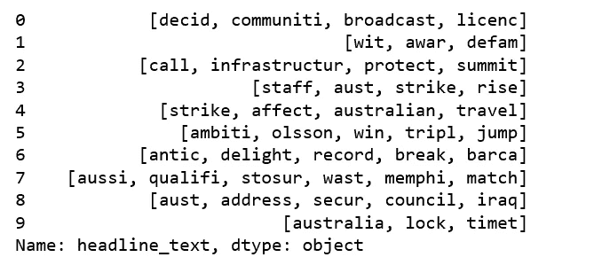
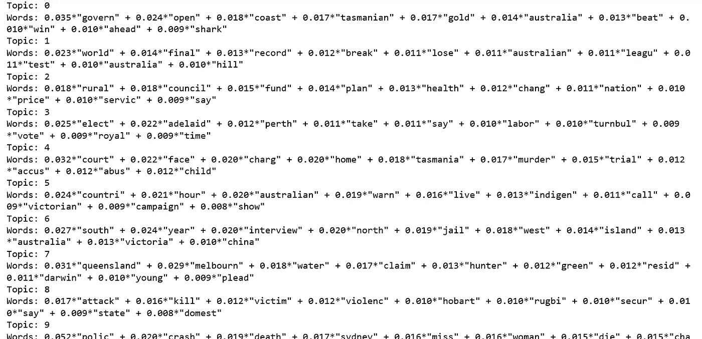
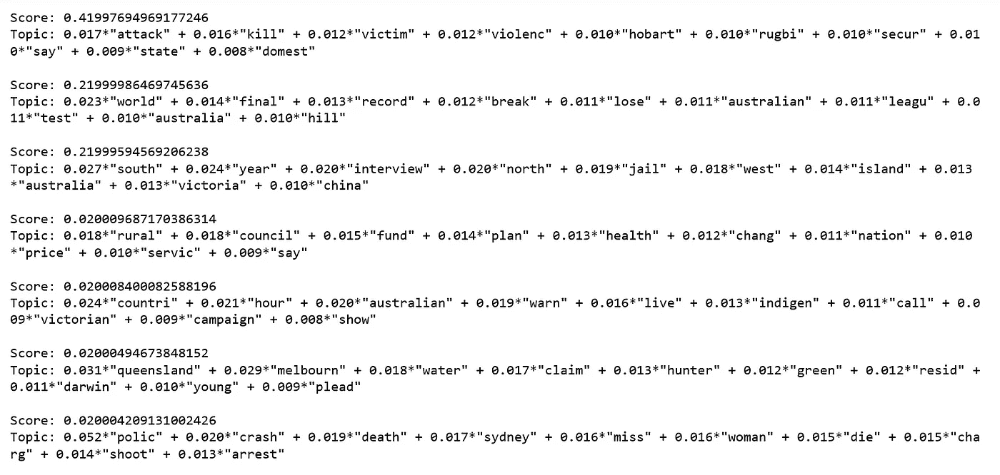
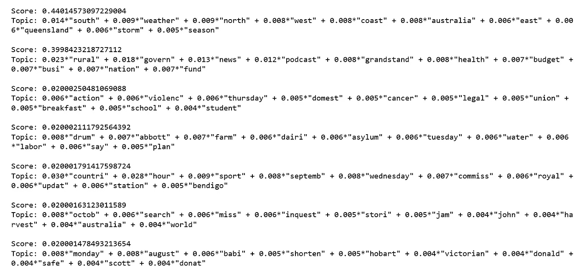
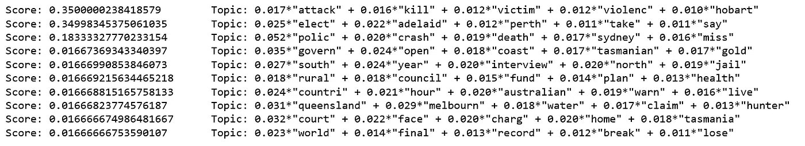

# Python 中的主题建模和潜在狄利克雷分配

> 原文：<https://towardsdatascience.com/topic-modeling-and-latent-dirichlet-allocation-in-python-9bf156893c24?source=collection_archive---------0----------------------->


Photo Credit: Pixabay

[**主题建模**](https://en.wikipedia.org/wiki/Topic_model) 是一种用于发现文档集合中出现的抽象“主题”的统计建模。 [**潜在狄利克雷分配**](http://blog.echen.me/2011/08/22/introduction-to-latent-dirichlet-allocation/) (LDA)是主题模型的一个例子，用于将文档中的文本分类到特定主题。它建立了每个文档的主题模型和每个主题的单词模型，建模为 Dirichlet 分布。

这里我们将把 LDA 应用于一组文档，并把它们分成主题。我们开始吧！

# 数据

我们将使用的数据集是 15 年间出版的超过 100 万条新闻标题的列表，可以从 [Kaggle](https://www.kaggle.com/therohk/million-headlines/data) 下载。

```
import pandas as pddata = pd.read_csv('abcnews-date-text.csv', error_bad_lines=False);
data_text = data[['headline_text']]
data_text['index'] = data_text.index
documents = data_text
```

看一眼数据。

```
print(len(documents))
print(documents[:5])
```

***1048575***



Figure 1

# 数据预处理

我们将执行以下步骤:

*   **分词**:将文本拆分成句子，句子拆分成单词。将单词小写，去掉标点符号。
*   少于 3 个字符的单词将被删除。
*   所有**停用字**都被移除。
*   单词被词汇化了——第三人称的单词变成了第一人称，过去时态和将来时态的动词变成了现在时态。
*   单词被词干化——单词被还原成它们的词根形式。

**加载 gensim 和 nltk 库**

```
import gensim
from gensim.utils import simple_preprocess
from gensim.parsing.preprocessing import STOPWORDS
from nltk.stem import WordNetLemmatizer, SnowballStemmer
from nltk.stem.porter import *
import numpy as np
np.random.seed(2018)import nltk
nltk.download('wordnet')
```

***【nltk _ data】下载包 wordnet 到
【nltk _ data】C:\ Users \ Susan Li \ AppData \ Roaming \ nltk _ data…
【nltk _ data】包 wordnet 已经是最新的了！***

***真***

**编写一个函数，对数据集**执行词汇化和词干预处理步骤。

```
def lemmatize_stemming(text):
    return stemmer.stem(WordNetLemmatizer().lemmatize(text, pos='v'))def preprocess(text):
    result = []
    for token in gensim.utils.simple_preprocess(text):
        if token not in gensim.parsing.preprocessing.STOPWORDS and len(token) > 3:
            result.append(lemmatize_stemming(token))
    return result
```

**选择预处理后的文件进行预览**。

```
doc_sample = documents[documents['index'] == 4310].values[0][0]print('original document: ')
words = []
for word in doc_sample.split(' '):
    words.append(word)
print(words)
print('\n\n tokenized and lemmatized document: ')
print(preprocess(doc_sample))
```

***原始文档:***

***['雨'，'帮忙'，'浇灭'，'丛林大火']***

***标记化和词条化的文档:***

***['雨'，'救命'，'浇灭'，'灌木']***

成功了！

**预处理标题文本，将结果保存为‘processed _ docs’**

```
processed_docs = documents['headline_text'].map(preprocess)
processed_docs[:10]
```



Figure 2

# 数据集上的单词包

从“processed_docs”创建一个字典，其中包含一个单词在训练集中出现的次数。

```
dictionary = gensim.corpora.Dictionary(processed_docs)count = 0
for k, v in dictionary.iteritems():
    print(k, v)
    count += 1
    if count > 10:
        break
```

***0 播出***

***1 共产主义***

***2 分钟***

**T5 3 许可 **

***4***

***5 默认***

***6 机智***

***⑦谓***

***8 基础设施***

***9 保护***

***10 峰会***

**Gensim 过滤器 _ 极端情况**

**过滤掉出现在**中的令牌

*   少于 15 份文件(绝对数量)或
*   超过 0.5 个文档(总语料库大小的一部分，而不是绝对数量)。
*   完成上述两个步骤后，只保留前 100000 个最常用的令牌。

```
dictionary.filter_extremes(no_below=15, no_above=0.5, keep_n=100000)
```

**Gensim doc2bow**

对于每个文档，我们创建一个字典，报告有多少
单词以及这些单词出现了多少次。将此保存到“bow_corpus ”,然后检查我们之前选择的文档。

```
bow_corpus = [dictionary.doc2bow(doc) for doc in processed_docs]
bow_corpus[4310]
```

***[(76，1)，(112，1)，(483，1)，(3998，1)]***

**我们的样本预处理文档**的单词预览包。

```
bow_doc_4310 = bow_corpus[4310]for i in range(len(bow_doc_4310)):
    print("Word {} (\"{}\") appears {} time.".format(bow_doc_4310[i][0], 
                                               dictionary[bow_doc_4310[i][0]], 
bow_doc_4310[i][1]))
```

***字 76(“bush fir”)出现 1 次。***

***字 112(“帮助”)出现 1 次。***

***字 483(“雨”)出现 1 次。***

***字 3998(“挫伤”)出现 1 次。***

# TF-IDF

使用模型创建 tf-idf 模型对象。' bow_corpus '上的 TfidfModel 并将其保存到' tfidf '，然后对整个语料库应用转换并将其命名为' corpus_tfidf '。最后，我们预览了第一份文档的 TF-IDF 分数。

```
from gensim import corpora, modelstfidf = models.TfidfModel(bow_corpus)
corpus_tfidf = tfidf[bow_corpus]from pprint import pprintfor doc in corpus_tfidf:
    pprint(doc)
    break
```

***[(0，0.5907943557842693)，***

***(1，0.3900924708457926)***

***(2，0.49514546614015836)***

***(3，0.5036078441840635)】***

# **运行 LDA 使用的包字**

使用 gensim.models.LdaMulticore 训练我们的 lda 模型，并将其保存到“lda_model”

```
lda_model = gensim.models.LdaMulticore(bow_corpus, num_topics=10, id2word=dictionary, passes=2, workers=2)
```

对于每个主题，我们将探索在该主题中出现的单词及其相对权重。

```
for idx, topic in lda_model.print_topics(-1):
    print('Topic: {} \nWords: {}'.format(idx, topic))
```



Figure 3

你能用每个题目中的单词和它们对应的权重来区分不同的题目吗？

# **使用 TF-IDF 运行 LDA**

```
lda_model_tfidf = gensim.models.LdaMulticore(corpus_tfidf, num_topics=10, id2word=dictionary, passes=2, workers=4)for idx, topic in lda_model_tfidf.print_topics(-1):
    print('Topic: {} Word: {}'.format(idx, topic))
```


Figure 4

还是那句话，能不能用每个题目里的词和对应的权重来区分不同的题目？

# **使用 LDA 词袋模型对样本文档进行分类的性能评估**

我们将检查我们的测试文档将被分类到哪里。

```
processed_docs[4310]
```

***['雨'，'帮助'，'挫伤'，'灌木']***

```
for index, score in sorted(lda_model[bow_corpus[4310]], key=lambda tup: -1*tup[1]):
    print("\nScore: {}\t \nTopic: {}".format(score, lda_model.print_topic(index, 10)))
```



Figure 5

我们的测试文档最有可能成为我们的模型分配的主题的一部分，这就是准确的分类。

# **使用 LDA TF-IDF 模型对样本文档进行分类的性能评估。**

```
for index, score in sorted(lda_model_tfidf[bow_corpus[4310]], key=lambda tup: -1*tup[1]):
    print("\nScore: {}\t \nTopic: {}".format(score, lda_model_tfidf.print_topic(index, 10)))
```



Figure 6

我们的测试文档最有可能成为我们的模型分配的主题的一部分，这就是准确的分类。

# **在看不见的文档上测试模型**

```
unseen_document = 'How a Pentagon deal became an identity crisis for Google'
bow_vector = dictionary.doc2bow(preprocess(unseen_document))for index, score in sorted(lda_model[bow_vector], key=lambda tup: -1*tup[1]):
    print("Score: {}\t Topic: {}".format(score, lda_model.print_topic(index, 5)))
```



Figure 7

源代码可以在 [Github](https://github.com/susanli2016/NLP-with-Python/blob/master/LDA_news_headlines.ipynb) 上找到。我期待听到任何反馈或问题。

参考:

[Udacity — NLP](https://www.udacity.com/course/natural-language-processing-nanodegree--nd892)