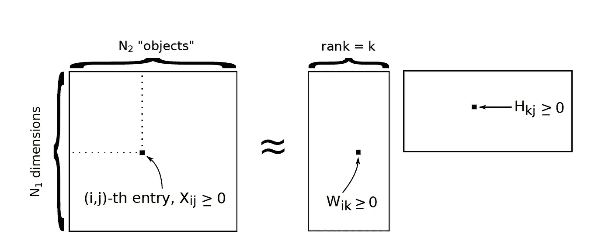
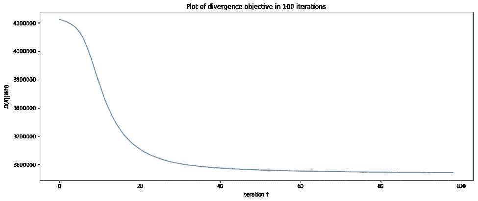
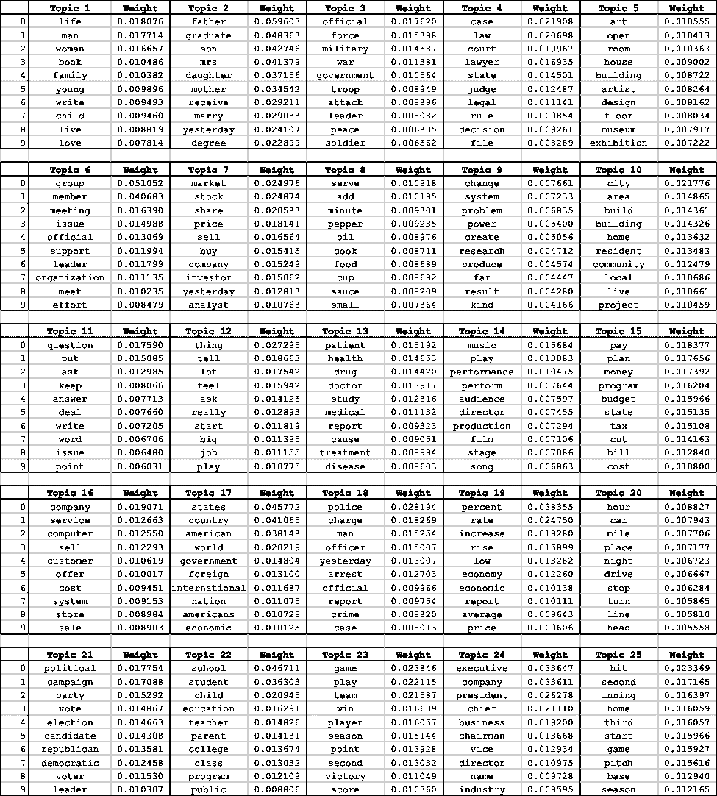

# 纽约时报新闻数据集的主题建模

> 原文：<https://towardsdatascience.com/topic-modeling-for-the-new-york-times-news-dataset-1f643e15caac?source=collection_archive---------0----------------------->

*Credits: Mario Tama, News Getty Images*

## 一种用于新闻主题分类的非负矩阵分解方法

# 为什么要主题建模？

我们生活在一个不断收集数据流的世界。因此，从收集的信息中寻找见解会变得非常乏味和耗时。主题建模是作为组织、搜索和理解大量文本信息的工具而设计的。

# 什么是主题建模？

在[机器学习](https://medium.com/towards-data-science/becoming-a-machine-learning-geek-a956a98a7498)中，主题模型被具体定义为一种自然语言处理技术，用于发现文档集合中文本的隐藏语义结构，通常称为*语料库*。一般来说，每个文档指的是一组连续的单词，就像一个段落或一篇文章，其中每篇文章包含一组单词。

让我们以*纽约时报*数据集为例，其中每篇文章代表一个文档。我们想解决的问题是这些单词在一个文档中出现的频率。这将允许我们将每个文档分类到一个特定的主题。

# NMF 是如何工作的？

通常使用两种主要的主题建模技术，*潜在狄利克雷分布* (LDA)和*非负矩阵分解* (NMF)。让我们把重点放在主题建模的后一个实现上，对纽约时报新闻数据集中的相似词进行聚类。

NMF 技术通过概率分布检查文档并在数学框架中发现主题。作为一个例子，我们首先用矩阵 **X** 作为我们的数据。这个矩阵由两个更小的矩阵 **W** 和 **H** 表示，当它们相乘时，近似重构 **X** 。

在实施 NMF 之前有一些先决条件。首先，数据 **X** 必须有非负的条目。没有丢失，但可能有许多零。第二，学习因式分解 **W** 和 **H** 必须有非负项。

# 如何实现 NMF？

这个问题中使用的数据由来自纽约时报的 8447 份文件组成。词汇量 3012 字(此处下载[)。我们首先使用该数据构建矩阵 **X** ，其中 Xij 是单词 I 在文档 j 中出现的次数。因此， **X** 是 30，128，447，并且 **X** 中的大多数值将等于零。](https://github.com/moorissa/nmf_nyt/blob/master/nyt_vocab.dat)

这里，我们将一个 **N** × **M** 矩阵 **X** 分解成一个秩- **K** 近似值 **W H** ，其中 **W** 是 **N** × **K** ， **H** 是 **K** × **M** ，矩阵中的所有值为 **W** 和 **H** 中的每个值都可以随机初始化为一个正数，这里我用的是均匀(0，1)分布。

我们通过最小化以下散度损失对该数据实施并运行 NMF 算法，其中 **W** 和 **H** 包含非负值:

> 对于数据预处理和矩阵计算，您可以在本文底部的编码参考中找到我的原始代码。

现在让我们挑选一些我们想要排序的主题，以及我们预期目标函数会偏离的迭代次数。假设我们将等级设置为 25，并运行 100 次迭代，这也对应于学习 25 个主题。

我们可以看到目标图是下面迭代的函数。通过观察目标函数的散度，我们确保了用于聚类相似单词的模型是稳定的。

运行该算法后，我们希望规范化 **W** 的列，使它们的总和为 1。这也是为了确保我们得到的概率分布没有大于零的值。

现在，假设我们为每个话题选择 10 个单词。对于 **W** 的每一列，我们列出了具有最大权重的 10 个单词，并显示权重以显示我们预期的概率分布。 **W** 的第 *i-* 行对应于提供数据的“字典”中的第 *i-* 个单词。

# 主题建模结果

下表捕获了一组包含 25 个主题的文档，这是我们预期的结果。仔细查看结果，*话题 7* 指的是**财经**话题，**医疗**领域*话题 13* ，**娱乐**领域*话题 14* ，以及**商业**领域*话题 24* 。这些只是数百个话题中的 25 个，如果不是数百万的话，还有其他的可能性！

***挑战:*** 你能猜出上面每个题目代表什么吗？下面评论下来！

# 编码参考

**注意:**代码是基于 NMF 背后的原始数学概念和直观计算实现的，但更方便的替代方法是使用 Python 库，如 *scikit-learn* 。

希望你喜欢！

*Source:* [*https://github.com/moorissa/nmf_nyt*](https://github.com/moorissa/nmf_nyt)

Moorissa 是一名研究生，目前在哥伦比亚大学学习机器学习，希望有一天她可以利用这些技能让世界变得更好，一次一天。