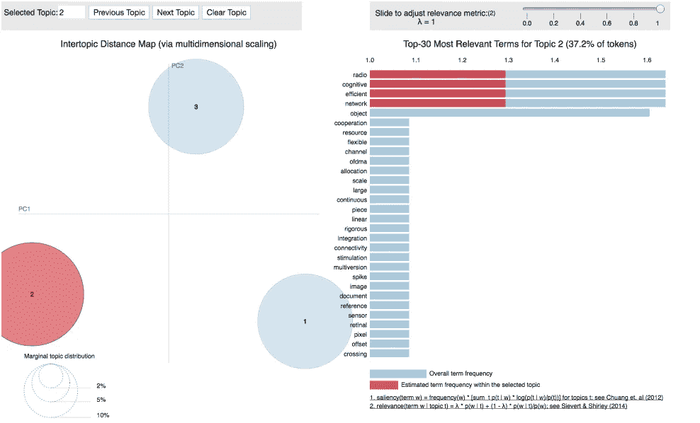
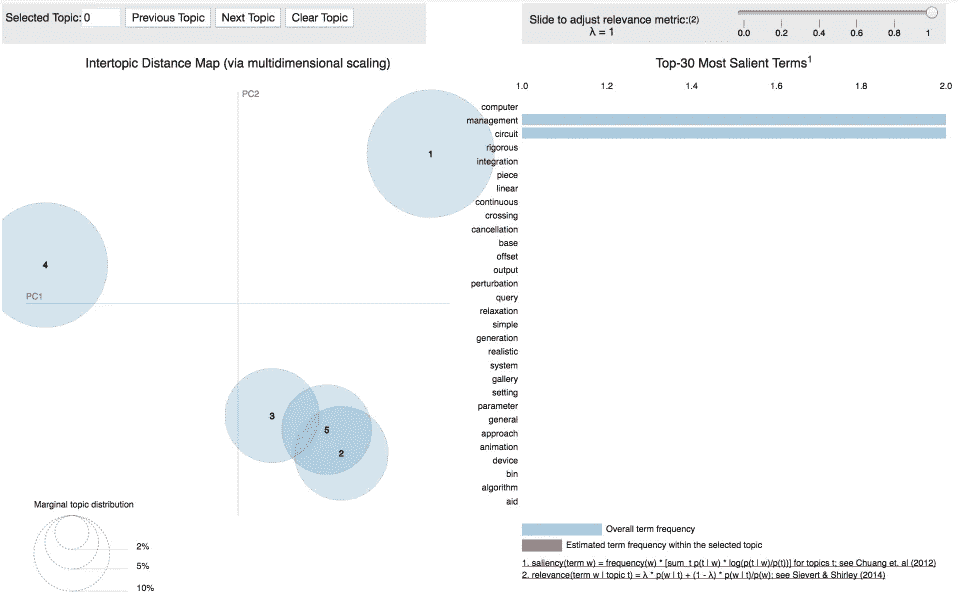
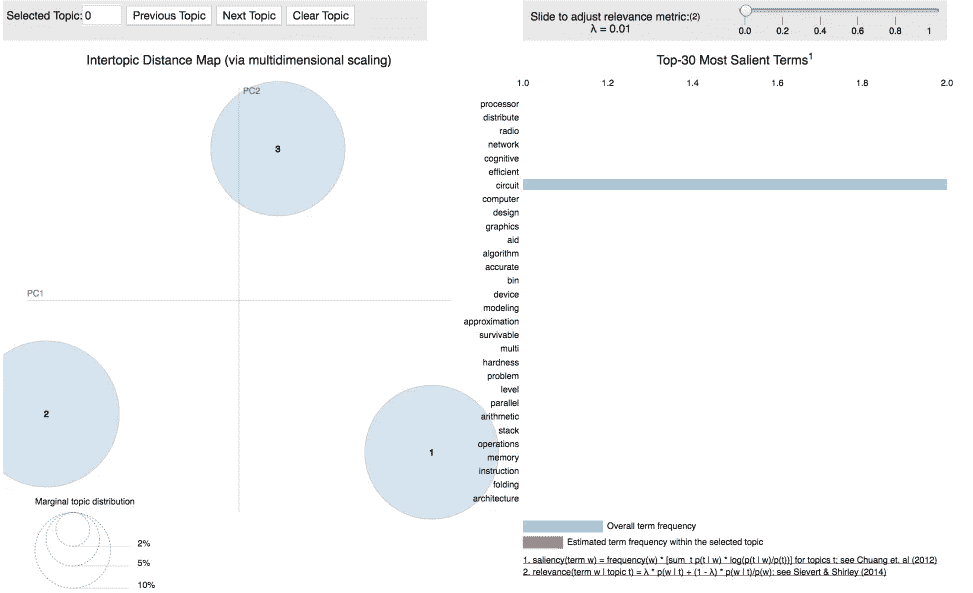
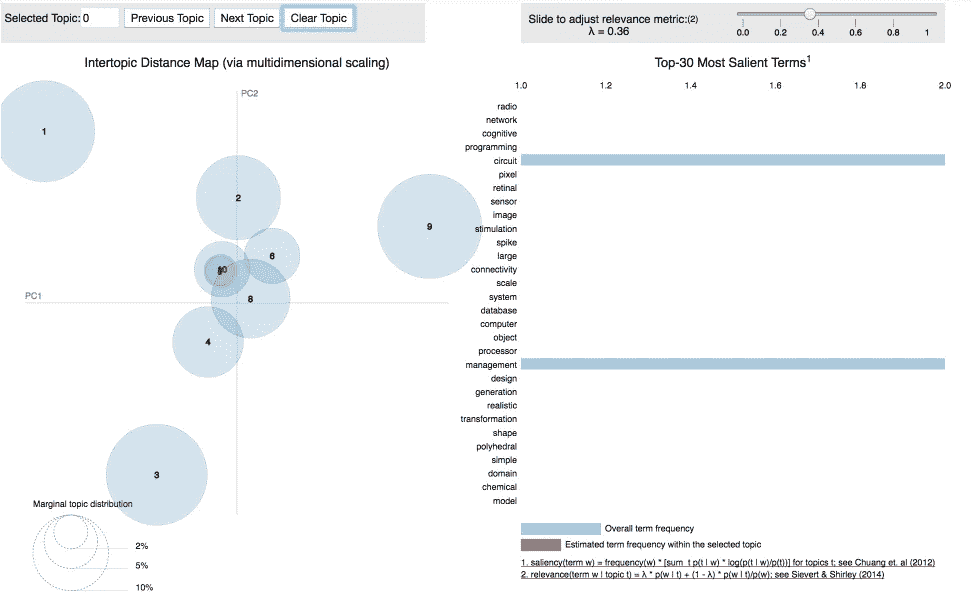

# 用 NLTK 和 Gensim 在 Python 中进行主题建模

> 原文：<https://towardsdatascience.com/topic-modelling-in-python-with-nltk-and-gensim-4ef03213cd21?source=collection_archive---------0----------------------->



在这篇文章中，我们将学习如何识别文档中讨论的主题，称为主题建模。特别是，我们将讨论[潜在的狄利克雷分配](https://en.wikipedia.org/wiki/Latent_Dirichlet_allocation) (LDA):一种广泛使用的主题建模技术。我们将应用 LDA 将一组研究论文转换成一组主题。

研究论文主题建模是一种无监督的机器学习方法，它帮助我们发现论文中隐藏的语义结构，允许我们学习语料库中论文的主题表示。该模型可以应用于文档上的任何种类的标签，例如网站上帖子上的标签。

# 该过程

*   即使我们不确定主题是什么，我们也会提前选择主题的数量。
*   每个文档都表示为主题的分布。
*   每个主题都表示为单词的分布。

研究论文文本数据只是一堆未标记的文本，可以在[这里](https://github.com/susanli2016/Machine-Learning-with-Python/blob/master/dataset.csv)找到。

# 文本清理

我们使用下面的函数来清理我们的文本并返回一个令牌列表:

```
import spacy
spacy.load('en')
from spacy.lang.en import English
parser = English()def tokenize(text):
    lda_tokens = []
    tokens = parser(text)
    for token in tokens:
        if token.orth_.isspace():
            continue
        elif token.like_url:
            lda_tokens.append('URL')
        elif token.orth_.startswith('@'):
            lda_tokens.append('SCREEN_NAME')
        else:
            lda_tokens.append(token.lower_)
    return lda_tokens
```

我们使用 [NLTK 的 Wordnet](http://www.nltk.org/howto/wordnet.html) 来寻找单词、同义词、反义词等的意思。另外，我们使用 [WordNetLemmatizer](http://www.nltk.org/_modules/nltk/stem/wordnet.html) 来获取词根。

```
import nltk
nltk.download('wordnet')from nltk.corpus import wordnet as wn
def get_lemma(word):
    lemma = wn.morphy(word)
    if lemma is None:
        return word
    else:
        return lemma

from nltk.stem.wordnet import WordNetLemmatizer
def get_lemma2(word):
    return WordNetLemmatizer().lemmatize(word)
```

过滤掉停用词:

```
nltk.download('stopwords')
en_stop = set(nltk.corpus.stopwords.words('english'))
```

现在我们可以定义一个函数来为主题建模准备文本:

```
def prepare_text_for_lda(text):
    tokens = tokenize(text)
    tokens = [token for token in tokens if len(token) > 4]
    tokens = [token for token in tokens if token not in en_stop]
    tokens = [get_lemma(token) for token in tokens]
    return tokens
```

打开我们的数据，逐行阅读，每行，为 LDA 准备文本，然后添加到列表中。

现在我们可以看到我们的文本数据是如何转换的:

```
import random
text_data = []
with open('dataset.csv') as f:
    for line in f:
        tokens = prepare_text_for_lda(line)
        if random.random() > .99:
            print(tokens)
            text_data.append(tokens)
```

*[' social crowd '，' social '，' network '，' base '，' framework '，' crowd '，' simulation']
['detection '，' technique '，' clock '，' recovery '，' application']
['voltage '，' syllabic '，' companding '，' domain '，' filter']
['perceptual '，' base '，' coding '，' decision']
['cognitive '，' mobile '，' virtual '，' network '，' operator '，' investment '，' pricing '，'f '，'神经元']
['平铺'，'交错'，'多级'，'离散'，'小波'，'变换']
['安全'，'交叉'，'层'，'协议'，'无线'，'传感器'，'网络']
['客观性'，'工业'，'展示']
['平衡'，'分组'，'丢弃'，'提高'，'性能'，'网络']
['身体 qos '，'自适应'，'无线电'，'不可知论者'，'传感器'，'网络']
['设计'，'可靠性'，'方法论']
['上下文'，'*

# 带有 Gensim 的 LDA

首先，我们从数据中创建一个字典，然后转换成[单词袋](https://en.wikipedia.org/wiki/Bag-of-words_model)语料库，并保存字典和语料库以备将来使用。

```
from gensim import corpora
dictionary = corpora.Dictionary(text_data)corpus = [dictionary.doc2bow(text) for text in text_data]import pickle
pickle.dump(corpus, open('corpus.pkl', 'wb'))
dictionary.save('dictionary.gensim')
```

我们要求 LDA 在数据中找出 5 个主题:

```
import gensim
NUM_TOPICS = 5
ldamodel = gensim.models.ldamodel.LdaModel(corpus, num_topics = NUM_TOPICS, id2word=dictionary, passes=15)
ldamodel.save('model5.gensim')topics = ldamodel.print_topics(num_words=4)
for topic in topics:
    print(topic)
```

*(0，' 0.034* "处理器"+ 0.019* "数据库"+ 0.019* "发布"+ 0.019* "概述" ')
(1，' 0.051* "计算机"+ 0.028* "设计"+ 0.028* "图形"+ 0.028* "图库" ')
(2，' 0.050* "管理"+ 0.027* "对象"+ 0.027*

主题 0 包括像“处理器”、“数据库”、“问题”和“概述”这样的词，听起来像是与数据库相关的主题。主题 1 包括像“计算机”、“设计”、“图形”和“画廊”这样的词，它肯定是一个平面设计相关的主题。主题 2 包括像“管理”、“对象”、“电路”和“高效”这样的词，听起来像是企业管理相关的主题。诸如此类。

使用 LDA，我们可以看到具有不同主题不同文档，且区别是明显的。

让我们尝试一个新文档:

```
new_doc = 'Practical Bayesian Optimization of Machine Learning Algorithms'
new_doc = prepare_text_for_lda(new_doc)
new_doc_bow = dictionary.doc2bow(new_doc)
print(new_doc_bow)
print(ldamodel.get_document_topics(new_doc_bow))
```

*[(38，1)，(117，1)]
[(0，0.06669136)，(1，0.40170625)，(2，0.06670282)，(3，0.39819494)，(4，0.066704586)]*

我的新文档是关于机器学习算法的，LDA 输出显示主题 1 具有最高的分配概率，主题 3 具有第二高的分配概率。我们同意了！

记住以上 5 个概率加起来是 1。

现在，我们要求 LDA 在数据中找出 3 个主题:

```
ldamodel = gensim.models.ldamodel.LdaModel(corpus, num_topics = 3, id2word=dictionary, passes=15)
ldamodel.save('model3.gensim')
topics = ldamodel.print_topics(num_words=4)
for topic in topics:
    print(topic)
```

*(0，' 0.029* "处理器"+ 0.016* "管理"+ 0.016* "辅助"+ 0.016* "算法" ')
(1，' 0.026* "无线电"+ 0.026* "网络"+ 0.026* "认知"+ 0.026* "高效" ')
(2，' 0.029* "电路"+ 0.029* "分发"+ 0.016*。*

我们还可以找到 10 个主题:

```
ldamodel = gensim.models.ldamodel.LdaModel(corpus, num_topics = 10, id2word=dictionary, passes=15)
ldamodel.save('model10.gensim')
topics = ldamodel.print_topics(num_words=4)
for topic in topics:
    print(topic)
```

*(0，' 0.055* "数据库"+ 0.055* "系统"+ 0.029* "技术"+ 0.029* "递归" ')
(1，' 0.038* "分发"+ 0.038* "图形"+ 0.038* "重新生成"+ 0.038* "精确" ')
(2，' 0.055* "管理"+ 0.029* "多版本"+ 0.029*

# 皮尔戴维斯

pyLDAvis 旨在帮助用户解释符合文本数据语料库的主题模型中的主题。该软件包从拟合的 LDA 主题模型中提取信息，以通知基于 web 的交互式可视化。

可视化 5 个主题:

```
dictionary = gensim.corpora.Dictionary.load('dictionary.gensim')
corpus = pickle.load(open('corpus.pkl', 'rb'))
lda = gensim.models.ldamodel.LdaModel.load('model5.gensim')import pyLDAvis.gensim
lda_display = pyLDAvis.gensim.prepare(lda, corpus, dictionary, sort_topics=False)
pyLDAvis.display(lda_display)
```



Figure 1

显著性:衡量术语告诉你多少关于主题的信息。

相关性:给定主题的单词和给定主题的单词的概率的加权平均值，由主题的概率归一化。

气泡的大小衡量了主题相对于数据的重要性。

首先，我们得到了最显著的术语，意思是术语主要告诉我们与主题相关的事情。我们也可以看个别话题。

可视化 3 个主题:

```
lda3 = gensim.models.ldamodel.LdaModel.load('model3.gensim')
lda_display3 = pyLDAvis.gensim.prepare(lda3, corpus, dictionary, sort_topics=False)
pyLDAvis.display(lda_display3)
```



Figure 2

可视化 10 个主题:

```
lda10 = gensim.models.ldamodel.LdaModel.load('model10.gensim')
lda_display10 = pyLDAvis.gensim.prepare(lda10, corpus, dictionary, sort_topics=False)
pyLDAvis.display(lda_display10)
```



Figure 3

当我们有 5 或 10 个主题时，我们可以看到某些主题聚集在一起，这表明主题之间的相似性。这是一个多么好的方法来形象化我们到目前为止所做的事情！

试试看，找个文本数据集，有标签就去掉标签，自己建个主题模型！

源代码可以在 [Github](https://github.com/susanli2016/Machine-Learning-with-Python/blob/master/topic_modeling_Gensim.ipynb) 上找到。我期待听到任何反馈或问题。