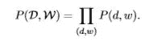
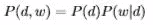
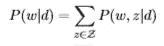
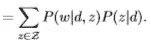
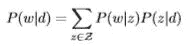
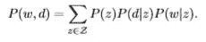
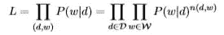
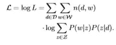
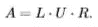
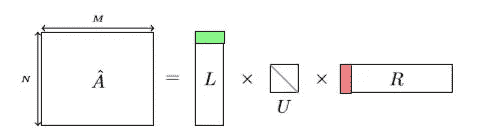

# PLSA 的主题建模

> 原文：<https://towardsdatascience.com/topic-modelling-with-plsa-728b92043f41?source=collection_archive---------3----------------------->

假设你有数百篇文章/句子。你想知道每篇文章/句子谈论什么话题。一篇描述对一家制药公司的指控的文章可能会谈论像*政府、医药*或*商业这样的话题。*我们的目标是将这些主题分配给文档。

执行这项任务的方法之一是概率潜在语义分析(PLSA)。

PLSA 或概率潜在语义分析是一种用于在概率框架下对信息建模的技术。*潜在*因为话题被当作潜在的或隐藏的变量。

# **型号:**

可以用两种不同的方式来理解 PLSA。

1.  潜在变量模型
2.  矩阵分解

第一个帮助你很好地理解 PLSA 的数学。而第二种方法很容易用 Python 实现。

让我们正式定义出现在 PLSA 的变量。

我们有三组变量

1.  **文件数:** *D={d1，d2，d3，…dN}* ， *N* 为文件数。 *di* 表示 *D* 中带有文件的*。*注意——此处的文档也可以指句子。这两个词可以互换使用。**
2.  **单词:** *W={w1，w2，…wM}* ，M 是我们词汇量的大小。 *wi* 表示词汇表中的第 I 个单词 *W.*
    *注:集合 W 被视为单词包。意思是索引 I 的赋值没有特定的顺序*
3.  **题目:** *Z={z1，z2，…zk} —* 潜变量或隐变量。数字 *k* 是我们指定的参数。

指定了命名约定之后，让我们来看看第一种方法。

## 潜在变量模型:

如前所述，主题是隐藏变量。我们唯一看到的是文字和一套文件。在这个框架中，我们将隐藏变量与观察变量联系起来。

我们将 *z* 与( *d，w)* 联系起来的方式是，我们描述一个生成过程，我们选择一个文档，然后是一个主题，然后是一个单词。形式上，

1.  我们选择一个概率为 *P(d)* 的文档
2.  对于本文档中的每一个单词 *dn，wi*——从概率为 *P(z|dn)的条件分布中选择一个话题 *zi* 。
    -* 选择一个有概率的单词 *P(w|zi)*

如果不是完全清楚，也不用担心。我在数学上把一切都放在前面了。在进入方程之前，让我们讨论一下模型的两个假设。

**假设 1——单词包:**正如我们之前讨论的，单词在词汇表中的排序并不重要。更准确地说，联合变量(d，w)是独立采样的。

假设—条件独立:我们做的一个关键假设是单词和文档是条件独立的。有条件地聚焦**这个词**。这意味着—

***P(w，d | z)= P(w | z)* P(d | z)——***(3)

上述讨论下的模型可指定如下—

***现在，***

利用条件独立性，

使用贝叶斯规则，

模型中的参数是—

1.  ***P(w | z)——***有(M-1)*K 个。怎么会？对于每一个 ***z*** 我们都有 M 个单词。但是因为这 M 个概率的和应该是 1，我们失去了一个自由度。
2.  ***P(z | d)——***有(K-1)*N 个参数来确定。

使用期望最大化或似然函数的 EM 算法来确定上述参数。

可能性函数—

Likelihood function

对数可能性—

Log Likelihood

我们不会深入 EM 算法是如何工作的。这次讨论的主要目的是让你熟悉主题如何与观察到的变量、单词和文档相关联。如果你想了解它的数学，你可以在这里找到相关的论文。

## 矩阵分解模型

另一种表示 PLSA 的方法是矩阵分解模型。

考虑一个维度为 *N*M* 的文档-单词矩阵，其中 *N* 是文档的数量， *M* 是词汇表的大小。矩阵的元素是一个单词在文档中出现的次数。如果单词 *wi* 在文档 *dj* 中出现一次，那么元素 *(j，i) = 1。*

如果你想到这个矩阵，大部分元素都是 0。假设我们有一个 10 个单词的文档和 1000 个单词的词汇表。自然地，该行的 990 个元素将具有值 0。这样的矩阵称为*稀疏矩阵。*

矩阵分解的作用是将这个矩阵(姑且称之为 *A* )分解成低维矩阵(奇异值分解)

Pictorial representation of the above equation

*L、U* 和 *R* 的尺寸分别为 *N*K、K*K* 和 *K*M* 。

矩阵 U 是对角矩阵，取值为 *AA** 的特征值的平方根，其中*表示转置。对于任意给定的 *k，*你选择 *L 的第 k *行，*的第 *k* 元素， *U* 的第 *k* 列， *R.* 的第*k*列，记住， *k* 是我们设置的题目数。*

这个模型与潜变量模型没有太大的不同。这三个矩阵可以解释为—

1.  *L* 包含文档概率 ***P(d|z)***
2.  *U* 是主题 ***P(z)*** 的先验概率的对角矩阵
3.  *R* 对应单词概率 ***P(w|z)***

所以如果你把三个矩阵相乘，你实际上做的是下面的等式——

请注意，这三个矩阵的元素不能为负，因为它们代表概率。因此，使用[非负矩阵分解](https://www.cc.gatech.edu/~hpark/papers/nmf_book_chapter.pdf)来分解 *A* 矩阵。

如果你想在 Python 中应用这个算法，你可以在这里找到一个例子。

感谢阅读！如果你喜欢这个博客，你可能想看看我的另一篇关于单词嵌入和 Word2Vec 的文章。

欢迎分享你的观点。很乐意在 LinkedIn 上与您联系