# 总体最小二乘法与 OLS 和 ODR 的比较

> 原文：<https://towardsdatascience.com/total-least-squares-in-comparison-with-ols-and-odr-f050ffc1a86a?source=collection_archive---------4----------------------->

## 线性回归分析的整体概述

**目录:**

1.  OLS:快速回顾
2.  TLS:解释
3.  ODR:触及表面
4.  三种方法的比较及结果分析

总体最小二乘法(又名 TLS)是一种回归分析方法，旨在最小化响应变量(或观察值)和预测值(我们常说的拟合值)之间的误差平方和。最流行和标准的方法是普通最小二乘法(又名 OLS)，TLS 是采用不同方法的其他方法之一。为了获得实际的理解，我们将通过这两种方法以及正交距离回归(又名 ODR)来了解一下，这是一种旨在最小化正交距离的回归模型。

## OLS:快速回顾

为了复习我们的知识，首先让我们回顾一下回归分析和 OLS。一般来说，我们使用回归分析来预测(或模拟)未来事件。更准确地说，如果我们有一堆过去收集的数据(这是一个自变量)和相应的结果(这是一个因变量)，我们就可以用我们刚刚收集的新数据来制造预测未来结果的机器。

为了制造更好的机器，我们应用回归分析并试图获得更好的参数，这是我们模型的斜率和常数。例如，让我们看看下图。我们求红色回归线的参数(而蓝色点是数据点(响应变量和自变量)，灰色线的长度是这个估计量计算出来的残差的量)。

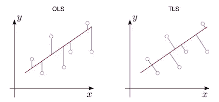

A visual comparison between OLS and TLS

在 OSL，灰色线不是正交的。这是 OSL 和 TLS(以及 ODR)的主要区别。在 OSL，灰线平行于 y 轴，而在 TLS 中，灰线垂直于回归线。OLS 的目标函数(或损失函数)定义为:

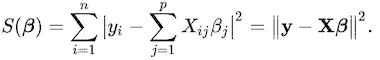

这通过二次最小化来解决。我们可以从中获得参数向量(这就是我们所需要的)。

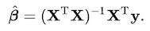

Numpy 为此提供了 numpy.linalg.lstsq，不过从头开始实现这个 ***正规方程*** 很容易。我们在下面的代码中得到 ***b*** 中的参数向量，并用它来预测拟合值。numpy.linalg.lstsq 期望常量 ***c*** 存在于最后一个索引处，所以我们需要切换列值的位置。

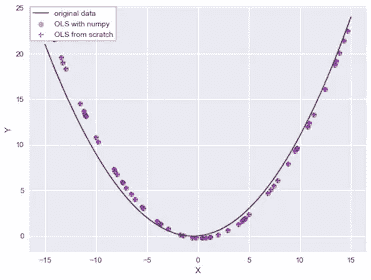

## TLS:解释

让我们回到 TLS，考虑一下 TLS 优于 OLS 的原因。OLS 期望所有的样本数据都被精确地测量，或者没有误差地观察。然而，在实际情况下，或多或少会有观测误差。如果假设是合理的，OLS 可能是一个不一致的估计量，而不是理论假设的理想机器。TLS 可以考虑这个问题，它允许自变量和因变量都存在误差。我们希望最小化自变量的误差 ***E*** 和因变量的误差 ***F*** 。这些误差被认为包含观测误差和残差。

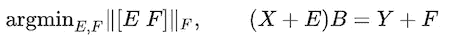

用 SVD 求解 X 和 Y 的协方差矩阵后，我们得到了下面的等式。*是 ***的左奇异向量【xᵀy】******【σ】***是对角线上有奇异值的对角矩阵。*

*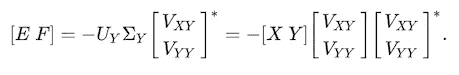*

*同样参数向量 ***B*** 定义为:*

*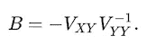*

*在下面的代码中(TLS 正规方程的实现)，我们计算了***【E F】***并添加了对 ***Xtyt*** 的返回。(Xtyt 只是 x 波浪号和 y 波浪号的意思。一个波浪号往往暗示一个近似值)垂直堆叠的向量***【vxy vyy】***是***【xᵀy】******v***的右奇异向量的整个最后一列。用于计算参数向量***【B】***的 ***Vxy*** 和 ***Vyy*** 与此不同。 ***Vxy*** 和 ***Vyy*** 都是被截断的数量的***×变量*** 。*

*第***【n】***列为错误*****n***到最后一列为错误 ***F*** 。我们还可以通过***Y =【X，E】B***计算出估算的 ***Y*** 值，写在下面第 15 行。关于 Matlab 中更多数学过程和代码的参考，可以查看 [*这个*](http://people.duke.edu/~hpgavin/SystemID/CourseNotes/TotalLeastSquares.pdf) 详细 pdf。***

**(**警告**:对于非 Matlab、R、Julia 或 Fortran 用户，数组的索引从 1 开始)**

**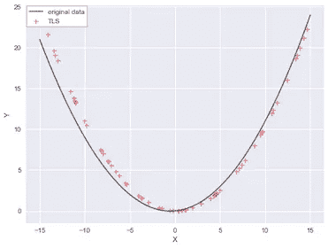**

## **ODR:触及表面**

**有一种回归模型旨在最小化正交距离。谢天谢地，Scipy 提供了 scipy.odr 包。我们可以在***数据*** *功能中设置误差值***【wd】**。这是一个权重矩阵，用于处理残差的不等方差(异方差)。如果我们事先知道误差有多大/多小，这种调整可以提高估计量。然而，在现实世界中，很难确定或估计这一点。这种加权也是提高加权最小二乘和广义最小二乘应用的有效方法之一。******

***我们在***【wd】***中设置***1×******N***的误差值数组，也就是说*的误差值被应用到*的数据点上。*****

***ODR 比其他国家更适合这个数据集。***

***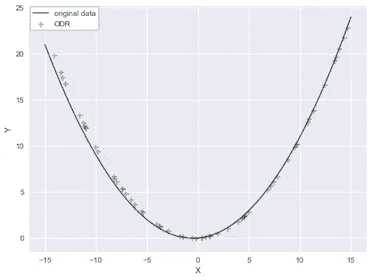***

## ***三种方法的比较***

***让我们比较这三种方法，直观地看看它们的适用性。左图中灰色的上方三角形是自变量和因变量都包含错误的数据。右图显示了每个模型产生的每个数据点的误差。纵轴表示误差有多大。ODR 和 TLS 在二次曲线的中心拟合得非常好，然而，随着它们远离中心，它们的预测失去了精度。为了解释这一点，当拟合值的方差很小时，ODR 和 TLS 工作得很好。特别是当拟合值的方差如此大时，TLS 将不再正确工作，尽管当方差小时，在没有任何加权值的情况下预测拟合值是非常精确的。在这种情况下，我们需要应用迭代方法，例如梯度下降。***

***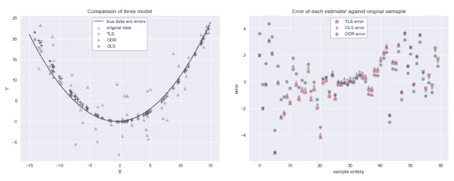***

***以确保每个模型的均方误差(又名 MSE)和拟合优度(或 R2 分数)。总的来说，ODR 更适合这个数据样本，但这取决于数据。我们需要逐一考虑这些模型，直到找到最佳模型。***

***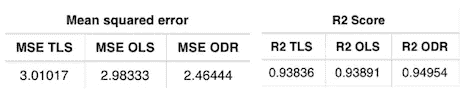***

***参考资料:***

***[总体最小二乘 PDF CEE 629 杜克大学](http://people.duke.edu/~hpgavin/SystemID/CourseNotes/TotalLeastSquares.pdf)***

***[总体最小二乘维基](https://en.wikipedia.org/wiki/Total_least_squares)***

***[正交距离回归初级读本](https://wormlabcaltech.github.io/mprsq/stats_tutorial/ODR.html)***

***我们浏览的样本数据:***