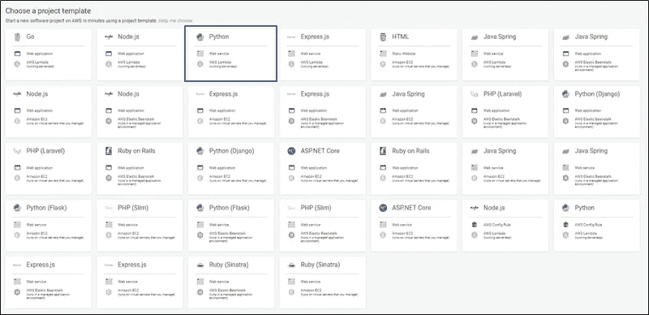
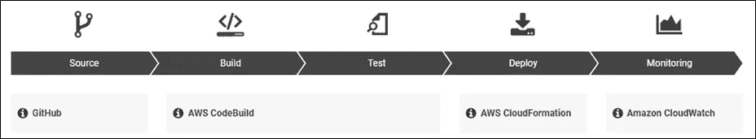
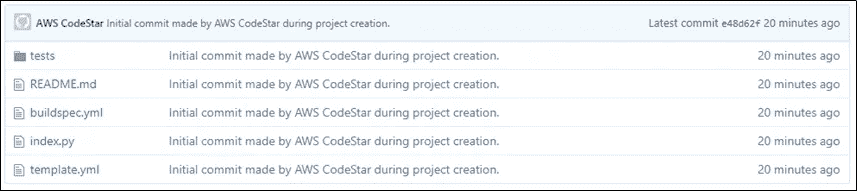
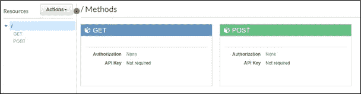
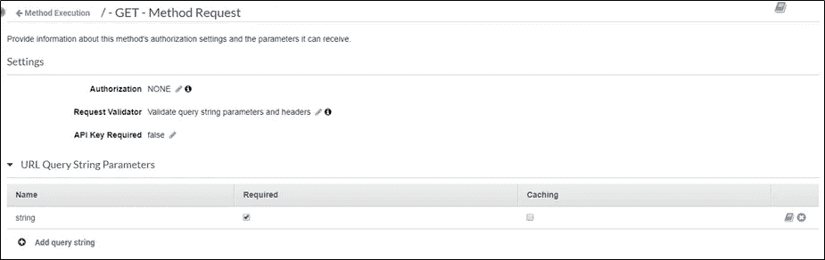
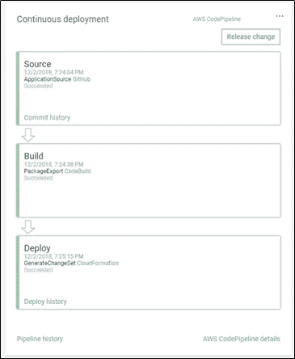

# 使用 AWS CodeStar，在 10 分钟内将您的 ML 模型转变为 web 服务

> 原文：<https://towardsdatascience.com/tourn-your-ml-model-into-a-web-service-in-under-10-minutes-with-aws-codestar-d9e0f4ae24a6?source=collection_archive---------13----------------------->

## 部署您的模型变得更加容易

Photo by [Ryan Hutton](https://unsplash.com/photos/Jztmx9yqjBw?utm_source=unsplash&utm_medium=referral&utm_content=creditCopyText) on [Unsplash](https://unsplash.com/search/photos/star?utm_source=unsplash&utm_medium=referral&utm_content=creditCopyText)

作为一名数据科学家，开发一个能够做出正确预测的模型本身就让人觉得非常值得。然而，您机器上的 hdf5 文件通常对您的公司或任何与您刚解决的问题有相同问题的人来说并没有真正的帮助。因此，下一步通常是为您的模型创建一个 web 服务，您可以通过 API 访问它。一种选择是编写一个 Flask 应用程序，您可以将其托管在您的服务器上。不幸的是，这种方法通常很复杂，而且扩展性不好。虽然有很多工具可以帮助设置和管理虚拟服务器，但是每个试图设置 EC2 实例的人都知道随之而来的麻烦。坚持使用 AWS，下一个选择是在 Lambda 上运行您的模型，通过 API Gateway 等公开它。由于至少需要管理四个不同的服务+代码，这种方法可能更简单，但仍然非常复杂。幸运的是，亚马逊认识到了这个问题，并在 2017 年推出了解决方案: [**AWS CodeStar**](https://aws.amazon.com/codestar/) 。

CodeStar 通过以直观易用的方式连接多个 AWS 服务，简化了应用程序的创建和部署流程。作为一个例子，我们将部署我的实现[Rob Renalds](https://github.com/rrenaud/Gibberish-Detector)Gibberish Detector，这是一个基于马尔可夫链的工具，用于检测一个字符串是包含真正的单词还是只是随机的“乱码”。我在德语文本上训练模型，并将其存储为 Python Pickle 文件。

到本文结束时，我们将拥有一个工作的 web 服务，它通过 GET 请求接收一个变量，通过 Python 代码运行模型，并将结果预测作为 JSON 返回。

## 步骤 1:创建您的 CodeStar 项目

Over 30 templates make it easy to set up your web service or app

因为我们的目标是建立一个 web 服务，所以我们可以选择第一个 Python 模板。因此，我们的服务将在 Lambda 上“无服务器”运行。以下三个步骤相对来说不言自明:

1.  我们决定一个项目名称，AWS 也将把它转换成一个 URL 友好的项目 id。稍后，这个项目 id 将成为 HTTP 端点的一部分。
2.  接下来，我们必须选择我们首选的 Git 存储库。如果您决定使用 GitHub，您可以选择更改存储库名称、描述，并将其设置为 public 或 private。CodeStar 将为您创建一个存储库，其中包含所有必需的文件，稍后会有更多相关内容。
3.  为了发挥它的魔力，CodeStar 需要获得许可来代表你管理我们管道中所有不同的工具。

Our AWS CodePipeline

## 步骤 2:连接到您的源存储库

CodeStar 的一个伟大之处在于，代码都是通过 Git 管理的，每次更新都会更新 Lambda 函数并自动部署。因为 AWS 会自动为您创建存储库，所以开始编码所需要做的就是一个`git clone your_repository_url`。

AWS CodeStar creates all the necessary files for you

## 步骤 3:在 AWS APIGateway 中创建 GET 参数

要更改 API 参数，我们需要在 AWS APIGateway 中打开我们的项目。最快的方法是在我们的仪表板的边栏上:项目->项目资源-> AWS APIGateway。

AWS APIGateway before our changes

第一步是添加一个*方法请求*。在本练习中，我们添加一个字符串参数，称为*字符串*。因为我们需要这个输入来运行我们的模型，所以我们可以将这个参数*设为必需的*。APIGateway 要求我们检查一个合适的*请求验证器*。因为我们只使用 URL 参数，所以验证器*验证查询字符串参数和头*就可以了。以下是结果页面的外观:

AWS APIGateway configuration for one URL parameter

## 步骤 4:编写 Lambda 函数

CodeStar 从您的 Git 存储库构建。因此，一旦完成，您就可以在您最喜欢的 IDE 和`push`中编写代码。默认情况下，创建的存储库包含以下项目:

*   index.py:这个文件包含 Lambda 函数的代码。
*   readme . MD:readme 文件包含有关后续步骤的基本信息以及到官方文档的链接。
*   template.yml:你的“无服务器”AWS 架构的结构。
*   这个文件包含在构建过程中执行的附加命令。标准的命令预构建是单元测试的执行。
*   tests/:包含带有上述单元测试的文件 *test_handler.py* 。

首先，我们必须使我们的模型文件可以被函数访问。最简单的方法是将文件添加到我们的 Git 存储库中。AWS Lambda 有相对宽松的[存储限制](https://docs.aws.amazon.com/lambda/latest/dg/limits.html)，对于大多数用例来说应该足够了。一旦上传，Lambda 可以使用`open`以通常的方式访问文件。

最后，我们可以将我们的 Python 代码写入 index.py，它将成为我们的 Lambda 函数。根据我们在步骤 3 和 4 中的设置，我们可以通过`event`参数轻松访问 URL get-parameter:

`req_name = event['queryStringParameters']['string']`

你可以在 [Github](https://github.com/R4h4/gibberish_detection/blob/master/index.py) 上找到完整代码。在实现了主函数之后，我们必须更新单元测试。请记住，如果单元测试失败，服务将不会被部署。因此，我们会相应地更新所有内容:

我们现在要做的就是使用常用的命令:`git add .`、`git commit`和`git push`将模型文件和代码推送到项目存储库。一旦更改上线，CodeStar 将自动更新其代码基础，并构建和部署一切。您可以在仪表板的右侧找到状态。

How it should look like

## 最后的话

如果你跟着做了——恭喜你，你刚刚在不到 10 分钟的时间里公开了你的机器学习模型！您可以在仪表板上找到 API 的端点，添加参数，瞧。由于 AWS CodePipline 的集成，很容易保持您的模型更新，与 Amazon CloudWatch 的连接让您可以深入了解一旦您的功能在野外会发生什么。
通过 Lambda 公开你的机器学习模型只是你可以用 CodeStar 做的许多伟大事情之一。下一次，当你在设置任何涉及 5+服务的 AWS 工作流程时迷失了方向，看一看，也许 CodeStar 也能帮助你减少生产时间。