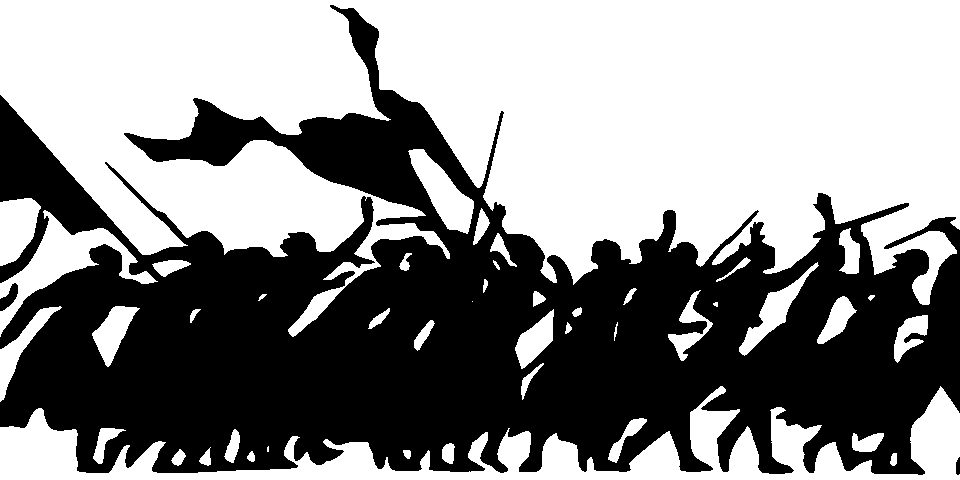

# 走向防御性数据科学宣言

> 原文：<https://towardsdatascience.com/towards-a-manifesto-of-defensive-data-science-a09fb9d37acd?source=collection_archive---------13----------------------->

*数据科学家的世界你一无所获，却收获了更多的客户*

我是一个非常糟糕的壁球运动员，但在一个短暂的时期内，当一个对手告诉我如何防守时，我成为了一个稍微更好的壁球运动员——而不是每次击球时都试图击出致胜球或吊球，稳定而深入地回击，以便我的对手最终更接近他们的后角，最终犯下错误。事实证明，遵循这一策略，我可以比全力以赴打好每一杆时赢得更多的分数。更好的是，在前两个点打完之后，我并没有因为跑来跑去而筋疲力尽——直到第四个点打了一半才停下来。

数据科学有一点相同，因为人们经常试图用最精彩的镜头赢得每一分，而不是通过应用正确的工具，更不用说通过应用允许他们花费最少努力的正确工具。

合适的工具会更容易实现，更容易理解，更容易交流。它将使用较少的计算能力来计算其结果。防御数据的本质在于算法的经济性。

为了最新的事物而避开它的理由很容易被发现。最显而易见的是，在一种方法是尖端的和它难以实现之间有一种直观的关联。有些时候，这是因为方法本身就很复杂。在其他时候，这将是由于该方法缺乏成熟的现成解决方案(否则它不会是“前沿”)，所以需要做更多的工作来形成什么是可用的，以满足您的应用程序的特定需求。

这里有比投入[不必要的努力](https://www.processexcellencenetwork.com/lean-six-sigma-business-transformation/articles/the-7-deadly-wastes-that-could-cost-your-company)更多的风险——尽管[新乡重夫](https://en.wikipedia.org/wiki/Shigeo_Shingo)会告诉你那已经够糟了。算法最简单的模型是最容易被顾客和客户接受的，可信的模型是最能赢得人心的。一个算法存在的时间越长，你的客户就越有可能见过它。越简单，他们就越有可能理解它，从而信任它。因此，你的发现可以传播给他人的观念是数据科学防御方法的主要目标之一。

比过于复杂的算法更不必要的是错误问题的解决方案。正如约翰·图基(John Tukey)所说，“对*正确*的问题给出一个大致的答案，这通常是模糊的，远比对错误问题给出一个*精确*的答案好得多，后者总是可以变得精确。”

发现正确问题的途径需要[时间与客户一起了解他们的需求](/selling-your-data-science-project-7e3e06f91ec6) —但是在这里花的时间越多，你越认真地试图理解问题背后的[问题，解决方案就越有价值。](https://en.wikipedia.org/wiki/5_Whys)

找到了解决客户问题的可行方案后，下一个重要步骤是找到向客户解释的最佳方式，除非他们不可能不理解，否则不能指望或相信他们会理解。正如谚语所说，数据科学家 80%的精力花在清理数据上，80%的精力也花在向需要理解数据的人解释最终结果上。

交流的可视化策略不同于发现的可视化策略。一个完整的解决方案必须包括允许客户自己发现的独特组件，以及确保客户正确理解您的发现的组件。因此，确保你的沟通不留任何侥幸心理是防御数据科学的另一个核心要点。

当然，不管你认为你知道多少，也不管你认为你的算法有多好，你出错的可能性仍然存在。一个防御性的数据科学家欢迎被证伪——不仅仅是因为道德含义。通过提出明确的案例，并用数据支持，防御性数据科学家确保主题专家可以提出有用的批评，并通过在发布前将模型暴露给这些人，最大限度地提高了在任何人受到影响之前发现错误的可能性。

李小龙信奉的哲学是“运动经济”——用最少的努力获得结果。当然，为了达到这种效果，李和他的学生刻苦训练，以完善他们的技术。实际上，他们在道场投入了最大的努力，特别是在打斗中尽量减少努力。防御性数据科学要求数据科学家付出努力来防止用户不必要的努力。