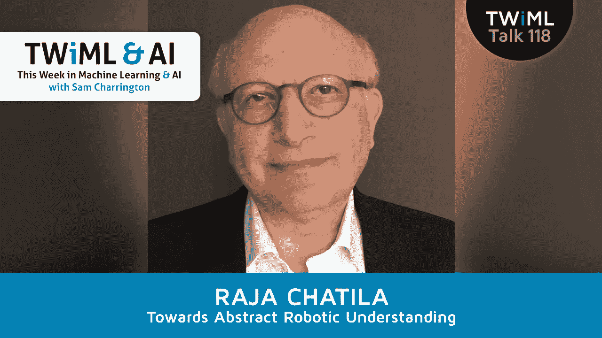

# Raja Chatila 的抽象机器人理解

> 原文：<https://towardsdatascience.com/towards-abstract-robotic-understanding-with-raja-chatila-d1c32e9c0f6d?source=collection_archive---------9----------------------->

## TWiML Talk 118

在这一集里，我们邀请到了 Raja Chatila，他是巴黎皮埃尔和玛丽·居里大学智能系统和机器人学主任，也是 IEEE 智能和自治系统伦理全球倡议的执行委员会主席。

## 订阅:[iTunes](https://itunes.apple.com/us/podcast/this-week-in-machine-learning/id1116303051?mt=2)/[SoundCloud](https://soundcloud.com/twiml)/[Google Play](https://goo.gl/app/playmusic?ibi=com.google.PlayMusic&isi=691797987&ius=googleplaymusic&link=https://play.google.com/music/m/Ihs3mamzsef2akrfycfkq3sspti?t%3DThis_Week_in_Machine_Learning_%2526_AI_Podcast)/[Stitcher](http://www.stitcher.com/s?fid=92079&refid=stpr)/[RSS](https://twimlai.com/feed)

Raja 和我就他的研究聊得很开心，他的研究涉及机器人的感知和发现。我们讨论了学习和发现之间的关系，特别是当它应用于机器人及其环境时，以及机器人感知和行动之间的联系。我们还深入探讨了应用于智能系统的启示、抽象教导、元推理和自我意识的概念。最后，我们触及这些系统的价值和伦理问题。

# 和我一起参加人工智能峰会

你是一名需要在企业中广泛的机器学习和人工智能机会上变得聪明的 IT、技术或业务领导者吗？或者，也许你组织中的某个人可以从这方面的提升中受益？(或者，也许你会从他们的升级中受益！)如果这听起来像你或你认识的人，你可能会对我即将举行的人工智能峰会感兴趣。

把这个活动想象成一个为期两天的机器学习和人工智能的技术 MBA。你会清楚地了解:

机器学习和深度学习如何工作(不需要数学知识)
如何在您的组织中识别机器学习和深度学习的机会
如何理解和利用计算机视觉和自然语言处理等技术
如何管理和标记数据以利用 ML 和 AI
以及如何建立 AI 优先的文化，并在您的业务中实施 AI。

你将对整个人工智能和人工智能领域正在发生的事情有一个知情的观点，并将能够自信地与你的同事、客户和合作伙伴讨论机器学习和人工智能。我对这次活动和演讲者感到非常兴奋，你们将有机会向他们学习。欲了解更多信息，请访问[twimlai.com/aisummit](https://twimlai.com/aisummit)，如有疑问，请随时联系[我](http://twimlai.com/contact)。

# 关于 Raja

*   [LinkedIn 上的拉贾](https://www.linkedin.com/in/rajachatila/?locale=en_US)
*   [ISIR 的拉贾](http://www.isir.upmc.fr/?op=view_profil&id=229)

# 采访中提到

*   [在这里报名参加人工智能大会！](https://twimlai.com/ainy2018)
*   [看看@ShirinGlander 的伟大 TWiML 速写！](https://www.shirin-glander.de/)
*   [TWiML 呈现:系列页面](https://twimlai.com/series)
*   [TWiML 事件页面](https://twimlai.com/events)
*   [TWiML Meetup](https://twimlai.com/meetup)
*   [TWiML 简讯](https://twimlai.com/newsletter)

由李·罗斯韦尔创作的《以后再谈》，由 CC 4.0 授权

*原载于 2018 年 3 月 12 日*[*twimlai.com*](https://twimlai.com/twiml-talk-118-towards-abstract-robotic-understanding-raja-chatila/)*。*