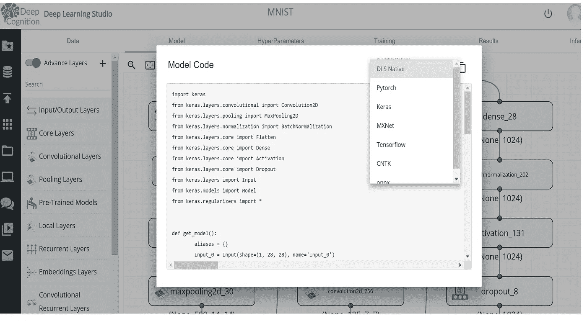
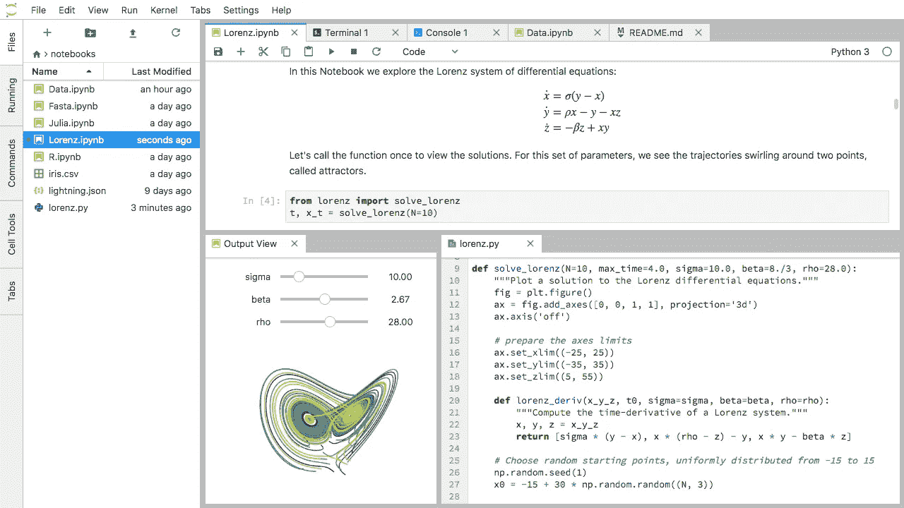
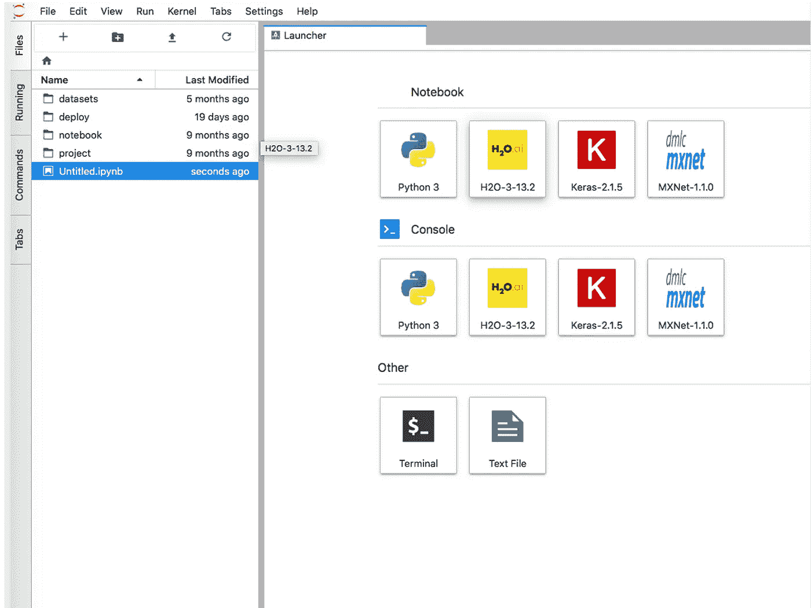
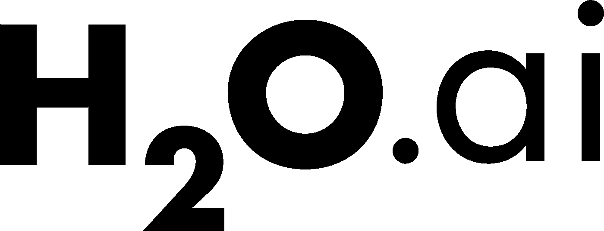
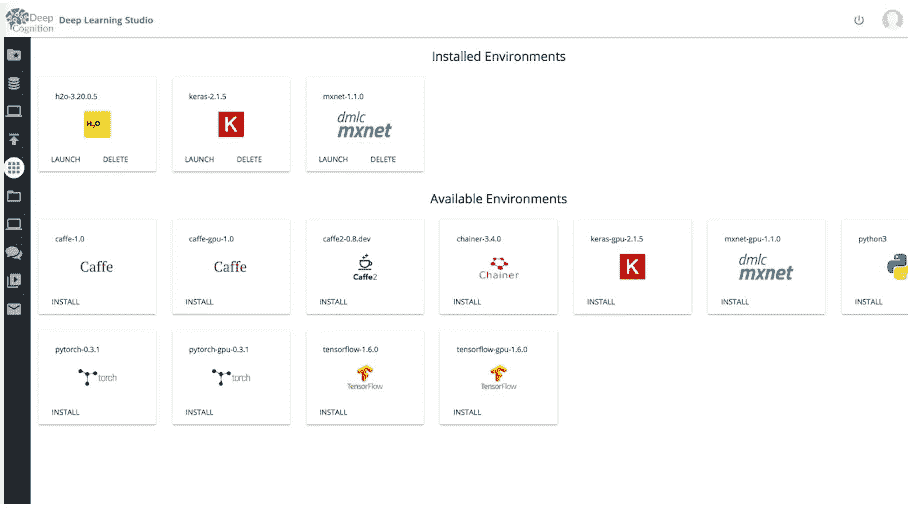
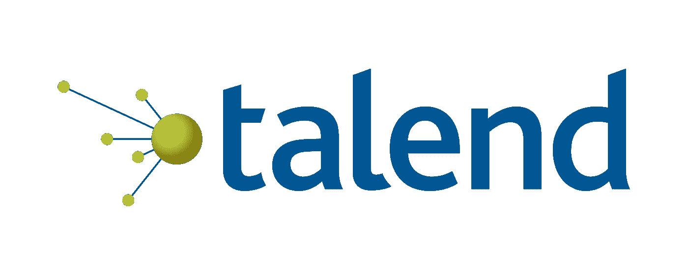
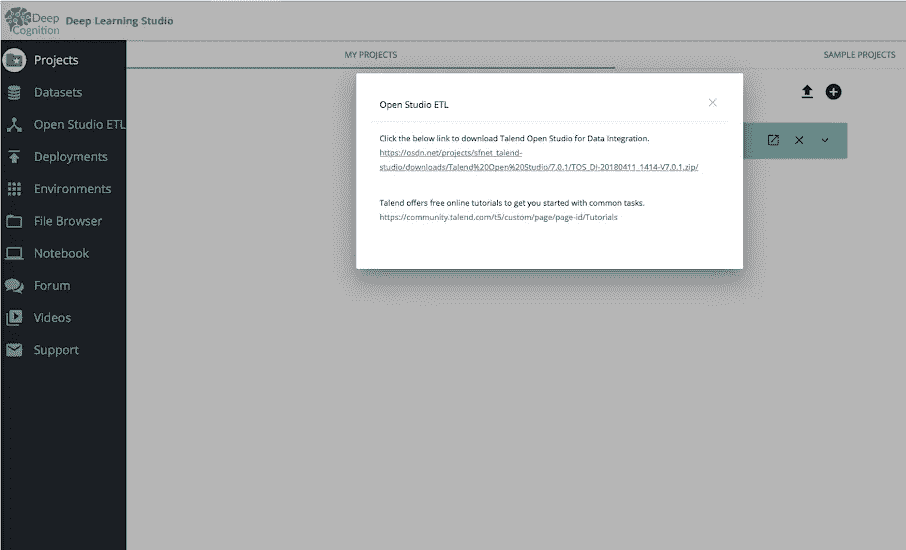

# 以深度认知迈向更轻松的深度学习生活

> 原文：<https://towardsdatascience.com/towards-an-easier-deep-learning-life-with-deep-cognition-8fa8f41ca672?source=collection_archive---------16----------------------->

## Deep Cognition 的深度学习工作室的新版本中出现了令人惊叹的新功能。你有深度学习模型但是你希望它在 TensorFlow 或者 MXNet？现在可以转换了！JupyterLab 已为您预先配置，H2O 现已作为预先配置的环境和新的集成功能提供给 Talend！

深度学习有趣又神奇。现在做深度学习非常容易，你有很多很好的框架和库、平台等等。但我认为改变游戏规则的是[深度认知](https://medium.com/u/561cb78751ed?source=post_page-----8fa8f41ca672--------------------------------)。

在他们的新版本中，他们为他们的深度学习工作室(DLS)添加了惊人的功能。顺便说一句，如果你想知道更多，就看看这个:

 [## 深度认知让深度学习变得简单

### 在过去的一个月里，我有幸见到了 DeepCognition.ai 的创始人

becominghuman.ai](https://becominghuman.ai/deep-learning-made-easy-with-deep-cognition-403fbe445351)  [## 深度认知的视频漫游

### 大家好！在本文中，我将与您分享几个视频，带您浏览深度认知的平台…

towardsdatascience.com](/a-video-walkthrough-of-deep-cognition-fd0ca59d2f76) 

要尝试我将向您展示的新功能，您需要下载最新版本的 DLS:

 [## 深度学习工作室桌面

### Deep Learning Studio - Desktop 是在您的硬件上本地运行的单用户解决方案。桌面版允许您…

deepcognition.ai](https://deepcognition.ai/products/desktop/) 

# **提高不同深度学习框架之间的互操作性**

深度学习工作室增加了一个功能，可以让用户将模型转换为 Tensorflow、Caffe、Keras2、MXNet、CNTK、Pytorch 或 ONNX。

你现在可以复制转换后的代码，并在喜欢的深度学习框架中使用它。

这太酷了，因为如果出于某种原因你需要创建 Pytorch 代码，但你只知道 Keras，现在你可以很容易地转换你的代码。

# **JupyterLab 现已在深度学习工作室内可用**

如果你没有听说过，JupyterLab 是 Jupyter 项目的下一代用户界面。它提供了经典 Jupyter 笔记本的所有熟悉的构建模块(笔记本、终端、文本编辑器、文件浏览器、丰富输出等)。)在一个灵活而强大的用户界面中，可以通过第三方扩展进行扩展。

JupyterLab 是一个交互式开发环境，用于处理笔记本、代码和数据。最重要的是，JupyterLab 完全支持 Jupyter 笔记本。

JupyterLab 提供了笔记本、文档和活动之间的高度集成:

*   拖放以重新排列笔记本单元格，并在笔记本之间复制它们。
*   从文本文件(以交互方式运行代码块。py，。r，。md，。tex 等。).
*   将代码控制台链接到笔记本内核，以交互方式探索代码，而不会因为临时的临时工作而弄乱笔记本。
*   使用实时预览编辑流行的文件格式，如 Markdown、JSON、CSV、Vega、VegaLite 等。

JupyterLab 建立在一个扩展系统之上，该系统使您能够通过安装额外的扩展来自定义和增强 JupyterLab。

现在在 DLS 你可以看到:

# **H2O.ai 现已在 DLS 作为预配置环境提供**

是的。朱庇特拉布的最后一张照片是对 H2O 的一个试探！现在也是 DLS 的一部分。

H2O 是用于大数据分析的开源软件。由 [H2O.ai](http://h2o.ai) 公司生产。

如果你想了解如何利用 H2O 改变你作为一名数据科学家的生活，我建议你看看[马修·丹乔](https://medium.com/u/2ba518663a6?source=post_page-----8fa8f41ca672--------------------------------)与 R 合作的商业数据科学课程(你可以使用此优惠券代码享受八五折优惠！):

 [## DS4B 201-R:面向商业的数据科学

### 了解如何使用 H2O 自动机器学习和石灰黑盒模型解决现实世界中的员工流动问题…

大学.商业-科学. io](https://university.business-science.io/p/hr201-using-machine-learning-h2o-lime-to-predict-employee-turnover/?coupon_code=SAVE_15) 

最后！

# **Talend Open Studio 现已在深度学习工作室内可用**

Talend Open Studio 为跨公共云、私有云和混合云以及内部环境的数据集成提供了单一平台。

使用 Talend，您可以:

*   **功能强大，易于使用。**[Talend Open Studio for Data Integration](https://www.talend.com/products/data-integration/data-integration-open-studio/)，您可以免费下载和使用，它提供了设计和执行各种数据集成流程所需的所有功能，例如数据迁移(包括 ETL 和 ELT)和数据同步。凭借基于 Eclipse 的图形开发环境、900 多个组件和内置数据连接器、统一的元数据存储库、Java 代码的自动生成和强大的 ETL 测试功能，基于订阅的 Talend Data Integration 通过专门为企业级项目设计的功能(如团队协作工具、工业级部署和实时负载平衡)补充了 Talend Open Studio 的数据集成功能。
*   **成熟的性能。**Talend Open Studio for Data Integration 于 2006 年推出，迅速赢得了市场份额，拥有数百万次下载和数十万用户。Talend 数据集成平台企业版的用户数以千计，包括一些世界上最大的公司。
*   **节省大量成本。**与劳动密集型定制开发或专有软件相比，Talend 的开源解决方案可大幅节省成本。与用于数据集成的免费 Talend Open Studio 相关的节省是显而易见的，但是即使是基于订阅的 Talend 数据集成，成本也明显低于专有技术。
*   **活跃的社区。**围绕 Talend 数据集成和应用集成解决方案的社区非常活跃。一些社区应用程序可用于共享问题、建议和代码。
*   **由塔伦德撑腰。Talend 应用一个主要的和正在进行的 R&D；努力维护和改进其开源产品。该供应商提供专业质量的用户文档和培训材料，并为那些需要它的人提供一流的技术支持和专业服务。**

现在集成到 DLS，像一个开放的工作室 ETL。如果你想改善你的数据集成工作流程，这是必须的。

我真的认为 GUI 和 AutoML 是用深度学习完成事情的不远的将来。不要误解我，我喜欢编码，但是我认为我们明年要写的代码数量会减少。

我们不能花这么多时间在世界范围内一遍又一遍地编写相同的东西，所以我认为这两个特性(GUI 和 AutoML)将帮助数据科学家提高生产率和解决更多的问题。

下载新的 DLS，检查这个新功能，并与他人分享！

感谢你阅读这篇文章。我希望你在这里找到了一些有趣的东西:)如果你有问题，请在 Twitter 上关注我:

 [## 法维奥·巴斯克斯(@法维奥·巴斯克斯)|推特

### Favio Vázquez 的最新推文(@FavioVaz)。数据科学家。物理学家和计算工程师。我有一个…

twitter.com](https://twitter.com/faviovaz) 

和 LinkedIn:

 [## Favio Vázquez -首席数据科学家- OXXO | LinkedIn

### 查看 Favio Vázquez 在世界上最大的职业社区 LinkedIn 上的个人资料。Favio 有 17 个工作列在他们的…

www.linkedin.com](https://www.linkedin.com/in/faviovazquez/) 

那里见:)