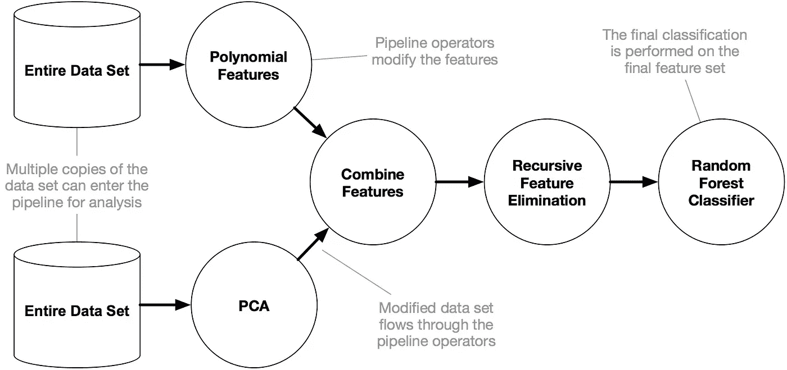
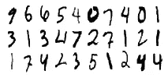
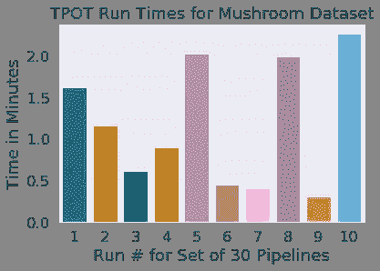

# Python 中的 TPOT 自动机器学习

> 原文：<https://towardsdatascience.com/tpot-automated-machine-learning-in-python-4c063b3e5de9?source=collection_archive---------4----------------------->


TPOT graphic from the [docs](http://epistasislab.github.io/tpot/)

在这篇文章中，我分享了我和 Python 中的自动机器学习(autoML)工具 [TPOT](http://epistasislab.github.io/tpot/) 的一些探索。目标是看看 TPOT 能做什么，以及它是否值得成为你机器学习工作流程的一部分。

自动化机器学习不会取代数据科学家，(至少现在不会)，但它可能会帮助你更快地找到好的模型。TPOT 自称是你的数据科学助手。

> TPOT 旨在成为一个助手，通过探索你可能从未考虑过的管道配置，给你提供如何解决特定机器学习问题的想法，然后将微调留给更受约束的参数调整技术，如网格搜索。

所以 TPOT 帮助你找到好的算法。请注意，它不是为自动化深度学习而设计的——类似 AutoKeras 的东西可能会有所帮助。


[**An example machine learning pipeline (source: TPOT docs)**](http://epistasislab.github.io/tpot/)

TPOT 建立在 scikit learn 库的基础上，并严格遵循 scikit learn API。它可以用于回归和分类任务，并为医学研究提供特殊的实现。

TPOT 是开源的，有很好的文档记录，正在积极开发中。它的开发是由宾夕法尼亚大学的研究人员带头进行的。TPOT 似乎是最受欢迎的 autoML 库之一，截至 2018 年 8 月，有近[4500 个 GitHub star](https://github.com/EpistasisLab/tpot/)。

# TPOT 是如何工作的？



[An example TPOT Pipeline](http://epistasislab.github.io/tpot/) (source: TPOT docs)

TPOT 拥有其开发者所称的遗传搜索算法来寻找最佳参数和模型集合。它也可以被认为是一种自然选择或进化算法。TPOT 尝试了一条流水线，评估了它的性能，并随机改变了流水线的某些部分，以寻找性能更好的算法。

> AutoML 算法不像在数据集上拟合一个模型那么简单；他们正在考虑多种机器学习算法(随机森林、线性模型、支持向量机等。)在具有多个预处理步骤(缺失值插补、缩放、PCA、特征选择等)的流水线中。)，所有模型和预处理步骤的超参数，以及在流水线内集成或堆叠算法的多种方式。*(来源:*[*【TPOT 文档】*](http://epistasislab.github.io/tpot/using/) *)*

TPOT 的这种能力来自于自动高效地评估各种可能的管道。手动完成这项工作既麻烦又慢。

# 运行 TPOT

TPOT 分类器的实例化、拟合和评分类似于任何其他 sklearn 分类器。格式如下:

```
tpot = TPOTClassifier()
tpot.fit(X_train, y_train)
tpot.score(X_test, y_test)
```

TPOT 有自己的一键编码变体。注意，它可以自动将其添加到管道中，因为它将具有少于 10 个唯一值的特性视为分类特性。如果你想使用自己的编码策略，你可以对你的数据进行编码，然后*再*把它输入 TPOT。

您可以为 tpot.score 选择评分标准(尽管 Jupyter 和多处理器内核的一个 bug 使您无法在 Jupyter 笔记本中拥有一个多处理器内核的自定义评分标准)。

看来你不能改变 TPOT 在内部搜索最佳管道时使用的评分标准，只能改变 TPOT 选择最佳算法后在测试集上使用的评分标准。这是一些用户可能想要更多控制的领域。也许在未来的版本中会增加这个选项。

TPOT 使用 tpot.export()将有关最佳性能算法及其准确度分数的信息写入文件。您可以选择 TPOT 运行时希望看到的冗长程度，并让它在运行时将管道写入输出文件，以防由于某种原因提前终止(例如，您的 Kaggle 内核崩溃)。

# TPOT 要跑多长时间？


简而言之，这要视情况而定。

TPOT 被设计为运行一段时间——几个小时甚至一天。尽管使用较小数据集的不太复杂的问题可以在几分钟内看到很好的结果。您可以调整 TPOT 的几个参数，以便更快地完成搜索，但代价是对最佳管道的搜索不够彻底。它并不是为了对预处理步骤、特性选择、算法和参数进行全面的搜索而设计的，但是如果您将它的参数设置得更详尽一些，它可能会更接近。

正如医生解释的那样:

> …TPOT 将需要一段时间才能在较大的数据集上运行，但了解原因很重要。使用默认的 TPOT 设置(100 代，100 人口规模)，TPOT 将在完成前评估 10，000 个管道配置。为了将这个数字放入上下文中，考虑机器学习算法的 10，000 个超参数组合的网格搜索，以及该网格搜索需要多长时间。也就是说，有 10，000 个模型配置要用 10 重交叉验证来评估，这意味着在一次网格搜索中，大约有 100，000 个模型适合并评估了训练数据。

我们将在下面看到的一些数据集只需要几分钟就可以找到得分较高的算法；其他人可能需要几天。

以下是默认的 TPOTClassifier 参数:

```
generations=100, 
population_size=100, 
offspring_size=None  # Jeff notes this gets set to population_size
mutation_rate=0.9, 
crossover_rate=0.1, 
scoring="Accuracy",  # for Classification
cv=5, 
subsample=1.0, 
n_jobs=1,
max_time_mins=None, 
max_eval_time_mins=5,
random_state=None, 
config_dict=None,
warm_start=False, 
memory=None,
periodic_checkpoint_folder=None, 
early_stop=None
verbosity=0
disable_update_check=False
```

每个参数的描述可以在[文档](http://epistasislab.github.io/tpot/api/)中找到。以下是几个决定 TPOT 将搜索的管道数量的关键因素:

```
**generations:** int, optional (default: 100)           
Number of iterations to the run pipeline optimization process.            Generally, TPOT will work better when you give it more generations(and therefore time) to optimize the pipeline. **TPOT will evaluate POPULATION_SIZE + GENERATIONS x OFFSPRING_SIZE pipelines in total** (emphasis mine).**population_size:** int, optional (default: 100)            
Number of individuals to retain in the GP population every generation. 
Generally, TPOT will work better when you give it more individuals (and therefore time) to optimize the pipeline. **offspring_size:** int, optional (default: None)
Number of offspring to produce in each GP generation.            
By default, offspring_size = population_size.
```

从 TPOT 开始，设置 *verbosity=3* 和*periodic _ check point _ folder = " any _ string _ you _ like "*是值得的，这样你就可以看到模型的发展和训练分数的提高。当管道元素的一些组合不兼容时，您会看到一些错误，但是不要担心。

如果您正在多核上运行，并且没有使用自定义计分功能，请设置 n_jobs=-1 以使用所有可用的内核并加速 TPOT。

## 搜索空间

以下是 TPOT 从版本 0.9 开始选择的分类算法和参数:

```
‘sklearn.naive_bayes.**BernoulliNB**’: { ‘alpha’: [1e-3, 1e-2, 1e-1, 1., 10., 100.], ‘fit_prior’: [True, False] }, ‘sklearn.naive_bayes.**MultinomialNB**’: { ‘alpha’: [1e-3, 1e-2, 1e-1, 1., 10., 100.], ‘fit_prior’: [True, False] }, ‘sklearn.tree.**DecisionTreeClassifier**’: { ‘criterion’: [“gini”, “entropy”], ‘max_depth’: range(1, 11), ‘min_samples_split’: range(2, 21), ‘min_samples_leaf’: range(1, 21) }, ‘sklearn.ensemble.**ExtraTreesClassifier**’: { ‘n_estimators’: [100], ‘criterion’: [“gini”, “entropy”], ‘max_features’: np.arange(0.05, 1.01, 0.05), ‘min_samples_split’: range(2, 21), ‘min_samples_leaf’: range(1, 21), ‘bootstrap’: [True, False] },‘sklearn.ensemble.**RandomForestClassifier**’: { ‘n_estimators’: [100], ‘criterion’: [“gini”, “entropy”], ‘max_features’: np.arange(0.05, 1.01, 0.05), ‘min_samples_split’: range(2, 21), ‘min_samples_leaf’: range(1, 21), ‘bootstrap’: [True, False] }, ‘sklearn.ensemble.**GradientBoostingClassifier**’: { ‘n_estimators’: [100], ‘learning_rate’: [1e-3, 1e-2, 1e-1, 0.5, 1.], ‘max_depth’: range(1, 11), ‘min_samples_split’: range(2, 21), ‘min_samples_leaf’: range(1, 21), ‘subsample’: np.arange(0.05, 1.01, 0.05), ‘max_features’: np.arange(0.05, 1.01, 0.05) },‘sklearn.neighbors.**KNeighborsClassifier**’: { ‘n_neighbors’: range(1, 101), ‘weights’: [“uniform”, “distance”], ‘p’: [1, 2] }, ‘sklearn.svm.**LinearSVC**’: { ‘penalty’: [“l1”, “l2”], ‘loss’: [“hinge”, “squared_hinge”], ‘dual’: [True, False], ‘tol’: [1e-5, 1e-4, 1e-3, 1e-2, 1e-1], ‘C’: [1e-4, 1e-3, 1e-2, 1e-1, 0.5, 1., 5., 10., 15., 20., 25.] }, ‘sklearn.linear_model.**LogisticRegression**’: { ‘penalty’: [“l1”, “l2”], ‘C’: [1e-4, 1e-3, 1e-2, 1e-1, 0.5, 1., 5., 10., 15., 20., 25.], ‘dual’: [True, False] }, ‘xgboost.**XGBClassifier**’: { ‘n_estimators’: [100], ‘max_depth’: range(1, 11), ‘learning_rate’: [1e-3, 1e-2, 1e-1, 0.5, 1.], ‘subsample’: np.arange(0.05, 1.01, 0.05), ‘min_child_weight’: range(1, 21), ‘nthread’: [1] }
```

并且 TPOT 可以堆叠分类器，包括多次相同的分类器。TPOT 的核心开发者之一在本期[中解释了它是如何工作的](https://github.com/EpistasisLab/tpot/issues/360):

> 流水线`*ExtraTreesClassifier(ExtraTreesClassifier(input_matrix, True, 'entropy', 0.10000000000000001, 13, 6), True, 'gini', 0.75, 17, 4)*`执行以下操作:
> 
> 使用提取树分类器拟合所有原始特征
> 
> 从提取树分类器中获取预测，并使用这些预测创建新要素
> 
> 将原始特征加上新的“预测特征”传递给第二个提取树分类器，并将其预测用作管道的最终预测
> 
> 这个过程被称为堆叠分类器，这是机器学习中一种相当常见的策略。

这里是 TPOT 从 0.9 版本开始可以应用的 11 个预处理程序。

```
‘sklearn.preprocessing.**Binarizer**’: { ‘threshold’: np.arange(0.0, 1.01, 0.05) }, ‘sklearn.decomposition.**FastICA**’: { ‘tol’: np.arange(0.0, 1.01, 0.05) }, ‘sklearn.cluster.**FeatureAgglomeration**’: { ‘linkage’: [‘ward’, ‘complete’, ‘average’], ‘affinity’: [‘euclidean’, ‘l1’, ‘l2’, ‘manhattan’, ‘cosine’] }, ‘sklearn.preprocessing.**MaxAbsScaler**’: { }, ‘sklearn.preprocessing.**MinMaxScaler**’: { }, ‘sklearn.preprocessing.**Normalizer**’: { ‘norm’: [‘l1’, ‘l2’, ‘max’] }, ‘sklearn.kernel_approximation.**Nystroem**’: { ‘kernel’: [‘rbf’, ‘cosine’, ‘chi2’, ‘laplacian’, ‘polynomial’, ‘poly’, ‘linear’, ‘additive_chi2’, ‘sigmoid’], ‘gamma’: np.arange(0.0, 1.01, 0.05), ‘n_components’: range(1, 11) }, ‘sklearn.decomposition.**PCA**’: { ‘svd_solver’: [‘randomized’], ‘iterated_power’: range(1, 11) }, ‘sklearn.preprocessing.PolynomialFeatures’: { ‘degree’: [2], ‘include_bias’: [False], ‘interaction_only’: [False] }, ‘sklearn.kernel_approximation.**RBFSampler**’: { ‘gamma’: np.arange(0.0, 1.01, 0.05) }, ‘sklearn.preprocessing.RobustScaler’: { }, ‘sklearn.preprocessing.**StandardScaler**’: { }, ‘tpot.builtins.ZeroCount’: { }, ‘**tpot.builtins.OneHotEncoder**’: { ‘minimum_fraction’: [0.05, 0.1, 0.15, 0.2, 0.25], ‘sparse’: [False] } (emphasis mine)
```

这是一个非常全面的 sklearn ml 算法列表，甚至包括一些您可能没有用于预处理的算法，包括 Nystroem 和 RBFSampler。最后列出的预处理算法就是之前提到的自定义 OneHotEncoder。请注意，该列表不包含神经网络算法。

组合的数量几乎是无限的——您可以堆叠算法，包括相同算法的实例。管道中的步骤数量可能有一个内部上限，但可以说可能有太多的管道。

如果您运行 TPOT 两次，它可能不会导致相同的算法选择(我发现，即使设置了 random_state，也可能不会，如下所述)。正如[文档](http://epistasislab.github.io/tpot/using/)所解释的:

> 如果您正在处理相当复杂的数据集或短时间运行 TPOT，不同的 TPOT 运行可能会产生不同的管道建议。TPOT 的优化算法在本质上是随机的，这意味着它使用随机性(部分)来搜索可能的管道空间。当两个 TPOT 运行推荐不同的管道时，这意味着 TPOT 运行由于缺少时间而没有收敛*或*多个管道在数据集上执行或多或少相同的操作。

少说多做。让我们用一些数据来检验一下 TPOT！

# 数据集 1: MNIST 数字分类

首先我们来看一个分类任务 sklearn 数据集中包含的来自 [MNIST 的流行手写数字分类任务。MNIST 数据库包含 70，000 张 28x28 像素的手写阿拉伯数字图像，从 0 到 9。](http://scikit-learn.org/stable/datasets/index.html)



TPOT 是 Kaggle Docker 镜像的标准配置，所以你只需要在使用 Kaggle 的时候导入它——你不需要安装它。

这是我的代码——可以在[这个 Kaggle 内核](https://www.kaggle.com/discdiver/tpot-with-mnist-digit-classification/)上获得，形式略有不同，可能有一些修改。

```
# import the usual stuff
import numpy as np 
import pandas as pd 
import matplotlib.pyplot as plt
import seaborn as sns
import os# import TPOT and sklearn stuff
from tpot import TPOTClassifier
from sklearn.datasets import load_digits
from sklearn.model_selection import train_test_split
import sklearn.metrics# create train and test sets
digits = load_digits()
X_train, X_test, y_train, y_test = train_test_split(digits.data, digits.target, train_size=0.75, test_size=0.25, random_state=34)tpot = TPOTClassifier(verbosity=3, 
                      scoring="balanced_accuracy", 
                      random_state=23, 
                      periodic_checkpoint_folder="tpot_mnst1.txt", 
                      n_jobs=-1, 
                      generations=10, 
                      population_size=100)# run three iterations and time themfor x in range(3):
    start_time = timeit.default_timer()
    tpot.fit(X_train, y_train)
    elapsed = timeit.default_timer() - start_time
    times.append(elapsed)
    winning_pipes.append(tpot.fitted_pipeline_)
    scores.append(tpot.score(X_test, y_test))
    tpot.export('tpot_mnist_pipeline.py')times = [time/60 for time in times]
print('Times:', times)
print('Scores:', scores)   
print('Winning pipelines:', winning_pipes)
```

如上所述，管道总数等于人口 _ 大小+世代 x 后代 _ 大小。

例如，如果设置 population_size=20，generations=5，那么 subject _ size = 20(因为默认情况下 subject _ size 等于 population_size。因为 20 + (5 * 20 ) = 120，所以总共有 120 条管道。

您可以看到，运行这个数据集根本不需要太多代码——这包括一个计时和重复测试的循环。

有 10 个可能的类别，没有理由选择一个结果而不是另一个，准确性——TPOT 分类的默认——是这项任务的一个很好的衡量标准。

下面是相关的代码部分。

```
digits = load_digits()
X_train, X_test, y_train, y_test = train_test_split(digits.data, digits.target, train_size=0.75, test_size=0.25, random_state=34)tpot = TPOTClassifier(verbosity=3, 
 scoring=”accuracy”, 
 random_state=32, 
 periodic_checkpoint_folder=”tpot_results.txt”, 
 n_jobs=-1, 
 generations=5, 
 population_size=10,
 early_stop=5)
```

结果如下:

```
Times: [4.740584810283326, 3.497970838083226, 3.4362493358499098]
Scores: [0.9733333333333334, 0.9644444444444444, 0.9666666666666667]Winning pipelines: [Pipeline(memory=None,
     steps=[('gradientboostingclassifier', GradientBoostingClassifier(criterion='friedman_mse', init=None,
              learning_rate=0.1, loss='deviance', max_depth=7,
              max_features=0.15000000000000002, max_leaf_nodes=None,
              min_impurity_decrease=0.0, min_impurity_split=None,
...auto', random_state=None,
              subsample=0.9500000000000001, verbose=0, warm_start=False))]), Pipeline(memory=None,
     steps=[('standardscaler', StandardScaler(copy=True, with_mean=True, with_std=True)), ('gradientboostingclassifier', GradientBoostingClassifier(criterion='friedman_mse', init=None,
              learning_rate=0.5, loss='deviance', max_depth=2,
              max_features=0.15000000000000002, max_leaf_...auto', random_state=None,
              subsample=0.9500000000000001, verbose=0, warm_start=False))]), Pipeline(memory=None,
     steps=[('standardscaler', StandardScaler(copy=True, with_mean=True, with_std=True)), ('gradientboostingclassifier', GradientBoostingClassifier(criterion='friedman_mse', init=None,
              learning_rate=0.5, loss='deviance', max_depth=2,
              max_features=0.15000000000000002, max_leaf_...auto', random_state=None,
              subsample=0.9500000000000001, verbose=0, warm_start=False))])]
```

请注意，只有 60 个管道——远远少于 TPOT 建议的——我们能够看到相当好的分数——在一个案例中，测试集的准确率超过 97%。

## 再现性

TPOT 每次都用相同的 random_state 集合找到相同的获胜管道吗？不一定。像 RandomForrestClassifier()这样的算法都有自己的 random_state 参数，这些参数没有被设置。

如果你实例化一个分类器，然后像我们在上面代码中的 *for* 循环中所做的那样反复拟合，TPOT 并不总是找到相同的结果。我在 random_state 设置和 Kaggle 的 GPU 设置打开的情况下运行了三组非常小的 60 条管道。请注意，我们得到的管道略有不同，因此三个测试集的测试集得分也略有不同。

下面是另一个例子，有少量的管道设置了随机状态，并使用了 Kaggle 的 CPU 设置。

```
Times: [2.8874817832668973, 0.043678393283335025, 0.04388708711679404]
Scores: [0.9622222222222222, 0.9622222222222222, 0.9622222222222222]
Winning pipelines: [Pipeline(memory=None,
     steps=[('gradientboostingclassifier', GradientBoostingClassifier(criterion='friedman_mse', init=None,
              learning_rate=0.5, loss='deviance', max_depth=2,
              max_features=0.15000000000000002, max_leaf_nodes=None,
              min_impurity_decrease=0.0, min_impurity_split=None,
....9500000000000001, tol=0.0001,
              validation_fraction=0.1, verbose=0, warm_start=False))]), Pipeline(memory=None,
     steps=[('gradientboostingclassifier', GradientBoostingClassifier(criterion='friedman_mse', init=None,
              learning_rate=0.5, loss='deviance', max_depth=2,
              max_features=0.15000000000000002, max_leaf_nodes=None,
              min_impurity_decrease=0.0, min_impurity_split=None,
....9500000000000001, tol=0.0001,
              validation_fraction=0.1, verbose=0, warm_start=False))]), Pipeline(memory=None,
     steps=[('gradientboostingclassifier', GradientBoostingClassifier(criterion='friedman_mse', init=None,
              learning_rate=0.5, loss='deviance', max_depth=2,
              max_features=0.15000000000000002, max_leaf_nodes=None,
              min_impurity_decrease=0.0, min_impurity_split=None,
....9500000000000001, tol=0.0001,
              validation_fraction=0.1, verbose=0, warm_start=False))])]
```

三次都发现了相同的管道。

注意，在第一次迭代之后，运行时间要快得多。TPOT 似乎确实记得它什么时候见过一个算法，并且不会重新运行它，即使它是第二次拟合，并且你已经设置了 memory=False。如果设置 verbosity=3，当它找到这样一个以前评估过的管道时，您将看到以下内容:

```
Pipeline encountered that has previously been evaluated during the optimization process. Using the score from the previous evaluation.
```

## 运行时间更长，精确度更高

如果制造大量管道，TPOT 怎么办？要真正看到 TPOT 在 MNIST 数字任务中的威力，你需要运行 500 多条管道。如果在 Kaggle 上运行，这至少需要一个小时。然后，您将看到更高的准确度分数，并可能看到更复杂的模型。

如果你有大量的管道和一项重要的任务，你可能会看到一个机器学习算法的输出进入另一个算法的链式或堆叠式集合。

```
0.9950861171999883knn = KNeighborsClassifier(
        DecisionTreeClassifier(
            OneHotEncoder(input_matrix, OneHotEncoder__minimum_fraction=0.15, OneHotEncoder__sparse=False), 
            DecisionTreeClassifier__criterion=gini, 
            DecisionTreeClassifier__max_depth=5, 
            DecisionTreeClassifier__min_samples_leaf=20, 
            DecisionTreeClassifier__min_samples_split=17), 
         KNeighborsClassifier__n_neighbors=1, 
         KNeighborsClassifier__p=2, 
         KNeighborsClassifier__weights=distance)
```

在运行了一个多小时并生成了 600 多条管道后，这是 0.995 的平均内部 CV 准确度分数。内核在完成之前崩溃了，所以我没有看到测试集的分数，也没有得到输出的模型，但是这对 TPOT 来说看起来很有希望。

该算法使用决策树分类器，将 TPOT 定制的 OneHotEncoder 分类编码输入 KNeighborsClassifier。

这是一个类似的内部分数，不同的管道来自于近 800 个管道后的一个不同的 random_state。

```
0.9903723557310828 KNeighborsClassifier(Normalizer(OneHotEncoder(RandomForestClassifier(MinMaxScaler(input_matrix), RandomForestClassifier__bootstrap=True, RandomForestClassifier__criterion=entropy, RandomForestClassifier__max_features=0.55, RandomForestClassifier__min_samples_leaf=6, RandomForestClassifier__min_samples_split=15, RandomForestClassifier__n_estimators=100), OneHotEncoder__minimum_fraction=0.2, OneHotEncoder__sparse=False), Normalizer__norm=max), KNeighborsClassifier__n_neighbors=4, KNeighborsClassifier__p=2, KNeighborsClassifier__weights=distance)
```

TPOT 发现了一个 KNN 管道，一个热编码，规范化和随机森林。花了两个半小时。前一个更快，得分更高，但有时这就是 TPOT 遗传搜索算法的随机性质。😉

## MNIST 数字分类任务的要点

1.  如果你给它足够的时间，TPOT 可以很好地完成这个图像识别任务。
2.  TPOT 管道越多越好。
3.  如果你需要任务的再现性，TPOT 不是你想要的工具。

# 数据集 2:蘑菇分类

对于第二个数据集，我选择了流行的[蘑菇分类任务。](https://www.kaggle.com/mokosan/mushroom-classification/data)目标是根据标签正确确定蘑菇是否有毒。这不是图像分类任务。它被设置为一个二元任务，这样所有潜在危险的蘑菇被归为一类，而安全食用蘑菇则归为另一类。


Yummy or deadly? Ask TPOT.

我的代码可以在[这个 Kaggle 内核](https://www.kaggle.com/discdiver/tpot-mushroom-classification-task/)上获得。

TPOT 通常可以在这个数据集上快速拟合出一个完美的模型。它在两分钟之内就完成了。这比我在没有 TPOT 的情况下使用许多 scikit-learn 分类算法、各种名义数据编码和无参数调整测试该数据集时的性能和速度好得多。

在使用相同的 TPOTClassifier 实例和相同的随机状态集的三次运行中，TPOT 发现了以下情况:

```
Times: [1.854785452616731, 1.5694829618000463, 1.3383520993001488]
Scores: [1.0, 1.0, 1.0]
```

有趣的是，它每次都找到不同的最佳算法。它找到了 DecisionTreeClassifier，然后是 KNeighorsClassifier，然后是带有 BernoulliNB 的堆叠 RandomForestClassifier。

让我们更深入地探讨一下可再现性。让我们用完全相同的设置再运行一次。

```
Times: [1.8664863013502326, 1.5520636909670429, 1.3386059726501116]
Scores: [1.0, 1.0, 1.0]
```

我们看到同一组三个管道，非常相似的时间，测试集上相同的分数。

现在让我们试着将这个单元分成多个不同的单元，并在每个单元中实例化一个 TPOT 实例。代码如下:

```
X_train, X_test, y_train, y_test = train_test_split(X, y, train_size=0.75, test_size=0.25, random_state=25)tpot = TPOTClassifier(
  verbosity=3, 
  scoring=”accuracy”, 
  random_state=25, 
  periodic_checkpoint_folder=”tpot_mushroom_results.txt”, 
  n_jobs=-1, 
  generations=5, 
  population_size=10,
  early_stop = 5
)
```

第二次运行的结果现在与第一次运行的结果相匹配，并且花费了几乎相同的时间(分数= 1.0，时间= 1.9 分钟，管道=决策树分类器)。更高再现性的关键是我们在每个单元中实例化 TPOT 分类器的一个新实例。

下面是 10 组 30 个流水线的时间结果，其中随机状态在训练测试分割上，TPOT 设置为 10。所有管道正确地对测试集上的所有蘑菇进行了分类。TPOT 在这项简单易学的任务上速度很快。



# 蘑菇任务的收获

对于这个基本的分类任务，TPOT 表现得又好又快。

作为比较，[R 中蘑菇集上的这个 Kaggle 内核](https://www.kaggle.com/mokosan/mushroom-classification/notebook)非常好，探索了各种算法，非常接近完美的精度。但是，它并没有完全达到 100%,与我们实施 TPOT 相比，它确实花费了更多的准备和培训时间。

我强烈认为 TPOT 可以为将来这样的任务节省时间，至少作为第一步。

# 数据集 3:埃姆斯住宅预测

接下来，我们转向回归任务，看看 TPOT 的表现。我们将使用流行的[爱荷华州艾姆斯房价预测数据集](https://www.kaggle.com/c/house-prices-advanced-regression-techniques)来预测房产销售价值。我的代码可以在[这个 Kaggle 内核](https://www.kaggle.com/discdiver/tpot-on-ames-housing-regression/)上获得。


This house could be in Ames, Iowa, right?

对于这个任务，我首先做了一些基本的缺失值插补。我用该列中最常见的值来填充缺失的数字列值，因为其中一些列包含序号数据。随着时间的推移，我会对列进行分类，并根据区间、序数或名义数据类型使用不同的插补策略。

在顺序编码之前，字符串列缺失值用“缺失”标签填充，因为并非所有列都有最常见的值。TPOT 的 one hot 编码算法将为每个特征增加一个维度，这将表明该数据缺少该特征的值。

TPOTRegressor 默认使用均方误差评分。

这里有一个只有 60 条管道的运行。

```
X_train, X_test, y_train, y_test = train_test_split(X, y, test_size = .25, random_state = 33)# instantiate tpot 
tpot = TPOTRegressor(verbosity=3,  
                      random_state=25, 
                      n_jobs=-1, 
                      generations=5, 
                      population_size=10,
                      early_stop = 5,
                      memory = None)
times = []
scores = []
winning_pipes = []# run 3 iterations
for x in range(3):
    start_time = timeit.default_timer()
    tpot.fit(X_train, y_train)
    elapsed = timeit.default_timer() - start_time
    times.append(elapsed)
    winning_pipes.append(tpot.fitted_pipeline_)
    scores.append(tpot.score(X_test, y_test))
    tpot.export('tpot_ames.py')# output results
times = [time/60 for time in times]
print('Times:', times)
print('Scores:', scores)   
print('Winning pipelines:', winning_pipes)
```

这三次小试的结果。

```
Times: [3.8920086714831994, 1.4063017464330188, 1.2469199204002508]
Scores: [-905092886.3009057, -922269561.2683483, -949881926.6436856]
Winning pipelines: [Pipeline(memory=None,
     steps=[('zerocount', ZeroCount()), ('xgbregressor', XGBRegressor(base_score=0.5, booster='gbtree', colsample_bylevel=1,
       colsample_bytree=1, gamma=0, learning_rate=0.1, max_delta_step=0,
       max_depth=9, min_child_weight=18, missing=None, n_estimators=100,
       n_jobs=1, nthread=1, objective='reg:linear', random_state=0,
       reg_alpha=0, reg_lambda=1, scale_pos_weight=1, seed=None,
       silent=True, subsample=0.5))]), Pipeline(memory=None,
     steps=[('xgbregressor', XGBRegressor(base_score=0.5, booster='gbtree', colsample_bylevel=1,
       colsample_bytree=1, gamma=0, learning_rate=0.1, max_delta_step=0,
       max_depth=9, min_child_weight=11, missing=None, n_estimators=100,
       n_jobs=1, nthread=1, objective='reg:linear', random_state=0,
       reg_alpha=0, reg_lambda=1, scale_pos_weight=1, seed=None,
       silent=True, subsample=0.5))]), Pipeline(memory=None,
     steps=[('stackingestimator', StackingEstimator(estimator=RidgeCV(alphas=array([ 0.1,  1\. , 10\. ]), cv=None, fit_intercept=True,
    gcv_mode=None, normalize=False, scoring=None, store_cv_values=False))), ('maxabsscaler-1', MaxAbsScaler(copy=True)), ('maxabsscaler-2', MaxAbsScaler(copy=True)), ('xgbr...      reg_alpha=0, reg_lambda=1, scale_pos_weight=1, seed=None,
       silent=True, subsample=0.5))])]
```

运行很快完成，每次都找到不同的获胜管道。取分数的平方根得到均方根误差(RMSE)。RMSE 的平均价格在 3 万美元左右。

对于 train_test_split 和 TPOTRegressor，尝试使用 60 个管道和 random_state = 20。

```
Times: [9.691357856966594, 1.8972856383004304, 2.5272325469001466]
Scores: [-1061075530.3715296, -695536167.1288683, -783733389.9523941]Winning pipelines: [Pipeline(memory=None,
     steps=[('stackingestimator-1', StackingEstimator(estimator=RandomForestRegressor(bootstrap=True, criterion='mse', max_depth=None,
           max_features=0.7000000000000001, max_leaf_nodes=None,
           min_impurity_decrease=0.0, min_impurity_split=None,
           min_samples_leaf=12, min_sample...0.6000000000000001, tol=0.0001,
             validation_fraction=0.1, verbose=0, warm_start=False))]), Pipeline(memory=None,
     steps=[('xgbregressor', XGBRegressor(base_score=0.5, booster='gbtree', colsample_bylevel=1,
       colsample_bytree=1, gamma=0, learning_rate=0.1, max_delta_step=0,
       max_depth=7, min_child_weight=3, missing=None, n_estimators=100,
       n_jobs=1, nthread=1, objective='reg:linear', random_state=0,
       reg_alpha=0, reg_lambda=1, scale_pos_weight=1, seed=None,
       silent=True, subsample=1.0))]), Pipeline(memory=None,
     steps=[('stackingestimator', StackingEstimator(estimator=RandomForestRegressor(bootstrap=True, criterion='mse', max_depth=None,
           max_features=0.7000000000000001, max_leaf_nodes=None,
           min_impurity_decrease=0.0, min_impurity_split=None,
           min_samples_leaf=12, min_samples_...ators=100, n_jobs=None,
          oob_score=False, random_state=None, verbose=0, warm_start=False))])]
```

导致了截然不同的管道和分数。

让我们用 720 条管道试一次更长的运行

```
X_train, X_test, y_train, y_test = train_test_split(X, y, test_size = .25, random_state = 20)tpot = TPOTRegressor(verbosity=3, 
 random_state=10, 
 #scoring=rmsle,
 periodic_checkpoint_folder=”any_string”,
 n_jobs=-1, 
 generations=8, 
 population_size=80,
 early_stop=5)
```

结果:

```
Times: [43.206709423016584]
Scores: [-644910660.5815958] 
Winning pipelines: [Pipeline(memory=None,
     steps=[('xgbregressor', XGBRegressor(base_score=0.5, booster='gbtree', colsample_bylevel=1,
       colsample_bytree=1, gamma=0, learning_rate=0.1, max_delta_step=0,
       max_depth=8, min_child_weight=3, missing=None, n_estimators=100,
       n_jobs=1, nthread=1, objective='reg:linear', random_state=0,
       reg_alpha=0, reg_lambda=1, scale_pos_weight=1, seed=None,
       silent=True, subsample=0.8500000000000001))])]
```

RMSE 是迄今为止最好的。收敛花了大半个小时，我们仍然在运行比推荐的小得多的管道。🤔

接下来，让我们尝试使用均方根对数误差，这是 Kaggle 在本次比赛中使用的自定义评分参数。这是在另一个非常小的迭代中运行的，30 个管道分三次运行，random_state=20。我们不能使用一个以上的 CPU 核心，因为在 Jupyter 的一些 TPOT 算法中有一个自定义评分参数的错误。

```
Times: [1.6125734224997965, 1.2910610851162345, 0.9708147236000514]
Scores: [-0.15007242511943228, -0.14164770517342357, -0.15506057088945932]
Winning pipelines: [Pipeline(memory=None,
     steps=[('maxabsscaler', MaxAbsScaler(copy=True)), ('stackingestimator', StackingEstimator(estimator=RandomForestRegressor(bootstrap=True, criterion='mse', max_depth=None,
           max_features=0.7000000000000001, max_leaf_nodes=None,
           min_impurity_decrease=0.0, min_impurity_split=None,
 ...0.6000000000000001, tol=0.0001,
             validation_fraction=0.1, verbose=0, warm_start=False))]), Pipeline(memory=None,
     steps=[('extratreesregressor', ExtraTreesRegressor(bootstrap=False, criterion='mse', max_depth=None,
          max_features=0.6500000000000001, max_leaf_nodes=None,
          min_impurity_decrease=0.0, min_impurity_split=None,
          min_samples_leaf=7, min_samples_split=10,
          min_weight_fraction_leaf=0.0, n_estimators=100, n_jobs=None,
          oob_score=False, random_state=None, verbose=0, warm_start=False))]), Pipeline(memory=None,
     steps=[('ridgecv', RidgeCV(alphas=array([ 0.1,  1\. , 10\. ]), cv=None, fit_intercept=True,
    gcv_mode=None, normalize=False, scoring=None, store_cv_values=False))])]
```

那些分数并不可怕。这个小运行的 tpot.export 的输出文件如下。

```
import numpy as np 
import pandas as pd 
from sklearn.linear_model import ElasticNetCV, LassoLarsCV 
from sklearn.model_selection import train_test_split from sklearn.pipeline import make_pipeline, make_union 
from tpot.builtins import StackingEstimator # NOTE: Make sure that the class is labeled 'target' in the data file 
tpot_data = pd.read_csv('PATH/TO/DATA/FILE', sep='COLUMN_SEPARATOR', dtype=np.float64) features = tpot_data.drop('target', axis=1).values training_features, testing_features, training_target, testing_target = train_test_split(features, tpot_data['target'].values, random_state=42) # Score on the training set was:-0.169929041242275 exported_pipeline = make_pipeline(     StackingEstimator(estimator=LassoLarsCV(normalize=False)),     ElasticNetCV(l1_ratio=0.75, tol=0.01) exported_pipeline.fit(training_features, training_target) results = exported_pipeline.predict(testing_features)
```

将来，我想在这个数据集上对 TPOT 做一些更长时间的运行，看看它的表现如何。我还想看看一些手动特征工程和各种编码策略如何提高我们的模型性能。

# 抓到 TPOT 和卡格尔了

我喜欢 Kaggle 的内核，但如果你想运行几个小时的算法，如 TPOT，这可能会超级令人沮丧。内核在运行时经常崩溃，你有时无法判断你尝试的提交是否被挂起，并且你不能像你希望的那样控制你的环境。


Wall for banging head

没有什么比 720 次管道迭代中的 700 次更好的了。我的 Kaggle CPU 利用率经常显示为 400%+并且在这个练习中需要多次重启。

其他一些需要注意的事项:

*   我发现我需要将我的 Pandas 数据帧转换成 Numpy 数组，以避免回归任务中的 XGBoost 问题。这是熊猫和 XGBoost 的一个已知问题。
*   一个 Kaggle 内核正在运行一个 Jupyter 笔记本。当 Jupyter 笔记本中的 n _ jobs > 1 时，TPOT 的自定义评分分类器不起作用。这是一个已知的[问题](https://github.com/EpistasisLab/tpot/issues/645)。
*   当你提交代码时，Kaggle 只会让你的内核代码写到一个输出文件。你看不到 TPOT 提交时的临时输出。确保文件名用引号括起来，不要用斜线。该文件将显示在 O *输出*选项卡上。
*   在 Kaggle 上打开 GPU 设置并不能加快大多数分析的速度，但可能会加快深度学习的速度。
*   ka ggle 6 小时的可能运行时间和 GPU 设置使得在非大型数据集上无需配置即可免费实验 TPOT 成为可能。很难拒绝免费的。

为了更多的时间和速度，你可以使用类似于 [Paperspace](https://www.paperspace.com/) 的东西。我在 Paperspace 上建立了 TPOT，虽然不是免费的，但也很轻松。如果你需要一个云解决方案来运行 TPOT，我建议你先在 Kaggle 上使用它，如果你需要几个小时以上的运行时间或更高的功率，就离开 Kaggle。

# 未来方向

TPOT 和 autoML 有很多有趣的方向可以探索。我想将 TPOT 与 autoSKlearn、MLBox、Auto-Keras 和其他公司进行比较。我还想看看它在处理更多种类的数据、其他插补策略和其他编码策略时的表现。与 LightGBM、CatBoost 和深度学习算法的比较也将是有趣的。机器学习的这个时刻令人兴奋的是，有这么多领域可以探索。关注 [me](https://medium.com/@jeffhale) 确保不会错过未来的分析。

对于大多数数据集来说，仍然有大量的数据清理、特征工程和最终模型选择要做——更不用说预先提出正确问题这一最重要的步骤。那么你可能需要生产你的模型。TPOT 还没有进行彻底的搜索。所以 TPOT 不会取代数据科学家的角色——但这个工具可能会让你最终的机器学习算法更好更快。

如果你使用过 TPOT 或其他 autoML 工具，请在评论中分享你的经验。

我希望这篇介绍 TPOT 的文章对你有所帮助。如果你有，请在你最喜欢的社交媒体上分享，这样其他人也可以找到它。😀

我写关于 [Python](https://memorablepython.com) 、 [SQL](https://memorablesql.com) 和其他技术主题的文章。如果你对这些感兴趣，请注册我的[邮件列表，那里有很棒的数据科学资源](https://dataawesome.com)，点击阅读更多内容，帮助你提高技能[。👍](https://medium.com/@jeffhale)

[](https://dataawesome.com)

投票快乐！🚀