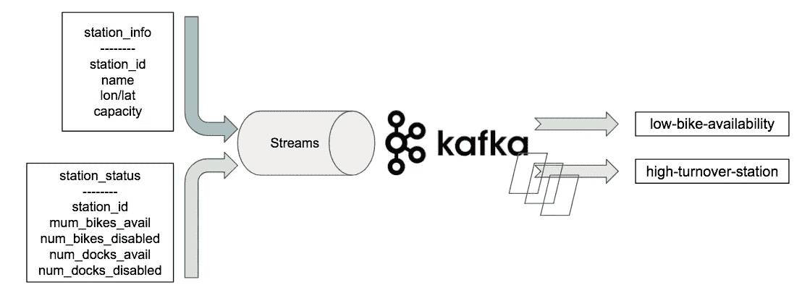

# 使用 Kafka Streams 跟踪纽约市 Citi Bike 的实时利用率

> 原文：<https://towardsdatascience.com/tracking-nyc-citi-bike-real-time-utilization-using-kafka-streams-1c0ea9e24e79?source=collection_archive---------8----------------------->

## 卡夫卡流的实际使用案例


“Blue Citibike bicycles are parked in a row at the World Trade Center.” by [Anthony Ginsbrook](https://unsplash.com/@aginsbrook?utm_source=medium&utm_medium=referral) on [Unsplash](https://unsplash.com?utm_source=medium&utm_medium=referral)

说到构建分布式实时流处理系统，我们是 Apache Kafka 的忠实粉丝。它可大规模扩展，具有简单的发布-订阅语义，并提供容错的持久数据存储。这是一个处理事件流数据的绝佳平台，例如点击事件、分布式日志、时间序列指标等。我们在之前的一篇文章中写过关于使用 Apache Kafka 构建实时分析的文章。

但是在大多数用例中，数据流不是孤立处理的。当收到 Kafka 消息时，经常会查询一些有状态数据存储，以便获得足够的信息来处理该消息。例如，如果我们有一个接收客户订单的订单流，该订单很可能需要使用客户信息和/或产品元数据查询数据库才能进行处理，那么流数据如何与有状态数据(如数据库表)一起工作呢？

这就是《T2》和《T3》出现的原因。Kafka Streams 是一组应用程序 API(目前在 Java & Scala 中)，无缝集成了无状态(流)和有状态(表)处理。这个设计的基本前提非常有趣。简而言之，它基于这样一个事实，即可以从变更数据捕获(CDC)流或事务日志记录中重建表。如果我们有一个变更日志流，那么表就是一个反映每个变更记录最新状态的本地存储。有了这个概念，流-流或流-表连接成为通过各种内部 Kafka 主题路由数据的统一操作。默认情况下，RocksDB 用于本地有状态存储，但也可以使用其他键值数据库。我鼓励你去读一下[的博客文章，这篇文章解释了设计卡夫卡作品的动机。这让我大开眼界。](https://www.confluent.io/blog/introducing-kafka-streams-stream-processing-made-simple/)

在本帖中，我们将使用 Kafka Streams 来跟踪纽约市花旗自行车使用率的实时统计数据。CitiBikeNYC 发布了包含自行车出行的历史数据集和每个自行车站点信息和可用性的实时 [GBFS 反馈](http://gbfs.citibikenyc.com/gbfs/gbfs.json)。虽然历史数据集是洞察的宝库，但通过实时数据馈送可以更好地获得一些利用率指标。我们将计算两个重要的利用率实时指标。

1.  目前可用自行车少于 10%的站点，计算方法为(可用自行车数量)/(站点容量)。该指标可以作为自行车可用性低的实时通知。
2.  每小时自行车周转率最高的站点，在滚动窗口中通过(站点自行车净变化)/(站点容量)计算。该指标可用于微调花旗自行车站再平衡战略。

数据流看起来像这样。



现在让我们开始编码。

首先，由于 Citi Bike feed 是一个 Restful API，我们需要添加一个 Java 应用程序来轮询端点，并将 JSON 响应转换为流并发布到 Kafka 主题上。

station_information 和 status JSON 的示例如下所示

我们使用 [google http java 客户端](https://developers.google.com/api-client-library/java/google-http-java-client/)将 http 响应转换成 POJO(普通旧 java 对象)。

然后我们将 station_information 和 statuses 对象的列表序列化为 string，并分别发布到它们命名的 Kafka 主题中。

关于向/从 Kafka 序列化/反序列化消息注释。对于生产级系统，Apache Kafka Streams API 使用基于 [avro](https://avro.apache.org/docs/current/) 的序列化，并使用[模式注册表](https://docs.confluent.io/current/schema-registry/docs/index.html)存储 avro 模式。我觉得对于这篇文章来说，这增加了很多不必要的麻烦，所以我把这部分去掉，尽可能使用基于字符串的序列化模式。如果你对基于 Avro 的 SerDes(序列化/反序列化)感兴趣，请查看 [Avro Serdes 类](https://kafka.apache.org/10/documentation/streams/developer-guide/datatypes.html#avro)。

现在我们有了来自 station_information 和 station_status 主题的数据流，让我们看看如何找到自行车利用率低于 10%的站点。完整的代码是[这里是](https://github.com/cloudboxlabs/blog-code/blob/master/citibikekafkastreams/src/main/java/com/cloudboxlabs/LowAvailability.java)。

首先，我们用一系列配置构造一个 KakfaStreams 对象，包括 Kafka 引导服务器、文件系统上的本地状态和 Kafka 消费者选项。

然后，我们可以连接转换的每个步骤，就像我们正在构建一个流数据管道一样。

1.  从 Kafka 主题 status 的输入构建一个 KStream。我们大量使用 Java8 Lambda 表达式，将输入流数据映射到 POJO，并提取 num_bikes_available 指标

2.从 Kafka 主题 station_information 的输入构建一个 KTable。

您可能会问，为什么我们使用 KStream 表示站点状态，而使用 KTable 表示站点信息。还记得流和表二元性吗？表是变更事件流的结束状态。在这种情况下，我们希望捕捉每个站点的状态变化，因为它告诉我们可用自行车的数量如何随时间变化。另一方面，站点信息是静态数据，包括容量、名称、地理位置等。我们只关心每条数据的最新值，因此 KTable 允许我们将一系列更改压缩到最终快照中。

3.现在是“这里发生了什么神奇的事情？”部分。让我们在 KStream 和 KTable 上做一个左连接。请记住，我们的指标是(可用自行车数量)/(车站容量)。分子来自 station_status 对象，但分母来自 station_information 对象，因此我们需要在这里做一个流表连接。这就是卡夫卡溪流的力量所在。能够在没有大量代码的情况下将一个不断发展的数据流与一个静态的本地存储连接起来是非常简单的。

在加入流之后，我们过滤计算出的小于 10%的可用性，并将数据映射到人类可读的输出字符串。

4.这一步并不是绝对必要的，但我们最终会将分析结果发布到 Kafka 的输出主题上，这样我们就可以检查它们了。

5.如果我们启动一个控制台 Kafka 消费程序，我们可以看到输出如下

```
station_id: 3699, longitude -73.98918, latitude 40.763603, bikes: 1, capacity: 30, ratio: 3.33%
station_id: 3700, longitude -73.95334, latitude 40.779408, bikes: 3, capacity: 39, ratio: 7.69%
station_id: 3704, longitude -73.941765, latitude 40.74375, bikes: 1, capacity: 19, ratio: 5.26%
```

现在，让我们来看看如何在会话窗口中计算周转率。我们有类似的步骤来建立站信息和站状态的 KStream/KTable。这里的代码是。

1.  我们计算的分析是(可用自行车数量的净变化)/ (station_capacity)，因此我们在这里引入了一个窗口聚合，我们可以折叠每个分组状态并计算净增量。聚合器接口接受一个初始化器和一个累加器。这类似于函数式编程中的 fold()或 reduce()操作。

2.既然计算了自行车的窗口化净变化，让我们再次连接 station_information KTable，并将我们的分析输出到输出主题。

3.输出如下所示。注意，本例中的关键字是一个窗口<string>，因为我们在流上应用了一个滚动窗口。</string>

```
station_id: [472@1535061600000/1535065200000], turnover: 72.22%
station_id: [473@1535061600000/1535065200000], turnover: 81.40%
station_id: [474@1535061600000/1535065200000], turnover: 5.13%
station_id: [476@1535061600000/1535065200000], turnover: 8.47%
station_id: [477@1535061600000/1535065200000], turnover: 55.32%
```

为了运行代码，按照这里的快速入门启动 Zookeeper、Kafka，创建主题并运行 Java 应用程序。

总之，我们如何看待在实践中使用卡夫卡作品？答案是“看情况”。这要看你的数据是什么样子，业务逻辑有多复杂。

Kafka Streams 站在 Apache Kafka 这个巨人的肩膀上，因此它无疑具有大规模分布式流数据平台的可扩展性和弹性。我们可以轻松地交替使用流数据和有状态数据，这说明了库 API 的设计有多好。如果你的数据在形式上非常简单，比如统计点击事件，排名页面浏览量，这是实时数据分析的一个很好的选择。

另一方面，由于 Kafka Streams 的内部使用 Kafka pub-sub 作为存储主干，您必须不断地考虑如何在数据管道的每个阶段序列化/反序列化您的数据。这意味着如果你在你的应用程序中使用了大量的 POJO(Plain old java object ),你就有了额外的任务来指定如何序列化它们，以便将它们传递到管道中，不管是不是 Avro 模式。虽然可以理解，但它增加了额外的复杂性，我不确定在业务逻辑繁重的应用程序中这样做是否值得。在撰写本文时，Kafka Streams 没有基于 python 的 API，因此对于执行大量分析的数据科学家来说，这是一个非常陡峭的学习曲线。

一如既往，你可以在 [Cloudbox Labs github](https://github.com/cloudboxlabs/blog-code/tree/master/citibikekafkastreams) 上找到这篇文章中讨论的完整代码。