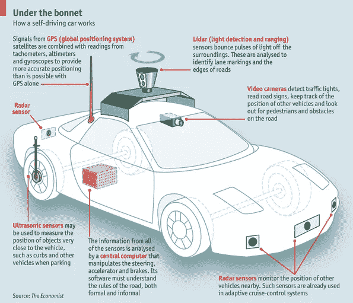
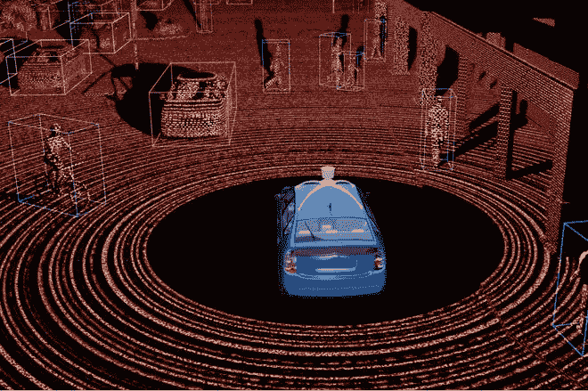
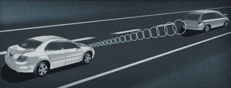
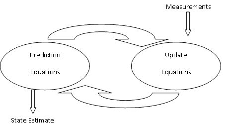
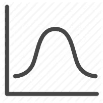
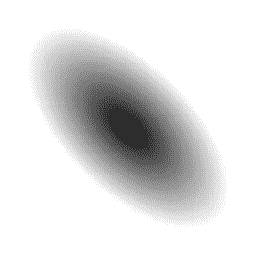
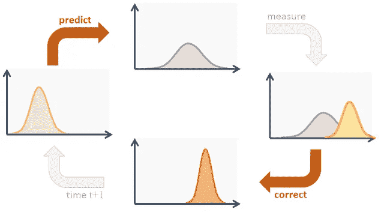

# 自动驾驶汽车跟踪行人

> 原文：<https://towardsdatascience.com/tracking-pedestrians-for-self-driving-cars-ccf588acd170?source=collection_archive---------1----------------------->

*第四章:用数据做酷事！*

自动驾驶汽车在行驶时需要周围的世界地图。它必须能够连续跟踪路上的行人、汽车、自行车和其他移动物体。在这篇文章中，我将通过一种称为扩展卡尔曼滤波器的技术进行讨论，谷歌自动驾驶汽车正在使用这种技术来跟踪道路上的移动物体。

下面是一个汽车在模拟器中跟踪行人的视频。激光雷达测量值为红色圆圈，雷达测量值为蓝色圆圈，估算标记为绿色三角形。有趣的是，与雷达相比，激光雷达的精确度有多高。经过一些试验，卡尔曼滤波器的精度可以提高到 0.09 的均方根误差。

Kalman Filter in action

链接到我的 [**GitHub**](https://github.com/priya-dwivedi/CarND/tree/master/Term%202/CarND-Extended-Kalman-Filter-P1) 用 C++实现上述视频的完整代码。

在讨论卡尔曼滤波器之前，我想先谈谈汽车中使用的三种主要传感器——摄像头(前后)、激光雷达和雷达。

Car Sensors — Camera, LIDAR and RADAR

激光雷达使用激光进行测量，并生成周围世界的点云，为汽车提供相当准确的 x 位置和 y 位置值。它能够以非常高的精度探测汽车附近(20-40 米)的物体。然而，激光雷达在恶劣的天气条件下或传感器变脏时不是很准确。激光雷达云看起来像:

LIDAR point cloud

另一方面，雷达不太精确，但是能够提供对物体的位置和速度的估计。速度是使用多普勒效应估计的，如下图所示。雷达能够探测到离汽车 200 米远的物体。它也不易受天气条件的影响。

RADAR estimating velocity of a car using Doppler effect

卡尔曼滤波器是一种算法，可用于跟踪一段时间内移动行人的位置和速度，并测量与之相关的不确定性。它有两个主要步骤——一个**预测步骤**,预测行人在下一个时间步可能在哪里，假设他们以恒定的速度移动；一个**更新步骤**,使用传感器数据(激光雷达和雷达)更新我们的估计。并且这两个步骤无休止地重复。

让我们更详细地讨论一下这个问题:

首先，我们将行人的状态指定为一个四维向量，表示-位置 x，位置 y，速度 x，速度 y。以下是卡尔曼滤波器的主要步骤:

1.  初始化 t=0 时行人的状态。我们通过读取传感器的第一个测量值来估计我们的位置和速度
2.  预测步骤——在 t=1 时，我们使用简单的物理方程来估计物体在恒定运动(固定速度，无加速度)下的可能位置

> px(t+1 时)= px(t 时)+ vx* dt(时间差)
> 
> vx(在 t+1 时)= vx(在 t 时)

类似地，我们可以更新我们的 y 位置和速度估计

3.测量值更新步骤-现在我们从雷达和激光雷达读取测量值，并使用它来更新我们在步骤 2 中计算的行人状态估计值。测量步骤后的新状态用于下一个预测步骤。

如下图所示，此过程不断重复以更新当前状态:

另一件要注意的事情是，在卡尔曼滤波器中，行人的状态被估计为具有均值和协方差的高斯(钟形曲线)。这是 1D 和 2D·高斯的长相:

1 D Gaussian

2D Gaussian

这里有个有趣的问题？—如果我们有传感器测量，为什么还需要进行预测？用传感器(激光雷达/雷达)测量来更新状态不是最好的吗？这些应该很准确。对吗？

不尽然！测量也可能有不确定性。设备制造商提供了传感器测量噪声的信息。此外，像雨/雾这样的局部环境条件会使传感器不太精确。

不要盲目相信测量结果，这是一个很好的做法。通过组合信息，用于预测和测量的高斯函数成倍增加，当这种情况发生时，最令人惊奇的事情发生了，由此产生的不确定性降低了，如下所示。

卡尔曼滤波方程有点复杂，你可以在维基百科上查看

我还构建了一个无味卡尔曼滤波器，它能够适应非线性运动，并且在预测行人的状态时更加准确。我的 [Github](https://github.com/priya-dwivedi/CarND/tree/master/Term%202/CarND-Unscented-Kalman-Filter-P2) 也有 C++内置的无味卡尔曼滤波器。

总的来说，构建我的第一个卡尔曼滤波器并使用它跟踪物体是一次很棒的经历，我对结果非常满意。

**其他著述**:[https://medium.com/@priya.dwivedi/](https://medium.com/@priya.dwivedi/)

PS:我住在多伦多，我希望将职业生涯转向深度学习。如果你喜欢我的帖子，并能把我联系到任何人，我将不胜感激:)。我的电子邮件是 priya.toronto3@gmail.com

**参考文献:**

[Udacity](https://www.udacity.com/) 无人驾驶汽车 Nano Degree——我感谢 Udacity 给我机会成为他们新的无人驾驶汽车项目的一部分。这是一次非常有趣的旅程。我使用的大部分代码都是在课堂讲课中建议的。