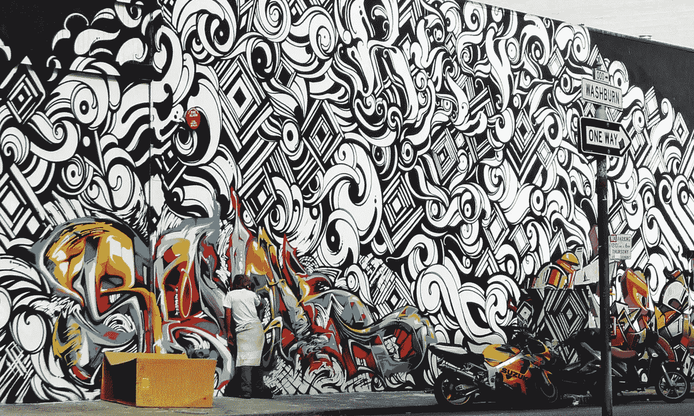
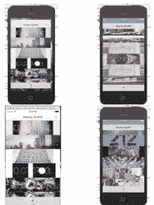
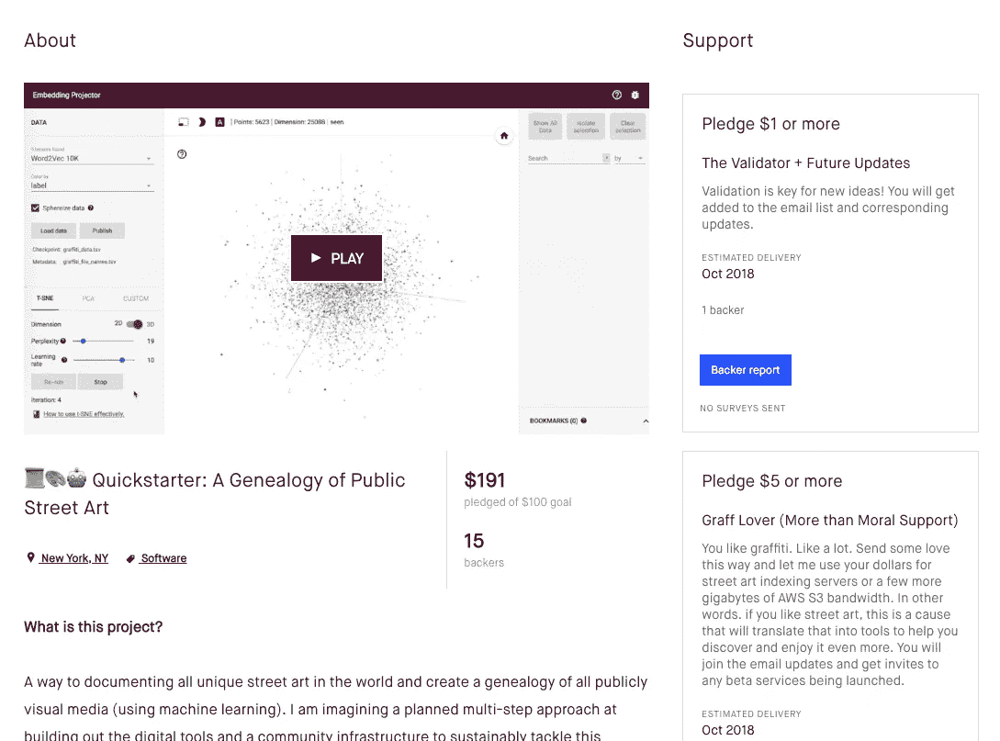
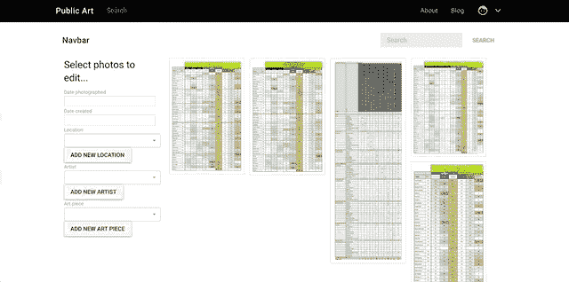
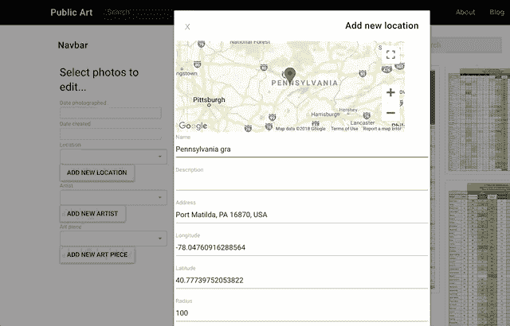
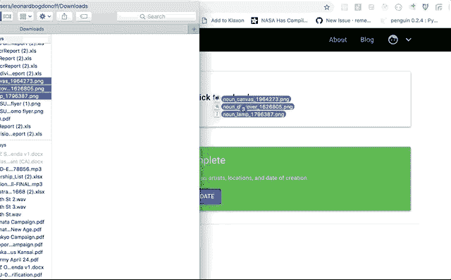
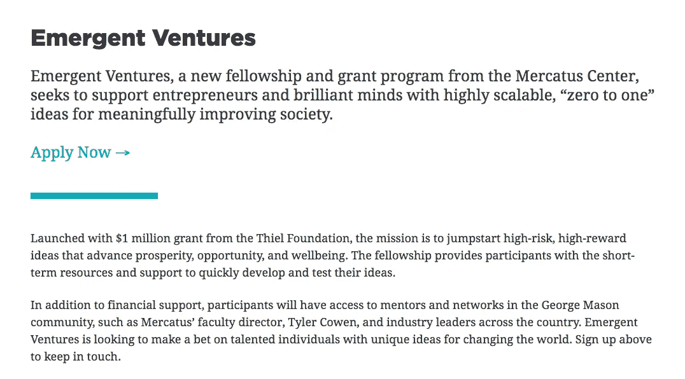
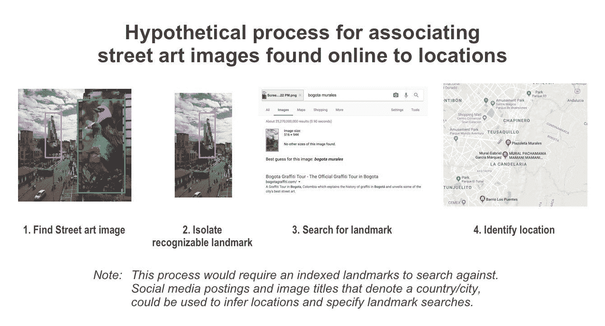
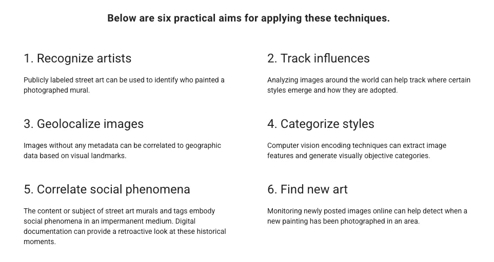
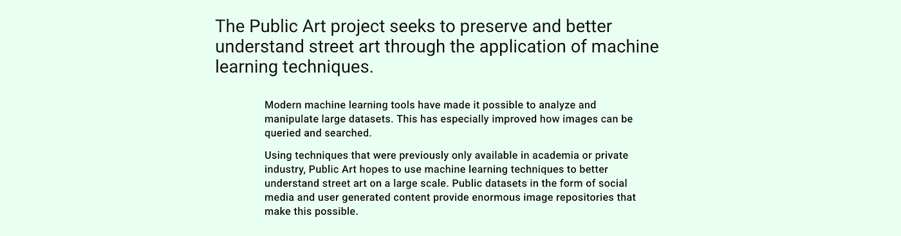

# 使用机器学习跟踪街头艺术-更新

> 原文：<https://towardsdatascience.com/tracking-street-art-with-machine-learning-updates-b6b24062d3d3?source=collection_archive---------11----------------------->

Mural from Reyes, Revok and Steel from MSK ([https://www.fatcap.com/live/revok-steel-and-reyes.html](https://www.fatcap.com/live/revok-steel-and-reyes.html))

感谢您关注[公共艺术](https://www.publicart.io)【⁰】项目，利用机器学习围绕街头艺术建立一个谱系。这个项目旨在创建一个记录世界各地街头艺术的中心，并使用现代图像分析技术为未来建立一个公共艺术的历史参考。

Public Art iOS application

作为一个快速更新，这个项目始于 2014 年，在 [Gary Chou 的轨道训练营](https://orbital.nyc/bootcamp/) [ ]期间，我建立了一系列小项目，探索软件和涂鸦如何在实验性的辅助项目中共存。其中一个副业项目是一项抓取 Instagram 图片的实验，并开发一个 iOS 来浏览你附近的街头艺术。这款功能不再完整的应用仍在 [iOS 应用商店](http://graffpass.com) [ ]。

去年 8 月，我开始参加先锋锦标赛，这是一个每月一次的锦标赛，围绕着一个由全球各地从事有趣项目的有创造力的年轻人组成的社区。我决定通过整合我对机器学习的熟悉程度，围绕记录涂鸦重新开始这个项目。

Kickstarter page

9 月份，[我运行了一个“Quickstarter”，这是一个 100 美元的 Kickstarter 项目，令人惊讶的是，在朋友之外，我发现了一些完全陌生的人对这个项目感兴趣](https://www.kickstarter.com/projects/rememberlenny/new-public-art-foundation-a-genealogy-of-public-st/) [ ]。这个项目给了我进一步探索街头艺术和软件如何共存的信心。

在同一个项目中，我开始继续从网上的公共资源中抓取更多的图片，同样，我发现我的旧方法有一个巨大的问题。虽然我仍然可以抓取 Instagram，就像我在 2014 年做的那样，但我需要用于历史目的的许多元数据不再可用。特别是，我没有地理数据，而地理数据是让这些图像变得有用的关键。我在这里简要地写了这个:[关于社交媒体的后中心化](https://medium.com/@rememberlenny/on-the-instagram-api-changes-f9341068461e)【⁴].

PublicArt.io current website’s functional prototype

从那以后，我把注意力从构建工具来抓取公共资源转移到构建一个可以在线存储公开记录的街头艺术的基础上。

这将效仿许多已经在线的照片分享服务，灵感来自 Flickr、Instagram、Imgur 等等。这项服务的重点将仅仅是记录街头艺术，帮助收集艺术作品的图像，观看艺术家的作品，并向公众提供这些数据。

我很自豪地宣布，来自乔治·梅森大学[⁶]墨卡托斯中心的[泰勒·考恩](http://marginalrevolution.com)[⁵]，已经将他的[新兴企业奖学金扩展到我的项目](https://marginalrevolution.com/marginalrevolution/2018/11/emergent-ventures-grant-recipients.html)[⁷].]

Emergent Ventures

虽然这个项目最初是个人资助的，但我对能够将我的时间扩展到构建工具上更有信心。有了这笔赠款，我相信我正在建造的东西有能力维持其成本并证明其价值。

在我目前的探索状态之前，我正在尝试应用嵌入分析技术的图像特征提取工具来比较不同的街头艺术作品是如何相似还是不同。为了过度简化和简单解释:[图像特征提取工具](https://en.wikipedia.org/wiki/Feature_extraction)可以获取图像并量化单个参数的存在，其代表特征【⁸].

该参数可以简化为一个单一的数字，然后可以跨图像进行比较。通过机器学习工具，特别是 [Tensorflow Inception 库](https://www.tensorflow.org/tutorials/images/image_recognition)【⁹】，可以从一张图像中提取数万个特征，然后用于与其他图像中的相似特征进行比较。

通过这些嵌入，我能够产生非常有趣的三维空间视觉效果，展示某些艺术家是如何相似或不同的。[在最基本的情况下，模板涂鸦被映射到同一个维度空间，而涂鸦“炸弹”或更大的壁画会分别映射到相似的多维空间](https://twitter.com/rememberlenny/status/1038992069094780928)【⁰].

在地理数据无法访问之前，我从 Instagram 上抓取了成千上万张图片，利用这些图片，[我分析了随着时间的推移，世界各地街头艺术的存在情况](https://twitter.com/rememberlenny/status/1058426005357060096) [ ]。

由于 Instagram 的政策变化，这些数据不再与最初被编入索引的实际图像相关联，而是提供了对世界各地街头艺术和涂鸦的洞察。

有趣的是，图像频率也提供了一种视觉，这种视觉回避了城市中心和街头艺术之间的明显关系。如果进一步分析，街头艺术和房地产价值、社区社会关系、政治参与和其他社会现象之间可能存在明显的相关性。

在过去的几天里，我一直专注于综合我期望使用机器学习来分析街头艺术的各种手段。由于媒体对人工智能的歪曲以及机器学习在技术/营销领域的广泛意义，我自己也在纠结我的意思。

在这个项目实施之前，我曾认为有可能建立物体检测模型来识别图像中不同类型的涂鸦。例如，故意破坏的表现不同于社区认可的壁画。我还想象有可能在更大的字母形式的涂鸦作品中找到识别特定字母的方法。我相信将定义良好的标签和数据集与一个可变的自动编码器相结合来生成基于机器学习的字母形式的片段会很有趣。

更进一步，我认为有可能使用机器学习来检测一个地方的图像何时是“新的”，基于它在特定地方的先前图像中没有被检测到。我认为找到穿越美国的火车车厢的摄像头也很有趣，并建立一个管道来捕捉火车车厢上的涂鸦，识别火车车厢序列号，并跟踪火车车厢及其各自的艺术如何穿越这个国家。

以上各点都是基于机器学习的分析技术的实际表达。

虽然这些都是有趣的项目，但我暂时将我的注意力集中在以下六点上:识别艺术家的作品，跟踪类似的风格/影响，[地理定位图像](https://twitter.com/rememberlenny/status/1053626064738631681) [ ]，对风格进行分类，关联社会现象，并发现新的艺术。基于跟踪图像，内容，图像图像的频率，并使这些数据可供他人使用，我相信街头艺术可以创造更多的价值，并获得更多的尊重。

基于最近的工作，我得到了一个功能齐全的应用程序，允许用户创建帐户，上传图像，将重要的元数据(艺术家/位置/创作数据)与图像相关联。虽然用户体验和设计不是我引以为豪的地方，但我会继续用现有的涂鸦鉴赏家测试当前的形式。

当我继续分享这个项目时，如果你有任何兴趣或者想了解更多，请联系我。

[0]:[https://www . public art . io](https://www.publicart.io)
【1】:[https://orbital.nyc/bootcamp/](https://orbital.nyc/bootcamp/)
【2】:[http://graffpass.com](http://graffpass.com)
【3】:[https://www . kickstarter . com/projects/remember Lenny/new-public-art-foundation-a-genetics-of-public-ST/updates](https://www.kickstarter.com/projects/rememberlenny/new-public-art-foundation-a-genealogy-of-public-st/updates)
【4】:[https://medium . com/@ remember Lenny/on-the-insta](https://medium.com/@rememberlenny/on-the-instagram-api-changes-f9341068461e)