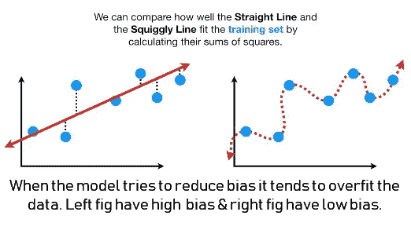
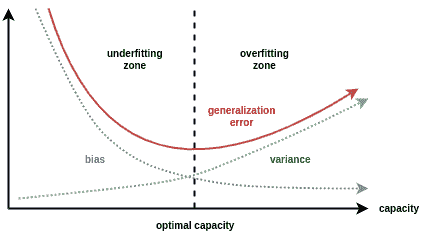
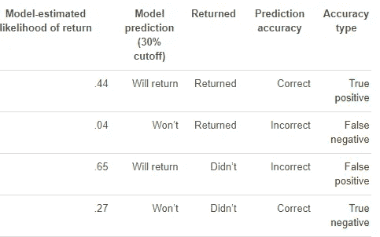
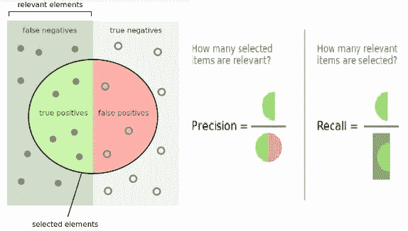
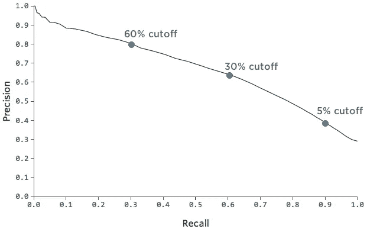

# 偏差-方差和精确-回忆权衡:如何瞄准最佳点？

> 原文：<https://towardsdatascience.com/tradeoffs-how-to-aim-for-the-sweet-spot-c20b40d5e6b6?source=collection_archive---------6----------------------->

## 如何在**偏差-方差&精确-召回权衡**中找到甜蜜点？理解在此过程中起主要作用的所有重要参数。

权衡是介于理智但无聊的生活和复杂、冒险但冒险的生活之间的一件事。生活中的每一点，甚至每一秒我们都做出某种‘取舍’。冒险与否的权衡总是帮助我们找到最佳平衡点或中间地带。当我们让机器像人类一样思考时，它们也受到“权衡”的困扰。

机器学习通常需要处理两个权衡，

1.  偏差-方差权衡
2.  精确召回的权衡

# 第 1 部分:偏差-方差权衡

## 1.1 首先，什么是偏差，什么是方差？

## 偏置:

要理解它，就要知道它的大概意思。剑桥词典称，

> 以不公平的方式支持或反对特定的人或事的行为，因为允许个人观点影响你的判断。

→所以在统计学的世界里，它被定义为，

> 统计偏差是统计技术或其结果的一个特征，由此结果的期望值不同于被估计的真实的潜在定量参数。

受够了“书生气”的定义，让我们通过与现实世界更相关的类比来理解它。

→用简单的英语来说，“机器学习技术无法捕捉真实关系是**偏见”。**

*   **低偏差**:预测数据点接近目标。此外，该模型对目标函数的形式提出了更少的假设。
*   **高偏差**:预测数据点远离目标。此外，该模型对目标函数的形式提出了更多的假设。
*   **低偏机器学习算法的例子:**决策树、k 近邻、支持向量机。
*   **高偏差机器学习算法的例子:**线性回归，线性判别分析，逻辑回归。

→因此，理想情况下，我们的主要目标是整体低偏置(但不总是如此)。具有高偏差的模型很少关注训练数据，并且过度简化了模型。它总是导致训练和测试数据的高误差。

## 1.1.2 差异:

再次要理解它，我们必须知道它的大致意思。剑桥词典称，

> 两个或多个事物不同的事实，或它们不同的数量或数目。

→所以在统计学的世界里，它被定义为，

> 在概率论和统计学中，**方差**是随机变量与其均值的方差平方的期望值。通俗地说，它测量一组(随机)数从它们的平均值分散开多远。

这又是一个“书生气”的定义。因此，让我们通过它在现实世界中的类比来弄清楚这个想法。

→用简单的英语来说，“它是给定数据点或数值的模型预测的可变性，它告诉我们数据的分布”。这里的数据分布就是数据点和平均值之差的平方(即偏差的平方，σ)

*   **低方差**:数据点相互接近，结果接近函数。此外，该模型建议随着训练数据集的改变而对目标函数的估计进行小的改变。
*   **高方差**:数据点分散，结果远离函数。建议随着训练数据集的改变而对目标函数的估计进行大的改变。
*   **低方差机器学习算法的例子:**线性回归、线性判别分析、逻辑回归。
*   **高方差机器学习算法的例子:**决策树、k 近邻、支持向量机。

→因此，理想情况下，我们的总体目标是低偏置。(但并不总是)。高方差模型非常重视训练数据，不会对以前没有见过的数据进行归纳。结果，这样的模型在训练数据上表现得非常好，但是在测试数据上有很高的错误率。

## 1.2.到目前为止，一切似乎都很好，那么偏差-方差权衡的结果是什么呢？

→要理解这一点，首先我们必须理解误差，因为它们或多或少只与误差有关。不管使用什么算法，都不能减少不可约误差&从问题的选择框架中引入。由影响输入变量到输出变量的映射的未知变量等因素引起。

→因此，为了最小化误差，我们必须最小化偏差和方差。

→任何有监督的机器学习算法的目标都是实现低偏差和低方差。反过来，该算法应该实现良好的预测性能。你可以在上面的例子中看到一个总的趋势:

*   参数或线性机器学习算法通常具有高偏差但低方差。
*   非参数或非线性机器学习算法通常具有低偏差但高方差。

> 机器学习算法的参数化通常是一场平衡偏差和方差的战斗。

→在机器学习中，偏差和方差之间的关系是不可避免的。

*   增加偏差会减少方差。
*   增加方差将减少偏差。

*Bias-Variance Trade-off as a Function of Model Capacity*

→ *从上图我们可以解读如下:*

I .高偏差和低方差使数据欠拟合，因为它错过了许多假设。此外，点数与预期预测值有偏差。

二。低偏差和高方差过度拟合数据，因为模型过于关注训练数据，不能很好地概括。

三。当两者都找到中间点或最佳点时，误差最小。

左上是我们的目标。

二。左下具有高偏差，因此它们远离目标，但由于低方差而彼此接近。

三。右上点由于高方差而展开，但是由于低偏差而接近目标。

四。右下方离目标很远，而且点数本身也是因为高方差和高偏差。

→为了建立一个好的模型，我们需要在偏差和方差之间找到一个好的平衡，这样可以使总误差最小化。偏差和方差的最佳平衡不会使模型过拟合或欠拟合。这是通过在反复试验的基础上进行超参数调整来实现的

# 第 2 部分:精确召回权衡

## 2.1.首先，什么是精确，什么是回忆，或者其他术语？

它们是*分类问题*的性能矩阵。我认为*分类*的每一个概念都可以用一个例子来解释。

**例子:**假设你正在考虑给可能会再次光顾的顾客额外赠送一块方糖。但是你当然想避免不必要的分发方糖，所以你只把方糖给那些模型显示至少有 30%可能会再次光顾的顾客。

Confusion Matrix

*   TP:被模型分类为*的将返回*，而实际上*已经返回了*
*   FP:被模型归类为*将返回*，但实际上*没有返回* *(类型 1 错误或告警)*
*   TN:被模型归类为*不会返回*，实际上*并没有返回*
*   FN:被模型归类为*不会返回*，但实际上*已经返回*。*(类型 2 错误或遗漏)*

*(注:我是假设读者了解‘混淆矩阵’，如果不了解，请先过一遍。)*

Venn Dig for Precision & Recall

**2.1.1 精度:**

> 检索到的实例中相关实例的比例。

→计算如下:TP / (TP + FP)

→从上面的例子，我们可以解读为，“*被归类为会回归的，实际做了的比例是多少？”*

→因此，精度表示我们的模型所说的相关数据点的比例实际上是相关的。

**2.1.2 召回(又称灵敏度):**

> 已检索的相关实例占相关实例总数的比例。

→计算如下:TP /( TP + FN)

→从上面的例子中，我们可以将它解释为，“*在那些实际返回的人中，有多少比例是这样分类的？”*

→一般来说，灵敏度告诉我们******目标*** *被正确识别的百分比。*也称为“真阳性率”，可互换使用。在正确识别阳性的基础上选择模型时很有用，在这种情况下，就是给额外的方糖。***

**→因此，回忆表示在数据集中找到所有相关实例的能力**

***在继续之前，我们应该了解一些其他有用的术语。***

****2.1.3 特异性(又称假阴性率):****

****→** *被正确识别的* ***阴性靶*** *的百分比。*在正确识别负面因素的基础上选择模型时很有用，在这种情况下，不会给出额外的方糖。**

**→计算为:TN/(TN + FP)**

**2 . 1 . 4 F1-分数:**

**→精确度和召回率的最佳结合我们可以使用所谓的 [F1 分数](https://en.wikipedia.org/wiki/F1_score)来组合这两个指标。**

**→F1 分数是精确度和召回率的调和平均值，在以下等式中考虑了这两个指标:**

****

**→我们使用[调和平均值而不是简单平均值，因为它会惩罚极值](https://stackoverflow.com/questions/26355942/why-is-the-f-measure-a-harmonic-mean-and-not-an-arithmetic-mean-of-the-precision)。精度为 1.0、召回率为 0.0 的分类器的简单平均值为 0.5，但 f 1 值为 0。**

****2.2 回到最初的问题，精确召回权衡还是精确 *vs* 召回？****

**→在任何一个模型中，您也可以决定强调精确度或召回率。也许你很缺方糖，所以你只想把方糖给那些你很有信心会再次光顾的人，所以你决定只把方糖给那些有 60%可能会再次光顾的顾客(而不是 30%)。**

**我们的精确度会提高，因为只有当你确信有人会回来的时候，你才会分发方糖。我们的召回率将会下降，因为将会有很多人最终会退回那些你没有足够信心给他们一块方糖的人。**

**精度:62% → 80%
召回:60% → 30%**

**→或者，如果你觉得方糖很丰富，你可以把它们分发给任何一个至少有 10%机会再次购买的人。**

**精确度:62% → 40%
召回率:60% → 90%**

**您可以使用此图表来跟踪精确度和召回率之间的权衡:**

****

**→更好的模型具有更高的精度和召回值。**

*   **你可以想象一个模型有 94%的准确率(几乎所有被标识为*的都将返回* do 事实上)和 97%的召回率(几乎所有*返回*的都被标识为这样)。**
*   **一个较弱的模型可能有 95%的精度，但 50%的召回率(当它识别某人为*将返回*，这在很大程度上是正确的，但它错误地标记为*不会返回*，而事实上是那些后来返回*的人中的一半返回*)。**
*   **或者这个模型有 60%的准确率和 60%的召回率**

**这些数字会让你对你的模型有多精确有一个很好的感觉，即使你实际上从来不想做任何预测。**

# *****包装完毕:*****

***就像现实世界中的权衡决策是基于当前环境做出的一样，这两种权衡也是如此。一天结束时，我们所要做的就是根据我们的需求做出判断。***