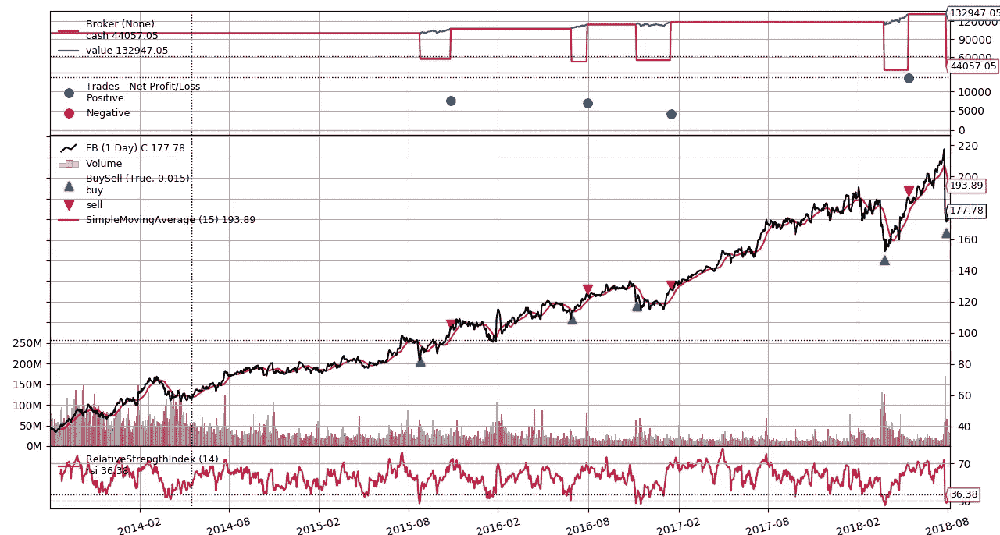

# 交易策略:用 Backtrader 进行回溯测试

> 原文：<https://towardsdatascience.com/trading-strategy-back-testing-with-backtrader-6c173f29e37f?source=collection_archive---------5----------------------->


Photo by [Chris Liverani](https://unsplash.com/@chrisliverani?utm_source=medium&utm_medium=referral) on [Unsplash](https://unsplash.com?utm_source=medium&utm_medium=referral)

(我的[博客](https://kylelix7.github.io/Back-testing-with-Backtrader/)里也有这个帖子)

在我的一篇[旧文章](https://medium.com/@kyle.jinhai.li/trading-strategy-technical-analysis-with-python-ta-lib-3ce9d6ce5614)中，我演示了如何计算技术指标，这些指标可以逻辑地结合起来建立交易策略。正如帖子中所强调的，在将策略应用于实际市场之前，应该先验证策略在回溯测试中的表现。

> 回溯测试是将交易策略或分析方法应用于历史数据的过程，以查看该策略或方法预测实际结果的准确性。
> -摘自[投资答案](https://investinganswers.com/financial-dictionary/stock-market/backtesting-865)

回溯测试就像机器学习中的交叉验证。但也不完全一样。回溯测试需要像交叉验证一样将数据分成两部分。一套用于训练，另一套用于验证。不同的是，训练测试分割可以随机进行交叉验证。在交易回溯测试中，你的数据是时间序列。您的训练数据必须比您的测试数据旧。否则你会偷窥未来，导致对你的策略的不正确衡量。因此，在回溯测试中，数据集的分割不能是随机的。回溯测试涉及真实世界中的市场模拟。实现自己的回溯测试库可能很难，而且容易出错。幸运的是，还有反向交易者。

Backtrader 是一个非常棒的开源 python 框架，它可以让你专注于编写可重用的交易策略、指标和分析工具，而不是花时间构建基础设施。它还支持回溯测试，让你评估自己想出的策略！

也就是说，这是一个免费的完整的技术人员建立自己的策略的解决方案。让我们开始浏览一下。

## 安装和设置

```
pip install backtrader[plotting]
```

## 制定战略

Backtrader 为您定义了一个[策略](https://www.backtrader.com/docu/strategy.html)界面。您需要创建一个实现此接口的类。一个重要的方法是 next()，你应该根据某一天的技术指标来决定是买进、卖出还是什么都不做。一个简单的策略是这样的。

```
**import** backtrader **as** bt **class** **MyStrategy**(bt.Strategy):

    **def** __init__(self):
        self.sma = bt.indicators.SimpleMovingAverage(period=15)

    **def** next(self):
        **if** self.sma > self.data.close:
            *# Do something*
            **pass**

        **elif** self.sma < self.data.close:
            *# Do something else*
            **pass**
```

如你所见，backtrader 附带了一套通用的技术指标。意味着你不需要在你自己或 TA lib 上回复来计算技术指标。

Backtrader 还提供模拟市场交易的功能。Once 可以在您的交易操作中根据美元或百分比计算佣金。

```
cerebro.broker.setcommission(commission=0.001) 
```

下面是用脸书历史市场数据进行回溯测试的完整示例。注意，历史交易数据是从[雅虎财经](https://finance.yahoo.com/quote/FB/history?p=FB&.tsrc=fin-srch-v1)下载的。它还支持[熊猫数据帧](https://www.backtrader.com/docu/pandas-datafeed/pandas-datafeed.html)。我有一个关于收集熊猫[交易数据的帖子。这个例子由一个简单的 TestStrategy 和一段启动回溯测试的驱动代码组成。简单策略只考虑买入/卖出信号的 RSI。你应该为你选择的股票添加更多的逻辑。](https://medium.com/@kyle.jinhai.li/collect-trading-data-with-pandas-library-8904659f2122)

```
**from** __future__ **import** (absolute_import, division, print_function,
                        unicode_literals)

**import** datetime
**import** os.path
**import** sys
**import** backtrader **as** bt
**class** TestStrategy(bt.Strategy):
    **def** log(self, txt, dt=**None**):
        dt = dt **or** self.datas[0].datetime.date(0)
        print(**'%s, %s'** % (dt.isoformat(), txt))

    **def** __init__(self):
        self.dataclose = self.datas[0].close
        self.order = **None** self.buyprice = **None** self.buycomm = **None** self.sma = bt.indicators.SimpleMovingAverage(self.datas[0], period=15)
        self.rsi = bt.indicators.RelativeStrengthIndex()

    **def** notify_order(self, order):
        **if** order.status **in** [order.Submitted, order.Accepted]:
            **return

        if** order.status **in** [order.Completed]:
            **if** order.isbuy():
                self.log(
                    **'BUY EXECUTED, Price: %.2f, Cost: %.2f, Comm %.2f'** %
                    (order.executed.price,
                     order.executed.value,
                     order.executed.comm))

                self.buyprice = order.executed.price
                self.buycomm = order.executed.comm
            **else**:  *# Sell* self.log(**'SELL EXECUTED, Price: %.2f, Cost: %.2f, Comm %.2f'** %
                         (order.executed.price,
                          order.executed.value,
                          order.executed.comm))

            self.bar_executed = len(self)

        **elif** order.status **in** [order.Canceled, order.Margin, order.Rejected]:
            self.log(**'Order Canceled/Margin/Rejected'**)

        *# Write down: no pending order* self.order = **None

    def** notify_trade(self, trade):
        **if not** trade.isclosed:
            **return** self.log(**'OPERATION PROFIT, GROSS %.2f, NET %.2f'** %
                 (trade.pnl, trade.pnlcomm))

    **def** next(self):
        self.log(**'Close, %.2f'** % self.dataclose[0])
        print(**'rsi:'**, self.rsi[0])
        **if** self.order:
            **return

        if not** self.position:
            **if** (self.rsi[0] < 30):
                self.log(**'BUY CREATE, %.2f'** % self.dataclose[0])
                self.order = self.buy(size=500)

        **else**:
            **if** (self.rsi[0] > 70):
                self.log(**'SELL CREATE, %.2f'** % self.dataclose[0])
                self.order = self.sell(size=500)

**if** __name__ == **'__main__'**:
    cerebro = bt.Cerebro()
    cerebro.addstrategy(TestStrategy)
    cerebro.broker.setcommission(commission=0.001)

    datapath = **'FB.csv'** *# Create a Data Feed* data = bt.feeds.YahooFinanceCSVData(
        dataname=datapath,
        fromdate=datetime.datetime(2013, 1, 1),
        todate=datetime.datetime(2018, 8, 5),
        reverse=**True**)

    cerebro.adddata(data)
    cerebro.broker.setcash(100000.0)
    print(**'Starting Portfolio Value: %.2f'** % cerebro.broker.getvalue())
    cerebro.run()
    print(**'Final Portfolio Value: %.2f'** % cerebro.broker.getvalue())
    cerebro.plot()
```

在执行结束时，你可以找出你的投资组合的最终价值。此外，你还可以根据时间绘制股票价格、技术指标、你的买入/卖出操作和你的投资组合价值。



正如你所看到的，这个简单的策略对 FB 很有效，因为它抓住了一些买卖机会。

这就是 backtrader 的回溯测试。如果你想深入了解，我建议你访问 [backtrader 的文档](https://www.backtrader.com/docu/introduction.html)了解更多高级用法。如果你想了解更多关于机器学习的知识，在 educative.io 网站上有一系列[有用的课程。这些课程包括像基本的 ML，NLP，图像识别等主题。编码和交易快乐！](https://www.educative.io/profile/view/6083138522447872?aff=VEzk)

推荐阅读:

[动手机器学习](https://www.amazon.com/gp/product/1492032646/ref=as_li_tl?ie=UTF8&camp=1789&creative=9325&creativeASIN=1492032646&linkCode=as2&tag=blog023b-20&linkId=e6994d31d10e7ac4d35d9889cfe5622e)

[用于数据分析的 Python:与 Pandas、NumPy 和 IPython 的数据争论](https://www.amazon.com/gp/product/1491957662/ref=as_li_tl?ie=UTF8&camp=1789&creative=9325&creativeASIN=1491957662&linkCode=as2&tag=blog023b-20&linkId=be0bbd6ab4fd578397d9c14facc76911)

[对冲基金真正在做什么](https://www.amazon.com/gp/product/1631570897/ref=as_li_tl?ie=UTF8&camp=1789&creative=9325&creativeASIN=1631570897&linkCode=as2&tag=blog023b-20&linkId=d7bb68173b008df1b500073e3a8d054e)

我的帖子:

[我关于 FAANG 访谈的帖子](https://medium.com/@fin.techology/my-posts-about-faang-interview-20e529c5f13f?source=your_stories_page---------------------------)

[我的 YouTube 频道](https://bit.ly/3bBOjtJ)

[我关于金融和科技的帖子](https://medium.com/@fin.techology/my-posts-about-finance-and-tech-7b7e6b2e57f4?source=your_stories_page---------------------------)

[从 CRUD web 应用开发到语音助手中的 SDE——我正在进行的机器学习之旅](https://medium.com/@fin.techology/from-crud-app-dev-to-sde-in-voice-assistant-my-ongoing-journey-to-ml-4ea11ec4966e?)

[全栈开发教程:将 AWS Lambda 无服务器服务集成到 Angular SPA 中](/full-stack-development-tutorial-integrate-aws-lambda-serverless-service-into-angular-spa-abb70bcf417f)

[全栈开发教程:用运行在 AWS Lambda 上的无服务器 REST API 提供交易数据](/full-stack-development-tutorial-serverless-rest-api-running-on-aws-lambda-a9a501f54405)

[全栈开发教程:在 Angular SPA 上可视化交易数据](/full-stack-development-tutorial-visualize-trading-data-on-angular-spa-7ec2a5749a38)

[强化学习:Q 学习简介](https://medium.com/@kyle.jinhai.li/reinforcement-learning-introduction-to-q-learning-444c951e292c)