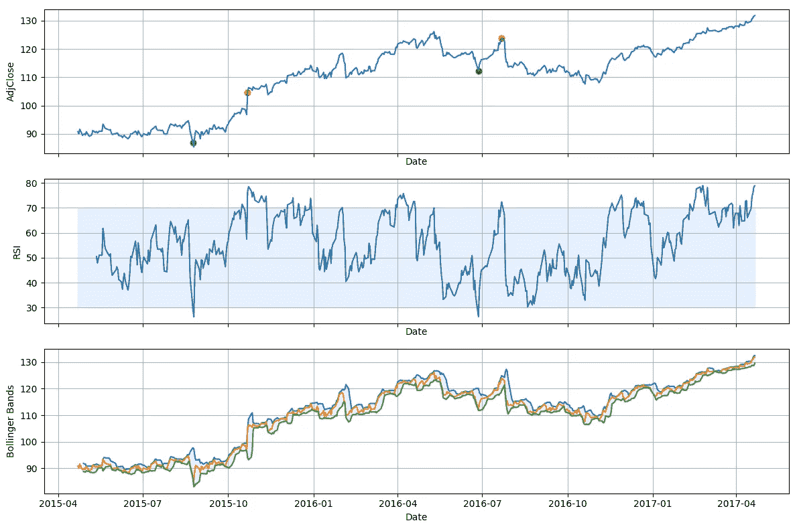

# 交易策略:用 Python TA-Lib 进行技术分析

> 原文：<https://towardsdatascience.com/trading-strategy-technical-analysis-with-python-ta-lib-3ce9d6ce5614?source=collection_archive---------3----------------------->


Photo by [Vladimir Solomyani](https://unsplash.com/@till_indeman?utm_source=medium&utm_medium=referral) on [Unsplash](https://unsplash.com?utm_source=medium&utm_medium=referral)

(我的[博客](https://kylelix7.github.io/Trading-Strategy-Technical-Analysis-with-Python-TA-Lib/)里也有这个帖子)

> 在金融领域，**交易策略**是一个固定的计划，旨在通过在市场上做多或做空来实现盈利回报。正确研究交易策略的主要原因是它的可验证性、可量化性、一致性和客观性。
> 
> 对于每一个交易策略，你都需要定义交易的资产、进场/出场点和资金管理规则。糟糕的资金管理会让潜在的盈利策略变得无利可图。
> 
> —来自[维基百科](https://en.wikipedia.org/wiki/Technical_analysis)

策略分为基于基本面分析和基于技术分析。基本面分析关注公司的资产、收益、市场、股息等，而技术分析只关注股价和成交量。技术分析广泛使用技术指标，这些指标是根据价格和交易量计算出来的，用来洞察交易行为。技术指标进一步分类为波动性、动量、趋势、成交量等。有选择地组合一只股票的指标可能会产生很好的盈利策略。一旦建立了策略，人们应该[用模拟器回测](https://www.investopedia.com/terms/b/backtesting.asp)该策略，以在实时交易前测量性能([回报和风险](https://medium.com/@kyle.jinhai.li/efficient-frontier-optimize-portfolio-with-scipy-57456428323e))。我有另一个[帖子](https://medium.com/@kyle.jinhai.li/trading-strategy-back-testing-with-backtrader-6c173f29e37f)涉及反向交易者的反向测试。

由于技术指标在构建策略中起着重要的作用，我将演示如何使用 [TA-Lib](https://www.ta-lib.org/) 来计算技术指标并构建一个简单的策略。(请不要直接使用策略进行实时交易，因为需要进行回溯测试)。如果你想自己算指标，参考我[上一篇](https://medium.com/@kyle.jinhai.li/trading-technical-analysis-with-pandas-43e737a17861)在[熊猫](https://pandas.pydata.org/)里怎么做。

在这篇文章中，我将用 [RSI](https://en.wikipedia.org/wiki/Relative_strength_index) (一个动量指标)和[布林线](https://en.wikipedia.org/wiki/Bollinger_Bands) %b(一个波动指标)构建一个策略。高 RSI(通常高于 70)可能表明股票超买，因此这是卖出信号。低 RSI(通常低于 30)表明股票超卖，这意味着买入信号。布林线告诉我们两个波段之间的大部分价格行为。因此，如果%b 高于 1，价格可能会回落到区间内。因此，这是一个卖出信号。而如果低于 0，则认为是买入信号。这个策略是一个简单的投票机制。当两个指标认为是买入的时候了，它就发出买入指令进场。当两个指标都认为是时候卖出时，它就发出卖出指令退出。

## 在 Mac 上安装 TA-Lib 和其他依赖项

```
python3 -m venv tutorial-env
source ~/tutorial-env/bin/activate
pip install panda
pip install pandas_datareader
pip install matplotlib
pip install scipy
pip install cython
brew install ta-lib
pip install TA-lib
```

## 计算布林线或 RSI

```
**import** pandas_datareader.data **as** web
**import** pandas **as** pd
**import** numpy **as** np
**from** talib **import** RSI, BBANDS
**import** matplotlib.pyplot **as** pltstart = **'2015-04-22'** end = **'2017-04-22'** symbol = **'MCD'** max_holding = 100
price = web.DataReader(name=symbol, data_source=**'quandl'**, start=start, end=end)
price = price.iloc[::-1]
price = price.dropna()
close = price[**'AdjClose'**].values
up, mid, low = BBANDS(close, timeperiod=20, nbdevup=2, nbdevdn=2, matype=0)
rsi = RSI(close, timeperiod=14)
print(**"RSI (first 10 elements)\n"**, rsi[14:24])
```

输出

```
RSI (first 10 elements)
 [50.45417011 47.89845022 49.54971141 51.0802541  50.97931103 61.79355957
 58.80010324 54.64867736 53.23445848 50.65447261]
```

将布林线转换为%b

```
**def** bbp(price):
    up, mid, low = BBANDS(close, timeperiod=20, nbdevup=2, nbdevdn=2, matype=0)
    bbp = (price[**'AdjClose'**] - low) / (up - low)
    **return** bbp
```

根据指标计算持仓量

```
holdings = pd.DataFrame(index=price.index, data={**'Holdings'**: np.array([np.nan] * index.shape[0])})
holdings.loc[((price[**'RSI'**] < 30) & (price[**'BBP'**] < 0)), **'Holdings'**] = max_holding
holdings.loc[((price[**'RSI'**] > 70) & (price[**'BBP'**] > 1)), **'Holdings'**] = 0holdings.ffill(inplace=**True**)
holdings.fillna(0, inplace=**True**)
```

此外，我们应该得到基于持有量的交易行为

```
holdings[**'Order'**] = holdings.diff()
holdings.dropna(inplace=**True**)
```

让我们想象一下我们的行动和指标

```
fig, (ax0, ax1, ax2) = plt.subplots(3, 1, sharex=**True**, figsize=(12, 8))
ax0.plot(index, price[**'AdjClose'**], label=**'AdjClose'**)
ax0.set_xlabel(**'Date'**)
ax0.set_ylabel(**'AdjClose'**)
ax0.grid()
**for** day, holding **in** holdings.iterrows():
    order = holding[**'Order'**]
    **if** order > 0:
        ax0.scatter(x=day, y=price.loc[day, **'AdjClose'**], color=**'green'**)
    **elif** order < 0:
        ax0.scatter(x=day, y=price.loc[day, **'AdjClose'**], color=**'red'**)

ax1.plot(index, price[**'RSI'**], label=**'RSI'**)
ax1.fill_between(index, y1=30, y2=70, color=**'#adccff'**, alpha=**'0.3'**)
ax1.set_xlabel(**'Date'**)
ax1.set_ylabel(**'RSI'**)
ax1.grid()

ax2.plot(index, price[**'BB_up'**], label=**'BB_up'**)
ax2.plot(index, price[**'AdjClose'**], label=**'AdjClose'**)
ax2.plot(index, price[**'BB_low'**], label=**'BB_low'**)
ax2.fill_between(index, y1=price[**'BB_low'**], y2=price[**'BB_up'**], color=**'#adccff'**, alpha=**'0.3'**)
ax2.set_xlabel(**'Date'**)
ax2.set_ylabel(**'Bollinger Bands'**)
ax2.grid()

fig.tight_layout()
plt.show()
```

下面，我用调整后的麦当劳收盘价(2015 年 4 月至 2017 年 4 月)用绿点(进场点)和红点(出场点)标出了行动。除此之外，RSI 指标和布林线也显示了这两个指标是如何影响交易的。从图中可以看出这个策略是好的。它捕捉了一对夫妇在此期间相对的一些低价和高价。应该进行回溯测试，以了解该策略与基准测试相比表现如何。

## 结果在图表中



这个帖子到此为止。如果你想了解更多关于机器学习的知识，educative.io 网站上有一系列[课程很有帮助。这些课程包括像基本的 ML，NLP，图像识别等主题。投资和编码快乐！](https://www.educative.io/profile/view/6083138522447872?aff=VEzk)

***来自《走向数据科学》编辑的提示:*** *虽然我们允许独立作者根据我们的* [*规则和指南*](/questions-96667b06af5) *发表文章，但我们并不认可每个作者的贡献。你不应该在没有寻求专业建议的情况下依赖一个作者的作品。详见我们的* [*读者术语*](/readers-terms-b5d780a700a4) *。*

推荐阅读:

[动手机器学习](https://amzn.to/33KaKtN)

[用于数据分析的 Python:与 Pandas、NumPy 和 IPython 的数据角力](https://amzn.to/3w8Vzqe)

[对冲基金真正在做什么](https://amzn.to/33O3jlo)

我的帖子:

[我关于 FAANG 访谈的帖子](https://medium.com/@fin.techology/my-posts-about-faang-interview-20e529c5f13f?source=your_stories_page---------------------------)

[我的 YouTube 频道](https://bit.ly/3bBOjtJ)

[我关于金融和科技的帖子](https://medium.com/@fin.techology/my-posts-about-finance-and-tech-7b7e6b2e57f4?source=your_stories_page---------------------------)

[从 CRUD web 应用开发到语音助手中的 SDE——我正在进行的机器学习之旅](https://medium.com/@fin.techology/from-crud-app-dev-to-sde-in-voice-assistant-my-ongoing-journey-to-ml-4ea11ec4966e?)

[全栈开发教程:将 AWS Lambda 无服务器服务集成到 Angular SPA 中](/full-stack-development-tutorial-integrate-aws-lambda-serverless-service-into-angular-spa-abb70bcf417f)

[全栈开发教程:用运行在 AWS Lambda 上的无服务器 REST API 提供交易数据](/full-stack-development-tutorial-serverless-rest-api-running-on-aws-lambda-a9a501f54405)

[全栈开发教程:在 Angular SPA 上可视化交易数据(1)](/full-stack-development-tutorial-visualize-trading-data-on-angular-spa-7ec2a5749a38)

[强化学习:Q 学习简介](https://medium.com/@kyle.jinhai.li/reinforcement-learning-introduction-to-q-learning-444c951e292c)